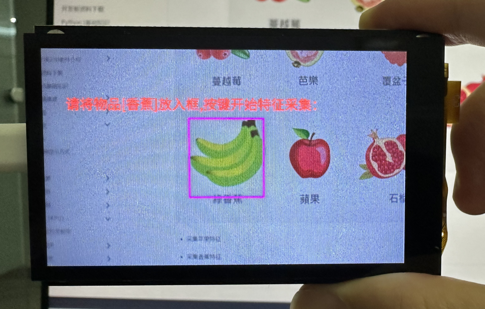
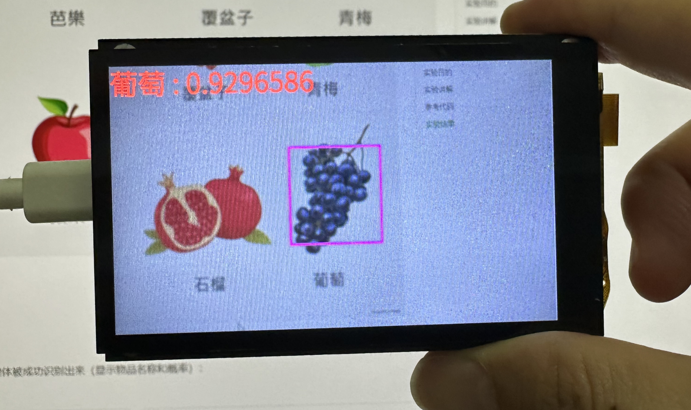

# 自分类学习

## 前言

前面视觉实验都是基于现成模型来进行识别，当我们想识别几个自定义不同物体时，可以使用自分类学习来实现拍照--采集特征--识别过程。

## 实验目的

自分类学习识别3种水果。学习完成后进行识别。


## 实验讲解

本实验通过CanMV K230 AI视觉框架开发，详细说明参考 [AI视觉开发框架](./ai_frame.md) 章节内容，这里不再重复。例程用到的模型已经存放在CanMV K230的文件系统，无需额外拷贝。

具体编程思路如下：

```mermaid
graph TD
    导入AI视觉框架相关模块  --> 加载相关模型 --> 初始化和配置相关模块 --> 获取摄像头图像 --> 采集物品特征 --> 拍照 --> 识别已采集特征物品 --> 画图指示 --> 拍照;
```

## 参考代码

```python
'''
实验名称：物体自分类学习
实验平台：01Studio CanMV K230
教程：wiki.01studio.cc
说明：意外中断或重新采集需要将"/sdcard/examples/utils/"目录下的"features"文件夹删除。
说明：可以通过display="xxx"参数选择"hdmi"、"lcd3_5"(3.5寸mipi屏)或"lcd2_4"(2.4寸mipi屏)显示方式
'''

from libs.PipeLine import PipeLine, ScopedTiming
from libs.AIBase import AIBase
from libs.AI2D import Ai2d
import os
import ujson
from media.media import *
from media.sensor import *
from time import *
import nncase_runtime as nn
import ulab.numpy as np
import time
import utime
import image
import random
import gc
import sys
import aicube


from machine import Pin
from machine import FPIOA

#将GPIO52、GPIO21配置为普通GPIO模式
fpioa = FPIOA()
fpioa.set_function(21,FPIOA.GPIO21)

KEY=Pin(21,Pin.IN,Pin.PULL_UP) #构建KEY对象
key_node = 0 #按键标志位

# 自定义自学习类
class SelfLearningApp(AIBase):

    def __init__(self,kmodel_path,model_input_size,labels,top_k,threshold,database_path,rgb888p_size=[224,224],display_size=[1920,1080],debug_mode=0):
        super().__init__(kmodel_path,model_input_size,rgb888p_size,debug_mode)
        self.kmodel_path=kmodel_path
        # 模型输入分辨率
        self.model_input_size=model_input_size
        self.labels=labels
        self.database_path=database_path
        # sensor给到AI的图像分辨率
        self.rgb888p_size=[ALIGN_UP(rgb888p_size[0],16),rgb888p_size[1]]
        # 显示分辨率
        self.display_size=[ALIGN_UP(display_size[0],16),display_size[1]]
        self.debug_mode=debug_mode
        # 识别阈值
        self.threshold = threshold
        # 选择top_k个相似度大于阈值的结果类别
        self.top_k = top_k
        #对应类别注册特征数量
        self.features= [2 for i in range(len(labels))]

        #注册单个特征中途间隔帧数
        self.time_one=60
        self.time_all = 0
        self.time_now = 0
        # 类别索引
        self.category_index = 0
        # 特征化部分剪切宽高
        self.crop_w = 400
        self.crop_h = 400
        # crop的位置
        self.crop_x = self.rgb888p_size[0] / 2.0 - self.crop_w / 2.0
        self.crop_y = self.rgb888p_size[1] / 2.0 - self.crop_h / 2.0
        self.crop_x_osd=0
        self.crop_y_osd=0
        self.crop_w_osd=0
        self.crop_h_osd=0
        # Ai2d实例，用于实现模型预处理
        self.ai2d=Ai2d(debug_mode)
        # 设置Ai2d的输入输出格式和类型
        self.ai2d.set_ai2d_dtype(nn.ai2d_format.NCHW_FMT,nn.ai2d_format.NCHW_FMT,np.uint8, np.uint8)
        self.data_init()

    # 配置预处理操作，这里使用了crop和resize，Ai2d支持crop/shift/pad/resize/affine，具体代码请打开/sdcard/libs/AI2D.py查看
    def config_preprocess(self,input_image_size=None):
        with ScopedTiming("set preprocess config",self.debug_mode > 0):
            # 初始化ai2d预处理配置，默认为sensor给到AI的尺寸，您可以通过设置input_image_size自行修改输入尺寸
            ai2d_input_size=input_image_size if input_image_size else self.rgb888p_size
            self.ai2d.crop(int(self.crop_x),int(self.crop_y),int(self.crop_w),int(self.crop_h))
            self.ai2d.resize(nn.interp_method.tf_bilinear, nn.interp_mode.half_pixel)
            self.ai2d.build([1,3,ai2d_input_size[1],ai2d_input_size[0]],[1,3,self.model_input_size[1],self.model_input_size[0]])

    # 自定义当前任务的后处理
    def postprocess(self,results):
        with ScopedTiming("postprocess",self.debug_mode > 0):
            return results[0][0]

    # 绘制结果，绘制特征采集框和特征分类框
    def draw_result(self,pl,feature):
        global key_node
        pl.osd_img.clear()
        with ScopedTiming("display_draw",self.debug_mode >0):
            pl.osd_img.draw_rectangle(self.crop_x_osd,self.crop_y_osd, self.crop_w_osd, self.crop_h_osd, color=(255, 255, 0, 255), thickness = 4)
            if (self.category_index < len(self.labels)):
                if key_node == 0:
                    pl.osd_img.draw_string_advanced(50, self.crop_y_osd-50, 30,"请将物品["+self.labels[self.category_index]+"]放入框,按键开始特征采集：", color=(255,255,0,0))
                if key_node == 1:
                    self.time_now += 1
                    pl.osd_img.draw_string_advanced(50, self.crop_y_osd-50, 30,"物品特征采集中："+self.labels[self.category_index] + "_" + str(int(self.time_now-1) // self.time_one) + ".bin", color=(255,255,0,0))
                    with open(self.database_path + self.labels[self.category_index] + "_" + str(int(self.time_now-1) // self.time_one) + ".bin", 'wb') as f:
                        f.write(feature.tobytes())
                    if (self.time_now // self.time_one == self.features[self.category_index]):
                        self.category_index += 1
                        self.time_all -= self.time_now
                        self.time_now = 0
                        key_node = 0 #第一个物品识别完成，清空按键标志位
            else:
                results_learn = []
                list_features = os.listdir(self.database_path)
                for feature_name in list_features:
                    with open(self.database_path + feature_name, 'rb') as f:
                        data = f.read()
                    save_vec = np.frombuffer(data, dtype=np.float)
                    score = self.getSimilarity(feature, save_vec)
                    if (score > self.threshold):
                        res = feature_name.split("_")
                        is_same = False
                        for r in results_learn:
                            if (r["category"] ==  res[0]):
                                if (r["score"] < score):
                                    r["bin_file"] = feature_name
                                    r["score"] = score
                                is_same = True
                        if (not is_same):
                            if(len(results_learn) < self.top_k):
                                evec = {}
                                evec["category"] = res[0]
                                evec["score"] = score
                                evec["bin_file"] = feature_name
                                results_learn.append( evec )
                                results_learn = sorted(results_learn, key=lambda x: -x["score"])
                            else:
                                if( score <= results_learn[self.top_k-1]["score"] ):
                                    continue
                                else:
                                    evec = {}
                                    evec["category"] = res[0]
                                    evec["score"] = score
                                    evec["bin_file"] = feature_name
                                    results_learn.append( evec )
                                    results_learn = sorted(results_learn, key=lambda x: -x["score"])
                                    results_learn.pop()
                draw_y = 0
                for r in results_learn:
                    pl.osd_img.draw_string_advanced( 0 , draw_y,50,r["category"] + " : " + str(r["score"]), color=(255,255,0,0))
                    draw_y += 50

    #数据初始化
    def data_init(self):
        os.mkdir(self.database_path)
        self.crop_x_osd = int(self.crop_x / self.rgb888p_size[0] * self.display_size[0])
        self.crop_y_osd = int(self.crop_y / self.rgb888p_size[1] * self.display_size[1])
        self.crop_w_osd = int(self.crop_w / self.rgb888p_size[0] * self.display_size[0])
        self.crop_h_osd = int(self.crop_h / self.rgb888p_size[1] * self.display_size[1])
        for i in range(len(self.labels)):
            for j in range(self.features[i]):
                self.time_all += self.time_one

    # 获取两个特征向量的相似度
    def getSimilarity(self,output_vec,save_vec):
        tmp = sum(output_vec * save_vec)
        mold_out = np.sqrt(sum(output_vec * output_vec))
        mold_save = np.sqrt(sum(save_vec * save_vec))
        return tmp / (mold_out * mold_save)


if __name__=="__main__":

    # 显示模式，可以选择"hdmi"、"lcd3_5"(3.5寸mipi屏)和"lcd2_4"(2.4寸mipi屏)

    display="lcd3_5"

    if display=="hdmi":
        display_mode='hdmi'
        display_size=[1920,1080]
        rgb888p_size = [1920, 1080]

    elif display=="lcd3_5":
        display_mode= 'st7701'
        display_size=[800,480]
        rgb888p_size = [1920, 1080]

    elif display=="lcd2_4":
        display_mode= 'st7701'
        display_size=[640,480]
        rgb888p_size = [1280, 960] #2.4寸屏摄像头画面比例为4:3

    # 模型路径
    kmodel_path="/sdcard/examples/kmodel/recognition.kmodel"
    database_path="/sdcard/examples/utils/features/" #重复运行需要将这个文件夹删除
    # 其它参数设置

    model_input_size=[224,224]

    labels=["苹果","香蕉","葡萄"]

    top_k=3
    threshold=0.5

    # 初始化PipeLine
    pl=PipeLine(rgb888p_size=rgb888p_size,display_size=display_size,display_mode=display_mode)

    pl.create(Sensor(width=rgb888p_size[0], height=rgb888p_size[1]))  # 创建PipeLine实例

    # 初始化自学习实例
    sl=SelfLearningApp(kmodel_path,model_input_size=model_input_size,labels=labels,top_k=top_k,threshold=threshold,database_path=database_path,rgb888p_size=rgb888p_size,display_size=display_size,debug_mode=0)
    sl.config_preprocess()

    clock = time.clock()

    while True:
        clock.tick()

        #检测按键
        if KEY.value()==0:   #按键被按下
            time.sleep_ms(10) #消除抖动
            if KEY.value()==0: #确认按键被按下
                print('KEY')
                key_node = 1
                while not KEY.value(): #检测按键是否松开
                    pass

        img=pl.get_frame() # 获取当前帧数据
        res=sl.run(img) # 推理当前帧
        sl.draw_result(pl,res) # 绘制结果到PipeLine的osd图像
        print(res)  # 打印结果
        pl.show_image() # 显示当前的绘制结果
        gc.collect()

        print(clock.fps()) #打印帧率

```

这里对关键代码进行讲解：

- 主函数代码：

代码加入按键检测，用于学习不同物体。

可以看到使用默认配置后只使用了4行代码便实现了**获取当前帧图像、AI推理、绘制结果、显示结果** 的识别流程。

代码中 `res`为检测结果。

```python
    ...
    while True:

        clock.tick()

        #检测按键
        if KEY.value()==0:   #按键被按下
            time.sleep_ms(10) #消除抖动
            if KEY.value()==0: #确认按键被按下
                print('KEY')
                key_node = 1
                while not KEY.value(): #检测按键是否松开
                    pass

        img=pl.get_frame() # 获取当前帧数据
        res=sl.run(img) # 推理当前帧
        sl.draw_result(pl,res) # 绘制结果到PipeLine的osd图像
        print(res)  # 打印结果
        pl.show_image() # 显示当前的绘制结果
        gc.collect()

        print(clock.fps()) #打印帧率
    ...
```

可以通过修改`labels`增加或减少待学习识别物体数量：

```python
    ...
    labels=["苹果","香蕉","葡萄"]
    ...
```

## 实验结果

:::danger 警告
每次运行代码后会在下面路径文件夹生成特征数据**/sdcard/examples/utils/features/**，如遇到意外中断情况可以删除整个`features`文件夹重新运行代码即可。
:::

在CanMV IDE中运行上述代码，按LCD提示进行操作,依次按下按键KEY开始采集3种水果特征。


- 采集苹果特征


- 采集香蕉特征



- 采集葡萄特征


完成后将摄像头正对其中一个物体，可以看到物体被成功识别出来（显示物品名称和概率）：



可以看到识别成功的概率非常高>0.9（最大1）。

