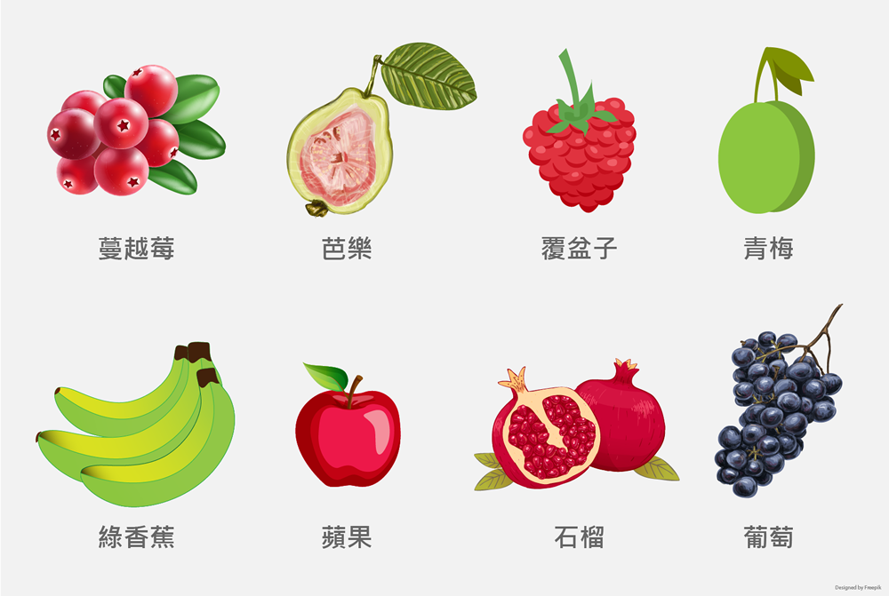
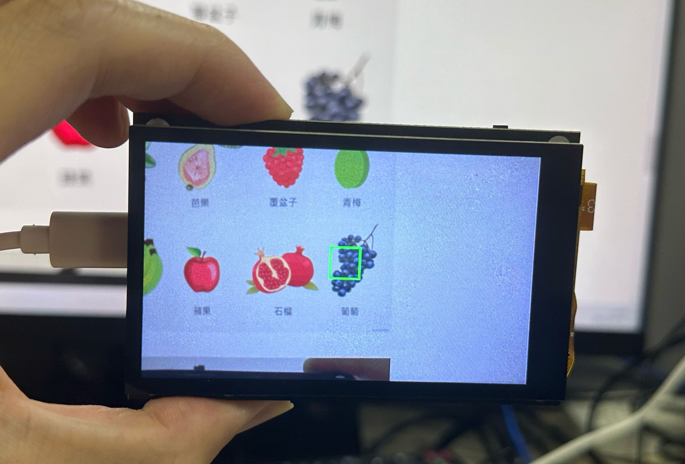
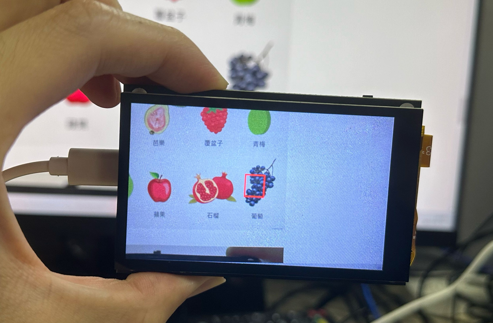

# 目标跟踪

## 前言

目标跟踪用于追踪图像中感兴趣的物体，常见的应用有自动跟随拍照。

## 实验目的

采集图像中感兴趣物体特征，然后追踪该物体。

## 实验讲解

本实验通过CanMV K230 AI视觉框架开发，详细说明参考 [AI视觉开发框架](./ai_frame.md) 章节内容，这里不再重复。例程用到的模型已经存放在CanMV K230的文件系统，无需额外拷贝。

具体编程思路如下：

```mermaid
graph TD
    导入AI视觉框架相关模块  --> 加载相关模型 --> 初始化和配置相关模块 --> 获取摄像头图像 --> 采集物体特征 --> 拍照 --> 跟踪物体 --> 画图指示 --> 拍照;
```

## 参考代码

```python
'''
实验名称：目标跟踪
实验平台：01Studio CanMV K230
教程：wiki.01studio.cc
'''

from libs.PipeLine import PipeLine, ScopedTiming
from libs.AIBase import AIBase
from libs.AI2D import Ai2d
from random import randint
import os
import ujson
from media.media import *
from time import *
import nncase_runtime as nn
import ulab.numpy as np
import time
import image
import aidemo
import random
import gc
import sys

# 自定义跟踪模版任务类
class TrackCropApp(AIBase):
    def __init__(self,kmodel_path,model_input_size,ratio_src_crop,center_xy_wh,rgb888p_size=[1280,720],display_size=[1920,1080],debug_mode=0):
        super().__init__(kmodel_path,model_input_size,rgb888p_size,debug_mode)
        # kmodel路径
        self.kmodel_path=kmodel_path
        # 跟踪模板输入分辨率
        self.model_input_size=model_input_size
        # sensor给到AI的图像分辨率，宽16字节对齐
        self.rgb888p_size=[ALIGN_UP(rgb888p_size[0],16),rgb888p_size[1]]
        # 视频输出VO分辨率，宽16字节对齐
        self.display_size=[ALIGN_UP(display_size[0],16),display_size[1]]
        # debug模式
        self.debug_mode=debug_mode
        # 跟踪框宽、高调整系数
        self.CONTEXT_AMOUNT = 0.5
        #src模型和crop模型输入比值
        self.ratio_src_crop = ratio_src_crop
        self.center_xy_wh=center_xy_wh
        # padding和crop参数
        self.pad_crop_params=[]
        # 注意：ai2d设置多个预处理时执行的顺序为：crop->shift->resize/affine->pad，如果不符合该顺序，需要配置多个ai2d对象;
        # 如下模型预处理要先做resize+padding再做resize+crop，因此要配置两个Ai2d对象
        self.ai2d_pad=Ai2d(debug_mode)
        self.ai2d_pad.set_ai2d_dtype(nn.ai2d_format.NCHW_FMT,nn.ai2d_format.NCHW_FMT,np.uint8, np.uint8)
        self.ai2d_crop=Ai2d(debug_mode)
        self.ai2d_crop.set_ai2d_dtype(nn.ai2d_format.NCHW_FMT,nn.ai2d_format.NCHW_FMT,np.uint8, np.uint8)
        self.need_pad=False

    # 配置预处理操作，这里使用了crop、pad和resize，Ai2d支持crop/shift/pad/resize/affine，具体代码请打开/sdcard/libs/AI2D.py查看
    def config_preprocess(self,input_image_size=None):
        with ScopedTiming("set preprocess config",self.debug_mode > 0):
            # 初始化ai2d预处理配置，默认为sensor给到AI的尺寸，可以通过设置input_image_size自行修改输入尺寸
            ai2d_input_size = input_image_size if input_image_size else self.rgb888p_size
            # 计算padding参数并应用pad操作，以确保输入图像尺寸与模型输入尺寸匹配
            self.pad_crop_params= self.get_padding_crop_param()
            # 如果需要padding,配置padding部分，否则只走crop
            if (self.pad_crop_params[0] != 0 or self.pad_crop_params[1] != 0 or self.pad_crop_params[2] != 0 or self.pad_crop_params[3] != 0):
                self.need_pad=True
                self.ai2d_pad.resize(nn.interp_method.tf_bilinear, nn.interp_mode.half_pixel)
                self.ai2d_pad.pad([0, 0, 0, 0, self.pad_crop_params[0], self.pad_crop_params[1], self.pad_crop_params[2], self.pad_crop_params[3]], 0, [114, 114, 114])
                output_size=[self.rgb888p_size[0]+self.pad_crop_params[2]+self.pad_crop_params[3],self.rgb888p_size[1]+self.pad_crop_params[0]+self.pad_crop_params[1]]
                self.ai2d_pad.build([1,3,ai2d_input_size[1],ai2d_input_size[0]],[1,3,output_size[1],output_size[0]])

                self.ai2d_crop.resize(nn.interp_method.tf_bilinear, nn.interp_mode.half_pixel)
                self.ai2d_crop.crop(int(self.pad_crop_params[4]),int(self.pad_crop_params[6]),int(self.pad_crop_params[5]-self.pad_crop_params[4]+1),int(self.pad_crop_params[7]-self.pad_crop_params[6]+1))
                self.ai2d_crop.build([1,3,output_size[1],output_size[0]],[1,3,self.model_input_size[1],self.model_input_size[0]])
            else:
                self.need_pad=False
                self.ai2d_crop.resize(nn.interp_method.tf_bilinear, nn.interp_mode.half_pixel)
                self.ai2d_crop.crop(int(self.center_xy_wh[0]-self.pad_crop_params[8]/2.0),int(self.center_xy_wh[1]-self.pad_crop_params[8]/2.0),int(self.pad_crop_params[8]),int(self.pad_crop_params[8]))
                self.ai2d_crop.build([1,3,ai2d_input_size[1],ai2d_input_size[0]],[1,3,self.model_input_size[1],self.model_input_size[0]])

    # 重写预处理函数preprocess，因为该部分不是单纯的走一个ai2d做预处理，所以该函数需要重写
    def preprocess(self,input_np):
        if self.need_pad:
            pad_output=self.ai2d_pad.run(input_np).to_numpy()
            return [self.ai2d_crop.run(pad_output)]
        else:
            return [self.ai2d_crop.run(input_np)]

    # 自定义后处理，results是模型输出array的列表
    def postprocess(self,results):
        with ScopedTiming("postprocess",self.debug_mode > 0):
            return results[0]

    # 计算padding和crop参数
    def get_padding_crop_param(self):
        s_z = round(np.sqrt((self.center_xy_wh[2] + self.CONTEXT_AMOUNT * (self.center_xy_wh[2] + self.center_xy_wh[3])) * (self.center_xy_wh[3] + self.CONTEXT_AMOUNT * (self.center_xy_wh[2] + self.center_xy_wh[3]))))
        c = (s_z + 1) / 2
        context_xmin = np.floor(self.center_xy_wh[0] - c + 0.5)
        context_xmax = int(context_xmin + s_z - 1)
        context_ymin = np.floor(self.center_xy_wh[1] - c + 0.5)
        context_ymax = int(context_ymin + s_z - 1)
        left_pad = int(max(0, -context_xmin))
        top_pad = int(max(0, -context_ymin))
        right_pad = int(max(0, int(context_xmax - self.rgb888p_size[0] + 1)))
        bottom_pad = int(max(0, int(context_ymax - self.rgb888p_size[1] + 1)))
        context_xmin = context_xmin + left_pad
        context_xmax = context_xmax + left_pad
        context_ymin = context_ymin + top_pad
        context_ymax = context_ymax + top_pad
        return [top_pad,bottom_pad,left_pad,right_pad,context_xmin,context_xmax,context_ymin,context_ymax,s_z]

    #重写deinit
    def deinit(self):
        with ScopedTiming("deinit",self.debug_mode > 0):
            del self.ai2d_pad
            del self.ai2d_crop
            super().deinit()

# 自定义跟踪实时任务类
class TrackSrcApp(AIBase):
    def __init__(self,kmodel_path,model_input_size,ratio_src_crop,rgb888p_size=[1280,720],display_size=[1920,1080],debug_mode=0):
        super().__init__(kmodel_path,model_input_size,rgb888p_size,debug_mode)
        # kmodel路径
        self.kmodel_path=kmodel_path
        # 检测模型输入分辨率
        self.model_input_size=model_input_size
        # sensor给到AI的图像分辨率，宽16字节对齐
        self.rgb888p_size=[ALIGN_UP(rgb888p_size[0],16),rgb888p_size[1]]
        # 视频输出VO分辨率，宽16字节对齐
        self.display_size=[ALIGN_UP(display_size[0],16),display_size[1]]
        # padding和crop参数列表
        self.pad_crop_params=[]
        # 跟踪框宽、高调整系数
        self.CONTEXT_AMOUNT = 0.5
        # src和crop模型的输入尺寸比例
        self.ratio_src_crop = ratio_src_crop
        # debug模式
        self.debug_mode=debug_mode
        # 注意：ai2d设置多个预处理时执行的顺序为：crop->shift->resize/affine->pad，如果不符合该顺序，需要配置多个ai2d对象;
        # 如下模型预处理要先做resize+padding再做resize+crop，因此要配置两个Ai2d对象
        self.ai2d_pad=Ai2d(debug_mode)
        self.ai2d_pad.set_ai2d_dtype(nn.ai2d_format.NCHW_FMT,nn.ai2d_format.NCHW_FMT,np.uint8, np.uint8)
        self.ai2d_crop=Ai2d(debug_mode)
        self.ai2d_crop.set_ai2d_dtype(nn.ai2d_format.NCHW_FMT,nn.ai2d_format.NCHW_FMT,np.uint8, np.uint8)
        self.need_pad=False

    # 配置预处理操作，这里使用了crop、pad和resize，Ai2d支持crop/shift/pad/resize/affine，具体代码请打开/sdcard/libs/AI2D.py查看
    def config_preprocess(self,center_xy_wh,input_image_size=None):
        with ScopedTiming("set preprocess config",self.debug_mode > 0):
            # 初始化ai2d预处理配置，默认为sensor给到AI的尺寸，可以通过设置input_image_size自行修改输入尺寸
            ai2d_input_size=input_image_size if input_image_size else self.rgb888p_size
            # 计算padding参数并应用pad操作，以确保输入图像尺寸与模型输入尺寸匹配
            self.pad_crop_params= self.get_padding_crop_param(center_xy_wh)
            # 如果需要padding,配置padding部分，否则只走crop
            if (self.pad_crop_params[0] != 0 or self.pad_crop_params[1] != 0 or self.pad_crop_params[2] != 0 or self.pad_crop_params[3] != 0):
                self.need_pad=True
                self.ai2d_pad.resize(nn.interp_method.tf_bilinear, nn.interp_mode.half_pixel)
                self.ai2d_pad.pad([0, 0, 0, 0, self.pad_crop_params[0], self.pad_crop_params[1], self.pad_crop_params[2], self.pad_crop_params[3]], 0, [114, 114, 114])
                output_size=[self.rgb888p_size[0]+self.pad_crop_params[2]+self.pad_crop_params[3],self.rgb888p_size[1]+self.pad_crop_params[0]+self.pad_crop_params[1]]

                self.ai2d_pad.build([1,3,ai2d_input_size[1],ai2d_input_size[0]],[1,3,output_size[1],output_size[0]])
                self.ai2d_crop.resize(nn.interp_method.tf_bilinear, nn.interp_mode.half_pixel)
                self.ai2d_crop.crop(int(self.pad_crop_params[4]),int(self.pad_crop_params[6]),int(self.pad_crop_params[5]-self.pad_crop_params[4]+1),int(self.pad_crop_params[7]-self.pad_crop_params[6]+1))
                self.ai2d_crop.build([1,3,output_size[1],output_size[0]],[1,3,self.model_input_size[1],self.model_input_size[0]])
            else:
                self.need_pad=False
                self.ai2d_crop.resize(nn.interp_method.tf_bilinear, nn.interp_mode.half_pixel)
                self.ai2d_crop.crop(int(center_xy_wh[0]-self.pad_crop_params[8]/2.0),int(center_xy_wh[1]-self.pad_crop_params[8]/2.0),int(self.pad_crop_params[8]),int(self.pad_crop_params[8]))
                self.ai2d_crop.build([1,3,ai2d_input_size[1],ai2d_input_size[0]],[1,3,self.model_input_size[1],self.model_input_size[0]])

    # 重写预处理函数preprocess，因为该部分不是单纯的走一个ai2d做预处理，所以该函数需要重写
    def preprocess(self,input_np):
        with ScopedTiming("preprocess",self.debug_mode>0):
            if self.need_pad:
                pad_output=self.ai2d_pad.run(input_np).to_numpy()
                return [self.ai2d_crop.run(pad_output)]
            else:
                return [self.ai2d_crop.run(input_np)]

    # 自定义后处理，results是模型输出array的列表
    def postprocess(self,results):
        with ScopedTiming("postprocess",self.debug_mode > 0):
            return results[0]

    # 计算padding和crop参数
    def get_padding_crop_param(self,center_xy_wh):
        s_z = round(np.sqrt((center_xy_wh[2] + self.CONTEXT_AMOUNT * (center_xy_wh[2] + center_xy_wh[3])) * (center_xy_wh[3] + self.CONTEXT_AMOUNT * (center_xy_wh[2] + center_xy_wh[3])))) * self.ratio_src_crop
        c = (s_z + 1) / 2
        context_xmin = np.floor(center_xy_wh[0] - c + 0.5)
        context_xmax = int(context_xmin + s_z - 1)
        context_ymin = np.floor(center_xy_wh[1] - c + 0.5)
        context_ymax = int(context_ymin + s_z - 1)
        left_pad = int(max(0, -context_xmin))
        top_pad = int(max(0, -context_ymin))
        right_pad = int(max(0, int(context_xmax - self.rgb888p_size[0] + 1)))
        bottom_pad = int(max(0, int(context_ymax - self.rgb888p_size[1] + 1)))
        context_xmin = context_xmin + left_pad
        context_xmax = context_xmax + left_pad
        context_ymin = context_ymin + top_pad
        context_ymax = context_ymax + top_pad
        return [top_pad,bottom_pad,left_pad,right_pad,context_xmin,context_xmax,context_ymin,context_ymax,s_z]

    # 重写deinit
    def deinit(self):
        with ScopedTiming("deinit",self.debug_mode > 0):
            del self.ai2d_pad
            del self.ai2d_crop
            super().deinit()


class TrackerApp(AIBase):
    def __init__(self,kmodel_path,crop_input_size,thresh,rgb888p_size=[1280,720],display_size=[1920,1080],debug_mode=0):
        super().__init__(kmodel_path,rgb888p_size,debug_mode)
        # kmodel路径
        self.kmodel_path=kmodel_path
        # crop模型的输入尺寸
        self.crop_input_size=crop_input_size
        # 跟踪框阈值
        self.thresh=thresh
        # 跟踪框宽、高调整系数
        self.CONTEXT_AMOUNT = 0.5
        # sensor给到AI的图像分辨率，宽16字节对齐
        self.rgb888p_size=[ALIGN_UP(rgb888p_size[0],16),rgb888p_size[1]]
        # 视频输出VO分辨率，宽16字节对齐
        self.display_size=[ALIGN_UP(display_size[0],16),display_size[1]]
        # debug模式
        self.debug_mode=debug_mode
        self.ai2d=Ai2d(debug_mode)
        self.ai2d.set_ai2d_dtype(nn.ai2d_format.NCHW_FMT,nn.ai2d_format.NCHW_FMT,np.uint8, np.uint8)

    def config_preprocess(self,input_image_size=None):
        with ScopedTiming("set preprocess config",self.debug_mode > 0):
            pass

    # 重写run函数，因为没有预处理过程，所以原来run操作中包含的preprocess->inference->postprocess不合适，这里只包含inference->postprocess
    def run(self,input_np_1,input_np_2,center_xy_wh):
        input_tensors=[]
        input_tensors.append(nn.from_numpy(input_np_1))
        input_tensors.append(nn.from_numpy(input_np_2))
        results=self.inference(input_tensors)
        return self.postprocess(results,center_xy_wh)


    # 自定义后处理，results是模型输出array的列表,这里使用了aidemo的nanotracker_postprocess列表
    def postprocess(self,results,center_xy_wh):
        with ScopedTiming("postprocess",self.debug_mode > 0):
            det = aidemo.nanotracker_postprocess(results[0],results[1],[self.rgb888p_size[1],self.rgb888p_size[0]],self.thresh,center_xy_wh,self.crop_input_size[0],self.CONTEXT_AMOUNT)
            return det

class NanoTracker:
    def __init__(self,track_crop_kmodel,track_src_kmodel,tracker_kmodel,crop_input_size,src_input_size,threshold=0.25,rgb888p_size=[1280,720],display_size=[1920,1080],debug_mode=0):
        # 跟踪模版模型路径
        self.track_crop_kmodel=track_crop_kmodel
        # 跟踪实时模型路径
        self.track_src_kmodel=track_src_kmodel
        # 跟踪模型路径
        self.tracker_kmodel=tracker_kmodel
        # 跟踪模版模型输入分辨率
        self.crop_input_size=crop_input_size
        # 跟踪实时模型输入分辨率
        self.src_input_size=src_input_size
        self.threshold=threshold

        self.CONTEXT_AMOUNT=0.5       # 跟踪框宽、高调整系数
        self.ratio_src_crop = 0.0     # src模型和crop模型输入比值
        self.track_x1 = float(600)    # 起始跟踪目标框左上角点x
        self.track_y1 = float(300)    # 起始跟踪目标框左上角点y
        self.track_w = float(100)     # 起始跟踪目标框w
        self.track_h = float(100)     # 起始跟踪目标框h
        self.draw_mean=[]             # 初始目标框位置列表
        self.center_xy_wh = []
        self.track_boxes = []
        self.center_xy_wh_tmp = []
        self.track_boxes_tmp=[]
        self.crop_output=None
        self.src_output=None
        # 跟踪框初始化时间
        self.seconds = 8
        self.endtime = time.time() + self.seconds
        self.enter_init = True

        # sensor给到AI的图像分辨率，宽16字节对齐
        self.rgb888p_size=[ALIGN_UP(rgb888p_size[0],16),rgb888p_size[1]]
        # 视频输出VO分辨率，宽16字节对齐
        self.display_size=[ALIGN_UP(display_size[0],16),display_size[1]]
        self.init_param()

        self.track_crop=TrackCropApp(self.track_crop_kmodel,model_input_size=self.crop_input_size,ratio_src_crop=self.ratio_src_crop,center_xy_wh=self.center_xy_wh,rgb888p_size=self.rgb888p_size,display_size=self.display_size,debug_mode=0)
        self.track_src=TrackSrcApp(self.track_src_kmodel,model_input_size=self.src_input_size,ratio_src_crop=self.ratio_src_crop,rgb888p_size=self.rgb888p_size,display_size=self.display_size,debug_mode=0)
        self.tracker=TrackerApp(self.tracker_kmodel,crop_input_size=self.crop_input_size,thresh=self.threshold,rgb888p_size=self.rgb888p_size,display_size=self.display_size)
        self.track_crop.config_preprocess()

    # run函数
    def run(self,input_np):
        # 在初始化时间内，crop模版部分的到跟踪模版特征，否则，对当前帧进行src推理得到特征并使用tracker对两个特征推理，得到跟踪框的坐标
        nowtime = time.time()
        if (self.enter_init and nowtime <= self.endtime):
            print("倒计时: " + str(self.endtime - nowtime) + " 秒")
            self.crop_output=self.track_crop.run(input_np)
            time.sleep(1)
            return self.draw_mean
        else:
            self.track_src.config_preprocess(self.center_xy_wh)
            self.src_output=self.track_src.run(input_np)
            det=self.tracker.run(self.crop_output,self.src_output,self.center_xy_wh)
            return det

    # 绘制效果，绘制跟踪框位置
    def draw_result(self,pl,box):
        pl.osd_img.clear()
        if self.enter_init:
            pl.osd_img.draw_rectangle(box[0],box[1],box[2],box[3],color=(255, 0, 255, 0),thickness = 4)
            if (time.time() > self.endtime):
                self.enter_init = False
        else:
            self.track_boxes = box[0]
            self.center_xy_wh = box[1]
            track_bool = True
            if (len(self.track_boxes) != 0):
                track_bool = self.track_boxes[0] > 10 and self.track_boxes[1] > 10 and self.track_boxes[0] + self.track_boxes[2] < self.rgb888p_size[0] - 10 and self.track_boxes[1] + self.track_boxes[3] < self.rgb888p_size[1] - 10
            else:
                track_bool = False

            if (len(self.center_xy_wh) != 0):
                track_bool = track_bool and self.center_xy_wh[2] * self.center_xy_wh[3] < 40000
            else:
                track_bool = False
            if (track_bool):
                self.center_xy_wh_tmp = self.center_xy_wh
                self.track_boxes_tmp = self.track_boxes
                x1 = int(float(self.track_boxes[0]) * self.display_size[0] / self.rgb888p_size[0])
                y1 = int(float(self.track_boxes[1]) * self.display_size[1] / self.rgb888p_size[1])
                w = int(float(self.track_boxes[2]) * self.display_size[0] / self.rgb888p_size[0])
                h = int(float(self.track_boxes[3]) * self.display_size[1] / self.rgb888p_size[1])
                pl.osd_img.draw_rectangle(x1, y1, w, h, color=(255, 255, 0, 0),thickness = 4)
            else:
                self.center_xy_wh = self.center_xy_wh_tmp
                self.track_boxes = self.track_boxes_tmp
                x1 = int(float(self.track_boxes[0]) * self.display_size[0] / self.rgb888p_size[0])
                y1 = int(float(self.track_boxes[1]) * self.display_size[1] / self.rgb888p_size[1])
                w = int(float(self.track_boxes[2]) * self.display_size[0] / self.rgb888p_size[0])
                h = int(float(self.track_boxes[3]) * self.display_size[1] / self.rgb888p_size[1])
                pl.osd_img.draw_rectangle(x1, y1, w, h, color=(255, 255, 0, 0),thickness = 4)
                pl.osd_img.draw_string_advanced( x1 , y1-50,32, "请远离摄像头，保持跟踪物体大小基本一致!" , color=(255, 255 ,0 , 0))
                pl.osd_img.draw_string_advanced( x1 , y1-100,32, "请靠近中心!" , color=(255, 255 ,0 , 0))

    # crop参数初始化
    def init_param(self):
        self.ratio_src_crop = float(self.src_input_size[0])/float(self.crop_input_size[0])
        print(self.ratio_src_crop)
        if (self.track_x1 < 50 or self.track_y1 < 50 or self.track_x1+self.track_w >= self.rgb888p_size[0]-50 or self.track_y1+self.track_h >= self.rgb888p_size[1]-50):
                    print("**剪切范围超出图像范围**")
        else:
            track_mean_x = self.track_x1 + self.track_w / 2.0
            track_mean_y = self.track_y1 + self.track_h / 2.0
            draw_mean_w = int(self.track_w / self.rgb888p_size[0] * self.display_size[0])
            draw_mean_h = int(self.track_h / self.rgb888p_size[1] * self.display_size[1])
            draw_mean_x = int(track_mean_x / self.rgb888p_size[0] * self.display_size[0] - draw_mean_w / 2.0)
            draw_mean_y = int(track_mean_y / self.rgb888p_size[1] * self.display_size[1] - draw_mean_h / 2.0)
            self.draw_mean=[draw_mean_x,draw_mean_y,draw_mean_w,draw_mean_h]
            self.center_xy_wh = [track_mean_x,track_mean_y,self.track_w,self.track_h]
            self.center_xy_wh_tmp=[track_mean_x,track_mean_y,self.track_w,self.track_h]

            self.track_boxes = [self.track_x1,self.track_y1,self.track_w,self.track_h,1]
            self.track_boxes_tmp=np.array([self.track_x1,self.track_y1,self.track_w,self.track_h,1])


if __name__=="__main__":
    # 显示模式，默认"hdmi",可以选择"hdmi"和"lcd"
    display_mode="lcd"
    if display_mode=="hdmi":
        display_size=[1920,1080]
    else:
        display_size=[800,480]
    # 跟踪模板模型路径
    track_crop_kmodel_path="/sdcard/examples/kmodel/cropped_test127.kmodel"
    # 跟踪实时模型路径
    track_src_kmodel_path="/sdcard/examples/kmodel/nanotrack_backbone_sim.kmodel"
    # 跟踪模型路径
    tracker_kmodel_path="/sdcard/examples/kmodel/nanotracker_head_calib_k230.kmodel"
    # 其他参数
    rgb888p_size=[1280,720]
    track_crop_input_size=[127,127]
    track_src_input_size=[255,255]
    threshold=0.1

    # 初始化PipeLine，只关注传给AI的图像分辨率，显示的分辨率
    pl=PipeLine(rgb888p_size=rgb888p_size,display_size=display_size,display_mode=display_mode)
    pl.create()
    track=NanoTracker(track_crop_kmodel_path,track_src_kmodel_path,tracker_kmodel_path,crop_input_size=track_crop_input_size,src_input_size=track_src_input_size,threshold=threshold,rgb888p_size=rgb888p_size,display_size=display_size)

    clock = time.clock()

    while True:

        clock.tick()

        img=pl.get_frame()              # 获取当前帧
        output=track.run(img)           # 推理当前帧
        track.draw_result(pl,output)    # 绘制当前帧推理结果
        print(output)                   # 打印当前结果
        pl.show_image()                 # 展示推理结果
        gc.collect()

        print(clock.fps()) #打印帧率
```

这里对关键代码进行讲解：

- 主函数代码：

可以看到使用默认配置后只使用了4行代码便实现了**获取当前帧图像、AI推理、绘制结果、显示结果** 的识别流程。

代码中 `output`为检测结果。

```python
    ...
    while True:

        clock.tick()

        img=pl.get_frame()              # 获取当前帧
        output=track.run(img)           # 推理当前帧
        track.draw_result(pl,output)    # 绘制当前帧推理结果
        print(output)                   # 打印当前结果
        pl.show_image()                 # 展示推理结果
        gc.collect()

        print(clock.fps()) #打印帧率
    ...
```

## 实验结果

在CanMV IDE中运行上述代码，代码开始运行后出现一个绿色矩形框，将要跟踪物体放在矩形框内。

原图：



这里演示追踪葡萄，将葡萄放进绿色矩形框。



等待矩形框变成红色后说明学习成功并开始追踪，这时候移动摄像头，始终能找到葡萄。




