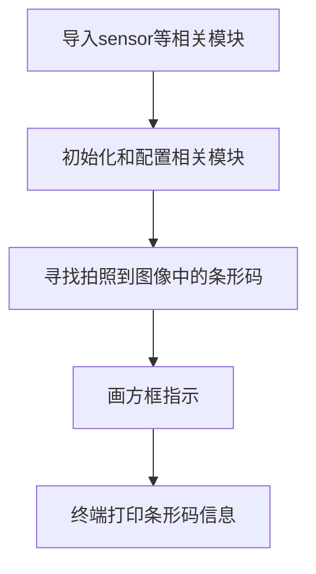
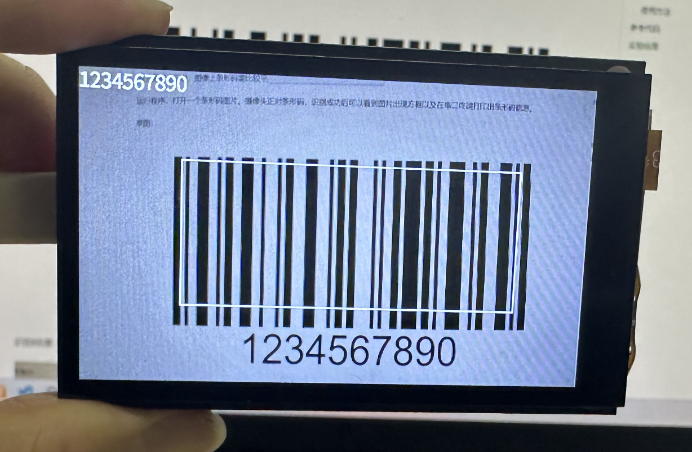
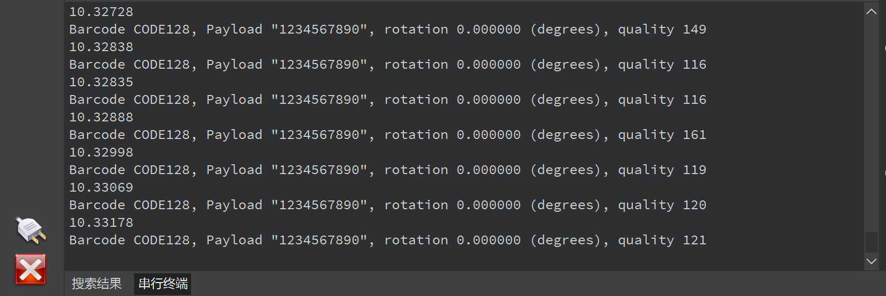

# 条形码识别

## 前言
条形码（barcode）是将宽度不等的多个黑条和空白，按照一定的编码规则排列，用以表达一组信息的图形标识符。常见的条形码是由反射率相差很大的黑条（简称条）和白条（简称空）排成的平行线图案。条形码可以标出物品的生产国、制造厂家、商品名称、生产日期、图书分类号、邮件起止地点、类别、日期等许多信息，因而在商品流通、图书管理、邮政管理、银行系统等许多领域都得到广泛的应用。


## 实验目的
编程实现条形码识别，并将识别到的信息通过串口终端打印出来。

## 实验讲解

而对于CanMV K230而言，直接使用MicroPython中的find_barcodes()即可获取摄像头采集图像中条形码的相关信息。该函数支持所有一维条形码：

image.EAN2 <br></br>
image.EAN5 <br></br>
image.EAN8 <br></br>
image.UPCE <br></br>
image.ISBN10 <br></br>
image.UPCA <br></br>
image.EAN13 <br></br>
image.ISBN13 <br></br>
image.I25 <br></br>
image.DATABAR (RSS-14) <br></br>
image.DATABAR_EXP (RSS-Expanded) <br></br>
image.CODABAR image.CODE39 <br></br>
image.PDF417 image.CODE93 <br></br>
image.CODE128 <br></br>

具体说明如下：

## find_barcodes对象

### 构造函数
```python
image.find_barcodes([roi])
```
查找roi区域内的所有条形码并返回一个image.barcode的对象列表。

### 使用方法

以上函数返回image.barcode对象列表。

```python
barcode.rect()
```
返回一个矩形元组（x,y,w,h）,条形码的边界。可以通过索引[0-3]来获得单个值。

<br></br>

```python
barcode.payload()
```
返回条形码字符串信息。可以通过索引[4]来获得这个值。

<br></br>

```python
barcode.type()
```
返回条形码类型。

<br></br>

更多用法请阅读官方文档：<br></br>
https://developer.canaan-creative.com/k230_canmv/main/zh/api/openmv/image.html#find-barcodes

<br></br>

从上表可以看到，使用MicroPython编程我们只需要简单地调用find_barcodes()函数，对得到的结果再进行处理即可，非常方便。代码编写流程如下图所示：



## 参考代码

```python
'''
实验名称：条形码识别
实验平台：01Studio CanMV K230
说明：编程实现摄像头识别各类条形码
'''

import time, math, os, gc

from media.sensor import * #导入sensor模块，使用摄像头相关接口
from media.display import * #导入display模块，使用display相关接口
from media.media import * #导入media模块，使用meida相关接口

#定义条形码类型
def barcode_name(code):
    if(code.type() == image.EAN2):
        return "EAN2"
    if(code.type() == image.EAN5):
        return "EAN5"
    if(code.type() == image.EAN8):
        return "EAN8"
    if(code.type() == image.UPCE):
        return "UPCE"
    if(code.type() == image.ISBN10):
        return "ISBN10"
    if(code.type() == image.UPCA):
        return "UPCA"
    if(code.type() == image.EAN13):
        return "EAN13"
    if(code.type() == image.ISBN13):
        return "ISBN13"
    if(code.type() == image.I25):
        return "I25"
    if(code.type() == image.DATABAR):
        return "DATABAR"
    if(code.type() == image.DATABAR_EXP):
        return "DATABAR_EXP"
    if(code.type() == image.CODABAR):
        return "CODABAR"
    if(code.type() == image.CODE39):
        return "CODE39"
    if(code.type() == image.PDF417):
        return "PDF417"
    if(code.type() == image.CODE93):
        return "CODE93"
    if(code.type() == image.CODE128):
        return "CODE128"

try:

    sensor = Sensor() #构建摄像头对象
    sensor.reset() #复位和初始化摄像头
    #sensor.set_framesize(Sensor.FHD) #设置帧大小FHD（1920x1080），默认通道0
    sensor.set_framesize(width=800, height=480) #设置帧大小VGA，默认通道0
    sensor.set_pixformat(Sensor.RGB565) #设置输出图像格式，默认通道0

    Display.init(Display.ST7701, to_ide=True) #同时使用3.5寸mipi屏和IDE缓冲区显示图像，800x480分辨率
    #Display.init(Display.VIRT, sensor.width(), sensor.height()) #只使用IDE缓冲区显示图像

    MediaManager.init() #初始化media资源管理器

    sensor.run() #启动sensor

    clock = time.clock()

    while True:

        os.exitpoint() #检测IDE中断
        clock.tick()

        img = sensor.snapshot() #拍摄图片

        codes = img.find_barcodes() #查找图像中所有条形码

        for code in codes:

            #对条码画矩形表示
            img.draw_rectangle(code.rect(),thickness=2)

            #打印相关信息
            print_args = (barcode_name(code), code.payload(), (180 * code.rotation()) / math.pi, code.quality())
            print("Barcode %s, Payload \"%s\", rotation %f (degrees), quality %d" % print_args)

            img.draw_string_advanced(0, 0, 30, code.payload(), color = (255, 255, 255)) #图像显示条码信息

        Display.show_image(img) #显示图片

        print(clock.fps()) #打印帧率

###################
# IDE中断释放资源代码
###################
except KeyboardInterrupt as e:
    print(f"user stop")
except BaseException as e:
    print(f"Exception '{e}'")
finally:
    # sensor stop run
    if isinstance(sensor, Sensor):
        sensor.stop()
    # deinit display
    Display.deinit()

    os.exitpoint(os.EXITPOINT_ENABLE_SLEEP)
    time.sleep_ms(100)

    # release media buffer
    MediaManager.deinit()
```

## 实验结果

为了更好地识别，图像上条形码需比较平展，不能太小。

运行程序，打开一个条形码图片。摄像头正对条形码，识别成功后可以看到图片出现方框以及在串口终端打印出条形码信息。

原图：


识别结果：



串口终端打印条形码详细信息：



条形码是日常生活应用非常广泛的东西，有了本节实验技能，我们就可以轻松打造一个属于自己的条形码扫描仪了。