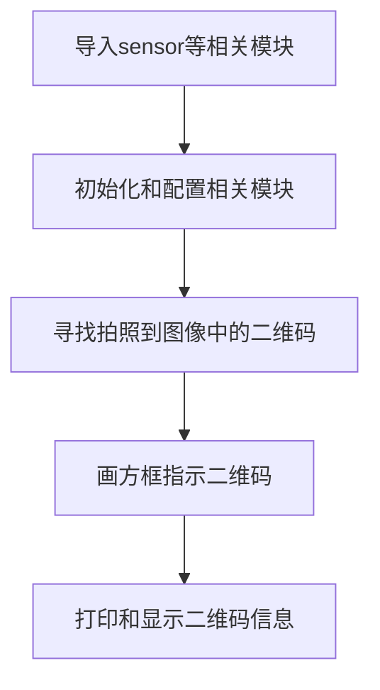
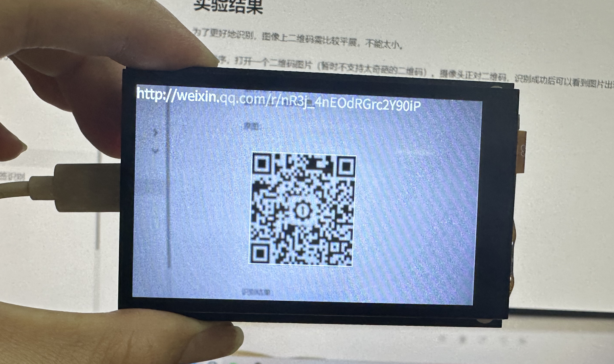
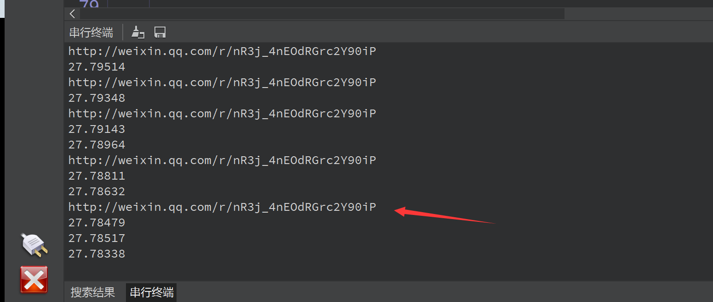

# 二维码识别

## 前言
相信大家都知道二维码了，特别是在扫码支付越来越流行的今天，二维码的应用非常广泛。今天我们就来学习如何使用CanMV K230开发套件实现二维码信息识别。

## 实验目的
编程实现二维码识别，并将识别到的信息通过串口终端打印出来。

## 实验讲解

二维码又称二维条码，常见的二维码为QR Code，QR全称Quick Response，是一个近几年来移动设备上超流行的一种编码方式，它比传统的Bar Code条形码能存更多的信息，也能表示更多的数据类型。

二维条码/二维码（2-dimensional bar code）是用某种特定的几何图形按一定规律在平面（二维方向上）分布的、黑白相间的、记录数据符号信息的图形；在代码编制上巧妙地利用构成计算机内部逻辑基础的“0”、“1”比特流的概念，使用若干个与二进制相对应的几何形体来表示文字数值信息，通过图象输入设备或光电扫描设备自动识读以实现信息自动处理：它具有条码技术的一些共性：每种码制有其特定的字符集；每个字符占有一定的宽度；具有一定的校验功能等。同时还具有对不同行的信息自动识别功能、及处理图形旋转变化点。

而对于CanMV K230而言，直接使用MicroPython中的find_qrcodes()即可获取摄像头采集图像中二维码的相关信息。具体说明如下：

## find_qrcodes对象

### 构造函数
```python
image.find_qrcodes([roi])
```
查找roi区域内的所有二维码并返回一个image.qrcode的对象列表。

### 使用方法

以上函数返回image.qrcode对象列表。

```python
qrcode.rect()
```
返回一个矩形元组（x,y,w,h）,二维码的边界。可以通过索引[0-3]来获得单个值。

<br></br>

```python
qrcode.payload()
```
返回二维码字符串信息。可以通过索引[4]来获得这个值。

<br></br>

```python
qrcode.verison()
```
返回二维码版本号。

<br></br>

更多用法请阅读官方文档：<br></br>
https://developer.canaan-creative.com/canmv/main/canmv/library/canmv/image.html#find-qrcodes

<br></br>

从上表可以看到，使用MicroPython编程我们只需要简单地调用find_qrcodes()函数，对得到的结果再进行处理即可，非常方便。代码编写流程如下图所示：



## 参考代码

### CanMV K230 + 3.5寸mipi屏

```python
'''
实验名称：二维码识别
实验平台：01Studio CanMV K230 + 3.5寸mipi屏
说明：编程实现摄像头识别二维码
教程：wiki.01studio.cc
'''

import time, math, os, gc

from media.sensor import * #导入sensor模块，使用摄像头相关接口
from media.display import * #导入display模块，使用display相关接口
from media.media import * #导入media模块，使用meida相关接口

sensor = Sensor() #构建摄像头对象
sensor.reset() #复位和初始化摄像头
sensor.set_framesize(width=800, height=480) #设置帧大小为LCD分辨率(800x480)，默认通道0
sensor.set_pixformat(Sensor.RGB565) #设置输出图像格式，默认通道0

Display.init(Display.ST7701, to_ide=True) #同时使用3.5寸mipi屏和IDE缓冲区显示图像，800x480分辨率
#Display.init(Display.VIRT, sensor.width(), sensor.height()) #只使用IDE缓冲区显示图像

MediaManager.init() #初始化media资源管理器

sensor.run() #启动sensor

clock = time.clock()

while True:

    clock.tick()

    img = sensor.snapshot() #拍摄图片

    res = img.find_qrcodes() #寻找二维码

    if len(res) > 0: #在图片和终端显示二维码信息

        img.draw_rectangle(res[0].rect(), thickness=2)
        img.draw_string_advanced(0, 0, 30, res[0].payload(), color = (255, 255, 255))

        print(res[0].payload()) #串口终端打印

    Display.show_image(img) #显示图片

    print(clock.fps()) #打印帧率

```


### CanMV K230 mini + 2.4寸mipi屏

```python
'''
实验名称：二维码识别
实验平台：01Studio CanMV K230 mini + 2.4寸mipi屏
说明：编程实现摄像头识别二维码
教程：wiki.01studio.cc
'''

import time, math, os, gc

from media.sensor import * #导入sensor模块，使用摄像头相关接口
from media.display import * #导入display模块，使用display相关接口
from media.media import * #导入media模块，使用meida相关接口

sensor = Sensor(width=1280, height=960) #构建摄像头对象
sensor.reset() #复位和初始化摄像头
sensor.set_framesize(width=640, height=480) #设置帧大小为LCD分辨率(640x480)，默认通道0
sensor.set_pixformat(Sensor.RGB565) #设置输出图像格式，默认通道0

Display.init(Display.ST7701, width=640, height=480, to_ide=True) #同时使用mipi屏和IDE缓冲区显示图像
#Display.init(Display.VIRT, sensor.width(), sensor.height()) #只使用IDE缓冲区显示图像

MediaManager.init() #初始化media资源管理器

sensor.run() #启动sensor

clock = time.clock()

while True:

    clock.tick()

    img = sensor.snapshot() #拍摄图片

    res = img.find_qrcodes() #寻找二维码

    if len(res) > 0: #在图片和终端显示二维码信息

        img.draw_rectangle(res[0].rect(), thickness=2)
        img.draw_string_advanced(0, 0, 30, res[0].payload(), color = (255, 255, 255))

        print(res[0].payload()) #串口终端打印

    Display.show_image(img) #显示图片

    print(clock.fps()) #打印帧率

```

## 实验结果

为了更好地识别，图像上二维码需比较平展，不能太小。

运行程序，打开一个二维码图片（暂时不支持太奇葩的二维码）。摄像头正对二维码，识别成功后可以看到图片出现方框以及在串口终端打印出二维码信息。

原图：


识别结果：



串口终端打印二维码详细信息：



二维码是日常生活应用非常广泛的东西，有了本节实验技能，我们就可以轻松打造一个属于自己的二维码扫描仪了。