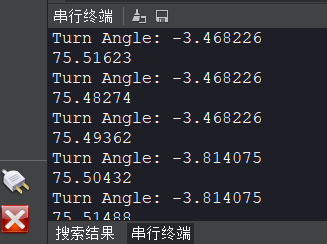

# 机器人巡线（实线）

## 前言

本节的巡线案例仍然是基于颜色识别，原理是根据摄像头采集到的图像直线与中心偏离的位置计算出偏离角度，这个方法让巡线变得更容易。如果你的CanMV K230连接到机器人（或相关设备），那么机器人（设备）可以直接关键计算角度偏离结果做出相应调整。


## 实验目的
通过编程实现CanMV K230摄像头画面中黑线的偏离角度。

## 实验讲解

本实验对画面是有一定要求的，也就是摄像头采集图像一定要出现唯一1条连续的黑色直线。程序通过对画面切割成三部分，计算每个部分黑色线的中心点X坐标，然后采用加权平均算法估算出直线的偏离位置。通常情况下越靠近底部的地方离摄像头越近，顶部表示远方线段。因此底部的图形权重高。以下下是示意图讲解：

假设摄像头当前画面的像素是例程的QQVGA分辨率：160（宽）X120（高），左上角坐标为（0,0），然后当前出现直线坐标为（80,120）至（160,0）偏右的直线。上中下三个部分的权重分别为0.1、0.3、0.7（底部图像靠近机器人，权重大，权重总和可以不是1），我们来计算一下其中心值。


上图中Y轴的中点坐标就是60，X坐标加权平均值计算如下：

X’=（80*0.7+120*0.3+160*0.1）/（0.7+0.3+0.1）=98

那么直线偏离坐标可以认为是（98,60），图中绿色“+”位置。那么利用反正切函数可以求出偏离角度：a = atan((98-80)/60)=16.7°，机器人相当于实线的位置往左偏了，所以加一个负号，即 -16.7°；偏离角度就是这么计算出来的。**得到偏离角度后就可以自己编程去调整小车或者机器人的运动状态，直到0°为没有偏离。**

本实验主要采用find_blobs函数编程，这个函数在上一节已经有讲述，具体使用方法如下表：

## find_blobs对象

### 构造函数
```python
image.find_blobs(thresholds[, invert=False[, roi[, x_stride=2[, y_stride=1[, area_threshold=10
                 [, pixels_threshold=10[, merge=False[, margin=0[, threshold_cb=None[, 
                 merge_cb=None]]]]]]]]]])
```
查找图像中指定的色块。返回image.blog对象列表；参数说明：
- `thresholds`: 必须是元组列表。 [(lo, hi), (lo, hi), ..., (lo, hi)] 定义你想追踪的颜色范围。 对于灰度图像，每个元组需要包含两个值 - 最小灰度值和最大灰度值。 仅考虑落在这些阈值之间的像素区域。 对于RGB565图像，每个元组需要有六个值(l_lo，l_hi，a_lo，a_hi，b_lo，b_hi) - 分别是LAB L，A和B通道的最小值和最大值。
- `area_threshold`: 若色块的边界框区域小于此参数值，则会被过滤掉；
- `pixels_threshold`: 若色块的像素数量小于此参数值，则会被过滤掉；
- `merge`: 若为True,则合并所有没有被过滤的色块；
- `margin`: 调整合并色块的边缘。

### 使用方法

以上函数返回image.blob对象。

```python
blob.rect()
```
返回一个矩形元组（x,y,w,h）,如色块边界。可以通过索引[0-3]来获得这些值。

<br></br>

```python
blob.cx()
```
返回色块(int)的中心x位置。可以通过索引[5]来获得这个值。

<br></br>

```python
blob.cy()
```
返回色块(int)的中心y位置。可以通过索引[6]来获得这个值。

<br></br>

[官方文档](https://developer.canaan-creative.com/k230_canmv/main/zh/api/openmv/image.html#find-blobs)

<br></br>

了解了找色块函数应用方法后，我们可以理清一下编程思路，代码编写流程如下：


## 参考代码

```python
'''
实验名称：机器人巡线（实线）
实验平台：01Studio CanMV K230
教程：wiki.01studio.cc

# 黑色灰度线巡线跟踪示例
#
#做一个跟随机器人的机器人需要很多的努力。这个示例脚本
#演示了如何做机器视觉部分的线跟随机器人。你
#可以使用该脚本的输出来驱动一个差分驱动机器人
#跟着一条线走。这个脚本只生成一个表示的旋转值（偏离角度）
#你的机器人向左或向右。
#
# 为了让本示例正常工作，你应该将摄像头对准一条直线（实线）
#并将摄像头调整到水平面45度位置。请保证画面内只有1条直线。
'''

import time, os, sys, math

from media.sensor import * #导入sensor模块，使用摄像头相关接口
from media.display import * #导入display模块，使用display相关接口
from media.media import * #导入media模块，使用meida相关接口

# 追踪黑线。使用 [(128, 255)] 追踪白线.
GRAYSCALE_THRESHOLD = [(0, 64)]

# 下面是一个roi【区域】元组列表。每个 roi 用 (x, y, w, h)表示的矩形。

'''
#采样图像QQVGA 160*120，列表把roi把图像分成3个矩形，越靠近的摄像头视野（通常为图像下方）的矩形权重越大。
ROIS = [ # [ROI, weight]
        (0, 100, 160, 20, 0.7), # 可以根据不同机器人情况进行调整。
        (0,  50, 160, 20, 0.3),
        (0,   0, 160, 20, 0.1)
       ]
'''
#采样图像为QVGA 320*240，列表把roi把图像分成3个矩形，越靠近的摄像头视野（通常为图像下方）的矩形权重越大。
ROIS = [ # [ROI, weight]
        (0, 200, 320, 40, 0.7), # 可以根据不同机器人情况进行调整。
        (0,  100, 320, 40, 0.3),
        (0,   0, 320, 40, 0.1)
       ]

# 计算以上3个矩形的权值【weight】的和，和不需要一定为1.
weight_sum = 0
for r in ROIS: weight_sum += r[4] # r[4] 为矩形权重值.

sensor = Sensor(width=1280, height=960) #构建摄像头对象，将摄像头长宽设置为4:3
sensor.reset() #复位和初始化摄像头
sensor.set_framesize(width=320, height=240) #设置帧大小，默认通道0
sensor.set_pixformat(Sensor.GRAYSCALE) #设置输出图像格式，默认通道0

Display.init(Display.ST7701, to_ide=True) #同时使用3.5寸mipi屏和IDE缓冲区显示图像，800x480分辨率
#Display.init(Display.VIRT, sensor.width(), sensor.height()) #只使用IDE缓冲区显示图像

MediaManager.init() #初始化media资源管理器

sensor.run() #启动sensor

clock = time.clock()

while True:

    ################
    ## 这里编写代码 ##
    ################
    clock.tick()

    img = sensor.snapshot() #拍摄一张图片

    centroid_sum = 0

    for r in ROIS:
        blobs = img.find_blobs(GRAYSCALE_THRESHOLD, roi=r[0:4], merge=True) # r[0:4] 是上面定义的roi元组.

        if blobs:
            # Find the blob with the most pixels.
            largest_blob = max(blobs, key=lambda b: b.pixels())

            # Draw a rect around the blob.
            img.draw_rectangle(largest_blob.rect())
            img.draw_cross(largest_blob.cx(),
                           largest_blob.cy())

            centroid_sum += largest_blob.cx() * r[4] # r[4] 是每个roi的权重值.

    center_pos = (centroid_sum / weight_sum) # 确定直线的中心.

    # 将直线中心位置转换成角度，便于机器人处理.
    deflection_angle = 0

    # 使用反正切函数计算直线中心偏离角度。可以自行画图理解
    #权重X坐标落在图像左半部分记作正偏，落在右边部分记为负偏，所以计算结果加负号。

    #deflection_angle = -math.atan((center_pos-80)/60) #采用图像为QQVGA 160*120时候使用

    deflection_angle = -math.atan((center_pos-160)/120) #采用图像为QVGA 320*240时候使用

    # 将偏离值转换成偏离角度.
    deflection_angle = math.degrees(deflection_angle)

    # 计算偏离角度后可以控制机器人进行调整.
    print("Turn Angle: %f" % deflection_angle)

    # LCD显示偏移角度,scale参数可以改变字体大小
    img.draw_string_advanced(2,2,20, str('%.1f' % deflection_angle), color=(255,255,255))

    #Display.show_image(img) #显示图片

    #显示图片，仅用于LCD居中方式显示
    Display.show_image(img, x=round((800-sensor.width())/2),y=round((480-sensor.height())/2))

    print(clock.fps()) #打印FPS
```

## 实验结果

在CanMV IDE中运行代码，分别观察摄像头采集到没偏移、左偏和右偏各个直线的实验结果。

### 无偏移

可以看到偏移角度接近0°；

画面图片：


终端结果：



### 左偏

小车或机器人左偏时角度为负数；

画面图片：


终端结果：


### 右偏

小车或机器人左偏时角度为正数；

画面图片：


终端结果：


获取偏移角度后可以执行指定动作或结合[UART(串口通讯)](../../basic_examples/uart.md) 章节内容告知其它外设或主控。