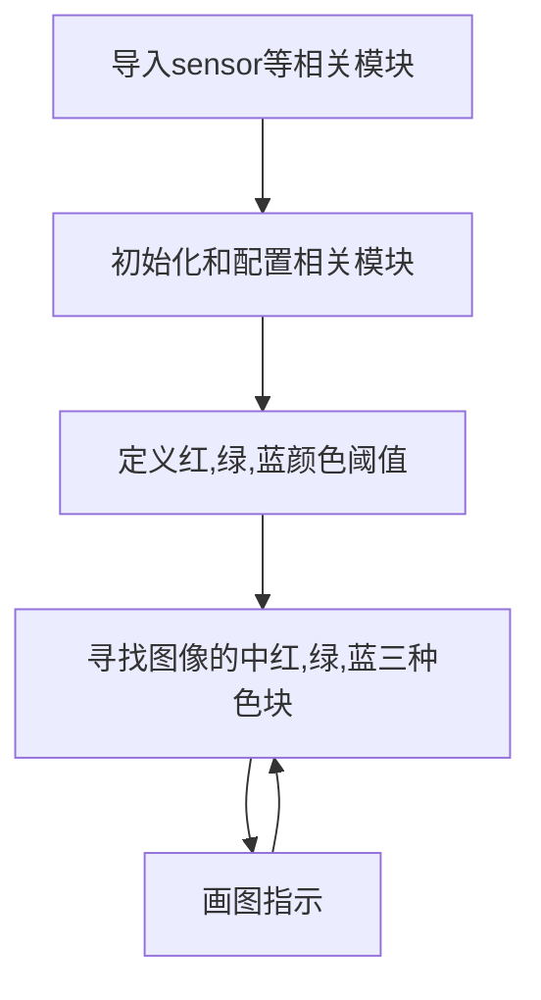
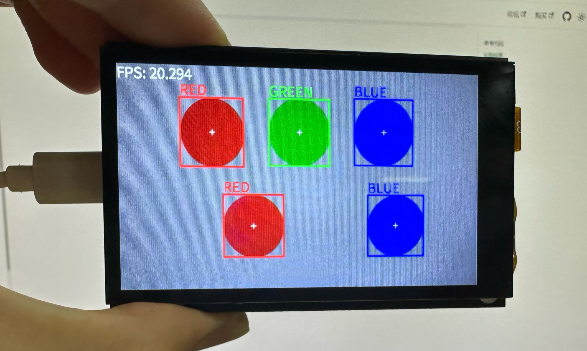

# 多种颜色识别

上一节我们学习了 [**单一颜色识别**](../color_recognition/single_color.md) ，只需要在这个基础上将代码稍作修改，即可实现多种颜色识别。

代码编写流程如下：



### 参考代码

```python
'''
实验名称：多种颜色识别
实验平台：01Studio CanMV K230
教程：wiki.01studio.cc
'''

import time, os, sys

from media.sensor import * #导入sensor模块，使用摄像头相关接口
from media.display import * #导入display模块，使用display相关接口
from media.media import * #导入media模块，使用meida相关接口

# 颜色识别阈值 (L Min, L Max, A Min, A Max, B Min, B Max) LAB模型
# 下面的阈值元组是用来识别 红、绿、蓝三种颜色，当然你也可以调整让识别变得更好。
thresholds = [(30, 100, 15, 127, 15, 127), # 红色阈值
              (30, 100, -64, -8, 50, 70), # 绿色阈值
              (0, 40, 0, 90, -128, -20)] # 蓝色阈值

colors1 = [(255,0,0), (0,255,0), (0,0,255)]
colors2 = ['RED', 'GREEN', 'BLUE']


sensor = Sensor() #构建摄像头对象
sensor.reset() #复位和初始化摄像头
sensor.set_framesize(width=800, height=480) #设置帧大小为LCD分辨率(800x480)，默认通道0
sensor.set_pixformat(Sensor.RGB565) #设置输出图像格式，默认通道0

Display.init(Display.ST7701, to_ide=True) #同时使用3.5寸mipi屏和IDE缓冲区显示图像，800x480分辨率
#Display.init(Display.VIRT, sensor.width(), sensor.height()) #只使用IDE缓冲区显示图像

MediaManager.init() #初始化media资源管理器

sensor.run() #启动sensor

clock = time.clock()

while True:

    ################
    ## 这里编写代码 ##
    ################
    clock.tick()

    img = sensor.snapshot() #拍摄一张图片

    for i in range(3):

        blobs = img.find_blobs([thresholds[i]]) # 0,1,2分别表示红，绿，蓝色。

        if blobs:

            for b in blobs: #画矩形、箭头和字符表示
                tmp=img.draw_rectangle(b[0:4], thickness = 4, color = colors1[i])
                tmp=img.draw_cross(b[5], b[6], thickness = 2)
                tmp=img.draw_string_advanced(b[0], b[1]-35, 30, colors2[i],color = colors1[i])


    img.draw_string_advanced(0, 0, 30, 'FPS: '+str("%.3f"%(clock.fps())), color = (255, 255, 255))

    Display.show_image(img) #显示图片

    print(clock.fps()) #打印FPS
```

与单一颜色识别例程相比，修改的代码如下，在颜色识别前中加入了for循环，识别预设的3种颜色：
```python
    ...
    for i in range(3):

        blobs = img.find_blobs([thresholds[i]]) # 0,1,2分别表示红，绿，蓝色。

        if blobs:

            for b in blobs: #画矩形、箭头和字符表示
                tmp=img.draw_rectangle(b[0:4], thickness = 4, color = colors1[i])
                tmp=img.draw_cross(b[5], b[6], thickness = 2)
                tmp=img.draw_string_advanced(b[0], b[1]-35, 30, colors2[i],color = colors1[i])
    ...
```

### 实验结果

运行多种颜色识别代码，可以看到实验结果如下，全部颜色被识别出来：

原图：


实验结果：

