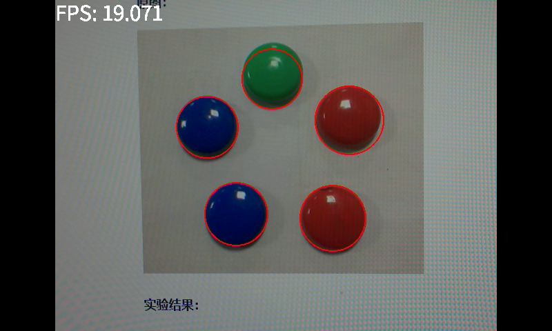
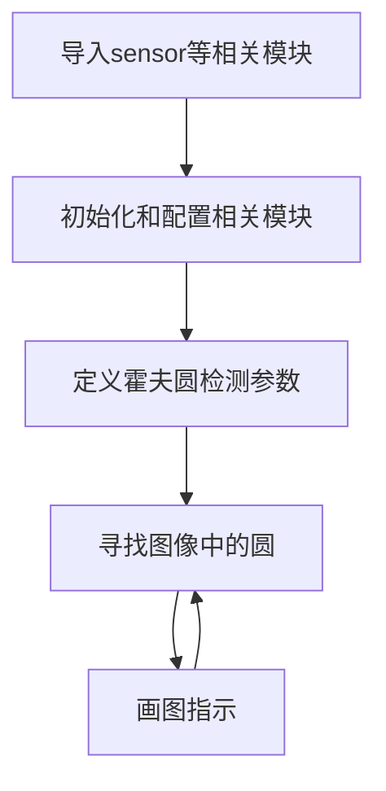

# 圆形检测（彩色图）

## 实验讲解

圆形检测（彩色）用于识别图像里的圆并画框标注。使用cv_lite库与前面 [圆形检测](../image_detection/find_circles.md) 例程对比速度更快。



## rgb888_find_circles对象

### 构造函数
```python
circles = cv_lite.rgb888_find_circles(image_shape, img_np, dp, minDist, param1, param2, minRadius, maxRadius)
```
查找图像中的圆形。参数说明：
- `image_shape`: 图像形状，list类型，顺序为[高，宽]，如[480,640]
- `img_np`: 图像数据引用，ulab.numpy.ndarray类型
- `dp`: 累加器分辨率与图像分辨率的反比，float类型
- `minDist`: 检测到的圆心最小距离，int类型
- `param1`: Canny边缘检测高阈值，int类型
- `param2`: 霍夫变换圆心检测阈值，int类型
- `minRadius`: 检测圆最小半径，int类型
- `maxRadius`: 检测圆最大半径，int类型

### 使用方法

以上函数返回circles值：**圆信息列表，每3个元素为一个圆的信息，包括位置x、y、r**

更多用法请阅读 [官方文档](https://www.kendryte.com/k230_canmv/zh/main/zh/api/cv_lite/cv_lite.html#rgb888-find-circles)

<br></br>

代码编写流程如下：



## 参考代码

### CanMV K230 + 3.5寸mipi屏

```python
'''
实验名称：色块检测
实验平台：01Studio CanMV K230
教程：wiki.01studio.cc
说明：通过修改lcd_width和lcd_height参数值选择3.5寸或2.4寸屏。
'''

# ============================================================
# MicroPython RGB888 彩色块检测测试代码（使用 cv_lite 扩展模块）
# RGB888 Color Blob Detection Test using cv_lite extension
# ============================================================

import time, os, sys, gc
from machine import Pin
from media.sensor import *  # 导入摄像头接口 / Camera interface
from media.display import * # 导入显示接口 / Display interface
from media.media import *   # 导入媒体资源管理器 / Media manager
import _thread
import cv_lite              # cv_lite 扩展模块
import ulab.numpy as np     # MicroPython NumPy 类库

#CanMV K230 - 3.5寸mipi屏分辨率定义
lcd_width = 800
lcd_height = 480

'''
#CanMV K230 mini - 2.4寸mipi屏分辨率定义
lcd_width = 640
lcd_height = 480
'''

# -------------------------------
# 图像尺寸设置 / Image resolution
# -------------------------------
image_shape = [480, 640]  # 高 x 宽 / Height x Width

# -------------------------------
# 初始化摄像头（RGB888模式） / Initialize camera (rgb888 mode)
# -------------------------------
sensor = Sensor(id=2, width=1280, height = 960, fps = 90)
sensor.reset()
sensor_width = sensor.width(None)
sensor_height = sensor.height(None)
sensor.set_framesize(width=image_shape[1], height=image_shape[0])
sensor.set_pixformat(Sensor.RGB888)  # RGB888格式 / rgb888 format

# -------------------------------
# 初始化显示（IDE虚拟显示模式） / Initialize display (IDE virtual output)
# -------------------------------
Display.init(Display.ST7701, width=lcd_width, height=lcd_height, to_ide=True, quality=50)

# -------------------------------
# 初始化媒体资源管理器 / Initialize media manager
# -------------------------------
MediaManager.init()
sensor.run()

# -------------------------------
# 色块检测阈值 / Blob detection thresholds
# 格式：[Rmin, Rmax, Gmin, Gmax, Bmin, Bmax]
threshold = [120, 255, 0, 50, 0, 50] #红色
#threshold = [0, 50, 120, 255, 0, 50] #绿色
#threshold = [0, 50, 0, 50, 120, 255] #蓝色

min_area = 100    # 最小色块面积 / Minimum blob area
kernel_size = 1   # 腐蚀膨胀核大小（用于预处理）/ Kernel size for morphological ops

# -------------------------------
# 启动帧率计时器 / Start FPS timer
# -------------------------------
clock = time.clock()

# -------------------------------
# 主循环 / Main loop
# -------------------------------
while True:
    clock.tick()

    # 拍摄一帧图像 / Capture a frame
    img = sensor.snapshot()
    img_np = img.to_numpy_ref()  # 获取 RGB888 ndarray 引用

    # 调用 cv_lite 扩展进行色块检测，返回 [x, y, w, h, ...] 列表
    blobs = cv_lite.rgb888_find_blobs(image_shape, img_np, threshold, min_area, kernel_size)

    # 遍历检测到的色块并绘制矩形框
    for i in range(len(blobs) // 4):   # 修正为整数除法
        x = blobs[4*i]
        y = blobs[4*i + 1]
        w = blobs[4*i + 2]
        h = blobs[4*i + 3]
        img.draw_rectangle(x, y, w, h, color=(255, 255, 255), thickness=2)  # 红色框

    img.draw_string_advanced(0, 0, 30, 'FPS: '+str("%.3f"%(clock.fps())), color = (255, 255, 255))

    # 显示结果图像 / Show image with blobs
    Display.show_image(img, x=round((lcd_width-sensor.width())/2),y=round((lcd_height-sensor.height())/2))

    # 打印帧率 / Print FPS
    print("findblobs:", clock.fps())

    # 垃圾回收 / Garbage collect
    gc.collect()

# -------------------------------
# 退出释放资源 / Cleanup on exit
# -------------------------------
sensor.stop()
Display.deinit()
os.exitpoint(os.EXITPOINT_ENABLE_SLEEP)
time.sleep_ms(100)
MediaManager.deinit()
```

### CanMV K230 mini + 2.4寸mipi屏

```python
'''
实验名称：色块检测
实验平台：01Studio CanMV K230
教程：wiki.01studio.cc
说明：通过修改lcd_width和lcd_height参数值选择3.5寸或2.4寸屏。
'''

# ============================================================
# MicroPython RGB888 彩色块检测测试代码（使用 cv_lite 扩展模块）
# RGB888 Color Blob Detection Test using cv_lite extension
# ============================================================

import time, os, sys, gc
from machine import Pin
from media.sensor import *  # 导入摄像头接口 / Camera interface
from media.display import * # 导入显示接口 / Display interface
from media.media import *   # 导入媒体资源管理器 / Media manager
import _thread
import cv_lite              # cv_lite 扩展模块
import ulab.numpy as np     # MicroPython NumPy 类库

'''
#CanMV K230 - 3.5寸mipi屏分辨率定义
lcd_width = 800
lcd_height = 480
'''

#CanMV K230 mini - 2.4寸mipi屏分辨率定义
lcd_width = 640
lcd_height = 480

# -------------------------------
# 图像尺寸设置 / Image resolution
# -------------------------------
image_shape = [480, 640]  # 高 x 宽 / Height x Width

# -------------------------------
# 初始化摄像头（RGB888模式） / Initialize camera (rgb888 mode)
# -------------------------------
sensor = Sensor(id=2, width=1280, height = 960, fps = 90)
sensor.reset()
sensor_width = sensor.width(None)
sensor_height = sensor.height(None)
sensor.set_framesize(width=image_shape[1], height=image_shape[0])
sensor.set_pixformat(Sensor.RGB888)  # RGB888格式 / rgb888 format

# -------------------------------
# 初始化显示（IDE虚拟显示模式） / Initialize display (IDE virtual output)
# -------------------------------
Display.init(Display.ST7701, width=lcd_width, height=lcd_height, to_ide=True, quality=50)

# -------------------------------
# 初始化媒体资源管理器 / Initialize media manager
# -------------------------------
MediaManager.init()
sensor.run()

# -------------------------------
# 色块检测阈值 / Blob detection thresholds
# 格式：[Rmin, Rmax, Gmin, Gmax, Bmin, Bmax]
threshold = [120, 255, 0, 50, 0, 50] #红色
#threshold = [0, 50, 120, 255, 0, 50] #绿色
#threshold = [0, 50, 0, 50, 120, 255] #蓝色

min_area = 100    # 最小色块面积 / Minimum blob area
kernel_size = 1   # 腐蚀膨胀核大小（用于预处理）/ Kernel size for morphological ops

# -------------------------------
# 启动帧率计时器 / Start FPS timer
# -------------------------------
clock = time.clock()

# -------------------------------
# 主循环 / Main loop
# -------------------------------
while True:
    clock.tick()

    # 拍摄一帧图像 / Capture a frame
    img = sensor.snapshot()
    img_np = img.to_numpy_ref()  # 获取 RGB888 ndarray 引用

    # 调用 cv_lite 扩展进行色块检测，返回 [x, y, w, h, ...] 列表
    blobs = cv_lite.rgb888_find_blobs(image_shape, img_np, threshold, min_area, kernel_size)

    # 遍历检测到的色块并绘制矩形框
    for i in range(len(blobs) // 4):   # 修正为整数除法
        x = blobs[4*i]
        y = blobs[4*i + 1]
        w = blobs[4*i + 2]
        h = blobs[4*i + 3]
        img.draw_rectangle(x, y, w, h, color=(255, 255, 255), thickness=2)  # 红色框

    img.draw_string_advanced(0, 0, 30, 'FPS: '+str("%.3f"%(clock.fps())), color = (255, 255, 255))

    # 显示结果图像 / Show image with blobs
    Display.show_image(img, x=round((lcd_width-sensor.width())/2),y=round((lcd_height-sensor.height())/2))

    # 打印帧率 / Print FPS
    print("findblobs:", clock.fps())

    # 垃圾回收 / Garbage collect
    gc.collect()

# -------------------------------
# 退出释放资源 / Cleanup on exit
# -------------------------------
sensor.stop()
Display.deinit()
os.exitpoint(os.EXITPOINT_ENABLE_SLEEP)
time.sleep_ms(100)
MediaManager.deinit()

```

## 实验结果

在CanMV IDE中运行代码，用户可自行调整参数，比如最小圆半径过滤一些干扰，识别结果如下：

**圆形识别：**

原图：


实验结果：

