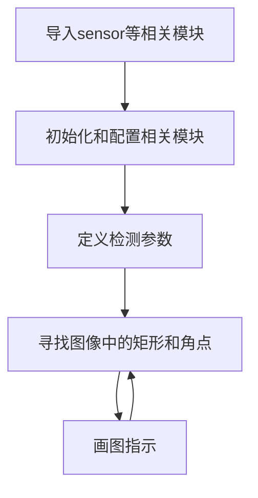

# 矩形带角点检测（彩色图）

## 实验讲解

矩形带角点检测（彩色）用于识别彩色图像里的矩形和4个角点并画框标注。


## rgb888_find_rectangles对象

### 构造函数
```python
rects = cv_lite.rgb888_find_rectangles_with_corners(
    image_shape, img_np,
    canny_thresh1, canny_thresh2,
    approx_epsilon,
    area_min_ratio,
    max_angle_cos,
    gaussian_blur_size
)
```
查找图像中的矩形。参数说明：
- `image_shape`: 图像形状，list类型，顺序为[高，宽]，如[480,640]
- `img_np`: 图像数据引用，ulab.numpy.ndarray类型
- `canny_thresh1`: Canny 边缘检测低阈值，int类型
- `canny_thresh2`: Canny 边缘检测高阈值，int类型
- `approx_epsilon`: 多边形拟合精度比例，float类型
- `area_min_ratio`: 最小面积比例，float类型
- `max_angle_cos`: 最大角度余弦，float类型
- `gaussian_blur_size`: 高斯模糊核尺寸，int类型

### 使用方法

以上函数返回rects值：**矩形位置信息列表，每个元素为一个列表包含一个矩形的坐标位置和角点坐标共12个数值**

更多用法请阅读 [官方文档](https://www.kendryte.com/k230_canmv/zh/main/zh/api/cv_lite/cv_lite.html#grayscale-find-with-corners)

<br></br>

代码编写流程如下：



## 参考代码

### CanMV K230 + 3.5寸mipi屏

```python
'''
实验名称：矩形带角点检测
实验平台：01Studio CanMV K230
教程：wiki.01studio.cc
说明：通过修改lcd_width和lcd_height参数值选择3.5寸或2.4寸屏。
'''


# ============================================================
# MicroPython RGB888矩形检测测试代码（使用 cv_lite 扩展模块）,带角点
# Grayscale Rectangle Detection Test using cv_lite extension
# ============================================================

import time, os, sys, gc
from machine import Pin
from media.sensor import *     # 摄像头接口 / Camera interface
from media.display import *    # 显示接口 / Display interface
from media.media import *      # 媒体资源管理器 / Media manager
import _thread
import cv_lite                 # cv_lite扩展模块 / cv_lite extension (C bindings)
import ulab.numpy as np        # MicroPython NumPy类库

#CanMV K230 - 3.5寸mipi屏分辨率定义
lcd_width = 800
lcd_height = 480

'''
#CanMV K230 mini - 2.4寸mipi屏分辨率定义
lcd_width = 640
lcd_height = 480
'''

# -------------------------------
# 图像尺寸设置 / Image resolution
# -------------------------------
image_shape = [480, 640]  # 高 x 宽 / Height x Width

# -------------------------------
# 初始化摄像头（RGB888模式） / Initialize camera (rgb888 mode)
# -------------------------------
sensor = Sensor(id=2, width=1280, height=960, fps = 90)
sensor.reset()
sensor_width = sensor.width(None)
sensor_height = sensor.height(None)
sensor.set_framesize(width=image_shape[1], height=image_shape[0])
sensor.set_pixformat(Sensor.RGB888)  # RGB888格式 / rgb888 format

# -------------------------------
# 初始化显示器（IDE虚拟输出） / Initialize display (IDE virtual output)
# -------------------------------
Display.init(Display.ST7701, width=lcd_width, height=lcd_height,
             to_ide=True, quality=50)

# -------------------------------
# 初始化媒体系统 / Initialize media system
# -------------------------------
MediaManager.init()
sensor.run()

# -------------------------------
# 可选增益设置（亮度/对比度调节）/ Optional sensor gain setting
# -------------------------------
gain = k_sensor_gain()
gain.gain[0] = 20
sensor.again(gain)

# -------------------------------
# 启动帧率计时 / Start FPS timer
# -------------------------------
clock = time.clock()

# -------------------------------
# 矩形检测可调参数 / Adjustable rectangle detection parameters
# -------------------------------
canny_thresh1      = 50        # Canny 边缘检测低阈值 / Canny low threshold
canny_thresh2      = 150       # Canny 边缘检测高阈值 / Canny high threshold
approx_epsilon     = 0.04      # 多边形拟合精度比例（越小拟合越精确）/ Polygon approximation accuracy
area_min_ratio     = 0.001     # 最小面积比例（相对于图像总面积）/ Min area ratio
max_angle_cos      = 0.3       # 最大角度余弦（越小越接近矩形）/ Max cosine of angle between edges
gaussian_blur_size = 5         # 高斯模糊核尺寸（奇数）/ Gaussian blur kernel size

# -------------------------------
# 主循环 / Main loop
# -------------------------------
while True:
    clock.tick()

    # 拍摄一帧图像 / Capture a frame
    img = sensor.snapshot()
    img_np = img.to_numpy_ref()

    # 调用底层矩形检测函数
    # 返回格式：[[x0, y0, w0, h0, c1.x, c1.y, c2.x, c2.y, c3.x, c3.y, c4,x, c4.y], [x1, y1, w1, h1,c1.x, c1.y, c2.x, c2.y, c3.x, c3.y, c4,x, c4.y], ...]
    rects = cv_lite.rgb888_find_rectangles_with_corners(
        image_shape, img_np,
        canny_thresh1, canny_thresh2,
        approx_epsilon,
        area_min_ratio,
        max_angle_cos,
        gaussian_blur_size
    )
    # 遍历检测到的矩形并绘制矩形框和角点
    for i in range(len(rects)):
        r = rects[i]
        img.draw_rectangle(r[0],r[1], r[2], r[3], color=(255, 255, 255), thickness=2)
        img.draw_cross(r[4],r[5],color=(255,0,0),size=10,thickness=2)
        img.draw_cross(r[6],r[7],color=(255,0,0),size=10,thickness=2)
        img.draw_cross(r[8],r[9],color=(255,0,0),size=10,thickness=2)
        img.draw_cross(r[10],r[11],color=(255,0,0),size=10,thickness=2)

    img.draw_string_advanced(0, 0, 30, 'FPS: '+str("%.3f"%(clock.fps())), color = (255, 255, 255))

    # 显示结果图像 / Show image with blobs
    Display.show_image(img, x=round((lcd_width-sensor.width())/2),y=round((lcd_height-sensor.height())/2))

    # 垃圾回收 & 输出帧率/ Garbage collect and print FPS
    gc.collect()
    print("fps:", clock.fps())

# -------------------------------
# 程序退出与资源释放 / Cleanup on exit
# -------------------------------
sensor.stop()
Display.deinit()
os.exitpoint(os.EXITPOINT_ENABLE_SLEEP)
time.sleep_ms(100)
MediaManager.deinit()

```

### CanMV K230 mini + 2.4寸mipi屏

```python
'''
实验名称：矩形带角点检测
实验平台：01Studio CanMV K230
教程：wiki.01studio.cc
说明：通过修改lcd_width和lcd_height参数值选择3.5寸或2.4寸屏。
'''


# ============================================================
# MicroPython RGB888矩形检测测试代码（使用 cv_lite 扩展模块）,带角点
# Grayscale Rectangle Detection Test using cv_lite extension
# ============================================================

import time, os, sys, gc
from machine import Pin
from media.sensor import *     # 摄像头接口 / Camera interface
from media.display import *    # 显示接口 / Display interface
from media.media import *      # 媒体资源管理器 / Media manager
import _thread
import cv_lite                 # cv_lite扩展模块 / cv_lite extension (C bindings)
import ulab.numpy as np        # MicroPython NumPy类库

'''
#CanMV K230 - 3.5寸mipi屏分辨率定义
lcd_width = 800
lcd_height = 480
'''

#CanMV K230 mini - 2.4寸mipi屏分辨率定义
lcd_width = 640
lcd_height = 480

# -------------------------------
# 图像尺寸设置 / Image resolution
# -------------------------------
image_shape = [480, 640]  # 高 x 宽 / Height x Width

# -------------------------------
# 初始化摄像头（RGB888模式） / Initialize camera (rgb888 mode)
# -------------------------------
sensor = Sensor(id=2, width=1280, height=960, fps = 90)
sensor.reset()
sensor_width = sensor.width(None)
sensor_height = sensor.height(None)
sensor.set_framesize(width=image_shape[1], height=image_shape[0])
sensor.set_pixformat(Sensor.RGB888)  # RGB888格式 / rgb888 format

# -------------------------------
# 初始化显示器（IDE虚拟输出） / Initialize display (IDE virtual output)
# -------------------------------
Display.init(Display.ST7701, width=lcd_width, height=lcd_height,
             to_ide=True, quality=50)

# -------------------------------
# 初始化媒体系统 / Initialize media system
# -------------------------------
MediaManager.init()
sensor.run()

# -------------------------------
# 可选增益设置（亮度/对比度调节）/ Optional sensor gain setting
# -------------------------------
gain = k_sensor_gain()
gain.gain[0] = 20
sensor.again(gain)

# -------------------------------
# 启动帧率计时 / Start FPS timer
# -------------------------------
clock = time.clock()

# -------------------------------
# 矩形检测可调参数 / Adjustable rectangle detection parameters
# -------------------------------
canny_thresh1      = 50        # Canny 边缘检测低阈值 / Canny low threshold
canny_thresh2      = 150       # Canny 边缘检测高阈值 / Canny high threshold
approx_epsilon     = 0.04      # 多边形拟合精度比例（越小拟合越精确）/ Polygon approximation accuracy
area_min_ratio     = 0.001     # 最小面积比例（相对于图像总面积）/ Min area ratio
max_angle_cos      = 0.3       # 最大角度余弦（越小越接近矩形）/ Max cosine of angle between edges
gaussian_blur_size = 5         # 高斯模糊核尺寸（奇数）/ Gaussian blur kernel size

# -------------------------------
# 主循环 / Main loop
# -------------------------------
while True:
    clock.tick()

    # 拍摄一帧图像 / Capture a frame
    img = sensor.snapshot()
    img_np = img.to_numpy_ref()

    # 调用底层矩形检测函数
    # 返回格式：[[x0, y0, w0, h0, c1.x, c1.y, c2.x, c2.y, c3.x, c3.y, c4,x, c4.y], [x1, y1, w1, h1,c1.x, c1.y, c2.x, c2.y, c3.x, c3.y, c4,x, c4.y], ...]
    rects = cv_lite.rgb888_find_rectangles_with_corners(
        image_shape, img_np,
        canny_thresh1, canny_thresh2,
        approx_epsilon,
        area_min_ratio,
        max_angle_cos,
        gaussian_blur_size
    )
    # 遍历检测到的矩形并绘制矩形框和角点
    for i in range(len(rects)):
        r = rects[i]
        img.draw_rectangle(r[0],r[1], r[2], r[3], color=(255, 255, 255), thickness=2)
        img.draw_cross(r[4],r[5],color=(255,0,0),size=10,thickness=2)
        img.draw_cross(r[6],r[7],color=(255,0,0),size=10,thickness=2)
        img.draw_cross(r[8],r[9],color=(255,0,0),size=10,thickness=2)
        img.draw_cross(r[10],r[11],color=(255,0,0),size=10,thickness=2)

    img.draw_string_advanced(0, 0, 30, 'FPS: '+str("%.3f"%(clock.fps())), color = (255, 255, 255))

    # 显示结果图像 / Show image with blobs
    Display.show_image(img, x=round((lcd_width-sensor.width())/2),y=round((lcd_height-sensor.height())/2))

    # 垃圾回收 & 输出帧率/ Garbage collect and print FPS
    gc.collect()
    print("fps:", clock.fps())

# -------------------------------
# 程序退出与资源释放 / Cleanup on exit
# -------------------------------
sensor.stop()
Display.deinit()
os.exitpoint(os.EXITPOINT_ENABLE_SLEEP)
time.sleep_ms(100)
MediaManager.deinit()

```

## 实验结果

在CanMV IDE中运行代码，用户可自行调整参数，过滤一些干扰，识别结果如下：

**矩形带角点识别：**

原图：


实验结果：

