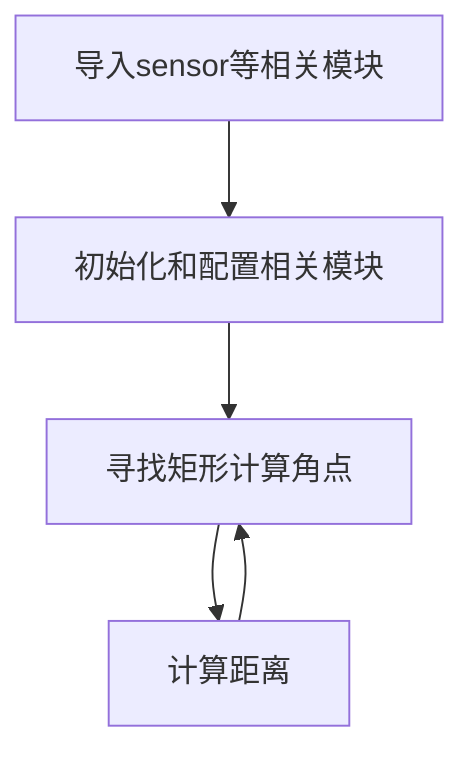

# PnP测距（基于矩形角点）

## 实验讲解

PnP 测距是基于透视 n 点（Perspective-N-Point，简称 PNP）算法的非接触式距离测量方法，核心是通过相机图像与已知参考点求解目标距离。

**典型应用**

- 机器人定位与避障：机器人通过相机识别环境参考点，计算与障碍物距离。
- AR/VR 导航：叠加虚拟信息时，通过 PNP 测距确定现实目标的空间位置。
- 工业视觉测量：无需接触工件，快速测量零件与相机的距离或零件间相对位置。

本节例程基于矩形角点，简单来说就是已知矩形的长宽尺寸，然后摄像头识别矩形角点，再计算摄像头到矩形的距离。


## rgb888_pnp_distance_from_corners对象

### 构造函数
```python
res = cv_lite.rgb888_pnp_distance_from_corners(
    image_shape, img_np,
    camera_matrix, dist_coeffs, dist_len,
    obj_width_real, obj_height_real
)
```
查找图像中指定的彩色色块。参数说明：
- `image_shape`: 图像形状，list类型，顺序为[高，宽]，如[480,640]；
- `img_np`: 图像数据引用，ulab.numpy.ndarray类型；
- `camera_matrix`: 相机内参矩阵
- `dist_coeffs`: 畸变系数
- `dist_len`: 畸变系数长度
- `roi_width_real`: 实际ROI宽度，单位cm
- `roi_height_real`: 实际ROI高度，单位cm

### 使用方法

以上函数返回res值：**res[0]估算距离，单位cm，res[1]最小外接矩形xywh，res[2]矩形角点坐标**

更多用法请阅读[官方文档](https://www.kendryte.com/k230_canmv/zh/main/zh/api/cv_lite/cv_lite.html#rgb888-pnp-distance-from-corners)

<br></br>

代码编写流程如下：



## 参考代码

### CanMV K230 + 3.5寸mipi屏

```python
'''
实验名称：PnP测距（基于矩形角点）
实验平台：01Studio CanMV K230
教程：wiki.01studio.cc
说明：通过修改lcd_width和lcd_height参数值选择3.5寸或2.4寸屏。
'''

# ============================================================
# MicroPython 轮廓检测+PnP 距离估计测试（cv_lite 扩展）
# Contour Detection + PnP Distance Estimation via cv_lite
# ============================================================

import time, os, gc
from machine import Pin
from media.sensor import *
from media.display import *
from media.media import *
import _thread
import cv_lite               # 需要实现对应的 native C 接口
import ulab.numpy as np

#CanMV K230 - 3.5寸mipi屏分辨率定义
lcd_width = 800
lcd_height = 480

'''
#CanMV K230 mini - 2.4寸mipi屏分辨率定义
lcd_width = 640
lcd_height = 480
'''

# -------------------------------
# 图像尺寸 / Image size
# -------------------------------
image_shape = [480, 640]

# -------------------------------
# 摄像头初始化
# -------------------------------
sensor = Sensor(id=2, width=1280, height=960, fps=90)
sensor.reset()
sensor_width = sensor.width(None)
sensor_height = sensor.height(None)
# 设置采集图片的分辨率
sensor.set_framesize(w=image_shape[1], h=image_shape[0],chn=CAM_CHN_ID_0)
sensor.set_pixformat(Sensor.RGB888)

# -------------------------------
# 虚拟显示器输出
# -------------------------------
Display.init(Display.ST7701, width=lcd_width, height=lcd_height, to_ide=True, quality=50)

# -------------------------------
# 启动媒体管理器
# -------------------------------
MediaManager.init()
sensor.run()

# ----------------------------------------
# 相机参数 / 01Studio K230默认相机参数，不同镜头有所差异
# ----------------------------------------
camera_matrix = [
    789.1207591978101,0.0,308.8211709453399,
    0.0,784.6402477892891,220.80604393744628,
    0.0,0.0,1.0
]
dist_coeffs = [-0.0032975761115662697,-0.009984467065645562,-0.01301691382446514,-0.00805834837844004,-1.063818733754765]
dist_len = len(dist_coeffs)

# -------------------------------
# 目标实际尺寸（单位 cm）
# -------------------------------
obj_width_real = 12
obj_height_real = 6

# -------------------------------
# 帧率监控
# -------------------------------
clock = time.clock()

# -------------------------------
# 主循环
# -------------------------------
while True:
    clock.tick()

    img = sensor.snapshot()
    img_np = img.to_numpy_ref()

    # 距离估计（通过轮廓+PnP）
    res = cv_lite.rgb888_pnp_distance_from_corners(
        image_shape, img_np,
        camera_matrix, dist_coeffs, dist_len,
        obj_width_real, obj_height_real
    )
    distance=res[0]
    rect=res[1]
    corners=res[2]

    # 如果距离估计成功
    if distance > 0:
        img.draw_string_advanced(0, 40, 32, "Dist: %.2fcm" % distance, color=(0, 255, 0))
        img.draw_rectangle(rect[0], rect[1], rect[2], rect[3], color=(255, 0, 0), thickness=2)
        img.draw_cross(corners[0][0],corners[0][1],color=(255,255,255),size=5,thickness=2)
        img.draw_cross(corners[1][0],corners[1][1],color=(255,255,255),size=5,thickness=2)
        img.draw_cross(corners[2][0],corners[2][1],color=(255,255,255),size=5,thickness=2)
        img.draw_cross(corners[3][0],corners[3][1],color=(255,255,255),size=5,thickness=2)
    else:
        img.draw_string_advanced(0, 40, 32, "No Rect Found", color=(255, 0, 0))

    img.draw_string_advanced(0, 0, 30, 'FPS: '+str("%.3f"%(clock.fps())), color = (255, 255, 255))

    # 显示结果图像 / Show image with blobs
    Display.show_image(img, x=round((lcd_width-sensor.width())/2),y=round((lcd_height-sensor.height())/2))

    print("contour_pnp:", clock.fps())
#    print("Distance:", distance)
    gc.collect()

# -------------------------------
# 释放资源
# -------------------------------
sensor.stop()
Display.deinit()
os.exitpoint(os.EXITPOINT_ENABLE_SLEEP)
time.sleep_ms(100)
MediaManager.deinit()
```

### CanMV K230 mini + 2.4寸mipi屏

```python
'''
实验名称：PnP测距（基于矩形角点）
实验平台：01Studio CanMV K230
教程：wiki.01studio.cc
说明：通过修改lcd_width和lcd_height参数值选择3.5寸或2.4寸屏。
'''

# ============================================================
# MicroPython 轮廓检测+PnP 距离估计测试（cv_lite 扩展）
# Contour Detection + PnP Distance Estimation via cv_lite
# ============================================================

import time, os, gc
from machine import Pin
from media.sensor import *
from media.display import *
from media.media import *
import _thread
import cv_lite               # 需要实现对应的 native C 接口
import ulab.numpy as np

'''
#CanMV K230 - 3.5寸mipi屏分辨率定义
lcd_width = 800
lcd_height = 480
'''

#CanMV K230 mini - 2.4寸mipi屏分辨率定义
lcd_width = 640
lcd_height = 480


# -------------------------------
# 图像尺寸 / Image size
# -------------------------------
image_shape = [480, 640]

# -------------------------------
# 摄像头初始化
# -------------------------------
sensor = Sensor(id=2, width=1280, height=960, fps=90)
sensor.reset()
sensor_width = sensor.width(None)
sensor_height = sensor.height(None)
# 设置采集图片的分辨率
sensor.set_framesize(w=image_shape[1], h=image_shape[0],chn=CAM_CHN_ID_0)
sensor.set_pixformat(Sensor.RGB888)

# -------------------------------
# 虚拟显示器输出
# -------------------------------
Display.init(Display.ST7701, width=lcd_width, height=lcd_height, to_ide=True, quality=50)

# -------------------------------
# 启动媒体管理器
# -------------------------------
MediaManager.init()
sensor.run()

# ----------------------------------------
# 相机参数 / 01Studio K230默认相机参数，不同镜头有所差异
# ----------------------------------------
camera_matrix = [
    789.1207591978101,0.0,308.8211709453399,
    0.0,784.6402477892891,220.80604393744628,
    0.0,0.0,1.0
]
dist_coeffs = [-0.0032975761115662697,-0.009984467065645562,-0.01301691382446514,-0.00805834837844004,-1.063818733754765]
dist_len = len(dist_coeffs)

# -------------------------------
# 目标实际尺寸（单位 cm）
# -------------------------------
obj_width_real = 12
obj_height_real = 6

# -------------------------------
# 帧率监控
# -------------------------------
clock = time.clock()

# -------------------------------
# 主循环
# -------------------------------
while True:
    clock.tick()

    img = sensor.snapshot()
    img_np = img.to_numpy_ref()

    # 距离估计（通过轮廓+PnP）
    res = cv_lite.rgb888_pnp_distance_from_corners(
        image_shape, img_np,
        camera_matrix, dist_coeffs, dist_len,
        obj_width_real, obj_height_real
    )
    distance=res[0]
    rect=res[1]
    corners=res[2]

    # 如果距离估计成功
    if distance > 0:
        img.draw_string_advanced(0, 40, 32, "Dist: %.2fcm" % distance, color=(0, 255, 0))
        img.draw_rectangle(rect[0], rect[1], rect[2], rect[3], color=(255, 0, 0), thickness=2)
        img.draw_cross(corners[0][0],corners[0][1],color=(255,255,255),size=5,thickness=2)
        img.draw_cross(corners[1][0],corners[1][1],color=(255,255,255),size=5,thickness=2)
        img.draw_cross(corners[2][0],corners[2][1],color=(255,255,255),size=5,thickness=2)
        img.draw_cross(corners[3][0],corners[3][1],color=(255,255,255),size=5,thickness=2)
    else:
        img.draw_string_advanced(0, 40, 32, "No Rect Found", color=(255, 0, 0))

    img.draw_string_advanced(0, 0, 30, 'FPS: '+str("%.3f"%(clock.fps())), color = (255, 255, 255))

    # 显示结果图像 / Show image with blobs
    Display.show_image(img, x=round((lcd_width-sensor.width())/2),y=round((lcd_height-sensor.height())/2))

    print("contour_pnp:", clock.fps())
#    print("Distance:", distance)
    gc.collect()

# -------------------------------
# 释放资源
# -------------------------------
sensor.stop()
Display.deinit()
os.exitpoint(os.EXITPOINT_ENABLE_SLEEP)
time.sleep_ms(100)
MediaManager.deinit()

```

## 实验结果

这里使用矩形的真实尺寸为12cm x 6cm 大家可以根据自己实际情况调整。

在CanMV IDE中运行代码，这里将摄像头放置在约30cm的位置，可以看到识别结果为29.5cm，跟实际距离接近。

原图：


实验结果：

