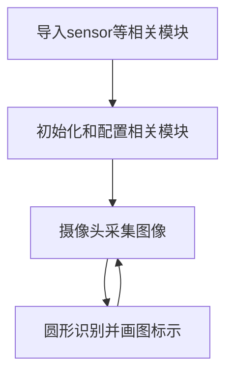
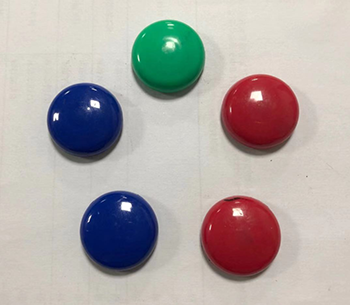
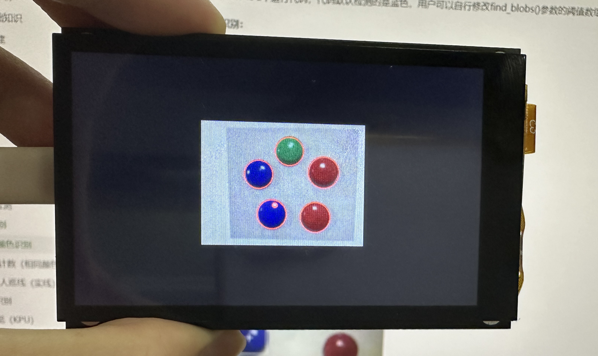

# 圆形检测

## 前言
本节学习的是对图像中的圆形进行检测识别。

## 实验目的
通过编程实现CanMV K230对图像中的圆形进行检测识别，并画图指示。

## 实验讲解

CanMV集成了圆形识别find_circles函数，位于image模块下，因此我们直接将拍摄到的图片进行处理即可，那么我们像以往一样像看一下圆形识别函数相关说明，具体如下：


## find_circles对象

### 构造函数
```python
image.find_circles([roi[, x_stride=2[, y_stride=1[, threshold=2000[, x_margin=10[, y_margin=10
                    [, r_margin=10[, r_min=2[, r_max[, r_step=2]]]]]]]]]])
```
找圆函数。返回一个image.circle圆形对象，该圆形对象有4个值： x, y（圆心）, r （半径）和magnitude（量级）；量级越大说明识别到的圆可信度越高。

参数说明：
- `roi`: 识别区域（x,y,w,h），未指定则默认整张图片。
- `threshold`: 阈值。返回大于或等于threshold的圆，调整识别可信度。
- `x_stride`  `y_stride` : 霍夫变换时跳过x，y像素的量；
- `x_margin` `y_margin` `r_margin` : 控制所检测圆的合并；
- `r_min`  `r_max`: 控制识别圆形的半径范围；
- `r_step`:控制识别步骤。

### 使用方法

直接调用该函数。（大部分参数使用默认即可，**不支持压缩图像和bayer图像**）

更多用法请阅读官方文档：<br></br>
https://developer.canaan-creative.com/k230_canmv/main/zh/api/openmv/image.html#find-circles

<br></br>

我们结合前面摄像头的应用，整理一下编程思路如下：



## 参考代码

```python
'''
实验名称：圆形检测
实验平台：01Studio CanMV K230
教程：wiki.01studio.cc
说明：推荐使用320x240以下分辨率，分辨率过大会导致帧率下降。
'''

import time, os, sys

from media.sensor import * #导入sensor模块，使用摄像头相关接口
from media.display import * #导入display模块，使用display相关接口
from media.media import * #导入media模块，使用meida相关接口

try:

    sensor = Sensor(width=1280, height=960) #构建摄像头对象，将摄像头长宽设置为4:3
    sensor.reset() #复位和初始化摄像头
    sensor.set_framesize(width=320, height=240) #设置帧大小，默认通道0
    sensor.set_pixformat(Sensor.RGB565) #设置输出图像格式，默认通道0

    Display.init(Display.ST7701, to_ide=True) #同时使用3.5寸mipi屏和IDE缓冲区显示图像，800x480分辨率
    #Display.init(Display.VIRT, sensor.width(), sensor.height()) #只使用IDE缓冲区显示图像

    MediaManager.init() #初始化media资源管理器

    sensor.run() #启动sensor

    clock = time.clock()

    while True:

        os.exitpoint() #检测IDE中断

        ################
        ## 这里编写代码 ##
        ################
        clock.tick()

        img = sensor.snapshot() #拍摄一张图片

        # 圆形类有 4 个参数值： 圆心(x, y), r (半径)和 magnitude（量级）；
        # 量级越大说明识别到的圆可信度越高。
        # `threshold` 参数控制找到圆的数量，数值的提升会降低识别圆形的总数。
        # `x_margin`, `y_margin`, and `r_margin`控制检测到接近圆的合并调节.
        # r_min, r_max, and r_step 用于指定测试圆的半径范围。
        for c in img.find_circles(threshold = 2000, x_margin = 10, y_margin= 10,
                                  r_margin = 10,r_min = 2, r_max = 100, r_step = 2):
            #画红色圆做指示
            img.draw_circle(c.x(), c.y(), c.r(), color = (255, 0, 0),thickness=2)

            print(c) #打印圆形的信息

        #Display.show_image(img) #显示图片

        #显示图片，仅用于LCD居中方式显示
        Display.show_image(img, x=round((800-sensor.width())/2),y=round((480-sensor.height())/2))

        print(clock.fps()) #打印FPS

###################
# IDE中断释放资源代码
###################
except KeyboardInterrupt as e:
    print("user stop: ", e)
except BaseException as e:
    print(f"Exception {e}")
finally:
    # sensor stop run
    if isinstance(sensor, Sensor):
        sensor.stop()
    # deinit display
    Display.deinit()
    os.exitpoint(os.EXITPOINT_ENABLE_SLEEP)
    time.sleep_ms(100)
    # release media buffer
    MediaManager.deinit()
```

## 实验结果

在CanMV IDE中运行代码，检测识别结果如下：

**原图：**



**实验结果：**


