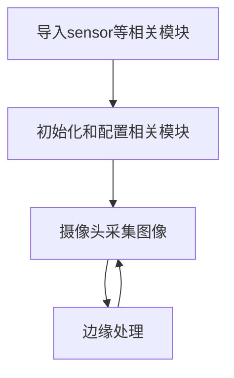
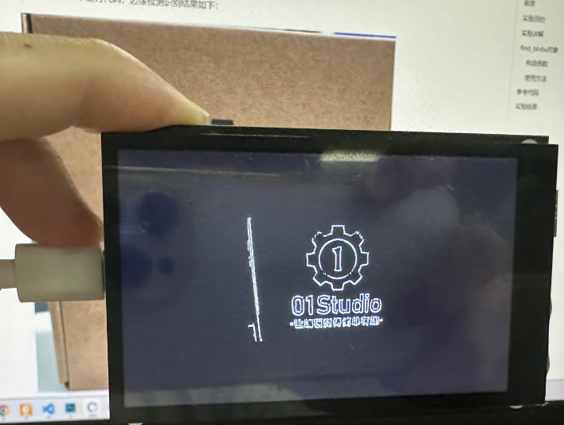

# 边缘检测

## 前言
生活中每个物体都有一个边缘。 简单来说就是轮廓，本节学习的是使用MicroPython 结合 CanMV K230 自带的库来做图像轮廓检测。

## 实验目的
通过编程实现CanMV K230对图像进行边缘检测。

## 实验讲解

CanMV集成了RGB565颜色块识别find_edges函数，位于 image 模块下，因此我们直接将拍摄到的图片进行处理即可，那么我们像以往一样像看一下本实验相关对象和函数说明，具体如下：


## find_edges对象

### 构造函数
```python
image.find_edges(edge_type[, threshold])
```
边缘检测，将图像变为黑白，边缘保留白色像素。

参数说明：
- `edge_type`: 处理方式。
    - `image.EDGE_SIMPLE `: 简单的阈值高通滤波算法；
    - `image.EDGE_CANNY`: Canny 边缘检测算法；
- `threshold`: 包含高、低阈值的二元组，默认是（100,200），仅支持灰度图像。

### 使用方法

直接调用该函数。

更多用法请阅读官方文档：<br></br>
https://www.kendryte.com/k230_canmv/main/zh/api/openmv/image.html#find-edges

<br></br>

由此可见边缘处理的方法非常简单，我们结合前面摄像头的应用，整理一下编程思路如下：



## 参考代码

```python
'''
实验名称：边缘检测
实验平台：01Studio CanMV K230
教程：wiki.01studio.cc
说明：推荐使用320x240以下分辨率，分辨率过大会导致帧率下降。
    通过修改lcd_width和lcd_height参数值选择3.5寸或2.4寸mipi屏。
'''

import time, os, sys, gc

from media.sensor import * #导入sensor模块，使用摄像头相关接口
from media.display import * #导入display模块，使用display相关接口
from media.media import * #导入media模块，使用meida相关接口


#3.5寸mipi屏分辨率定义
lcd_width = 800
lcd_height = 480

'''
#2.4寸mipi屏分辨率定义
lcd_width = 640
lcd_height = 480
'''

sensor = Sensor(width=1280, height=960) #构建摄像头对象，将摄像头长宽设置为4:3
sensor.reset() #复位和初始化摄像头
sensor.set_framesize(width=320, height=240) #设置帧大小为LCD分辨率(320x240)，默认通道0
sensor.set_pixformat(Sensor.GRAYSCALE) #设置输出图像格式，默认通道0

Display.init(Display.ST7701, width=lcd_width, height=lcd_height, to_ide=True) #同时使用mipi屏和IDE缓冲区显示图像，800x480分辨率
#Display.init(Display.VIRT, sensor.width(), sensor.height()) #只使用IDE缓冲区显示图像

MediaManager.init() #初始化media资源管理器

sensor.run() #启动sensor

clock = time.clock()

while True:

    ################
    ## 这里编写代码 ##
    ################
    clock.tick()

    img = sensor.snapshot() #拍摄一张图片

    #使用 Canny 边缘检测器
    img.find_edges(image.EDGE_CANNY, threshold=(50, 80))

    # 也可以使用简单快速边缘检测，效果一般，配置如下
    #img.find_edges(image.EDGE_SIMPLE, threshold=(100, 255))

    #Display.show_image(img) #显示图片

    #显示图片，仅用于LCD居中方式显示
    Display.show_image(img, x=round((lcd_width-sensor.width())/2),y=round((lcd_height-sensor.height())/2))

    print(clock.fps()) #打印FPS
```

## 实验结果

在CanMV IDE中运行代码，边缘检测识别结果如下：

**原图：**


**实验结果：**


