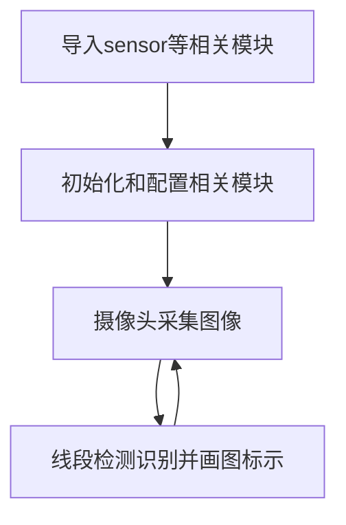
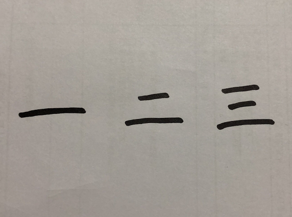
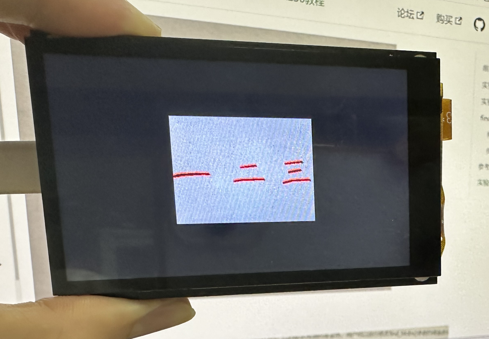

# 线段检测

## 前言
本节学习的是对图像中的线段进行检测识别。

## 实验目的
通过编程实现CanMV K230对图像中的线段进行检测识别，并画图指示。

## 实验讲解

CanMV集成了线段识别 find_line_segments 函数，位于 image 模块下，因此我们直接将拍摄到的图片进行处理即可，那么我们像以往一样像看一下线段识
别函数相关说明，具体如下：

## find_line_segments对象

### 构造函数
```python
image.find_line_segments([roi[, merge_distance=0[, max_theta_difference=15]]])
```
线段识别函数。返回一个 image.line 线段对象列表。

参数说明：
- `roi`: 识别区域（x,y,w,h），未指定则默认整张图片。
- `merge_distance`: 两条线段间可以相互分开而不被合并的最大像素；
- `max_theta_difference`: 将少于这个角度值的线段合并。

### 使用方法

直接调用该函数。（大部分参数使用默认即可，**不支持压缩图像和bayer图像**）

更多用法请阅读官方文档：<br></br>
https://developer.canaan-creative.com/k230_canmv/main/zh/api/openmv/image.html#find-segments

<br></br>

编程思路如下：



## 参考代码

```python
'''
实验名称：线段检测
实验平台：01Studio CanMV K230
教程：wiki.01studio.cc
说明：推荐使用320x240以下分辨率，分辨率过大会导致帧率下降。
     通过修改lcd_width和lcd_height参数值选择3.5寸或2.4寸mipi屏。
'''

import time, os, sys

from media.sensor import * #导入sensor模块，使用摄像头相关接口
from media.display import * #导入display模块，使用display相关接口
from media.media import * #导入media模块，使用meida相关接口

#3.5寸mipi屏分辨率定义
lcd_width = 800
lcd_height = 480

'''
#2.4寸mipi屏分辨率定义
lcd_width = 640
lcd_height = 480
'''

enable_lens_corr = False # 设为True可以获得更直的线段

sensor = Sensor(width=1280, height=960) #构建摄像头对象，将摄像头长宽设置为4:3
sensor.reset() #复位和初始化摄像头
sensor.set_framesize(width=320, height=240) #设置帧大小，默认通道0
sensor.set_pixformat(Sensor.RGB565) #设置输出图像格式，默认通道0

Display.init(Display.ST7701, width=lcd_width, height=lcd_height, to_ide=True) #同时使用mipi屏和IDE缓冲区显示图像
#Display.init(Display.VIRT, sensor.width(), sensor.height()) #只使用IDE缓冲区显示图像

MediaManager.init() #初始化media资源管理器

sensor.run() #启动sensor

clock = time.clock()

while True:

    ################
    ## 这里编写代码 ##
    ################
    clock.tick()

    img = sensor.snapshot() #拍摄一张图片

    if enable_lens_corr: img.lens_corr(1.8) # for 2.8mm lens...

    # `merge_distance` 控制相近的线段是否合并.  数值 0 (默认值)表示不合并。数值
    #为1时候表示相近1像素的线段被合并。因此你可以通过改变这个参数来控制检测到线
    #段的数量。

    # `max_theta_diff` 控制相差一定角度的线段合并，默认是15度，表示15度内的线
    # 段都会合并

    for l in img.find_line_segments(merge_distance = 0, max_theta_diff = 5):

        img.draw_line(l.line(), color = (255, 0, 0), thickness=2)
        print(l)

    #Display.show_image(img) #显示图片

    #显示图片，仅用于LCD居中方式显示
    Display.show_image(img, x=round((lcd_width-sensor.width())/2),y=round((lcd_height-sensor.height())/2))

    print(clock.fps()) #打印FPS
```

## 实验结果

在CanMV IDE中运行代码，识别结果如下：

**原图：**



**实验结果：**

