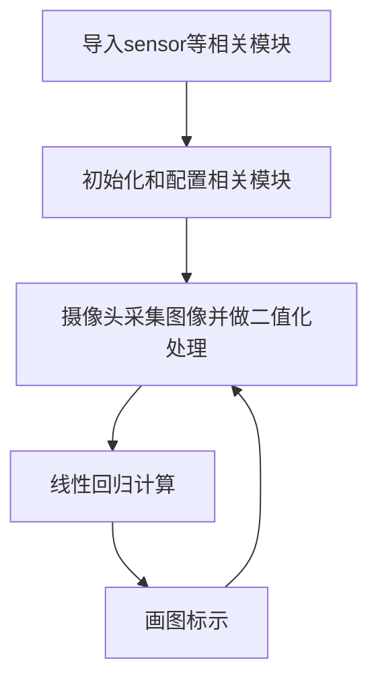
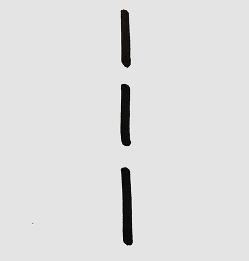
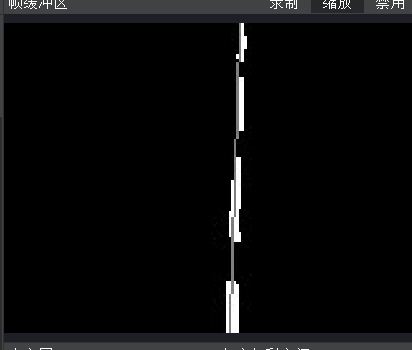
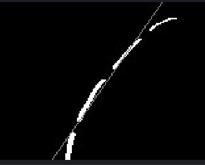
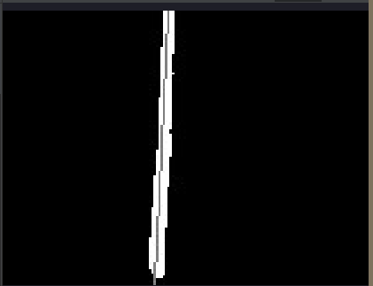
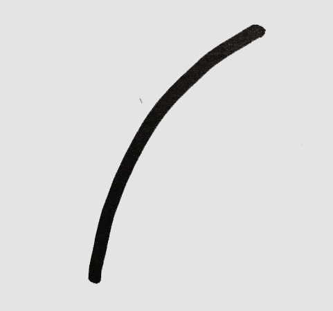
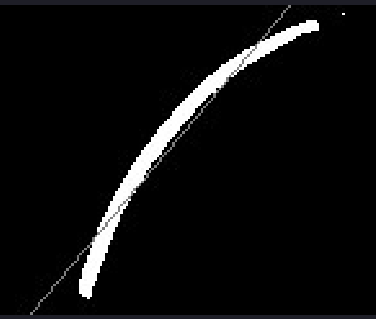
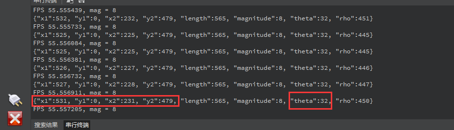
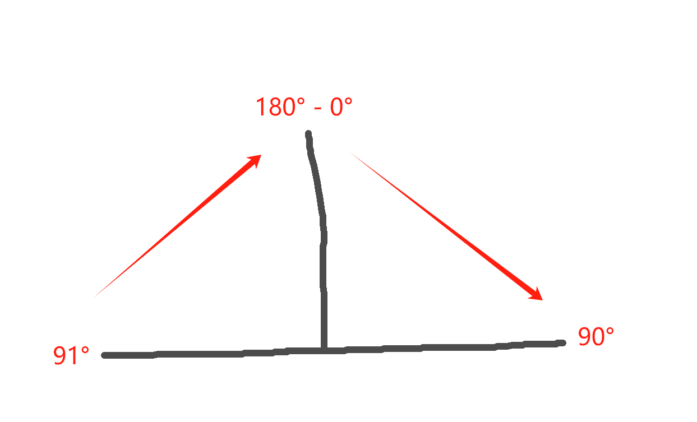

# 快速线性回归（巡线）

## 前言
快速线性回归的用途非常广泛，如比赛经常用到的小车、机器人巡线，可以通过线性回归的方式判断虚线和实线的轨迹。从而做出判断和响应。本节我们就来学习一下CanMV K230线性回归的编程方法。

## 实验目的
通过编程实现CanMV K230对图像中的实线（或虚线）进行检测识别，并画图指示。

## 实验讲解

CanMV集成了快速线性回归get_regression函数，位于image模块下，因此我们直接将拍摄到的图片进行处理即可，那么我们像以往一样像看一下函数相关说明，具体如下：

## get_regression对象

### 构造函数
```python
image.get_regression(thresholds[, invert=False[, roi[, x_stride=2[, y_stride=1[, 
                    area_threshold=10[, pixels_threshold=10[, robust=False]]]]]]])
```
线性回归计算。对图像所有阈值像素进行线性回归计算，通过最小二乘法进行，通常速度较快，但不能处理任何异常值；

参数说明：
- `threshold`: 必须是元组列表。 (lo, hi) 定义你想追踪的颜色范围。对于灰度图像，每个元组需要包含两个值：最小灰度值和最大灰度值。

### 使用方法

直接调用该函数。 更多用法请阅读[官方文档。](https://www.kendryte.com/k230_canmv/main/zh/api/openmv/image.html#get-regression)


为了提高处理效果，我们可以先将图像变成二值（黑白）图像。方法如下：

```python
image.binary(thresholds[, invert=False[, zero=False[, mask=None[, to_bitmap=False[, copy=False]]]]])
```
线性回归计算。对图像所有阈值像素进行线性回归计算，通过最小二乘法进行，通常速度较快，但不能处理任何异常值；
- `threshold`: 必须是元组列表。 (lo, hi) 定义你想追踪的颜色范围。对于灰度图像，每个元组需要包含两个值：最小灰度值和最大灰度值。

**例：thresholds=(0,100) ，则该函数表示将(0,100)灰度值范围变成白色。**

<br></br>

编程思路如下：



## 参考代码

```python
'''
实验名称：快速线性回归（巡线）
实验平台：01Studio CanMV K230
教程：wiki.01studio.cc
说明：通过修改lcd_width和lcd_height参数值选择3.5寸或2.4寸mipi屏。
'''

import time, os, sys

from media.sensor import * #导入sensor模块，使用摄像头相关接口
from media.display import * #导入display模块，使用display相关接口
from media.media import * #导入media模块，使用meida相关接口

#3.5寸mipi屏分辨率定义
lcd_width = 800
lcd_height = 480

'''
#2.4寸mipi屏分辨率定义
lcd_width = 640
lcd_height = 480
'''

THRESHOLD = (0, 100)  # 黑白图像的灰度阈值
BINARY_VISIBLE = True # 使用二值化图像你可以看到什么是线性回归。
                        # 这可能降低 FPS（每秒帧数）.

sensor = Sensor(width=1280, height=960) #构建摄像头对象，将摄像头长宽设置为4:3
sensor.reset() #复位和初始化摄像头
sensor.set_framesize(width=640, height=480) #设置帧大小，默认通道0
sensor.set_pixformat(Sensor.GRAYSCALE) #设置输出图像格式，默认通道0

Display.init(Display.ST7701,  width=lcd_width, height=lcd_height, to_ide=True) #同时使用mipi屏和IDE缓冲区显示图像
#Display.init(Display.VIRT, sensor.width(), sensor.height()) #只使用IDE缓冲区显示图像

MediaManager.init() #初始化media资源管理器

sensor.run() #启动sensor

clock = time.clock()

while True:

    ################
    ## 这里编写代码 ##
    ################
    clock.tick()

    #image.binary([THRESHOLD])将灰度值在THRESHOLD范围变成了白色
    img = sensor.snapshot().binary([THRESHOLD]) if BINARY_VISIBLE else sensor.snapshot()

    # 返回一个类似 find_lines() 和find_line_segments()的对象.
    # 有以下函数使用方法： x1(), y1(), x2(), y2(), length(),
    # theta() (rotation in degrees), rho(), and magnitude().
    #
    # magnitude() 代表线性回归的指令，其值为(0, INF]。
    # 0表示一个圆，INF数值越大，表示线性拟合的效果越好。

    line = img.get_regression([(255,255) if BINARY_VISIBLE else THRESHOLD])

    if (line):

        img.draw_line(line.line(), color = 127,thickness=4)

        print(line) #打印结果

    #显示图片，仅用于LCD居中方式显示
    Display.show_image(img, x=round((lcd_width-sensor.width())/2),y=round((lcd_height-sensor.height())/2))


    print("FPS %f, mag = %s" % (clock.fps(), str(line.magnitude()) if (line) else "N/A"))
```

## 实验结果

在CanMV IDE中运行代码，检测识别结果如下：

### 虚线直线测试

原图：

 

识别结果：



<br></br>

### 虚线曲线测试

原图：

 

识别结果：



<br></br>

### 实线直线测试

原图：

 

识别结果：



### 实线曲线测试

原图：

 

识别结果：



在串口终端可以看到识别结果：



上面结果包含拟合线段的两个点坐标，长度，以及非常重要的`theta`角度信息，`theta`角度表示如下：



从左往右依次为 91°->180°（0°）-> 90° 变化，大家可以结合上图观察实验数据理解，巡线行走的小车本质就是让这个拟合线段保持在0°位置行走。


