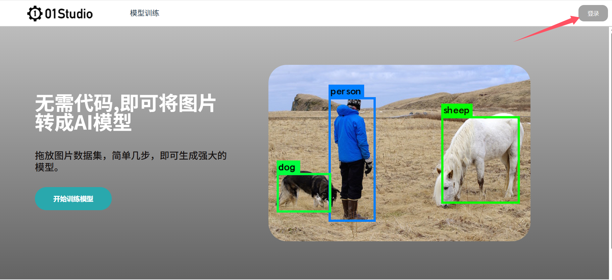

# 模型训练

你可以通过下面本地训练或者在线训练方式实现训练自己的视觉模型，并转换成在K230上可运行的KMODEL模型格式。快速完成比如垃圾分类等应用。

## 本地训练

关于本地训练你需要一台Linux主机或者虚拟机安装Linux系统。 详细训练环境搭建教程请参考：[K230 YOLO大作战](https://www.kendryte.com/k230_canmv/zh/main/zh/example/ai/YOLO%E5%A4%A7%E4%BD%9C%E6%88%98.html)

## 在线训练

无需代码，拖动图片即可训练自己的K230模型，训练完成后即可下载模型文件和Python参考代码。详细教程请参考：[嘉楠在线训练平台](https://www.kendryte.com/zh/training/start)