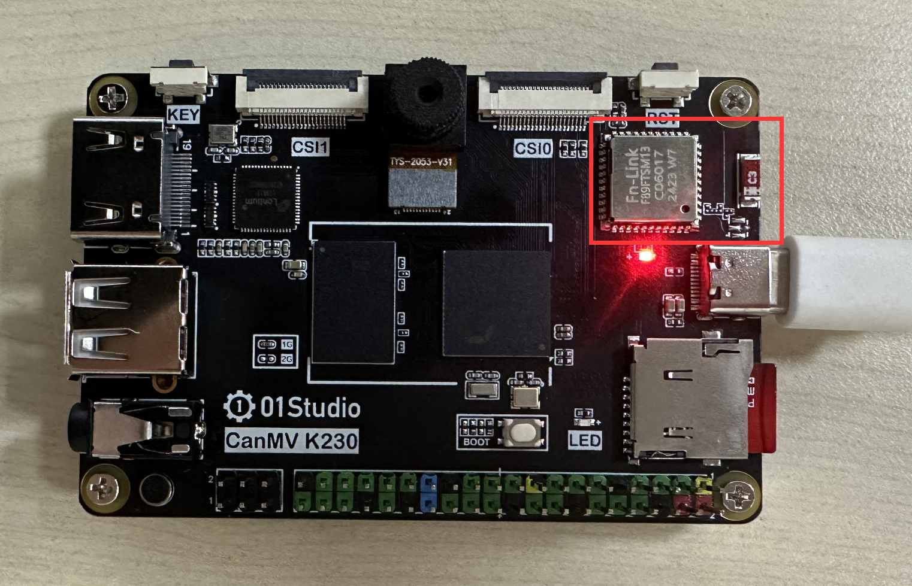
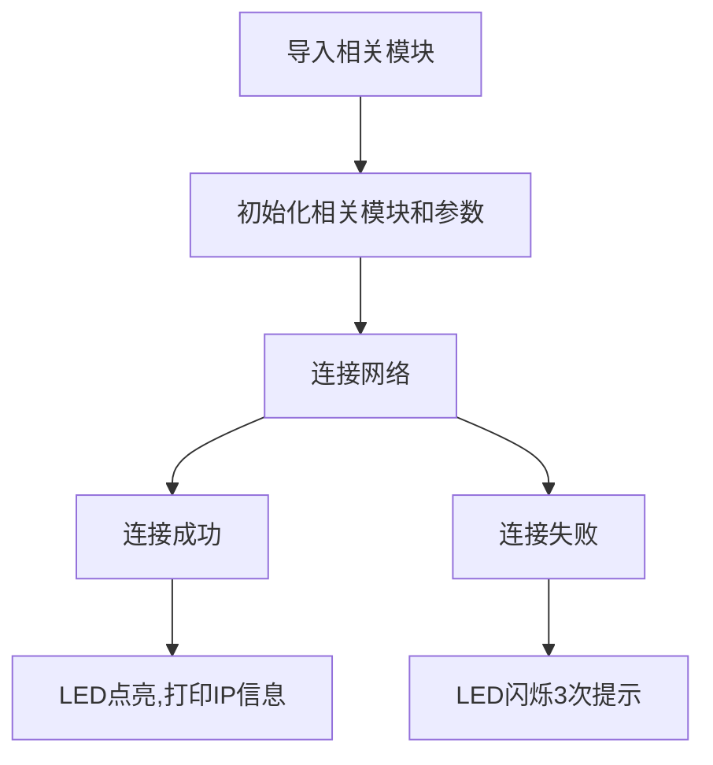
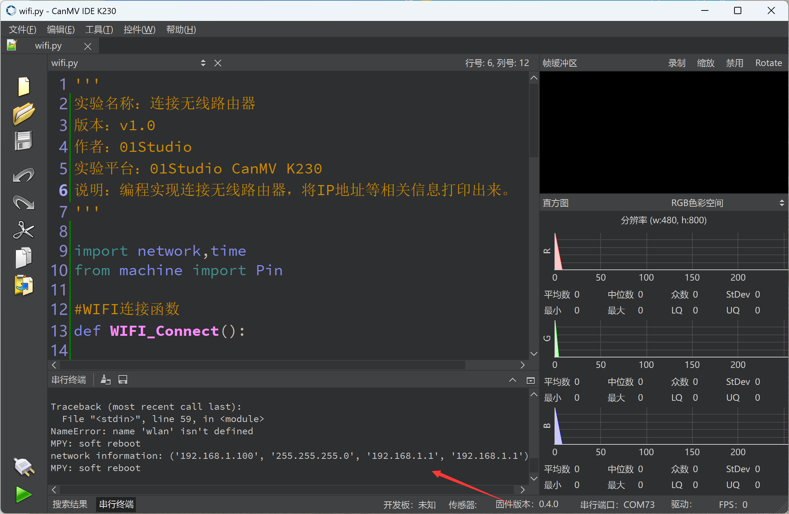

# 连接无线路由器

## 前言
WIFI是物联网中非常重要的角色，现在基本上家家户户都有WIFI网络了，通过WIFI接入到互联网，成了智能家居产品普遍的选择。而要想上网，首先需要连接上无线路由器。这一节我们就来学习如何使用CanMV K230开发板通过MicroPython编程实现连上路由器。

## 实验目的

编程实现连接路由器，将IP地址等相关信息通过串口终端打印（只支持2.4G网络）。

## 实验讲解

连接路由器上网是我们每天都做的事情，日常生活中我们只需要知道路由器的账号和密码，就能使用电脑或者手机连接到无线路由器，然后上网冲浪。

CanMV K230板载WiFi模块和陶瓷天线，可以直接连接2.4G无线网络。



CanMV K230 MicroPython库已经集成了network模块，开发者使用内置的network模块函数可以非常方便地连接上路由器。

我们先来看看network基于WiFi（WLAN模块）的构造函数和使用方法。

## network对象

### 构造函数
```python
wlan = network.WLAN(interface_id)
```
构建WiFi连接对象。 

- `interface_id`: 无线模式：

    - `network.STA_IF`: 客户端（STA）模式;
    - `network.AP_IF`: 热点（AP）模式。

### 使用方法
```python
wlan.active([is_active])
```
激活或停用网络接口。
- `[is_active]`: 激活或停用网络接口，参数为空时返回当前接口状态：

    - `True`: 激活网络接口;
    - `False`: 关闭网络接口。

<br></br>

```python
wlan.scan()
```

扫描允许访问的SSID。

<br></br>

```python
wlan.isconnected()
```
检查设备是否已经连接上。返回 `Ture`:已连接；`False`:未连接。

<br></br>

```python
wlan.connect(ssid,passwork)
```
WIFI连接。15秒超时。
- `ssid`: 账号；
- `passwork` : 密码；

<br></br>

```python
wlan.ifconfig([(ip, subnet, gateway, dns)])
```
配置WiFi信息，当参数为空时表示查看WiFi连接信息。
- `ip`: IP地址；
- `subnet` : 子网掩码；
- `gateway`: 网关地址；
- `dns` : DNS信息。

**例：wlan.ifconfig(('192.168.1.110', '255.255.255.0', '192.168.1.1', '8.8.8.8')) 。**

<br></br>

```python
wlan.disconnected()
```
断开连接。

<br></br>

更多用法请阅读官方文档：<br></br>
https://docs.micropython.org/en/latest/library/network.WLAN.html

从上表可以看到MicroPython通过模块封装，让WIFI联网变得非常简单。模块包含热点AP模块和客户端STA模式，热点AP是指其它电脑或者手机设备连接到CanMV K230发出的热点实现连接，但这样你的电脑就不能上网了，因此我们一般情况下都是使用STA模式。也就是开发板和电脑等其它设备同时连接到相同网段的路由器上。

wLAN.connect()连接5秒还没成功就退出连接。我们通过编程实现连接成功后蓝灯常亮，打印IP信息。连接失败蓝灯闪烁3次提示。

代码编写流程如下：




## 参考代码

```python
'''
实验名称：连接无线路由器
实验平台：01Studio CanMV K230
说明：编程实现连接无线路由器，将IP地址等相关信息打印出来。
教程：wiki.01studio.cc
'''

import network,time
from machine import Pin

#WIFI连接函数
def WIFI_Connect():

    WIFI_LED=Pin(52, Pin.OUT) #初始化WIFI指示灯

    wlan = network.WLAN(network.STA_IF) #STA模式
    wlan.active(True)                   #激活接口

    if not wlan.isconnected():

        print('connecting to network...')

        for i in range(3): #重复连接3次

            #输入WIFI账号密码（仅支持2.4G信号）, 连接超过5秒为超时
            wlan.connect('01Studio', '88888888')

            if wlan.isconnected(): #连接成功
                break

    if wlan.isconnected(): #连接成功

        print('connect success')

        #LED蓝灯点亮
        WIFI_LED.value(1)

        #等待获取IP地址
        while wlan.ifconfig()[0] == '0.0.0.0':
            pass

        #串口打印信息
        print('network information:', wlan.ifconfig())

    else: #连接失败

        #LED闪烁3次提示
        for i in range(3):
            WIFI_LED.value(1)
            time.sleep_ms(300)
            WIFI_LED.value(0)
            time.sleep_ms(300)

        #wlan.active(False)

#执行WIFI连接函数
WIFI_Connect()

```

## 实验结果

将代码中的WiFi网络账号和密码改成自己家里或者办公室的WiFi账号密码：**(只支持2.4G信号只，不支持5G或者2.4G&5G混合信号。)**
```python
#输入WIFI账号密码（仅支持2.4G信号）, 连接超过5秒为超时
 wlan.connect('01Studio', '88888888')
```

运行程序，可以观察到连接WiFi成功后串口终端打印IP等信息。



本节是WIFI应用的基础，成功连接到无线路由器的实验后，后面就可以做socket和MQTT等相关网络通信的应用了。