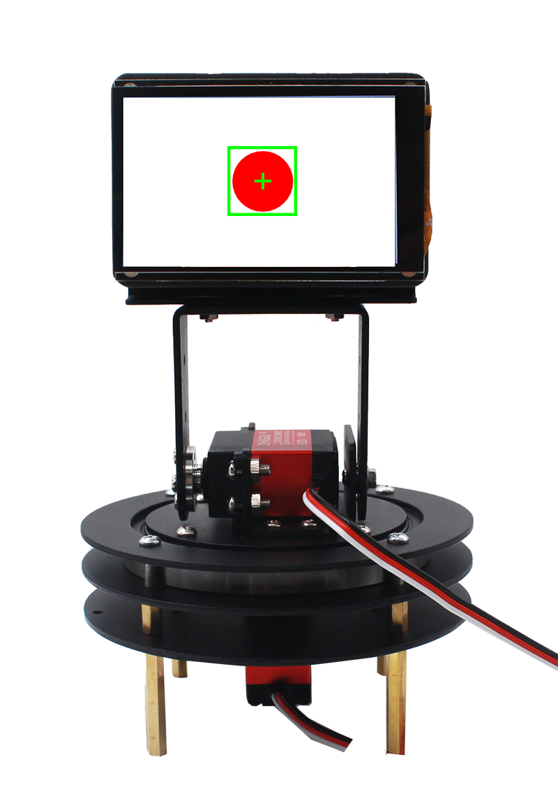
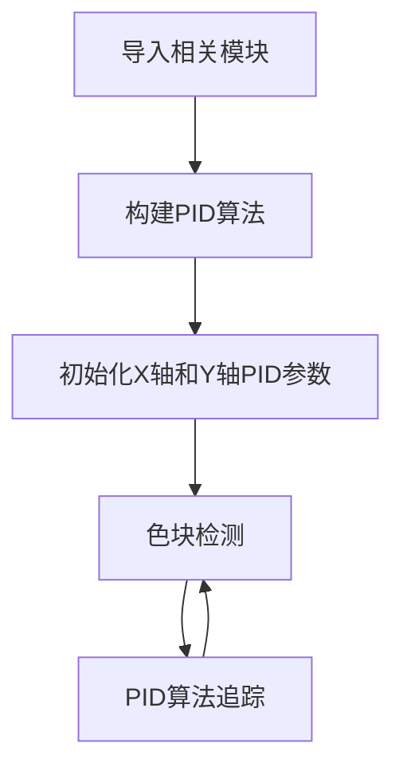
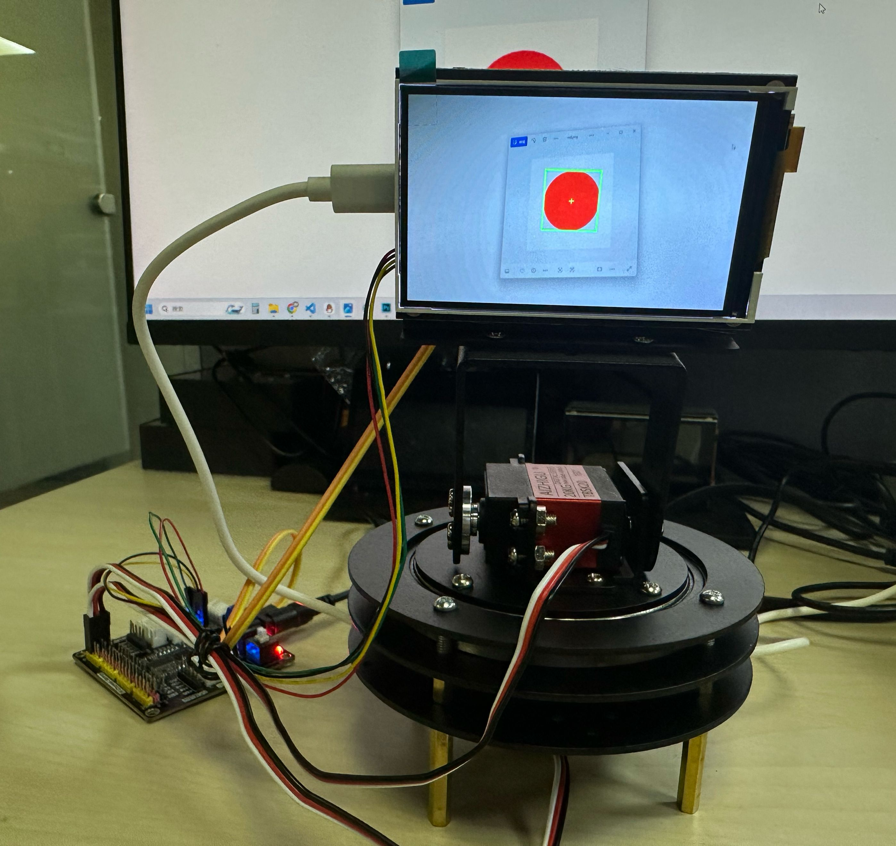

# 色块追踪

## 前言

在前两节我们学习了二维舵机云台舵机控制和PID控制原理知识，本节就来整合一下实现二维舵机云台色块追踪功能。



## 实验目的
二维舵机云台追踪指定颜色色块，让色块始终保持在显示屏正中央。

## 实验讲解

颜色识别教程参考 [单一颜色识别](../../machine_vision/color_recognition/single_color.md) 章节内容，这里不再重复。

二维云台舵机控制教程参考 [舵机控制](./servo.md) 章节内容，这里不再重复。

## PID算法实现

关于PID控制原理可参考前面 [PID控制原理](./pid.md) 相关教程。

下面是一段PID算法micropython实现代码：

```python
# PID对象
class PID:
    def __init__(self, p=0.05, i=0.01, d=0.01):
        self.kp = p
        self.ki = i
        self.kd = d
        self.target = 0
        self.error = 0
        self.last_error = 0
        self.integral = 0
        self.output = 0

    def update(self, current_value):
        self.error = self.target - current_value

        #变化小于10不响应
        if abs(self.error)<10:
            return 0

        self.integral += self.error
        derivative = self.error - self.last_error

        # 计算PID输出
        self.output = (self.kp * self.error) + (self.ki * self.integral) + (self.kd * derivative)

        self.last_error = self.error
        return self.output

    def set_target(self, target):
        self.target = target
        self.integral = 0
        self.last_error = 0
```

综合上面知识，色块追踪具体编程思路如下：



## 参考代码

### CanMV K230 + 3.5寸mipi屏

```python
'''
# Copyright (c) [2025] [01Studio]. Licensed under the MIT License.

实验名称：K230二维舵机云台（色块追踪）
实验平台：01Studio CanMV K230 + 3.5寸显示屏 + 二维舵机云台（含pyMotors驱动板）
说明：编程实现色块追踪，让色块保持在显示屏中央位置。（仅支持单个色块）
'''

import time, os, sys

from media.sensor import * #导入sensor模块，使用摄像头相关接口
from media.display import * #导入display模块，使用display相关接口
from media.media import * #导入media模块，使用meida相关接口

#舵机相关库
from machine import I2C,FPIOA
from servo import Servos
import time

#将GPIO11,12配置为I2C2功能
fpioa = FPIOA()
fpioa.set_function(11, FPIOA.IIC2_SCL)
fpioa.set_function(12, FPIOA.IIC2_SDA)

i2c = I2C(2,freq=10000) #构建I2C对象

#构建16路舵机对象
servo_x=Servos(i2c,degrees=270) #X轴使用的是270°舵机
servo_y=Servos(i2c,degrees=180) #Y轴使用的是180°舵机

#舵机对象使用用法, 详情参看servo.py文件
#
#s.position(index, degrees=None)
#index: 0~15表示16路舵机;
#degrees: 角度，0~180/270。

#云台初始位置，水平（X轴）135°和垂直（Y轴）90°，均居中。
x_angle = 135
y_angle = 90

servo_x.position(0,x_angle) #水平（X轴）使用使用端口0，转到135°
servo_y.position(1,y_angle) #垂直（Y轴）使用使用端口1，转到90°

# PID参数 (水平和垂直方向分别设置)
class PID:
    def __init__(self, p=0.05, i=0.01, d=0.01):
        self.kp = p
        self.ki = i
        self.kd = d
        self.target = 0
        self.error = 0
        self.last_error = 0
        self.integral = 0
        self.output = 0

    def update(self, current_value):
        self.error = self.target - current_value

        #变化小于10不响应
        if abs(self.error)<10:
            return 0

        self.integral += self.error
        derivative = self.error - self.last_error

        # 计算PID输出
        self.output = (self.kp * self.error) + (self.ki * self.integral) + (self.kd * derivative)

        self.last_error = self.error
        return self.output

    def set_target(self, target):
        self.target = target
        self.integral = 0
        self.last_error = 0

# 初始化PID控制器
x_pid = PID(p=0.01, i=0.0, d=0.001)  # 水平方向PID
y_pid = PID(p=0.015, i=0.0, d=0.001) # 垂直方向PID

# 设置目标位置 (图像中心), 3.5寸LCD分辨率为800x480
x_pid.set_target(800/2)
y_pid.set_target(480/2)

# 颜色识别阈值 (L Min, L Max, A Min, A Max, B Min, B Max) LAB模型
# 下面的阈值元组是用来识别 红、绿、蓝三种颜色，当然你也可以调整让识别变得更好。
thresholds = [(30, 100, 15, 127, 15, 127), # 红色阈值
              (30, 100, -64, -8, 50, 70), # 绿色阈值
              (0, 40, 0, 90, -128, -20)] # 蓝色阈值

sensor = Sensor() #构建摄像头对象
sensor.reset() #复位和初始化摄像头
sensor.set_framesize(width=800, height=480) #设置帧大小为LCD分辨率(800x480)，默认通道0
sensor.set_pixformat(Sensor.RGB565) #设置输出图像格式，默认通道0

Display.init(Display.ST7701, width=800, height=480, to_ide=True) #同时使用3.5寸mipi屏和IDE缓冲区显示图像，800x480分辨率
#Display.init(Display.VIRT, sensor.width(), sensor.height()) #只使用IDE缓冲区显示图像

MediaManager.init() #初始化media资源管理器

sensor.run() #启动sensor

clock = time.clock()

while True:

    ################
    ## 这里编写代码 ##
    ################
    clock.tick()

    img = sensor.snapshot() #拍摄一张图片

    blobs = img.find_blobs([thresholds[0]],area_threshold=400) # 0,1,2分别表示红，绿，蓝色。

    if blobs:

        for b in blobs: #画矩形和箭头表示

            tmp=img.draw_rectangle(b[0:4], thickness = 4)
            tmp=img.draw_cross(b[5], b[6], thickness = 2)

            x_center= b[0]+b[2]/2
            y_center=b[1]+b[3]/2

            #print(x_center,y_center)

            # 更新水平（X轴）舵机角度
            x_output = x_pid.update(x_center)
            x_angle = round(max(0, min(abs(x_angle + x_output),270)),1)
            servo_x.position(0,x_angle)

            # 更新垂直（Y轴）舵机角度
            y_output = y_pid.update(y_center)
            y_angle =  round(max(0, min(abs(y_angle - y_output),180)),1)
            servo_y.position(1,y_angle)


    #img.draw_string_advanced(0, 0, 30, 'FPS: '+str("%.3f"%(clock.fps())), color = (255, 255, 255))

    Display.show_image(img) #显示图片

    print(clock.fps()) #打印FPS
```

### CanMV K230 mini + 2.4寸mipi屏

```python
'''
# Copyright (c) [2025] [01Studio]. Licensed under the MIT License.

实验名称：K230二维舵机云台（色块追踪）
实验平台：01Studio CanMV K230 + 2.4寸显示屏 + 二维舵机云台（含pyMotors驱动板）
说明：编程实现色块追踪，让色块保持在显示屏中央位置。（仅支持单个色块）
'''

import time, os, sys

from media.sensor import * #导入sensor模块，使用摄像头相关接口
from media.display import * #导入display模块，使用display相关接口
from media.media import * #导入media模块，使用meida相关接口

#舵机相关库
from machine import I2C,FPIOA
from servo import Servos
import time

#将GPIO11,12配置为I2C2功能
fpioa = FPIOA()
fpioa.set_function(11, FPIOA.IIC2_SCL)
fpioa.set_function(12, FPIOA.IIC2_SDA)

i2c = I2C(2,freq=10000) #构建I2C对象

#构建16路舵机对象
servo_x=Servos(i2c,degrees=270) #X轴使用的是270°舵机
servo_y=Servos(i2c,degrees=180) #Y轴使用的是180°舵机

#舵机对象使用用法, 详情参看servo.py文件
#
#s.position(index, degrees=None)
#index: 0~15表示16路舵机;
#degrees: 角度，0~180/270。

#云台初始位置，水平（X轴）135°和垂直（Y轴）90°，均居中。
x_angle = 135
y_angle = 90

servo_x.position(0,x_angle) #水平（X轴）使用使用端口0，转到135°
servo_y.position(1,y_angle) #垂直（Y轴）使用使用端口1，转到90°

# PID参数 (水平和垂直方向分别设置)
class PID:
    def __init__(self, p=0.05, i=0.01, d=0.01):
        self.kp = p
        self.ki = i
        self.kd = d
        self.target = 0
        self.error = 0
        self.last_error = 0
        self.integral = 0
        self.output = 0

    def update(self, current_value):
        self.error = self.target - current_value

        #变化小于10不响应
        if abs(self.error)<10:
            return 0

        self.integral += self.error
        derivative = self.error - self.last_error

        # 计算PID输出
        self.output = (self.kp * self.error) + (self.ki * self.integral) + (self.kd * derivative)

        self.last_error = self.error
        return self.output

    def set_target(self, target):
        self.target = target
        self.integral = 0
        self.last_error = 0

# 初始化PID控制器
x_pid = PID(p=0.01, i=0.0, d=0.001)  # 水平方向PID
y_pid = PID(p=0.015, i=0.0, d=0.001) # 垂直方向PID

# 设置目标位置 (图像中心), 2.4寸LCD分辨率为640x480
x_pid.set_target(640/2)
y_pid.set_target(480/2)

# 颜色识别阈值 (L Min, L Max, A Min, A Max, B Min, B Max) LAB模型
# 下面的阈值元组是用来识别 红、绿、蓝三种颜色，当然你也可以调整让识别变得更好。
thresholds = [(30, 100, 15, 127, 15, 127), # 红色阈值
              (30, 100, -64, -8, 50, 70), # 绿色阈值
              (0, 40, 0, 90, -128, -20)] # 蓝色阈值

sensor = Sensor(width=1280, height=960) #构建摄像头对象
sensor.reset() #复位和初始化摄像头
sensor.set_framesize(width=640, height=480) #设置帧大小为LCD分辨率，默认通道0
sensor.set_pixformat(Sensor.RGB565) #设置输出图像格式，默认通道0

Display.init(Display.ST7701, width=640, height=480, to_ide=True) #同时使用2.4寸mipi屏和IDE缓冲区显示图像
#Display.init(Display.VIRT, sensor.width(), sensor.height()) #只使用IDE缓冲区显示图像

MediaManager.init() #初始化media资源管理器

sensor.run() #启动sensor

clock = time.clock()

################
## 这里编写代码 ##
################

while True:

    clock.tick()

    img = sensor.snapshot() #拍摄一张图片

    blobs = img.find_blobs([thresholds[0]],area_threshold=400) # 0,1,2分别表示红，绿，蓝色。

    if blobs:

        for b in blobs: #画矩形和箭头表示

            tmp=img.draw_rectangle(b[0:4], thickness = 4, color = (0, 255, 0))
            tmp=img.draw_cross(b[5], b[6], thickness = 2, color = (0, 255, 0))

            x_center= b[0]+b[2]/2
            y_center=b[1]+b[3]/2

            #print(x_center,y_center)

            # 更新水平（X轴）舵机角度
            x_output = x_pid.update(x_center)
            x_angle = round(max(0, min(abs(x_angle + x_output),270)),1)
            servo_x.position(0,x_angle)

            # 更新垂直（Y轴）舵机角度
            y_output = y_pid.update(y_center)
            y_angle =  round(max(0, min(abs(y_angle - y_output),180)),1)
            servo_y.position(1,y_angle)


    #img.draw_string_advanced(0, 0, 30, 'FPS: '+str("%.3f"%(clock.fps())), color = (255, 255, 255))

    Display.show_image(img) #显示图片

    print(clock.fps()) #打印FPS

```

**3.5寸屏和2.4寸屏需要使用不同的代码，这里对关键代码进行讲解：**

- 初始化PID控制器：

可通过修改p,i,d数值改变追踪效果。i在本实验中用不到配置默认0即可。

```python
# 初始化2个PID控制器
x_pid = PID(p=0.01, i=0.0, d=0.001)  # 水平方向PID
y_pid = PID(p=0.01, i=0.0, d=0.001) # 垂直方向PID
```

- 设置目前期望的位置

由于01Studio有不同尺寸的显示屏，3.5寸分辨率为800x480, 2.4寸分辨率为640*480。

```python
# 设置目标位置 (图像中心)，3.5寸屏
x_pid.set_target(800/2)
y_pid.set_target(480/2)
```

- 主函数代码：

在循环中一直检测色块，然后返回色块的中心X,Y坐标值，将这2个值喂给PID算法，根据算法返回值调整舵机位置。


```python
...
###############
## 这里编写代码
###############
while True:

    clock.tick()

    img = sensor.snapshot() #拍摄一张图片

    blobs = img.find_blobs([thresholds[0]],area_threshold=400) # 0,1,2分别表示红，绿，蓝色。

    if blobs:

        for b in blobs: #画矩形和箭头表示

            tmp=img.draw_rectangle(b[0:4], thickness = 4)
            tmp=img.draw_cross(b[5], b[6], thickness = 2)

            x_center= b[0]+b[2]/2
            y_center=b[1]+b[3]/2

            #print(x_center,y_center)

            # 更新水平（X轴）舵机角度
            x_output = x_pid.update(x_center)
            x_angle = round(max(0, min(abs(x_angle + x_output),270)),1)
            servo_x.position(0,x_angle)

            # 更新垂直（Y轴）舵机角度
            y_output = y_pid.update(y_center)
            y_angle =  round(max(0, min(abs(y_angle - y_output),180)),1)
            servo_y.position(1,y_angle)

    #img.draw_string_advanced(0, 0, 30, 'FPS: '+str("%.3f"%(clock.fps())), color = (255, 255, 255))

    Display.show_image(img) #显示图片

    print(clock.fps()) #打印FPS
    ...
```

## 实验结果

本例程测试色块（代码默认红色），另存为图片到本地即可使用：


运行代码，在摄像头画面移动色块图片，可以看到二维舵机云台实现了人脸追踪。



本例程默认有几个颜色阈值，如果想获取特定颜色阈值提升识别准确率，可以参考教程 [获取颜色阈值](../../machine_vision/color_recognition/count.md#获取颜色阈值)。


