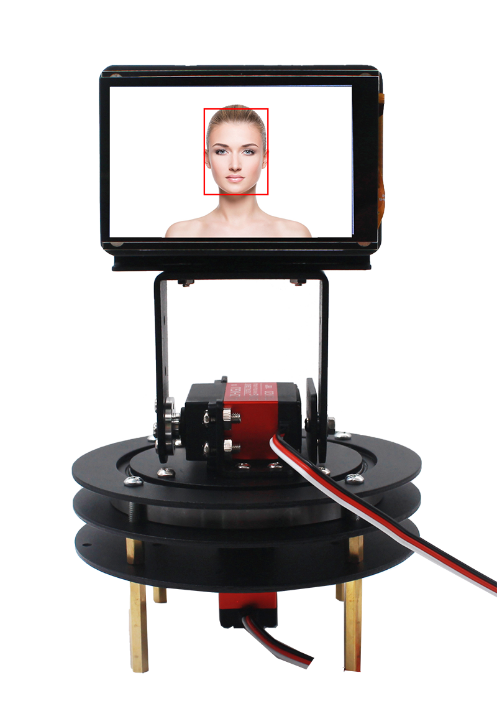
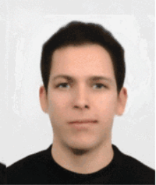
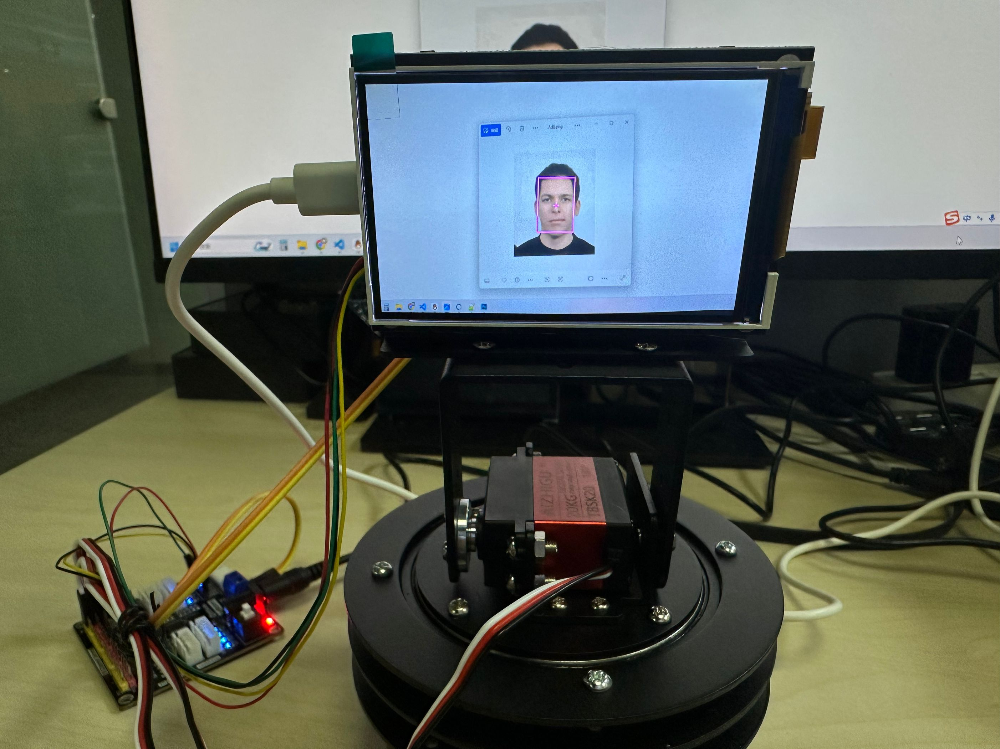

# 人脸追踪

:::tip 提示
本例程请使用01Studio资料包 2025-7-22 v1.3-70新版本镜像。
:::

## 前言
在前两节我们学习了二维舵机云台舵机控制和PID控制原理知识，本节就来整合一下实现二维舵机云台人脸追踪功能。



## 实验目的
二维舵机云台追踪人脸，让人脸始终保持在显示屏正中央。

## 实验讲解

人脸检测教程参考 [人脸检测](../../machine_vision/ai_vision/face/face_detection.md) 章节内容，这里不再重复。

二维云台舵机控制教程参考 [舵机控制](./servo.md) 章节内容，这里不再重复。

## PID算法实现

关于PID控制原理可参考上一节 [PID控制原理](./pid.md) 相关教程。

下面是一段PID算法micropython实现代码：

```python
# PID对象
class PID:
    def __init__(self, p=0.05, i=0.01, d=0.01):
        self.kp = p
        self.ki = i
        self.kd = d
        self.target = 0
        self.error = 0
        self.last_error = 0
        self.integral = 0
        self.output = 0

    def update(self, current_value):
        self.error = self.target - current_value

        #变化小于10不响应
        if abs(self.error)<10:
            return 0

        self.integral += self.error
        derivative = self.error - self.last_error

        # 计算PID输出
        self.output = (self.kp * self.error) + (self.ki * self.integral) + (self.kd * derivative)

        self.last_error = self.error
        return self.output

    def set_target(self, target):
        self.target = target
        self.integral = 0
        self.last_error = 0
```

综合上面知识，人脸追踪具体编程思路如下：

```mermaid
graph TD
    导入相关模块 --> 构建PID算法 --> 初始化X轴和Y轴PID参数 --> 人脸检测 --> PID算法追踪 --> 人脸检测;
```

## 参考代码

```python

'''
# Copyright (c) [2025] [01Studio]. Licensed under the MIT License.

实验名称：K230二维舵机云台（人脸追踪）
实验平台：01Studio CanMV K230 + 二维舵机云台（含pyMotors驱动板）
说明：编程实现人脸追踪，让人脸保持在显示屏中央位置。（仅支持单个人脸）
'''

#人脸视觉相关库
from media.sensor import * #导入sensor模块，使用摄像头相关接口
from libs.PipeLine import PipeLine, ScopedTiming
from libs.AIBase import AIBase
from libs.AI2D import Ai2d
import os
import ujson
from media.media import *
from media.sensor import *
from time import *
import nncase_runtime as nn
import ulab.numpy as np
import time
import utime
import image
import random
import gc
import sys
import aidemo
from media.sensor import * #导入sensor模块，使用摄像头相关接口

#舵机相关库
from machine import I2C,FPIOA
from servo import Servos
import time

#将GPIO11,12配置为I2C2功能
fpioa = FPIOA()
fpioa.set_function(11, FPIOA.IIC2_SCL)
fpioa.set_function(12, FPIOA.IIC2_SDA)

i2c = I2C(2,freq=10000) #构建I2C对象

#构建二维云台2路舵机对象
servo_x=Servos(i2c,degrees=270) #水平（X轴）使用的是270°舵机
servo_y=Servos(i2c,degrees=180) #垂直（Y轴）使用的是180°舵机

#舵机对象使用用法, 详情参看servo.py文件
#
#s.position(index, degrees=None)
#index: 0~15表示16路舵机;
#degrees: 角度，0~180/270。

#云台初始位置，水平（X轴）135°和垂直（Y轴）90°，均居中。
x_angle = 135
y_angle = 90

servo_x.position(0,x_angle) #水平（X轴）使用使用端口0，转到135°
servo_y.position(1,y_angle) #垂直（Y轴）使用使用端口1，转到90°

# PID参数 (水平和垂直方向分别设置)
class PID:
    def __init__(self, p=0.05, i=0.01, d=0.01):
        self.kp = p
        self.ki = i
        self.kd = d
        self.target = 0
        self.error = 0
        self.last_error = 0
        self.integral = 0
        self.output = 0

    def update(self, current_value):
        self.error = self.target - current_value

        #坐标变化小于10不响应
        if abs(self.error)<10:
            return 0

        self.integral += self.error
        derivative = self.error - self.last_error

        # 计算PID输出
        self.output = (self.kp * self.error) + (self.ki * self.integral) + (self.kd * derivative)

        self.last_error = self.error
        return self.output

    def set_target(self, target):
        self.target = target
        self.integral = 0
        self.last_error = 0

# 初始化2个PID控制器
x_pid = PID(p=0.01, i=0.0, d=0.001)  # 水平方向PID
y_pid = PID(p=0.01, i=0.0, d=0.001) # 垂直方向PID

# 自定义人脸检测类，继承自AIBase基类
class FaceDetectionApp(AIBase):
    def __init__(self, kmodel_path, model_input_size, anchors, confidence_threshold=0.5, nms_threshold=0.2, rgb888p_size=[224,224], display_size=[1920,1080], debug_mode=0):
        super().__init__(kmodel_path, model_input_size, rgb888p_size, debug_mode)  # 调用基类的构造函数
        self.kmodel_path = kmodel_path  # 模型文件路径
        self.model_input_size = model_input_size  # 模型输入分辨率
        self.confidence_threshold = confidence_threshold  # 置信度阈值
        self.nms_threshold = nms_threshold  # NMS（非极大值抑制）阈值
        self.anchors = anchors  # 锚点数据，用于目标检测
        self.rgb888p_size = [ALIGN_UP(rgb888p_size[0], 16), rgb888p_size[1]]  # sensor给到AI的图像分辨率，并对宽度进行16的对齐
        self.display_size = [ALIGN_UP(display_size[0], 16), display_size[1]]  # 显示分辨率，并对宽度进行16的对齐
        self.debug_mode = debug_mode  # 是否开启调试模式
        self.ai2d = Ai2d(debug_mode)  # 实例化Ai2d，用于实现模型预处理
        self.ai2d.set_ai2d_dtype(nn.ai2d_format.NCHW_FMT, nn.ai2d_format.NCHW_FMT, np.uint8, np.uint8)  # 设置Ai2d的输入输出格式和类型

    # 配置预处理操作，这里使用了pad和resize，Ai2d支持crop/shift/pad/resize/affine，具体代码请打开/sdcard/app/libs/AI2D.py查看
    def config_preprocess(self, input_image_size=None):
        with ScopedTiming("set preprocess config", self.debug_mode > 0):  # 计时器，如果debug_mode大于0则开启
            ai2d_input_size = input_image_size if input_image_size else self.rgb888p_size  # 初始化ai2d预处理配置，默认为sensor给到AI的尺寸，可以通过设置input_image_size自行修改输入尺寸
            top, bottom, left, right = self.get_padding_param()  # 获取padding参数
            self.ai2d.pad([0, 0, 0, 0, top, bottom, left, right], 0, [104, 117, 123])  # 填充边缘
            self.ai2d.resize(nn.interp_method.tf_bilinear, nn.interp_mode.half_pixel)  # 缩放图像
            self.ai2d.build([1,3,ai2d_input_size[1],ai2d_input_size[0]],[1,3,self.model_input_size[1],self.model_input_size[0]])  # 构建预处理流程

    # 自定义当前任务的后处理，results是模型输出array列表，这里使用了aidemo库的face_det_post_process接口
    def postprocess(self, results):
        with ScopedTiming("postprocess", self.debug_mode > 0):
            post_ret = aidemo.face_det_post_process(self.confidence_threshold, self.nms_threshold, self.model_input_size[1], self.anchors, self.rgb888p_size, results)
            if len(post_ret) == 0:
                return post_ret
            else:
                return post_ret[0]

    # 绘制检测结果到画面上
    def draw_result(self, pl, dets):
        with ScopedTiming("display_draw", self.debug_mode > 0):
            if dets:
                pl.osd_img.clear()  # 清除OSD图像
                for det in dets:
                    # 将检测框的坐标转换为显示分辨率下的坐标
                    x, y, w, h = map(lambda x: int(round(x, 0)), det[:4])

                    x = x * self.display_size[0] // self.rgb888p_size[0]
                    y = y * self.display_size[1] // self.rgb888p_size[1]
                    w = w * self.display_size[0] // self.rgb888p_size[0]
                    h = h * self.display_size[1] // self.rgb888p_size[1]

                    #画十字交叉
                    x_center = int(x + w/2)
                    y_center = int(y + h/2)
                    pl.osd_img.draw_cross(x_center, y_center, color=(255, 255, 0, 255), thickness=2)  # 绘制矩形框

                    pl.osd_img.draw_rectangle(x, y, w, h, color=(255, 255, 0, 255), thickness=2)  # 绘制矩形框

                    return x_center,y_center

            else:
                pl.osd_img.clear()

                return None,None

    # 获取padding参数
    def get_padding_param(self):
        dst_w = self.model_input_size[0]  # 模型输入宽度
        dst_h = self.model_input_size[1]  # 模型输入高度
        ratio_w = dst_w / self.rgb888p_size[0]  # 宽度缩放比例
        ratio_h = dst_h / self.rgb888p_size[1]  # 高度缩放比例
        ratio = min(ratio_w, ratio_h)  # 取较小的缩放比例
        new_w = int(ratio * self.rgb888p_size[0])  # 新宽度
        new_h = int(ratio * self.rgb888p_size[1])  # 新高度
        dw = (dst_w - new_w) / 2  # 宽度差
        dh = (dst_h - new_h) / 2  # 高度差
        top = int(round(0))
        bottom = int(round(dh * 2 + 0.1))
        left = int(round(0))
        right = int(round(dw * 2 - 0.1))
        return top, bottom, left, right

# 显示模式，可以选择"hdmi"、"lcd3_5"(3.5寸mipi屏)和"lcd2_4"(2.4寸mipi屏)
display="lcd3_5"

if display=="hdmi":
    display_mode='hdmi'
    display_size=[1920,1080]
    rgb888p_size = [1920, 1080]

elif display=="lcd3_5":
    display_mode= 'st7701'
    display_size=[800,480]
    rgb888p_size = [1920, 1080]

elif display=="lcd2_4":
    display_mode= 'st7701'
    display_size=[640,480]
    rgb888p_size = [1280, 960] #2.4寸屏摄像头画面比例为4:3

# 设置模型路径和其他参数
kmodel_path = "/sdcard/examples/kmodel/face_detection_320.kmodel"
# 其它参数
confidence_threshold = 0.5
nms_threshold = 0.2
anchor_len = 4200
det_dim = 4
anchors_path = "/sdcard/examples/utils/prior_data_320.bin"
anchors = np.fromfile(anchors_path, dtype=np.float)
anchors = anchors.reshape((anchor_len, det_dim))

# 初始化PipeLine，用于图像处理流程
pl = PipeLine(rgb888p_size=rgb888p_size, display_size=display_size, display_mode=display_mode)

pl.create(Sensor(width=rgb888p_size[0], height=rgb888p_size[1]))  # 创建PipeLine实例

# 初始化自定义人脸检测实例
face_det = FaceDetectionApp(kmodel_path, model_input_size=[320, 320], anchors=anchors, confidence_threshold=confidence_threshold, nms_threshold=nms_threshold, rgb888p_size=rgb888p_size, display_size=display_size, debug_mode=0)
face_det.config_preprocess()  # 配置预处理

# 设置目标位置 (图像中心)
x_pid.set_target(display_size[0]/2)
y_pid.set_target(display_size[1]/2)

clock = time.clock()

###############
## 这里编写代码
###############
while True:

    clock.tick()

    img = pl.get_frame()            # 获取当前帧数据
    res = face_det.run(img)         # 推理当前帧

    # 当检测到人脸时：
    if res:

        #print(res)
        x_center,y_center = face_det.draw_result(pl, res)   # 绘制结果并返回中心X,Y坐标

        # 更新水平（X轴）舵机角度
        x_output = x_pid.update(x_center)
        x_angle = round(max(0, min(abs(x_angle + x_output),270)),1) #限制角度0-270°
        servo_x.position(0,x_angle)

        # 更新垂直（Y轴）舵机角度
        y_output = y_pid.update(y_center)
        y_angle =  round(max(0, min(abs(y_angle - y_output),180)),1) #限制角度0-180°
        servo_y.position(1,y_angle)

    else:

        pl.osd_img.clear()  # 清除OSD图像

    pl.show_image()    # 显示结果
    gc.collect()       # 垃圾回收
    print(clock.fps()) #打印帧率
```

这里对关键代码进行讲解：

- 设置显示方式：
    通过改变`display`的参数选择"hdmi"、"lcd3_5"(3.5寸mipi屏)和"lcd2_4"(2.4寸mipi屏)显示方式，这会改变中心坐标。
```python
    ...

    # 显示模式，可以选择"hdmi"、"lcd3_5"(3.5寸mipi屏)和"lcd2_4"(2.4寸mipi屏)

    display="lcd3_5"

    if display=="hdmi":
        display_mode='hdmi'
        display_size=[1920,1080]
        rgb888p_size = [1920, 1080]

    elif display=="lcd3_5":
        display_mode= 'st7701'
        display_size=[800,480]
        rgb888p_size = [1920, 1080]

    elif display=="lcd2_4":
        display_mode= 'st7701'
        display_size=[640,480]
        rgb888p_size = [1280, 960] #2.4寸屏摄像头画面比例为4:3
    ...    
```

- 初始化PID控制器：

可通过修改p,i,d数值改变追踪效果。i在本实验中用不到配置默认0即可。

```python
# 初始化2个PID控制器
x_pid = PID(p=0.01, i=0.0, d=0.001)  # 水平方向PID
y_pid = PID(p=0.01, i=0.0, d=0.001) # 垂直方向PID
```

- 设置目前期望的位置

由于01Studio有不同尺寸的显示屏，这里以800x480的3.5寸显示屏为例，中心坐标为(400,240), 根据前面display值自动完成设置。

```python
# 设置目标位置 (图像中心)
x_pid.set_target(display_size[0]/2)
y_pid.set_target(display_size[1]/2)
```

- 主函数代码：

在循环中一直检测人脸，然后返回人脸的中心X,Y坐标值，将这2个值喂给PID算法，根据算法返回值调整舵机位置。


```python
...
###############
## 这里编写代码
###############
while True:

    clock.tick()

    img = pl.get_frame()            # 获取当前帧数据
    res = face_det.run(img)         # 推理当前帧

    # 当检测到人脸时：
    if res:

        #print(res)
        x_center,y_center = face_det.draw_result(pl, res)   # 绘制结果并返回中心X,Y坐标

        # 更新水平（X轴）舵机角度
        x_output = x_pid.update(x_center)
        x_angle = round(max(0, min(abs(x_angle + x_output),270)),1) #限制角度0-270°
        servo_x.position(0,x_angle)

        # 更新垂直（Y轴）舵机角度
        y_output = y_pid.update(y_center)
        y_angle =  round(max(0, min(abs(y_angle - y_output),180)),1) #限制角度0-180°
        servo_y.position(1,y_angle)

    else:

        pl.osd_img.clear()  # 清除OSD图像

    pl.show_image()    # 显示结果
    gc.collect()       # 垃圾回收
    print(clock.fps()) #打印帧率
    ...
```

## 实验结果

本例程测试头像，另存为图片到本地即可使用：



运行代码，在摄像头画面移动人脸头像，可以看到二维舵机云台实现了人脸追踪。




