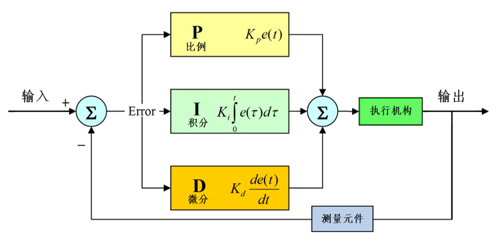
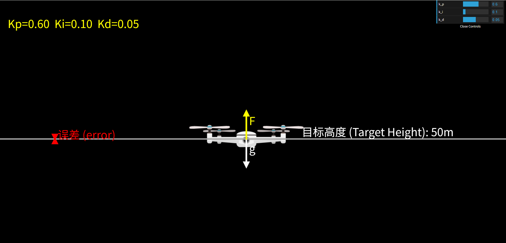
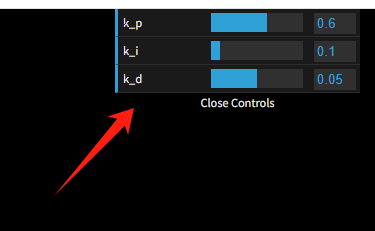

# PID控制原理

PID 算法【比例(Proportional) - 积分(Integral) - 微分控制算法(Derivative)】是工业控制、自动化领域中应用最广泛的闭环控制算法之一，其核心是通过偏差反馈动态调整控制量，使系统输出快速、稳定地接近目标值。

舵机云台常用于监控和目标跟随，比如人脸追踪，就要求摄像头始终让人脸保持在显示屏中心，当人脸移动时候实现跟随。

那么为什么要使用PID算法呢？我们不能检测到目标就直接将云台转到到相关位置么？答案是可以的，但这会存在一个“刹不住车”的问题，试想一下比如我们当前目标是要跑到一个一百米外的点，那么我们百米冲刺的速度跑过去，可想而知我们就好来不及“刹车”，冲出了终点，然后在终点来回跑，最终到达目的地。加入PID的好处就是拥有一个闭环系统，当我们距离终点较远时，可以跑快一点，当快到点终点时，跑慢一点，避免来回“震荡”，让系统更高效稳定。

关于PID控制算法原理可以查看B站这个up主的视频：https://www.bilibili.com/video/BV1et4y1i7Gm/

总结：
- P比例：控制移动速度
- I积分：控制绝度误差
- D微分：控制刹车减速

视频中提供的PID飞控在线模拟链接：[点击跳转](https://bitbci.github.io/Tools/pidSimulation/)

可修改右上角PID值实时调试：

PID基于二维舵机云台应用我们将在后面章节深入讲解。

