# 多路舵机/电机模块

## 前言
前面我们学习了单一舵机控制，但在一些需要多舵机/电机的场合，如机器人或小车等就需要同时控制多路舵机。那么这节我们来学习一下如何使用CanMV K230开发板控制多路舵机、电机和步进电机。

## 实验平台

01Studio CanMV K230开发套件和pyMotors多功能电机模块。 [点击购买>>](https://item.taobao.com/item.htm?id=649441899397)

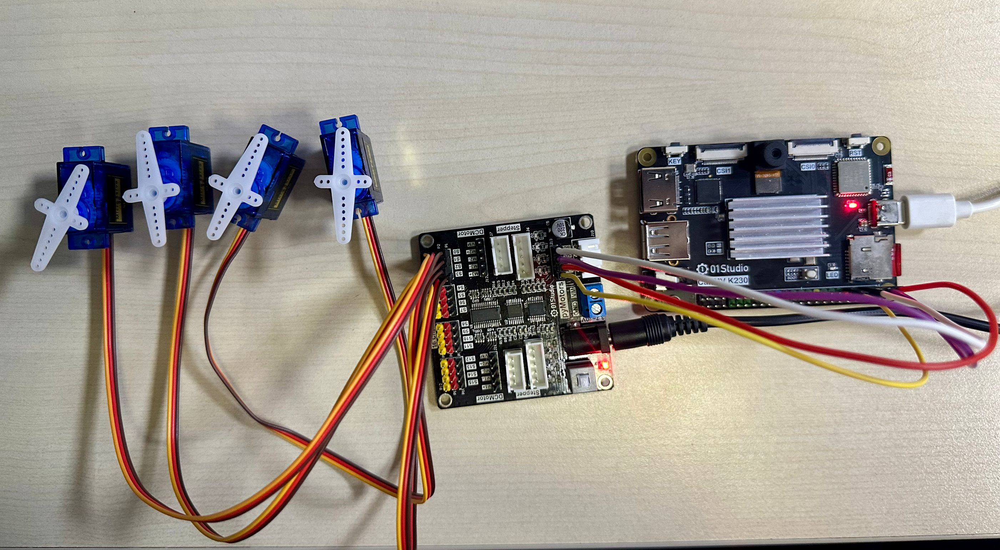

## 实验目的

通过编程实现对多路舵机、电机和步进电机的控制。

## 实验讲解

pyMotors多功能电机模块基于PCA9685，这是一款I2C转16路PWM芯片，只需要通过K230的I2C接口即可控制最大16路PWM舵机、4路直流电机、2路42步进电机或4相5线步进电机。电机供电支持3.7V-10V输入。


pyMotors模块资料包：[点击下载>>](https://download.01studio.cc/modules/motor/motors/motors.html)

本教程使用I2C2跟pyMotors模块连接。模块使用5V供电。

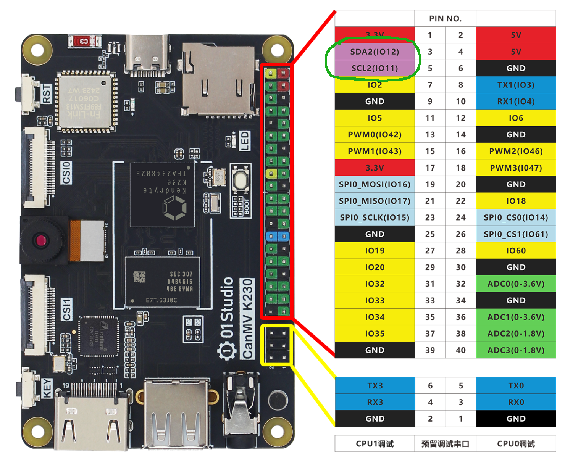

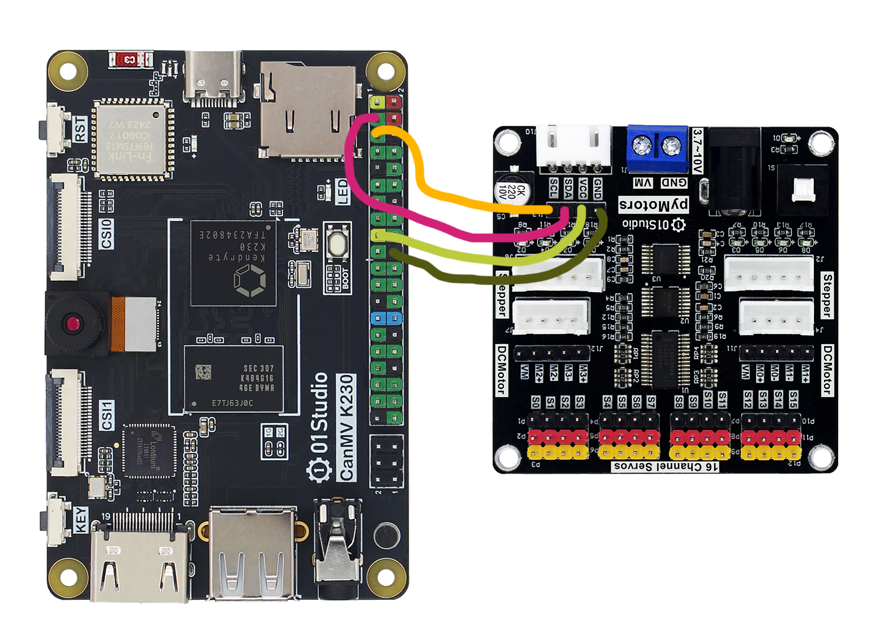

## 舵机

舵机通过3线（一般舵机的线序为信号，电源，地）控制，本节实验用到的是性价比较高的SG90舵机。通常情况下：黑色表示GND，红色表示VCC，橙色表示信号线。


舵机的详细控制原理可以参考 [舵机](../sensor_module/servo.md) 章节教程，这里不再重复。

### Servos对象

舵机的microppython驱动库已经封装好，位于servo.py和pca9685.py ,只需要在主函数初始化I2C2和调用即可。

#### 构造函数
```python
from servo import Servos

...

s=Servos(i2c) 
```
构建16路舵机对象。

#### 使用方法
```python
s.position(index, degrees=None)
```
设置某个舵机的位置。

- `index`: 值为 0~15 ，表示16个舵机的编号；
- `degrees`: 值为 0~180 ，表示舵机的角度；

<br></br>

运行前需要将 servo.py和pca9685.py 文件发送到CanMV U盘 `sdcard`根目录。主函数代码如下：

### 参考代码


```python
'''
# Copyright (c) [2025] [01Studio]. Licensed under the MIT License.

实验名称：pyMotors多功能电机模块
实验平台：01Studio CanMV K230
说明：同时控制16路舵机旋转
'''
from machine import I2C,FPIOA
from servo import Servos
import time

#将GPIO11,12配置为I2C2功能
fpioa = FPIOA()
fpioa.set_function(11, FPIOA.IIC2_SCL)
fpioa.set_function(12, FPIOA.IIC2_SDA)

i2c = I2C(2) #构建I2C对象
#print(i2c.scan())

#构建16路舵机对象
s=Servos(i2c)

#舵机对象使用用法, 详情参看servo.py文件
#
#s.position(index, degrees=None)
#index: 0~15表示16路舵机;
#degrees: 角度，0~180。

while True:

    for i in range(16):
        s.position(i,0) #i为0~15的16路输出，0表示角度0度。
    time.sleep(1)

    for i in range(16):
        s.position(i,180) #i为0~15的16路输出，180表示角度180度。
    time.sleep(1)

```

### 实验结果

将资料包示例程序的库文件全部拷贝到CanMV U盘 `sdcard`根目录：

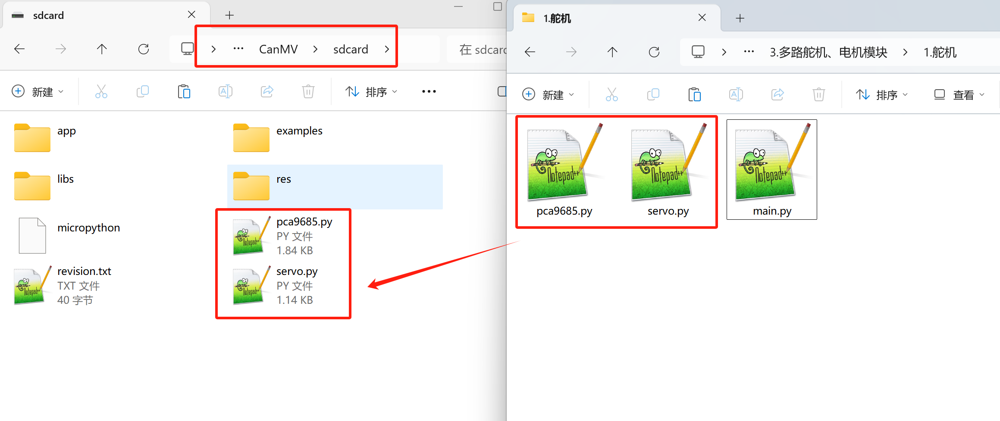

将180°舵机插到下图排针接口。运行上面主函数程序。可以看到全部舵机依次旋转至不同角度。**最大支持16路，保证电源供电电流足够即可。**


## 直流电机

本机教程使用的直流电机为常用的TT马达，2个引脚，支持正转和反转，常用于智能小车等场景。

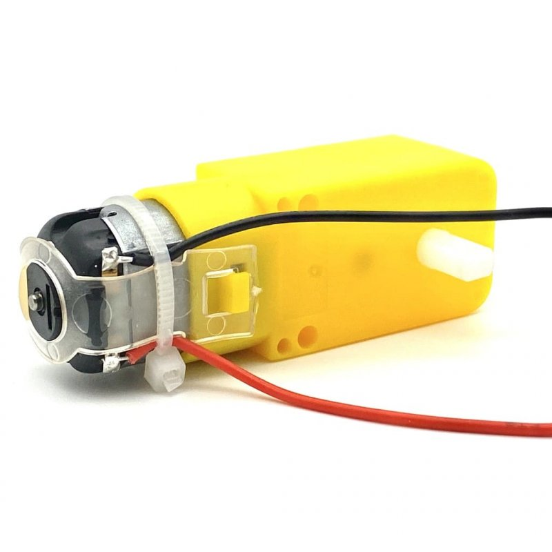

直流电机本质通过2个引脚施加电压控制正反转，通过PWM调速。pyMotors模块最大支持4路直流减速电机。M0到M3接口，`+`表示正，`-`表示负。

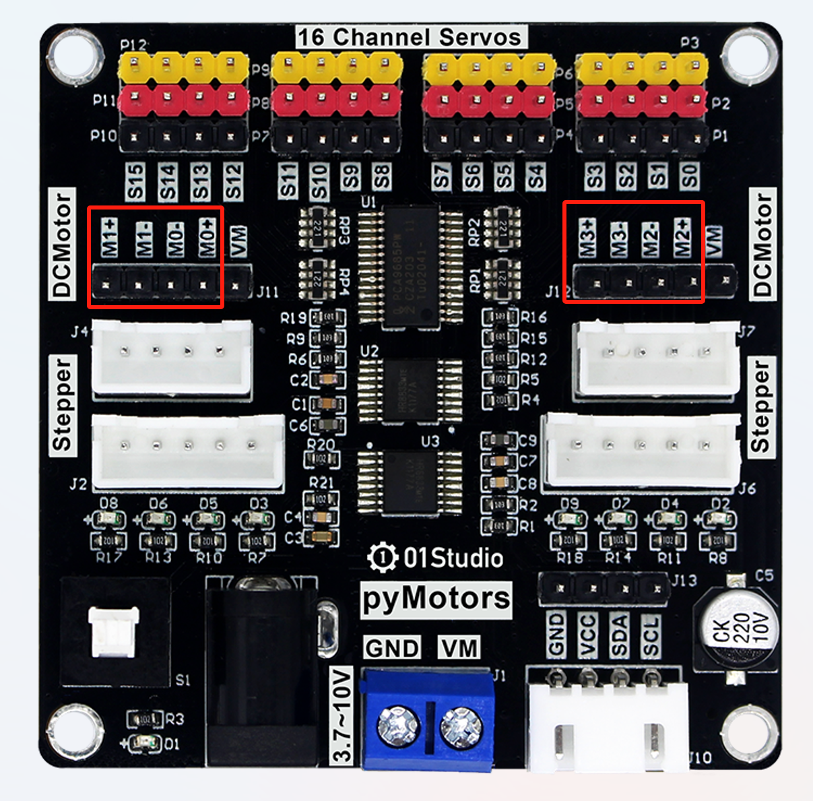

### Motors对象

直流电机的microppython驱动库已经封装好，位于motor.py和pca9685.py ,只需要在主函数初始化I2C2和调用即可。

#### 构造函数

```python
from motor import Motors

...

m=Motors(i2c) 
```
构建4路直流电机对象。

#### 使用方法

```python
m.speed(index, value=0)
```
电机控制函数。

- `index`: 值为 0~3 ，表示4个直流电机的编号；
- `value`: 速度值。范围：-4095~4095，正负表示转向，绝对值越大速度越快；

<br></br>

运行前需要将 motor.py和pca9685.py 文件发送到CanMV U盘 `sdcard`根目录。主函数代码如下：

### 参考代码

```python
'''
# Copyright (c) [2025] [01Studio]. Licensed under the MIT License.

实验名称：pyMotors多功能电机模块
实验平台：01Studio CanMV K230
说明：同时控制4路直流减速电机
'''

from machine import I2C,FPIOA
from motor import Motors
import time

#将GPIO11,12配置为I2C2功能
fpioa = FPIOA()
fpioa.set_function(11, FPIOA.IIC2_SCL)
fpioa.set_function(12, FPIOA.IIC2_SDA)

i2c = I2C(2) #构建I2C对象
#print(i2c.scan())

#构建4路直流电机对象
m=Motors(i2c)

#直流电机对象使用用法，详情参看motor.py文件
#
#m.speed(index, value=0)
#index: 0~3表示4路直流电机
#value: 速度。-4095~4095，正负表示转向，绝对值越大速度越大


#前进
m.speed(0,4095) #直流电机0正转，速度0~4095,4095表示最快速度
m.speed(1,4095)
m.speed(2,4095)
m.speed(3,4095)

time.sleep(3)

#后退
m.speed(0,-4095) #直流电机0反转，速度0~-4095,-4095表示反转最快速度
m.speed(1,-4095)
m.speed(2,-4095)
m.speed(3,-4095)

time.sleep(3)

#制动停止
for i in range(4):
    m.brake(i)

```

### 实验结果

将资料包示例程序的库文件全部拷贝到CanMV U盘 `sdcard`根目录：

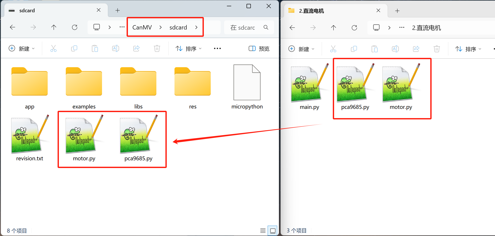

将电机插到下图排针接口。

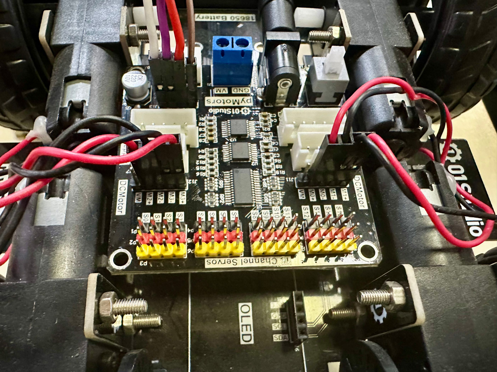

运行上面主函数程序。可以看到直流电机旋转。**最大支持4路，保证电源供电电流足够即可。**

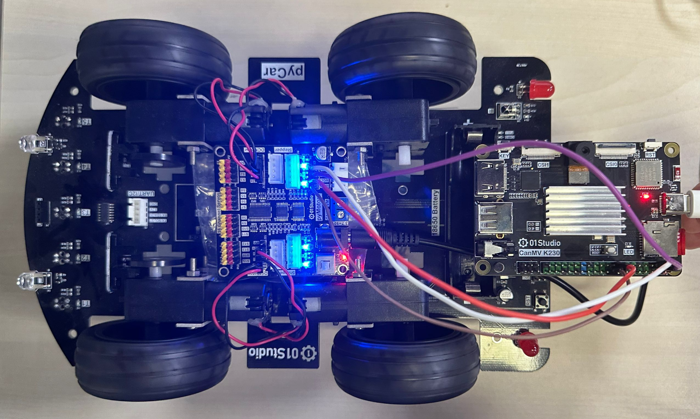

## 42步进电机

42步进电机是常用的步进电机，是指电机直径为42mm。[点击购买>>](https://item.taobao.com/item.htm?id=649081590385)，可以精准控制旋转步数。常用于3D打印机或一些机械设备精确控制场合。

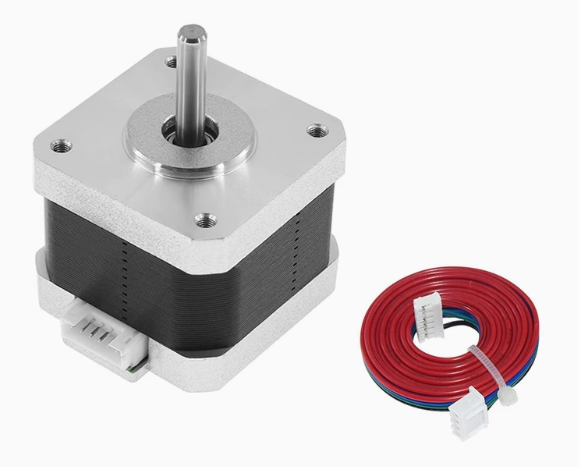

pyMotors模块支持2路42步进电机控制，接线如下：

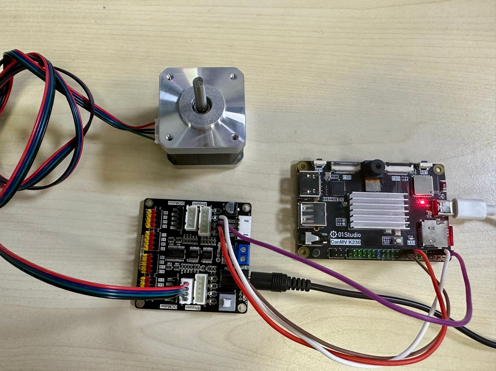

### Steppers对象

42步进电机的microppython驱动库已经封装好，位于stepper.py和pca9685.py ,只需要在主函数初始化I2C2和调用即可。

#### 构造函数
```python
from stepper import Steppers

...

s=Steppers(i2c) 
```
构建2路42步进电机对象。

#### 使用方法
```python
s.Step(index, steps=0, direction=1,mode=4, interval=2)
```
42步进电机控制函数。

- `index`: 值为 0~1 ，表示2个42步进电机的编号；
- `steps`: 转动步数；
- `direction`: 转动方向,1为正转，0为反转；
- `mode`: 转动模式，4表示4拍，8表示八拍;
- `interval`: 每拍间隔时间，单位为ms;

<br></br>

运行前需要将 stepper.py和pca9685.py 文件发送到CanMV U盘 `sdcard`根目录。主函数代码如下：


### 参考代码

```python
'''
# Copyright (c) [2025] [01Studio]. Licensed under the MIT License.

实验名称：pyMotors多功能电机模块
实验平台：01Studio CanMV K230
说明：同时控制2路42步进电机
'''

from machine import I2C,FPIOA
from stepper import Steppers
import time

#将GPIO11,12配置为I2C2功能
fpioa = FPIOA()
fpioa.set_function(11, FPIOA.IIC2_SCL)
fpioa.set_function(12, FPIOA.IIC2_SDA)

i2c = I2C(2) #构建I2C对象
#print(i2c.scan())

#构建2路42步进电机对象
s=Steppers(i2c)

#42步进电机对象使用用法，详情参看stepper.py文件
#
#s.Step(index, steps=0, direction=1,mode=4, interval=2)
#index: 0~1表示2路42步进电机
#steps: 转动步数
#direction：方向,1为正转，0为反转
#mode: 4表示4拍，8表示八拍
#interval：每拍间隔时间，单位为ms

#2路顺时针连续旋转
while True:
    s.Step(0,1)
    s.Step(1,1)
```

### 实验结果

将资料包示例程序的库文件全部拷贝到CanMV U盘 `sdcard`根目录：

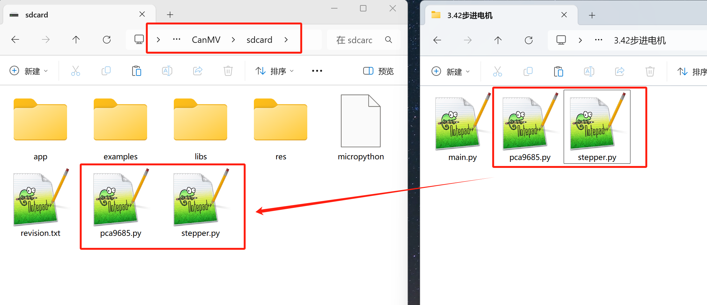


运行上面主函数程序。可以看到42步进电机按指定间隔和步数旋转。**最大支持2路，保证电源供电电流足够即可。**

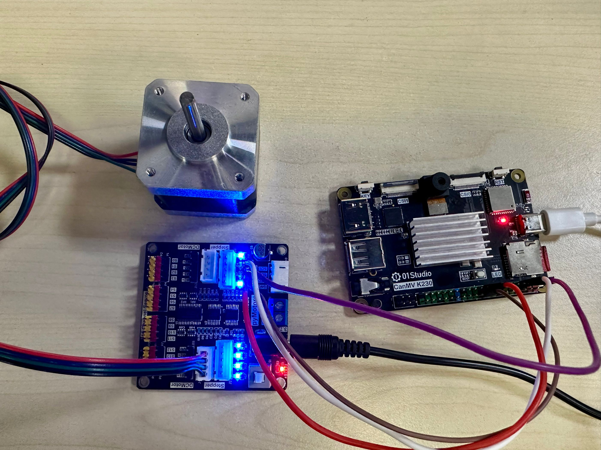

## 4相5线步进电机

4相5线步进电机是另一款常用的步进电机。[点击购买>>](https://item.taobao.com/item.htm?id=649082722225)，可以精准控制旋转步数。常用于3D打印机或一些机械设备精确控制场合。

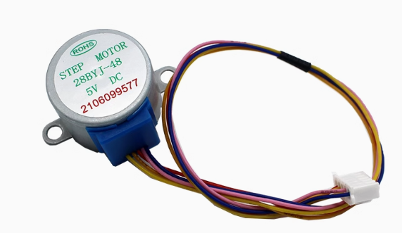

pyMotors模块支持2路4相5线步进电机控制，接线如下：

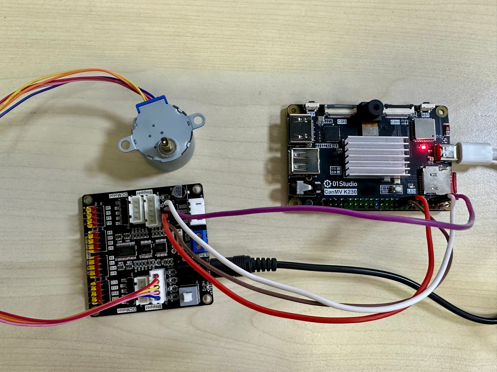

### Steppers_5W对象

4相5线步进电机的microppython驱动库已经封装好，位于stepper.py和pca9685.py ,只需要在主函数初始化I2C2和调用即可。

#### 构造函数
```python
from stepper import Steppers_5W

...

s=Steppers_5W(i2c) 
```
构建2路4相5线电机对象。

#### 使用方法
```python
s.Step(index, steps=0, direction=1,mode=4, interval=2)
```
4相5线步进电机控制函数。

- `index`: 值为 0~1 ，表示2个4相5线步进电机的编号；
- `steps`: 转动步数；
- `direction`: 转动方向,1为正转，0为反转；
- `mode`: 转动模式，4表示4拍，8表示八拍;
- `interval`: 每拍间隔时间，单位为ms;

<br></br>

运行前需要将 stepper.py和pca9685.py 文件发送到CanMV U盘 `sdcard`根目录。主函数代码如下：

### 参考代码

```python
'''
# Copyright (c) [2025] [01Studio]. Licensed under the MIT License.

实验名称：pyMotors多功能电机模块
实验平台：01Studio CanMV K230
说明：同时控制2路4相5线步进电机
'''

from machine import I2C,FPIOA
from stepper import Steppers_5W
import time

#将GPIO11,12配置为I2C2功能
fpioa = FPIOA()
fpioa.set_function(11, FPIOA.IIC2_SCL)
fpioa.set_function(12, FPIOA.IIC2_SDA)

i2c = I2C(2) #构建I2C对象
#print(i2c.scan())

#构建2路4相5线步进电机对象
s=Steppers_5W(i2c)

#4相5线步进电机对象使用用法，详情参看stepper.py文件
#
#s.Step(index, steps=0, direction=1,mode=4, interval=2)
#index: 0~1表示2路4相5线步进电机
#steps: 转动步数
#direction：方向,1为正转，0为反转
#mode: 4表示4拍，8表示八拍
#interval：每拍间隔时间，单位为ms

#2路顺时针连续旋转
while True:
    s.Step(0,1)
    s.Step(1,1)
```

### 实验结果

将资料包示例程序的库文件全部拷贝到CanMV U盘 `sdcard`根目录：


运行上面主函数程序。可以看到4相5线步进电机按指定间隔和步数旋转。**最大支持2路，保证电源供电电流足够即可。**

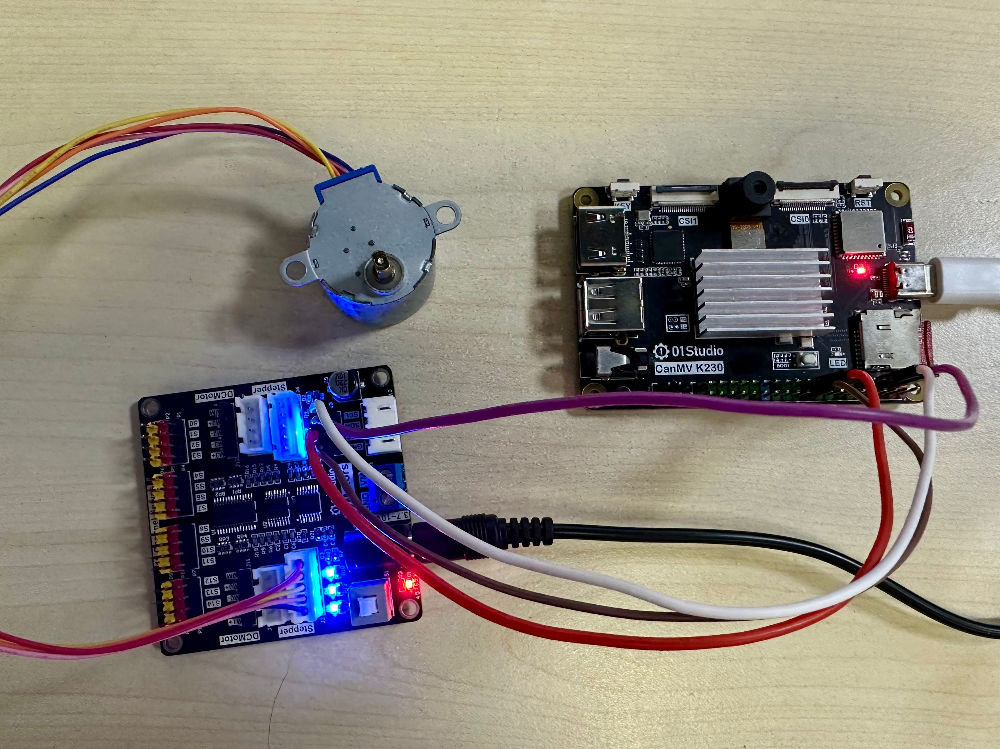
