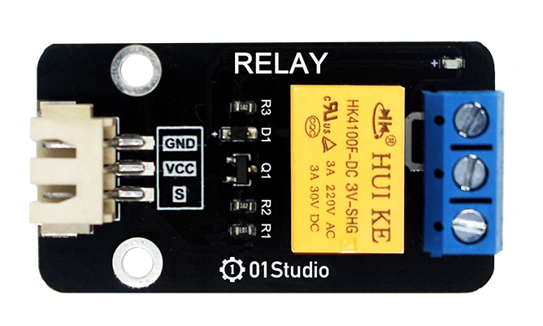
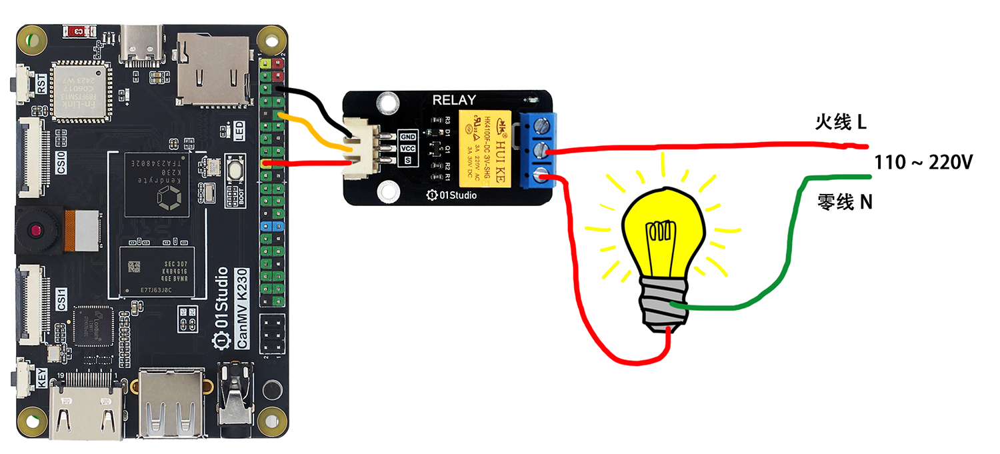
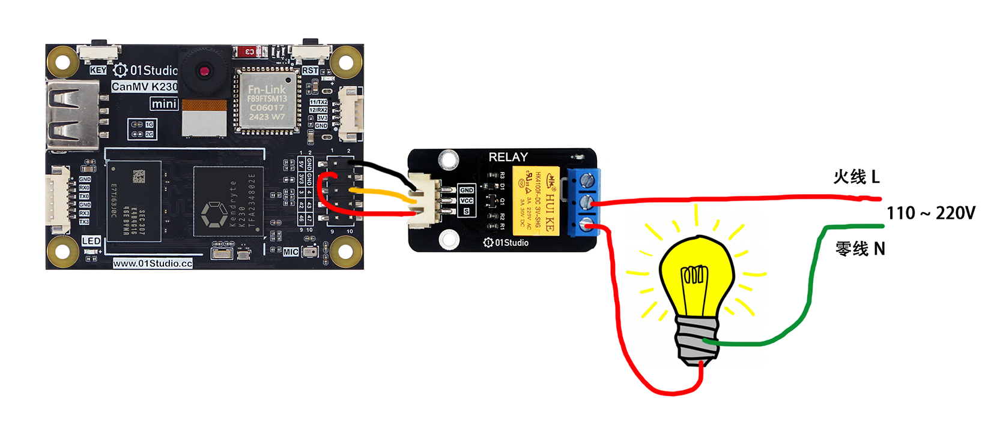
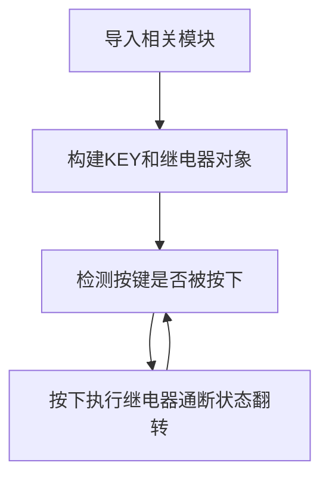
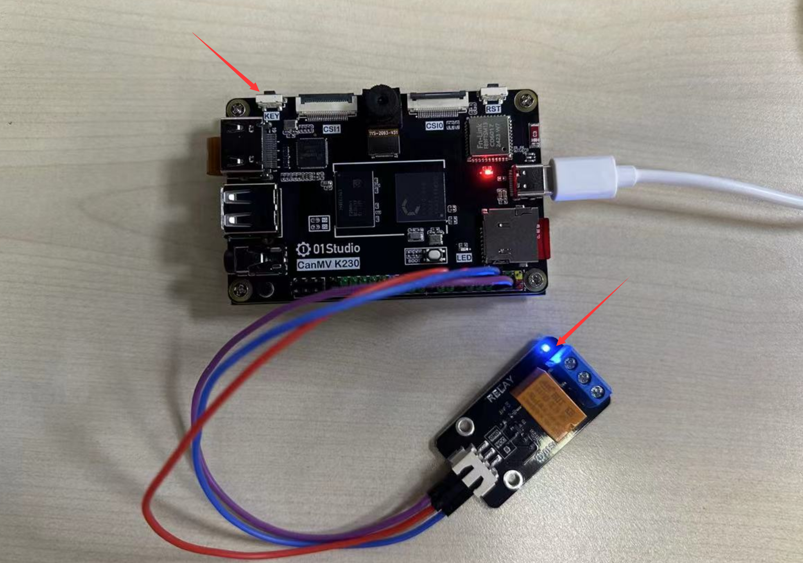

# 继电器

## 前言
我们知道CanMV K230开发板GPIO输出的电平是3.3V的，这是不能直接控制一些高电压的设备，比如电灯（220V）。这时候就可以使用我们常用的低压控制高压元件—继电器。

## 实验目的
使用按键控制继电器通断。

## 实验讲解

下图是01Studio的继电器模块，可以使用3.3V供电，CanMV K230引出IO可以直接连接控制端。左侧低压控制接口主要有供电引脚和信号控制引脚（供电电压一般为3.3V，具体以厂家参数为准）。右侧蓝色为高压部分，可连接220V电器。[**点击购买>>**](https://item.taobao.com/item.htm?id=624484399665)

:::tip 提示

务必使用3.3V电平控制的继电器，因为K230 GPIO输出为3.3V，使用5V控制的继电器操作不当可能会烧坏开发板。

:::



下图为电器连接示意图，左侧为低压控制部分，右侧为高压控制部分 (接线注意用电安全)：

- CanMV K230



- CanMV K230 mini



参考[GPIO介绍](../basic_examples/gpio_intro.md)章节可以看到上图连接的是IO4。因此连线后我们只需要控制GPIO2的高低电平即可控制继电器通断。我们结合按键实验，实现每次按下按键后继电器的通断状态改变。

代码编写流程如下：




## 参考代码

```python
'''
实验名称：继电器
实验平台：01Studio CanMV K230
说明：通过按键改变继电器通断状态
教程：wiki.01studio.cc
'''

from machine import Pin
from machine import FPIOA
import time


#将GPIO4、GPIO21配置为普通GPIO模式
fpioa = FPIOA()
fpioa.set_function(4,FPIOA.GPIO2)
fpioa.set_function(21,FPIOA.GPIO21)

RELAY=Pin(4,Pin.OUT) #构建继电器对象
KEY=Pin(21,Pin.IN,Pin.PULL_UP) #构建KEY对象

state=0 #继电器通断状态

while True:

    if KEY.value()==0:   #按键被按下
        time.sleep_ms(10) #消除抖动
        if KEY.value()==0: #确认按键被按下

            state=not state  #使用not语句而非~语句
            RELAY.value(state) #继电器通断状态翻转
            print('KEY')

            while not KEY.value(): #检测按键是否松开
                pass
```

## 实验结果

运行代码，可以通过按键来控制继电器通断：



继电器的控制方式非常简单，用途非常广。只需要一个简单的GPIO高低电平即可实现控制。