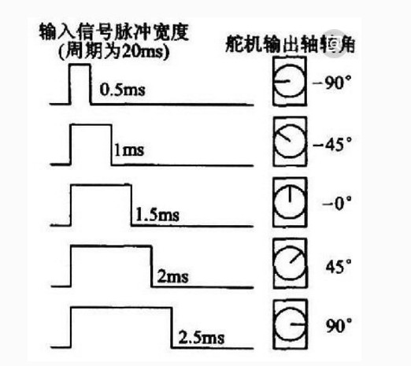

# 舵机

## 前言
舵机又叫伺服电机，是一个可以旋转特定角度的电机，可转动角度通常是90°、180°和360°（360°可以连续旋转）。我们看到的机器人身上就有非常多的舵机，它们抬手或者摇头的动作往往是通过舵机完成，因此机器人身上的舵机越多，意味着动作越灵活。

## 实验平台

01Studio CanMV K230开发套件和SG90舵机。**本教程使用电流较小的SG90舵机 [点击购买>>](https://item.taobao.com/item.htm?id=623613580232)，如使用到电流较大的舵机建议外接舵机驱动板单独供电，避免舵机产生反向电动势击坏开发板。**


## 实验目的
通过编程实现对舵机的控制。

## 实验讲解

伺服电机对象通过3线（一般舵机的线序为信号，电源，地）控制，本节实验用到的是性价比较高的SG90舵机。通常情况下：黑色表示GND，红色表示VCC，橙色表示信号线。


01Studio CanMV K230引出的GPIO排针有4路PWM，可以用于控制PWM舵机，供电为5V（只引出2个5V排针引脚）。

- CanMV K230


- CanMV K230 mini


舵机的排母接口通常是3P连在一起，因此你可能需要使用**母对公**杜邦线用于连接舵机和K230开发板。


下图以GPIO42为例接了1个SG90舵机，注意引线顺序不要接错。


180°舵机的控制一般需要一个20ms左右的时基脉冲，该脉冲的高电平部分一般为0.5ms-2.5ms范围内的角度控制脉冲部分，总间隔为2ms。以180度角度伺服为例，在MicroPython编程对应的控制关系是从-90°至90°，示例图如下：



而对于360°连续旋转舵机，上面的脉冲表则对应从正向最大速度旋转到反向最大速度旋转的过程。

CanMV库并没有集成Servo模块，但从上面可以看到上面是通过PWM来控制的，我们可以直接写PWM函数驱动即可。PWM教程可以长参考： [PWM](../basic_examples/pwm_beep.md) 章节内容。

代码编程流程图如下：


## 参考代码

```python
'''
# Copyright (c) [2025] [01Studio]. Licensed under the MIT License.

实验名称：舵机控制
实验平台：01Studio CanMV K230
说明：通过编程控制舵机旋转到不同角度
版本：v1.1
'''

from machine import Pin, PWM
from machine import FPIOA
import time

#配置引脚42为PWM0功能
#通道0：GPIO42,通道1：GPIO43,通道2：GPIO46,通道3：GPIO47
fpioa = FPIOA()
fpioa.set_function(42,FPIOA.PWM0)

#构建PWM0对象，通道0，频率为50Hz，占空比为0ns，默认使能输出
S1 = PWM(0, freq=50, duty_ns=0) # 在同一语句下创建和配置PWM

'''
#其它PWM引脚配置参考代码

#配置引脚43为PWM1功能
fpioa = FPIOA()
fpioa.set_function(43,FPIOA.PWM1)

#构建PWM1对象，通道1，频率为50Hz，占空比为0ns，默认使能输出
S2 = PWM(1, freq=50, duty_ns=0) # 在同一语句下创建和配置PWM
'''

'''
说明：舵机控制函数
功能：180度舵机：angle:-90至90 表示相应的角度
     360连续旋转度舵机：angle:-90至90 旋转方向和速度值。
    【duty_ns】占空比值：0.5ms-2.5ms
'''
def Servo(servo,angle):
    
    servo.duty_ns(int((angle+90)/180*2000000+500000))


while True:

    #-90度
    Servo(S1,-90)
    time.sleep(1)

    #-45度
    Servo(S1,-45)
    time.sleep(1)

    #0度
    Servo(S1,0)
    time.sleep(1)

    #45度
    Servo(S1,45)
    time.sleep(1)

    #90度
    Servo(S1,90)
    time.sleep(1)

```

## 实验结果

将180°舵机插到下图排针接口。运行程序。可以看到舵机依次旋转至不同角度。


## 360度连续旋转舵机

我们刚刚实现了180°舵机的角度控制，现在来做一下360°连续旋转舵机的实验，360°连续旋转舵机可以实现直流减速电机功能，用在小车或者航模上。

实验的代码不变，参数【-90至90】代表旋转方向和速度值大小。插上360°连续旋转舵机。可以看到舵机的旋转速度和方向逐渐变变化。


通过本节我们学会了使用不同类型的舵机，通过多路电机的组合使用，可以实现模型、航模、小车、机器人的实验。