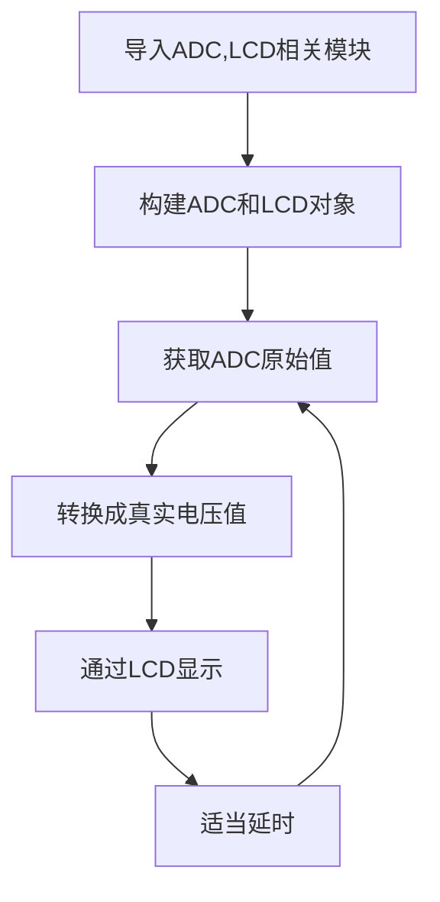
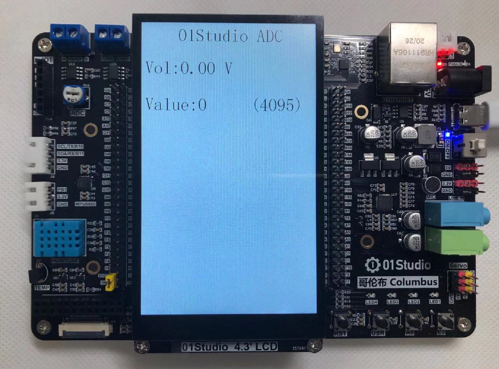
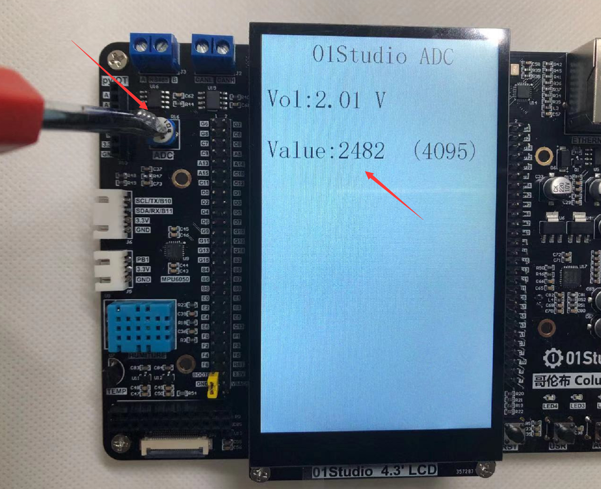

# ADC（电压测量）

## 前言
ADC(analog to digital conversion) 模拟数字转换。意思就是将模拟信号转化成数字信号，由于单片机只能识别二级制数字，所以外界模拟信号常常会通过ADC转换成其可以识别的数字信息。常见的应用就是将变化的电压转成数字信号实现对电压值测量。

## 实验平台
哥伦布MicroPython开发套件、4.3寸LCD显示屏（电容触摸）。


## 实验目的
通过编程调用MicroPython的内置ADC函数，实现测量0-3.3V电压，并显示到LCD屏幕上。

## 实验讲解

哥伦布主控的PA5引脚连接到了电位器，通过电位器的调节可以使得PA5引脚上的电压变化范围实现从0-3.3V。


pyb内置了ADC对象，使用说明如下：

## ADC对象

### 构造函数
```python
adc = pyb.ADC(pin)
```
构建ADC对象，ADC引脚对应如下：

- `pin` ：支持ADC的Pin对象，如：'A5'。


### 使用方法
```python
adc.read()
```
获取ADC值，测量精度是12位，返回0-4095（对应电压0-3.3V）。

<br></br>

更多用法请阅读官方文档：<br></br>
https://docs.01studio.cc/library/pyb.ADC.html#pyb-adc

<br></br>

熟悉ADC使用方法后，我们通过代码实现周期性测量引脚电压，代码编程流程图如下：




## 参考代码

```python
'''
实验名称：ADC-电压测量
版本：v1.0
平台：哥伦布开发板 + 4.3寸MCU屏（电容触摸）
作者：01Studio
说明：通过对ADC数据采集，转化成电压在显示屏上显示。ADC精度12位，电压0-3.3V。
'''

#导入相关模块
import pyb,time
from tftlcd import LCD43M

#定义常用颜色
RED = (255,0,0)
GREEN = (0,255,0)
BLUE = (0,0,255)
BLACK = (0,0,0)
WHITE = (255,255,255)

########################
# 构建4.3寸LCD对象并初始化
########################
d = LCD43M(portrait=1) #默认方向

d.fill(WHITE)#填充白色

#构建ADC对象，引脚PA5
adc = pyb.ADC('A5')

#显示标题
d.printStr('01Studio ADC', 100, 10, BLACK, size=4)

while True:

    #电压采集
    value = str(adc.read()) #原始值
    vol = str('%.2f'%(adc.read()/4095*3.3)) #电压值，0-3.3V

    #显示测量值和电压值
    d.printStr('Vol:'+vol+" V", 10, 100, BLACK, size=4)
    d.printStr('Value:'+value+"   ", 10, 200, BLACK, size=4)
    d.printStr("(4095)", 300, 200, BLACK, size=4)
    print(value)

    time.sleep_ms(500) #延时500ms
```

## 实验结果

在Thonny IDE运行代码, 可以看到下面的实验结果：

- 电位器顺时钟拧到尽头是0V



通过调节电位器，可以发现电压在不断变化。



:::danger 警告
ADC测量输入电压请勿大于3.3V，有可能烧坏主控芯片。
:::
