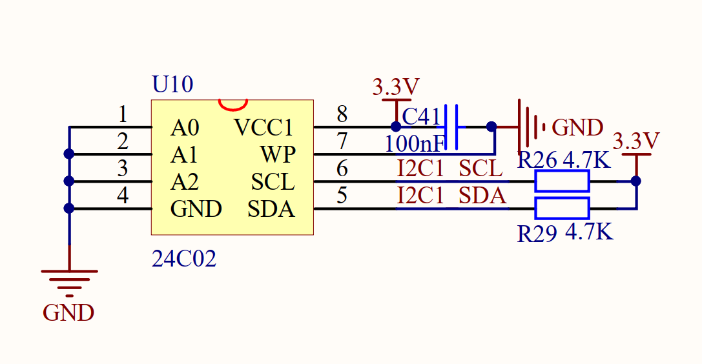
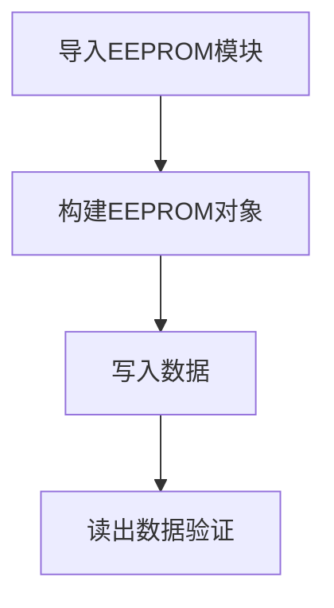
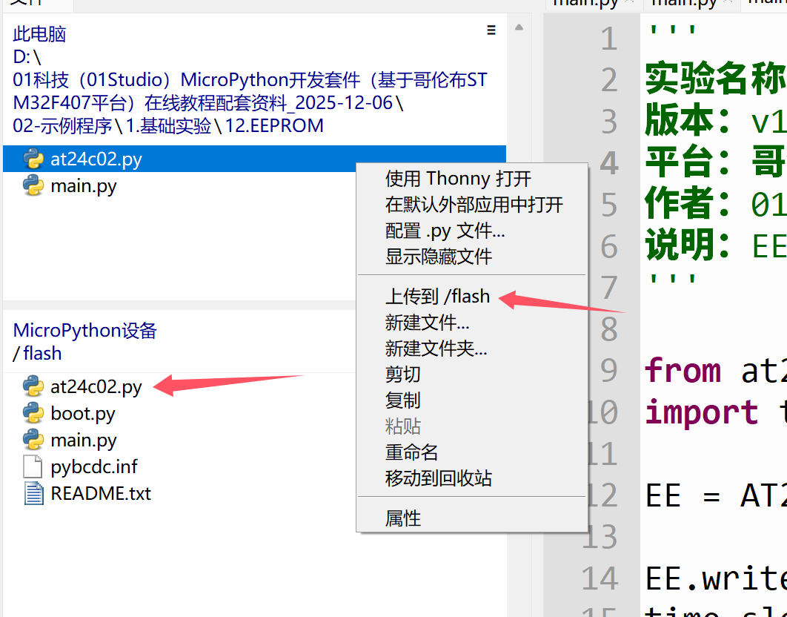
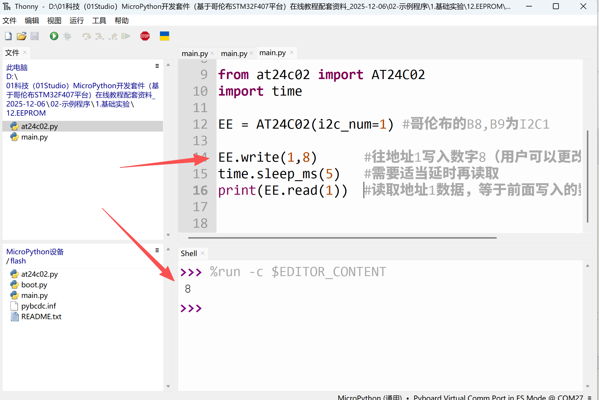

# EEPROM

## 前言
EEPROM (Electrically Erasable Programmable read only memory)是指带电可擦可编程只读存储器。是一种掉电后数据不丢失的存储芯片。也就是说我们可以将数据存储在EEPROM上，实现断电保存数据。

## 实验平台
哥伦布MicroPython开发套件。


## 实验目的
学习使用MicroPython的I2C总线通讯编程和EEPROM应用。

## 实验讲解

- 什么是I2C？

I2C是用于设备之间通信的双线协议，在物理层面，它由2条线组成：SCL和SDA，分别是时钟线和数据线。也就是说不通设备间通过这两根线就可以进行通信。

从下图可以看到EEPROM接了哥伦布开发板的I2C1引脚。



我们再来简单了解一下AT24C02, 这个芯片总共有256*8=2048 bits（2k）的存储空间，简单理解就是地址从0-255，每个地址最多放一个8bit数据，2^8=256.也就是数据也是0-255。

在了解完I2C和EEPROM后，我们来看看EEPROM的构造函数和使用方法，强大的micropython封装让EEPROM的读写变得非常简单：


## AT24C02对象

### 构造函数
```python
at24c02. AT24C02(i2c_num)
```
构建AT24C02对象。
- `i2c_num`：哥伦布预先定义的I2C引脚编号。如：1。

### 使用方法
```python
AT24C02.read(addr)
```
读取EEPROM指定地址里面的数据；
- `addr`：AT24C02数据地址：0-255

<br></br>

```python
AT24C02.write(addr,dat)
```
往EEPROM指定地址写数据；
- `addr`：AT24C02数据地址：0-255
- `dat`：数据：0-255

<br></br>

代码编程流程图如下：



## 参考代码

```python
'''
实验名称：EEPROM（AT24C02）
版本：v1.0
日期：2020.12
作者：01Studio
说明：EEPROM的读写实验
'''

from at24c02 import AT24C02
import time

EE = AT24C02(i2c_num=1) #哥伦布的B8,B9为I2C1

EE.write(1,8)      #往地址1写入数字8（用户可以更改自己写的数字）
time.sleep_ms(5)   #需要适当延时再读取
print(EE.read(1))  #读取地址1数据，等于前面写入的数字
```

## 实验结果

本例程需要将资料包里面的at24c02.py库上传到开发板文件系统。



在Thonny IDE运行代码，可以看到EEPROM读取出来的数据和前面写入的一致。



我们再次惊喜的发现，简单几行代码就实现了EEPROM的读写，不得不再次佩服micropython的强大。EEPROM是支持掉电保存的。有兴趣用户可以自行修改代码，通过写入数据—断电—读取数据的方式测试一下。
