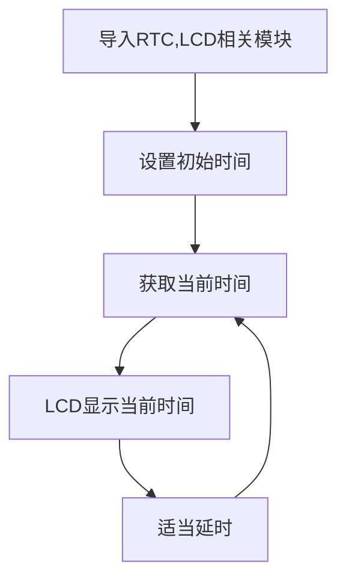
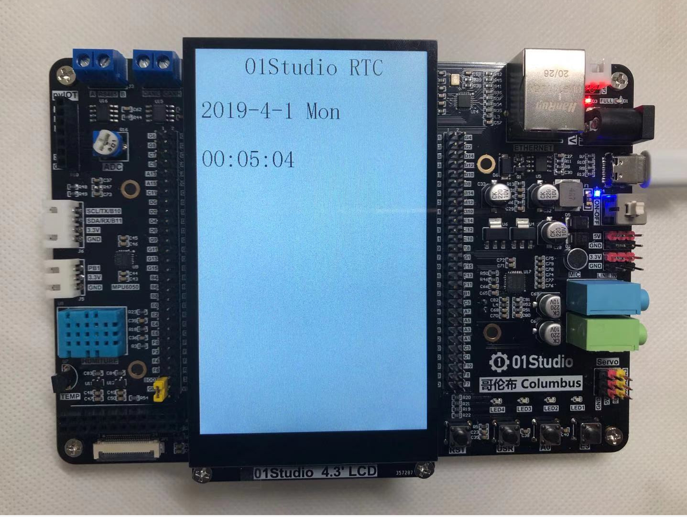
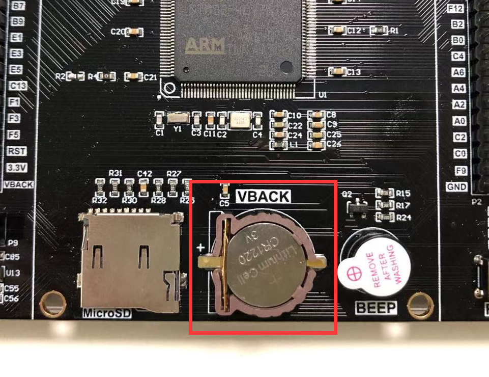

# RTC（实时时钟）

## 前言
时钟可以说我们日常最常用的东西了，手表、电脑、手机等等无时无刻不显示当前的时间。可以说每一个电子爱好者心中都希望拥有属于自己制作的一个电子时钟，接下来我们就用MicroPython开发板来制作一个属于自己的电子时钟。


## 实验平台
哥伦布MicroPython开发套件、4.3寸LCD显示屏（电容触摸）。


## 实验目的
学习RTC编程和制作电子时钟，使用LCD显示。

## 实验讲解

实验的原理是读取RTC数据。毫无疑问，强大的MicroPython已经集成了内置时钟函数模块。位于machine的RTC模块中，具体介绍如下：

## RTC对象

### 构造函数
```python
rtc = machine.RTC()
```
构建RTC对象，RTC对象位于machine模块下。

### 使用方法
```python
rtc.datetime((2025, 1, 1, 0, 0, 0, 0, 0))
```
设置RTC日期和时间。(2025, 1, 1, 0, 0, 0, 0, 0)按顺序分别表示（年，月，日，星期，时，分，秒，微妙），其中星期使用0-6表示星期一到星期日。

<br></br>

```python
rtc.datetime()
```
获取当前RTC时间。返回元组：（年，月，日，星期，时，分，秒，微妙），其中星期使用0-6表示星期一到星期日。

更多用法请阅读官方文档：<br></br>
https://docs.micropython.org/en/latest/library/machine.RTC.html#machine-rtc

<br></br>

从上表可以看到RTC（）的使用方法，我们需要做的就是先设定时间，然后再获取当前芯片里的时间，通过OLED显示屏显示，如此循环。在循环里，如果一直获取日期时间数据会造成资源浪费，所以可以每隔第一段时间获取一次数据，又由于肉眼需要看到至少每秒刷新一次即可，这里每隔300ms获取一次数据，所以具体流程如下：

熟悉RTC使用方法后，我们通过代码实现首次上电如果检测到未设置时间可以先设置时间，然后周期打印获取的时间信息，代码编程流程图如下：




## 参考代码

```python
'''
实验名称：RTC实时时钟
版本：v1.0
平台：哥伦布开发板 + 4.3寸MCU屏（电容触摸）
作者：01Studio
说明：在LCD上显示时间
社区：www.01studio.cc
'''

#导入相关模块
import time
from machine import RTC
from tftlcd import LCD43M

#定义常用颜色
RED = (255,0,0)
GREEN = (0,255,0)
BLUE = (0,0,255)
BLACK = (0,0,0)
WHITE = (255,255,255)

########################
# 构建4.3寸LCD对象并初始化
########################
d = LCD43M(portrait=1) #默认方向
d.fill(WHITE)#填充白色

#初始化RTC
rtc = RTC()

# 定义星期和时间（时分秒）显示字符列表
week = ['Mon', 'Tues', 'Wed', 'Thur', 'Fri', 'Sat', 'Sun']
rtc_time = ['', '', '']

#显示标题
d.printStr('01Studio RTC', 100, 10, BLACK, size=4)


# 首次上电配置时间，按顺序分别是：年，月，日，星期，时，分，秒，次秒级；这里做#了一个简单的判断，检查到当前年份不对就修改当前时间，开发者可以根据自己实际情况来修改。
if rtc.datetime()[0] != 2025:
    rtc.datetime((2025, 1, 1, 3, 0, 0, 0, 0))
    
while True:

    datetime = rtc.datetime()  # 获取当前时间

    # 显示日期，字符串可以直接用“+”来连接
    d.printStr(str(datetime[0]) + '-' + str(datetime[1]) + '-' + str(datetime[2]) + ' ' + week[(datetime[3] - 1)], 10, 100, BLACK, size=4)

    # 显示时间需要判断时、分、秒的值否小于10，如果小于10，则在显示前面补“0”以到较佳的显示效果
    for i in range(4, 7):
        if datetime[i] < 10:
            rtc_time[i - 4] = "0"
        else:
            rtc_time[i - 4] = ""

    # 显示时间
    d.printStr(rtc_time[0] + str(datetime[4]) + ':' + rtc_time[1] + str(datetime[5]) + ':' + rtc_time[2] + str(datetime[6]), 10, 200, BLACK, size=4)
    time.sleep_ms(300) #延时500ms
```

## 实验结果

在Thonny IDE运行代码，可以看到LCD屏显示当前RTC时间信息。



细心的用户或者会发现开发板的右下方有个小的纽扣电池，这个小电池的作用是后备电池，装上后开发板断电后时钟会继续跑，重新上电后时间是最新的。如果没有这电池，那么开发板断电后时钟无法继续运行。



RTC实时时钟的可玩性很强，我们还可以根据自己的风格来设定数字显示位置，以及加上一些属于自己的字符标识。打造自己的电子时钟。
