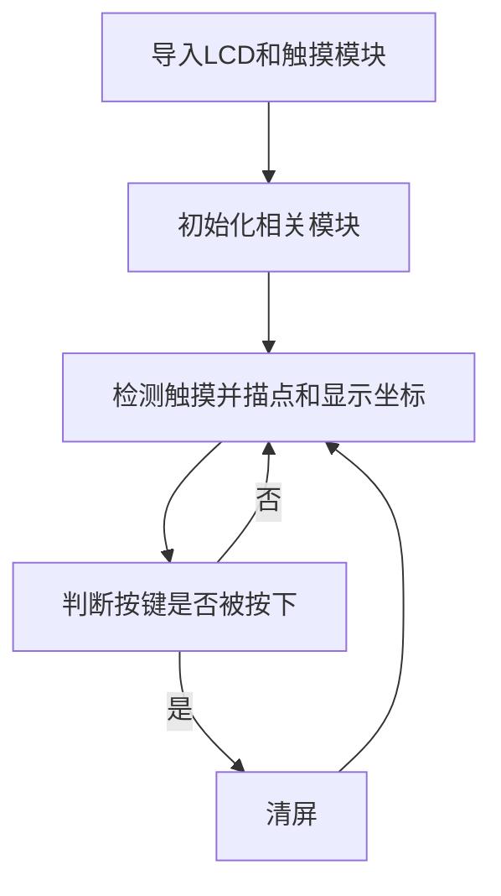

# 电容触摸屏

## 前言
上一节我们学习了LCD实验，但LCD只能显示相关内容，跟人是缺乏交互的。好比我们的智能手机，如果只有显示不能触碰，那么就没有可玩性了。因此本节学习一下3.2寸LCD的电阻触摸屏使用方法。

## 实验平台
哥伦布MicroPython开发套件、4.3寸LCD显示屏（电容触摸）。


## 实验目的
获取电容触摸屏的坐标并画点标记。

## 实验讲解

01Studio哥伦布开发板配套的4.3寸LCD上带1个电容触摸屏。当手指按下时候，通过简单的编程即可返回一个坐标，我们来看看其micropython构造函数和使用方法：

## XPT2046对象

### 构造函数
```python
touch.GT1151(portrait=1)
```
构建触摸屏对象。GT1151表示驱动芯片型号。

- `portrait` ：屏幕显示方向：
    - `1`: 480*800 ，默认
    - `2`: 横屏，800*480 ，1基础上顺时针旋转90° 
    - `3`: 竖屏，480*800 ，1基础上顺时针旋转180°
    - `4`: 横屏，800*480 ，1基础上顺时针旋转270°


### 使用方法

```python
GT1151.tick_inc()
```
手动刷新触摸，每次读取数据前必须执行该函数。

<br></br>

```python
GT1151.read()
```
读取触摸屏数据，返回（states,x,y）
- `states`: 当前触摸状态：0：按下；1：移动；2：松开。；
- `x`: 触摸点横坐标；
- `y`: 触摸点纵坐标；

<br></br>

更多用法请阅读官方文档：<br></br>
https://docs.01studio.cc/library/touch/touch.GT1151.html
<br></br>

学会了触摸对象用法后，我们可以编程实现触摸后屏幕打点表示，然后左上角显示当前触摸的坐标。另外再加入一个按键，按下清空屏幕。编程流程图如下：




## 参考代码

```python
'''
实验名称：电容触摸屏
版本：v1.0
平台：哥伦布开发板 + 4.3寸MCU屏（电容触摸）
作者：01Studio
说明：电容触摸屏采集触摸信息
'''

#当如相关模块
from touch import GT1151
from tftlcd import LCD43M
from pyb import Switch
import time

#定义颜色
BLACK = (0,0,0)
WHITE = (255,255,255)
RED=(255,0,0)

#LCD初始化
d = LCD43M(portrait=1)
d.fill(WHITE)#填充白色

#电容触摸屏初始化，方向和LCD一致
t = GT1151(portrait=1)

#USR按键初始化
sw = Switch()                       #定义按键对象名字为sw
sw.callback(lambda:d.fill(WHITE))   #当按键被按下时，LCD清屏白色

while True:

    data = t.read() #获取触摸屏坐标
    print(data) #REPL打印

    #当产生触摸时
    if data[0]!=2: #0：按下； 1：移动； 2：松开

        #触摸坐标画圆
        d.drawCircle(data[1], data[2], 10, BLACK, fillcolor=BLACK)
        d.printStr('(X:'+str('%03d'%data[1])+' Y:'+str('%03d'%data[2])+')',10,10,RED,size=3)

    time.sleep_ms(10) #触摸响应间隔
```

## 实验结果

运行程序，用手指触摸屏幕或者在屏幕上滑动，可以看到描点并在LCD左上角显示当前坐标。

:::tip 提示
3.2寸显示屏配套的是电阻屏，需要使用支架或笔尖等硬物进行触摸。跟手机电容屏不一样。
:::

- 进入触摸校准，依次点击十字中心点


按下USR按键清空屏幕内容：


没有触摸屏的LCD就失去了灵魂，有了触摸屏，跟开发板的交互就变得有意思了。