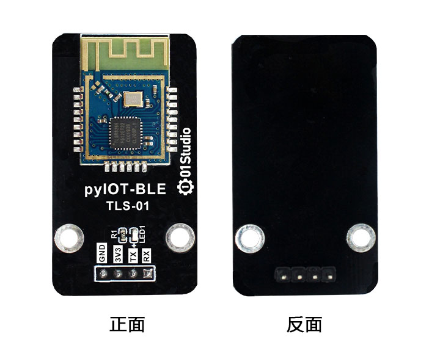
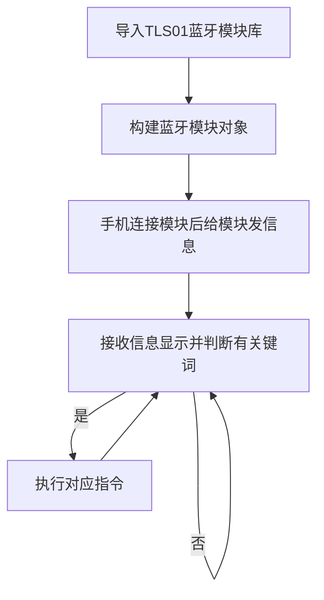
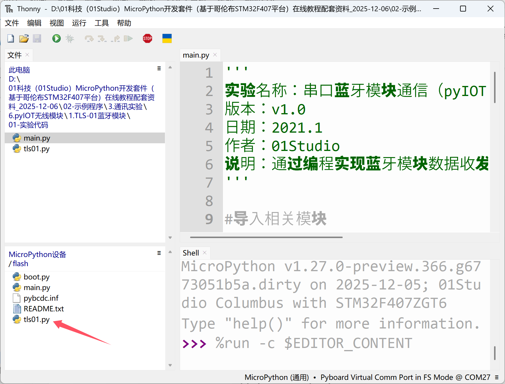
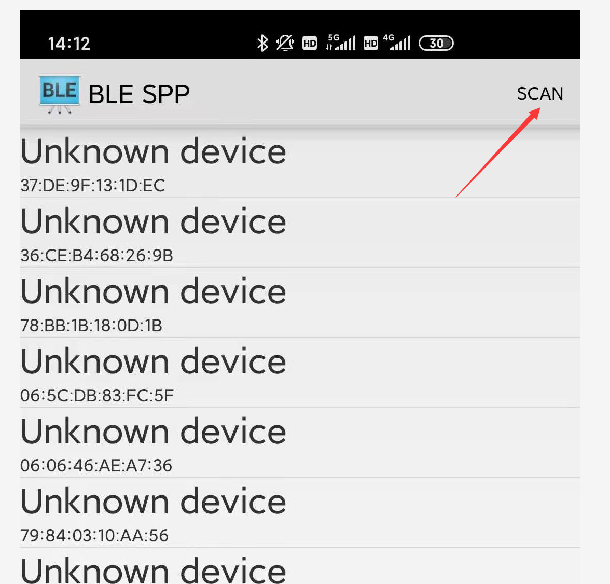
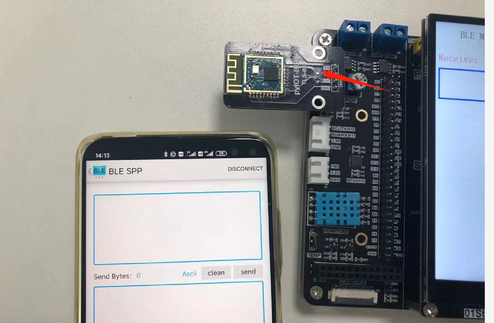
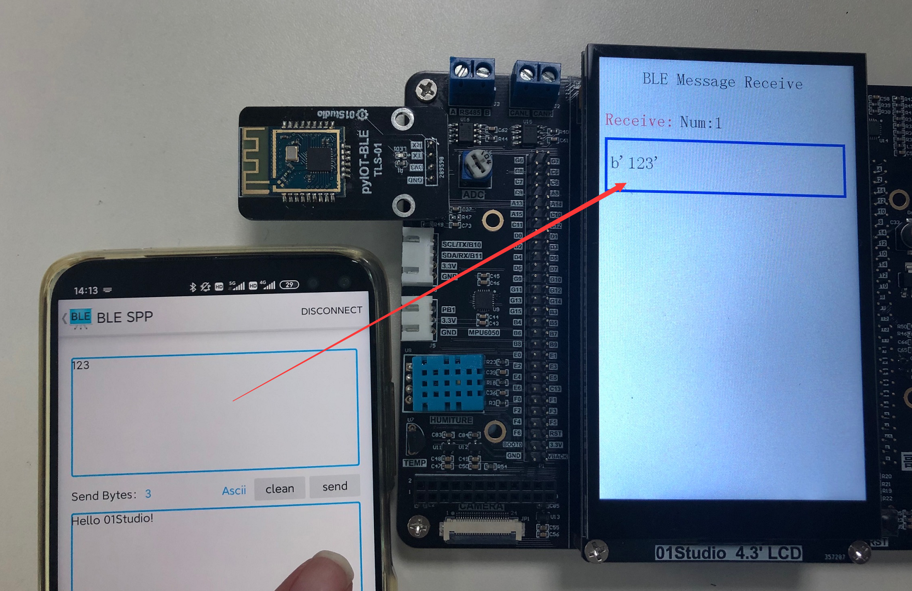
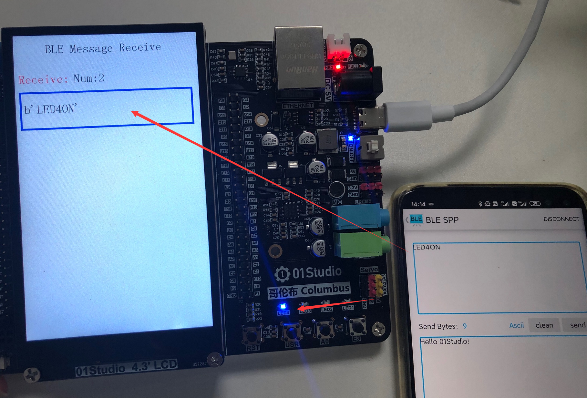

# 蓝牙模块

## 前言
低功耗蓝牙透传模块日常生活使用非常多，例如手环，通过手机可以快速实现蓝牙无线连接。从而控制硬件设备。

## 实验平台

哥伦布MicroPython开发套件和pyIOT-TSL01蓝牙透传模块。


## 实验目的
通过手机软件蓝牙连接模块，跟开发板进行通讯，LCD显示接收到的字符。并识别特定字符，点亮LED。

## 实验讲解

pyIOT-TLS01是基于WeBee TLS-01串口蓝牙透传模块，产品参数如下： [**点击购买>>**](https://item.taobao.com/item.htm?id=623491968946)



|  产品参数 |
|  :---:  |  --- |
| 蓝牙主控  | TLSR8266 |
| 控制方式  | UART(串口) |
| 蓝牙版本  | BLE4.0 (从机) |
| 功耗  | 工作电流：<8.8mA, 广播电流：<1mA |
| 引脚  | GND, 3.3V, TX, RX |
| 模块尺寸  | 4.5*2.5cm |

01Studio已经封装好了对应的python库，用户可以使用python编程直接使用基本的蓝牙功能。下面是TLS01库函数说明：

## TLS01对象

### 构造函数
```python
tls01.TLS01(uart, baud_rate=9600)
```
创建TLS01蓝牙模块对象。
- `uart` 串口编号
- `baud_rate` 波特率，默认是9600


### 使用方法
```python
TLS01.Name_Check()
```
查看蓝牙广播名称，返回字符。

<br></br>

```python
TLS01.BI_Check()
```
查看蓝牙模块广播间隔，返回类型：int

<br></br>

```python
TLS01.Baudrate_Check()
```
返回波特率

<br></br>

```python
TLS01.Name_Set(name)
```
设置模块广播名称;
- `name` 广播名字，字符类型，如：01Studio

<br></br>

```python
TLS01.BI_Set(BI)
```
设置蓝牙广播间隔;
- `BI` 蓝牙广播间隔，间隔越短，手机搜索到设备越快。例：100表示100ms

<br></br>

```python
TLS01.Baudrate_Set(Baudrate)
```
设置模块串口波特率;
- `Baudrate` 波特率值，例：9600，115200

<br></br>

```python
TLS01.RST()
```
复位模块。

<br></br>

```python
TLS01.RESET()
```
重置模块，恢复出厂设置。

<br></br>

蓝牙串口模块的使用已经很简单了，让我们不用去考虑蓝牙协议栈的事情，现在在这个基础上再使用micropython封装相关库，就变得更易用了，编程流程如下：



## 参考代码

```python
'''
实验名称：串口蓝牙模块通信（pyIOT-BLE TLS01蓝牙串口模块 by WeBee）
版本：v1.0
平台：哥伦布开发板
作者：01Studio
说明：通过编程实现蓝牙模块数据收发，并执行关键词指令，点亮LED
'''

#导入相关模块
from tls01 import TLS01
from pyb import LED
from tftlcd import LCD43M
import time

#定义常用颜色
RED = (255,0,0)
GREEN = (0,255,0)
BLUE = (0,0,255)
BLACK = (0,0,0)

########################
# 构建4.3寸LCD对象并初始化
########################
d = LCD43M(portrait=1) #默认方向

#画接收框
d.fill((255,255,255))
d.printStr('BLE Message Receive', 80, 20, BLACK, size=3)
d.printStr('Receive:', 10, 100, RED, size=3)
d.drawRect(10, 150, 450, 100, BLUE, border=5) #画矩形

#构建蓝牙模块对象（串口）
BLE=TLS01(3,9600) #设置串口号3和波特率,TX--Y9,RX--Y10

###############信息透传################
BLE.uart.write('Hello 01Studio!')#给手机发送一条数据

num = 0 #接收计数

#接收信息
while True:

    if BLE.uart.any(): #查询是否有信息

        text = BLE.uart.read(128) #默认单次最多接收128字节'''
        print(text)

        #接收数据LCD显示
        num =num +1
        d.printStr('Num:'+str(num), 150, 100, BLACK, size=3)
        d.printStr(str(text), 20, 180, BLACK, size=3)


        #判断关键词指令，打开或关闭LED4蓝灯
        if text == b'LED4ON':
            LED(4).on()

        if text == b'LED4OFF':
            LED(4).off()

```

## 实验结果

实验需要安装蓝牙模块配套的APP，目前仅支持安卓系统。应用位于***开发套件配套资料\02-示例程序\3.通讯实验\6.pyIOT无线模块\1.TLS-01蓝牙模块\02-手机APP**下的安卓应用BLE SPS.apk


将蓝牙模块插到哥伦布pyIOT接口：注意排针跟接口对应。


上电连接开发板，将示例代码中的`tls01.py`文件上传到开发板文件系统：



运行代码，打开安卓APP，点击右上角scan扫描周边蓝牙设备。



搜索出名字为BLE SPS时候，点击进入，自动连接蓝牙模块：


连接成功后模块的蓝色LED熄灭，表示蓝牙连接成功。



连接成功后可以相互收发数据：



发送“LED4ON”和“LED4OFF”关键词，分别点亮和关闭LED4蓝灯。



蓝牙串口透传模块的使用已经非常简单，赋予micropython库后使用起来则更为方便，其本质是对串口指令的封装，有兴趣用户可以查看源代码，结合模块手册为模块增加更多的库函数功能。