# 硬件详细介绍

## 主控

哥伦布开发板的主控为STM32F407ZGT6, 该芯片具备1MB flash和196k SRAM，168MHZ主频。144个引脚。

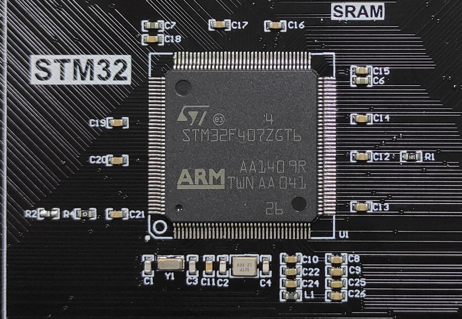

## 内存SRAM

STM32F407系列MCU的内存只有196k，因此并不能适用很多对内存要求较高的应用，哥伦布板载了1M字节的SRAM，用于提升主控的内存以应对更复杂的程序代码。

## FLASH

STM32F407芯片带了1M字节的Flash，但空间非常有限，因此我们增加了16字节的Flash，相当于拥有1个16M的U盘来存放代码和图片音视频等文件。

## EEPROM

板载256K字节的存储芯片AT24C02。

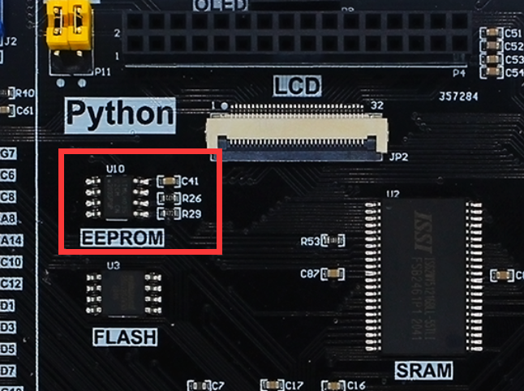

## LED

4路LED灯。

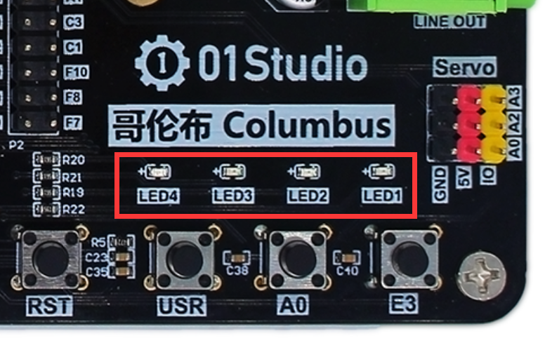

## 按键

1个复位按键和3个功能按键。

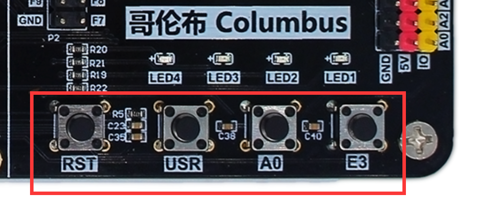

## 温度传感器DS18B20

温度传感器DS18B20在左下角。

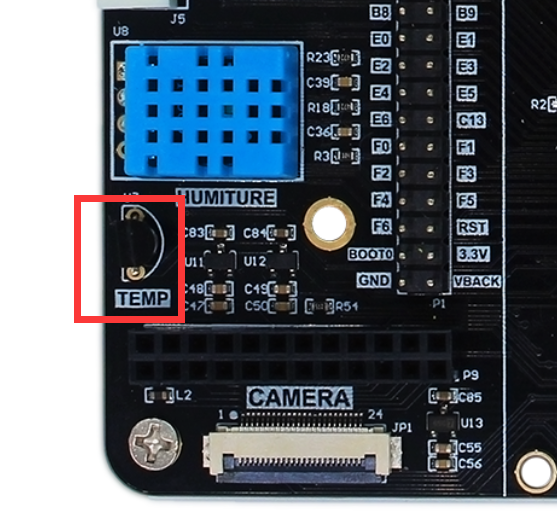

## 温湿度传感器DHT11

左下角蓝色的传感器是温湿度传感器DTH11。

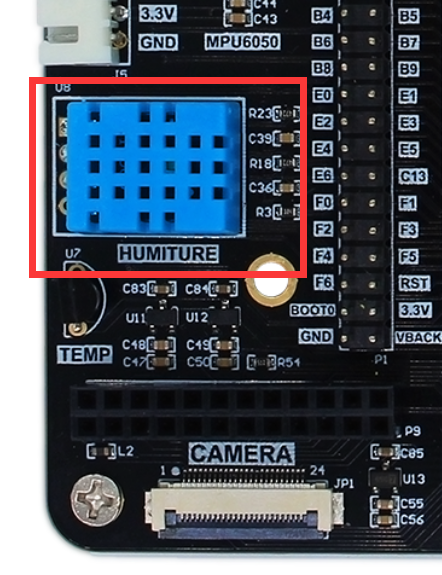

## 陀螺仪MPU6050

板载六轴加速度传感器MPU6050，可以实现三轴加速度和三轴角速度数据的测量。

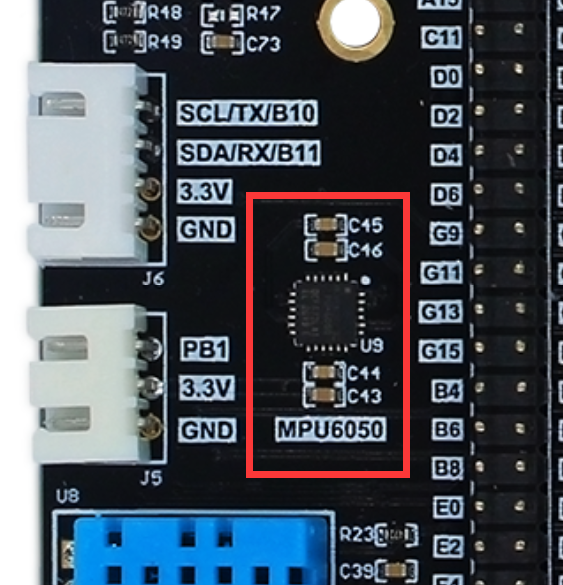

## 电位器

通过调节可调电阻可输出不同电压值，用于ADC（模拟数字转换）实验。

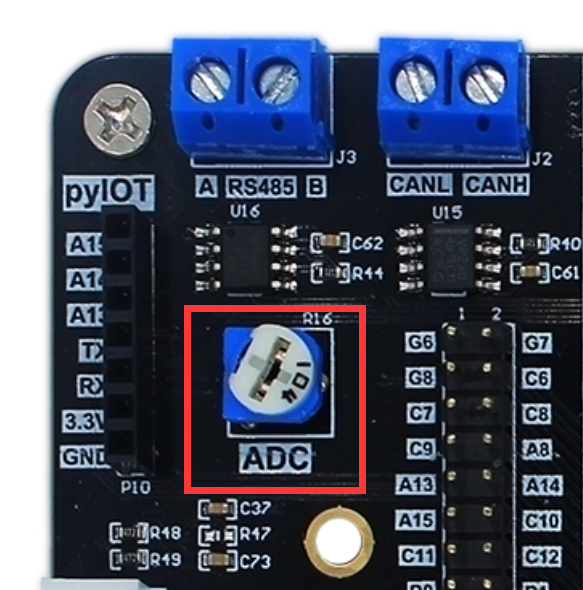

## 有源蜂鸣器

有源蜂鸣器用于发出滴滴声音。

## 纽扣电池座

用于RTC实时时钟断电后继续运行。型号为CR1220

## SD卡槽

伦布可以通过microSD卡获取大容量存储空间，最大支持32G。

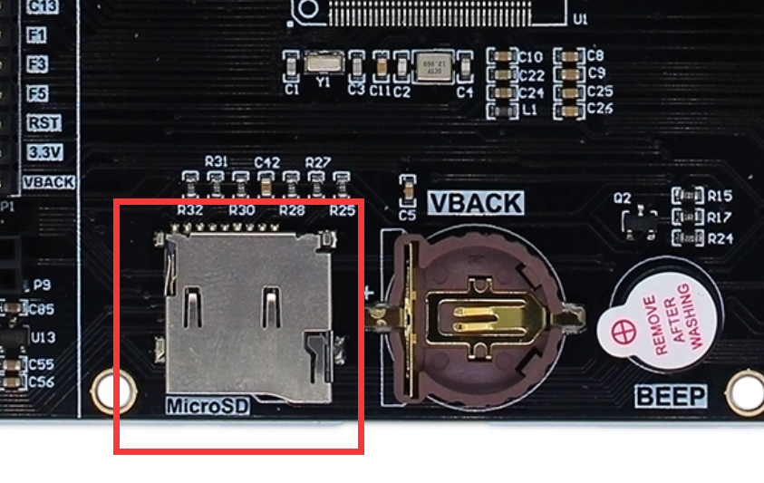

## 以太网

百兆以太网接口。

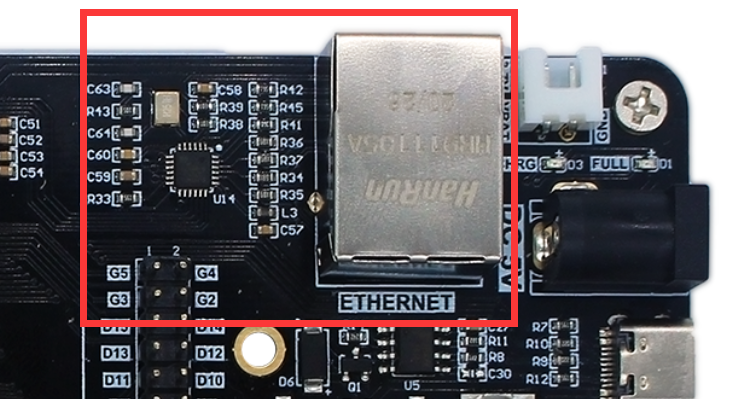

## 音频（带喇叭）

哥伦布开发板带有音频芯片，支持麦克风和线性输入，音频输出以及1个8欧/1W带音腔的喇叭。

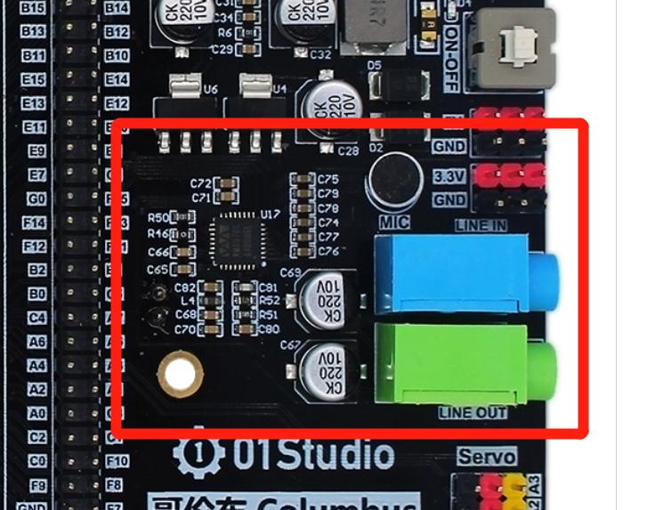

- 喇叭位于开发板后方

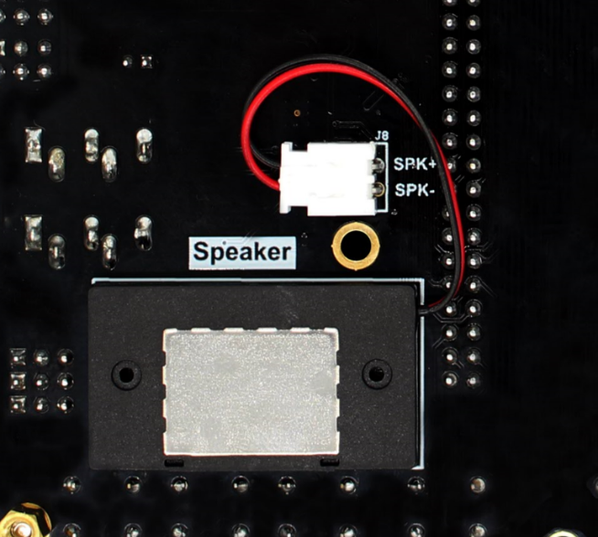

## RS485

哥伦布提供1路RS485通讯接口。位于开发板左上方。

## CAN总线

哥伦布提供1路CAN通讯接口。位于开发板左上方，提供CAN电平转换电路，可以直接外接CAN总线通讯。需要将跳线帽打到中间和下方以连接CAN转换芯片和主控的IO。

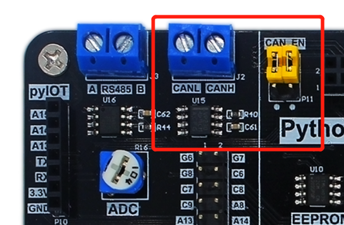

## pyIOT接口

pyIOT为01Studio IOT/无线串口通讯模块专用接口，可以外接01Studio的蓝牙、GPS、LORA等串口透传模块。

## 3P 传感器扩展接口

用于连接单GPIO、单总线、ADC的传感器。

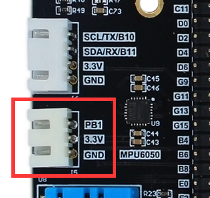

## 4P I2C/UART扩展接口

用于I2C、UART扩展接口。

## 摄像头接口

哥伦布板载DCMI摄像头接口，可以使用01Studio摄像头模块实现拍摄功能，支持排针和FPC排线连接。默认连接01Studio OV2640摄像头。

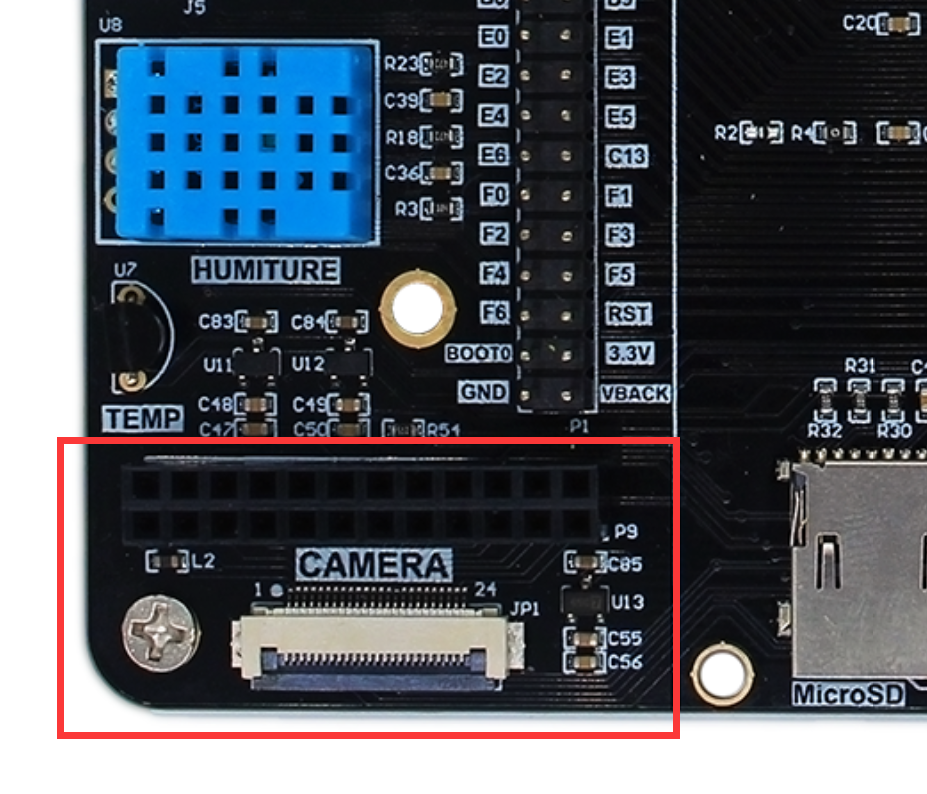

## 显示屏接口

哥伦布开发板板载LCD接口，可支持16位的MCU显示屏（带触控）。默认使用01Studio 4.3寸MCU LCD（带电容触摸）。

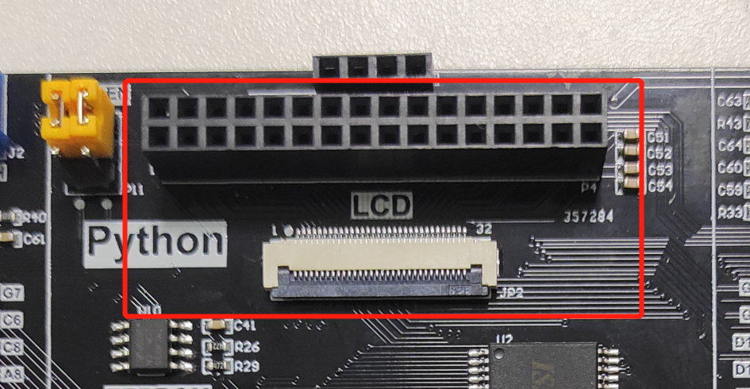

## 舵机接口

3路舵机接口。

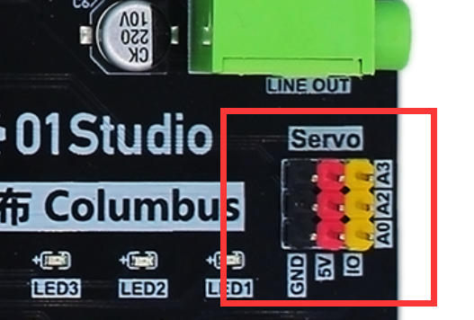

## TYPE-C接口

使用TYPE-C数据线进行开发。支持供电、烧录固件、U盘拷贝程序、REPL调试。

## 电源

可以使用TYPE-C供电，如接了较大电流外设，可以使用5V开关电源一起电源供电以确保足够的电流。

