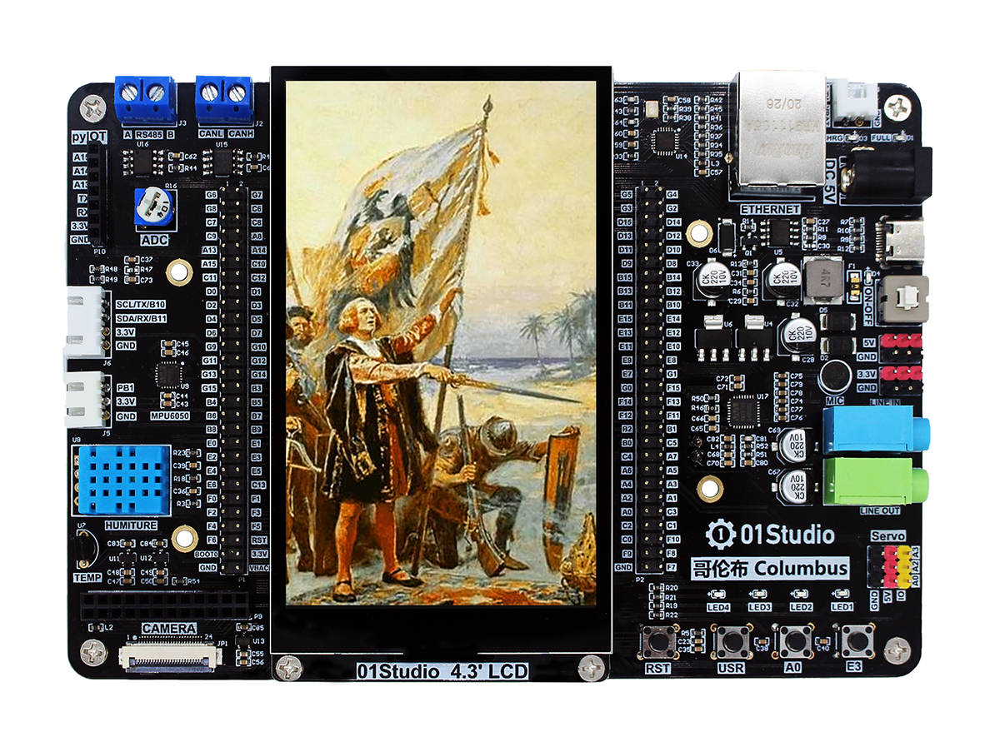
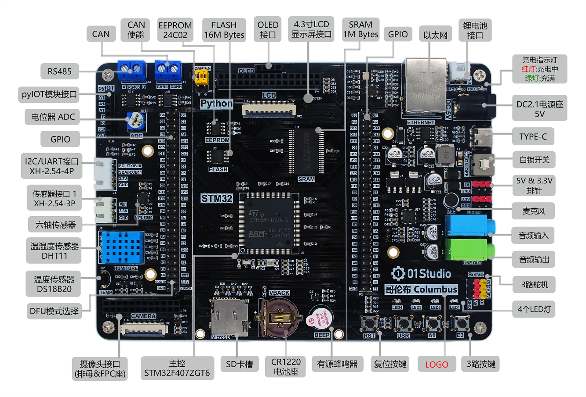
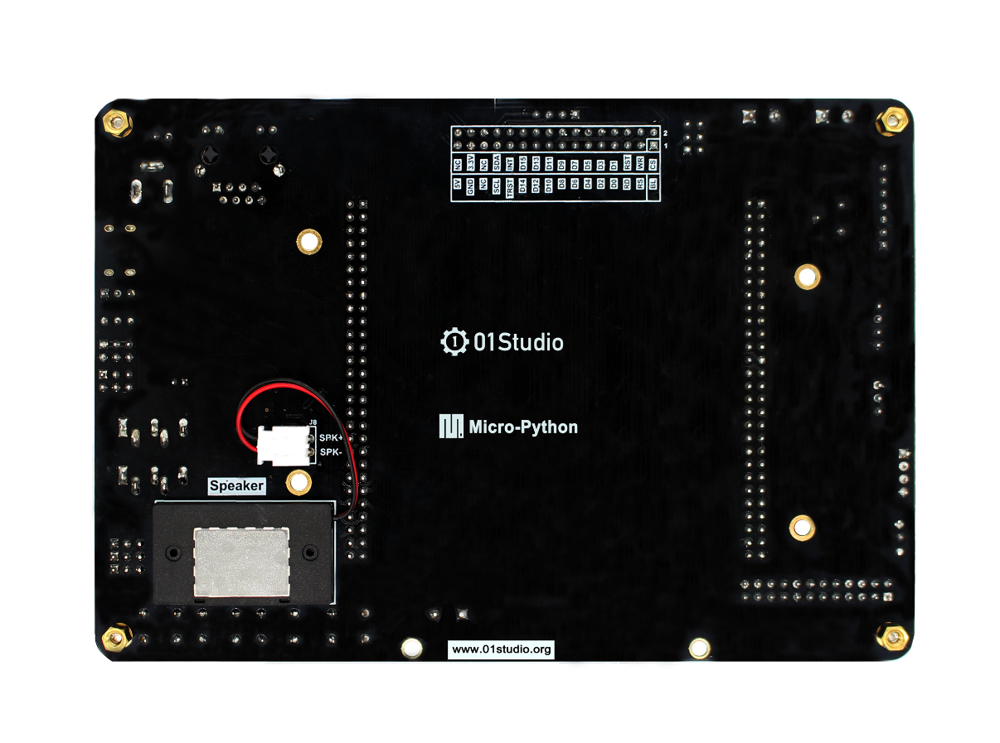
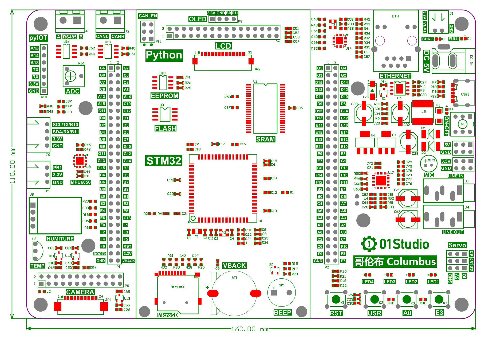
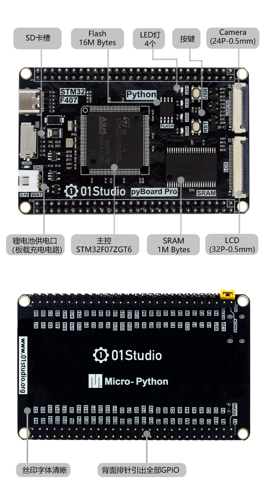
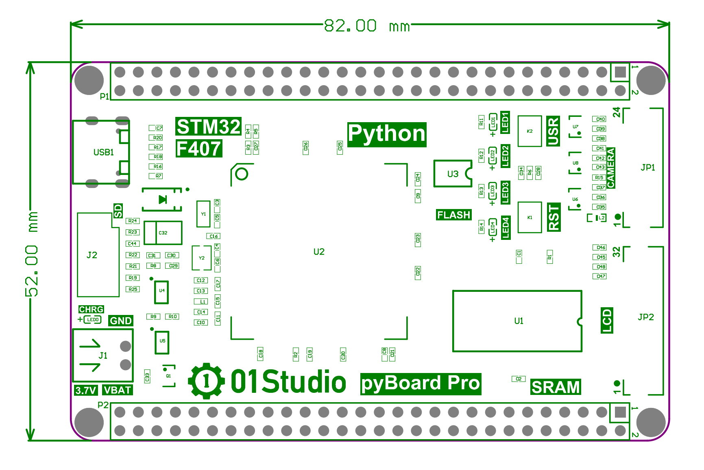

# 产品参数

## 哥伦布开发板

哥伦布开发板基于STM32平台，主控芯片使用STM32F407ZGT6。通过01Studio MicroPython固件能使用Python编程轻松玩转所有资源。

[**点击购买>>**](https://item.taobao.com/item.htm?id=635660548188)

### 硬件资源

### 详细参数

|  产品参数 |
|  :---:  | ---  |
| 主控 | STM32F407ZGT6 / ARM 32-bit Cortex-M4 @ 168MHz / 内部FLASH: 1M Bytes, 内部RAM: 192K Bytes |
| 存储 | **外部SRAM**: 1M Bytes |
|      | **外部Flash**: 16M Bytes |
|      | **EEPROM**: AT24C02, 256 Bytes |
|      | **SDIO**: MicroSD卡插槽，最大支持128GB |
| 传感器 | **温度传感器**: DS18B20 |
|      | **温湿度传感器**: DHT11 |
|      | **六轴传感器**: MPU6050 (3轴加速度+3轴陀螺仪) |
|      | **传感器外接**: 3P防呆接口 |
| 输入/输出 | **LED**: 4个 |
|      | **按键**: 4个 （1个复位按键+3个功能按键） |
|      | **电位器**: ADC输入 |
|      | **蜂鸣器**：有源蜂鸣器  |
|      | **OLED显示屏接口**：I2C接口  |
|      | **4.3寸显示屏（电容触摸）接口**：MUC屏，支持排线延长  |
| 多媒体 | **LED**: 4个 |
|      | **按键**: 4个 （1个复位按键+3个功能按键） |
|      | **电位器**: ADC输入 |
|      | **蜂鸣器**：有源蜂鸣器  |
|      | **OLED显示屏接口**：I2C接口  |
|      | **4.3寸显示屏（电容触摸）接口**：MUC屏，支持排线延长  |
| 通讯 | **USB**: TYPE-C接口（供电、烧写、UART、REPL调试多合一） |
|      | **百兆以太网接口** |
|      | **CAN接口**|
|      | **RS485接口**：有源蜂鸣器  |
|      | **pyIOT**：无线模块接口 |
|      | **UART/I2C**：4P防呆接口  |
| 其它 | **舵机接口**: 3路 （SG90小电流舵机） |
|      | **引出所有GPIO**：标准2.54mm排针 |
| 电源 | **USB(TYPE-C)供电**: 5V |
|      | **电源适配器**：DC2.1 / 5V |
|      | **锂电池供电**：3.6~4.2V （板载锂电池充电电路） |
|      | **RTC后备电池**：CR1220 |
|      | **排针供电**：5V |

|  外观规格 |
|  :---:  | ---  |
| 尺寸  | 160 x 110mm  (长宽为PCB尺寸) |

### 尺寸图

## 哥伦布核心板

哥伦布核心吧保留了哥伦布开发板最小系统电路，固件通用，体积小巧，引出全部IO，方便DIY。[**点击购买>>**](https://item.taobao.com/item.htm?id=640277845276)

### 硬件资源

### 引脚图

### 尺寸图

