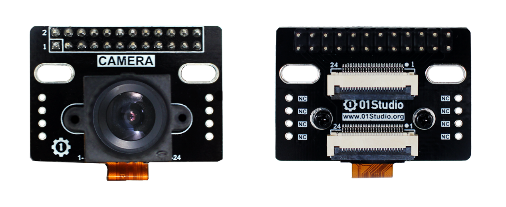
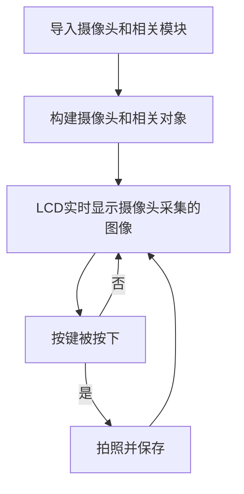
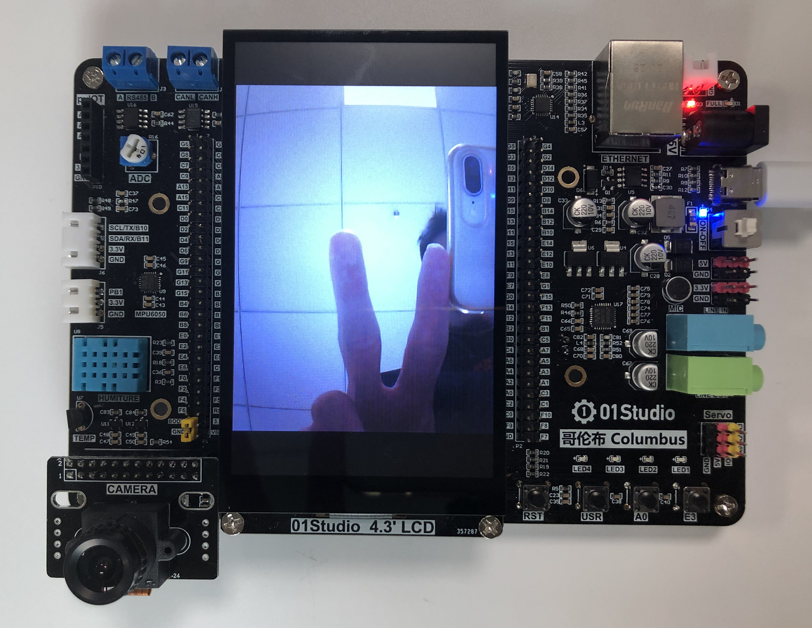
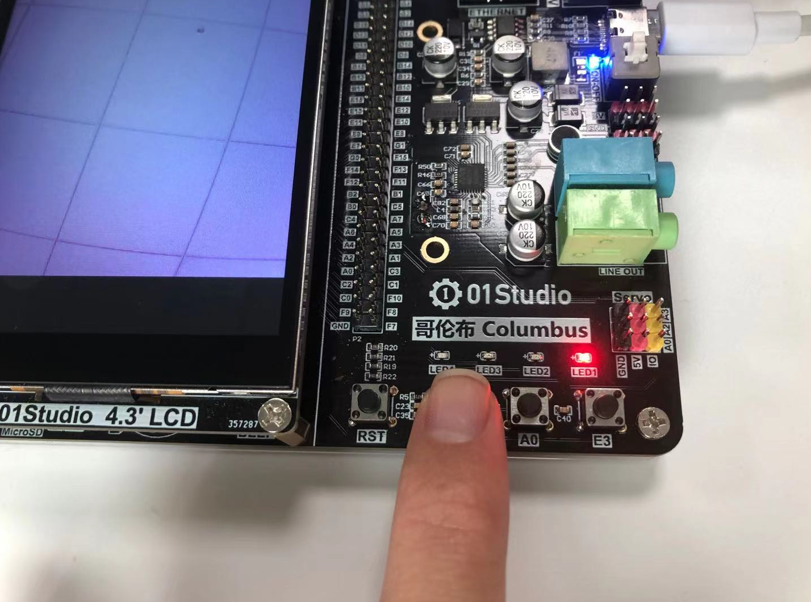

# 摄像头

## 前言
生活中充满着形形式式的摄像头，其被广泛应用在各行业，如照相机、手机相机、安防监控等。使用摄像头可以拍照，记录美好瞬间。

## 实验平台
哥伦布开发套件。01Studio STM32摄像头模块。


## 实验目的
编写实现OV2640摄像头拍摄图片。

## 实验讲解

本例程实验的摄像头感光芯片为常用的OV2640，200万像素摄像头，最大支持1600*1200像素分辨率拍摄。[**点击购买>>**](https://item.taobao.com/item.htm?id=636667911064)

参数如下：



|  模块参数 |
|  :---:  | ---  |
| 感光芯片  | OV2640 |
| 控制方式  | SCCB |
| 接口定义  | 24P 2.5mm排针 / 24P-0.5mm fpc座 |
| 像素  | 最高1600*1200（200万） |
| 模块尺寸  | 3.8 * 2.7mm |

01Studio已经将OV2640相关功能封装成MicroPython库，用户直接使用即可，OV2640对象如下：

## OV2640对象

### 构造函数
```python
sensor.OV2640()
```
构建OV2640对象。

### 使用方法
```python
OV2640.reset()
```
OV2640摄像头模块初始化。

<br></br>

```python
OV2640.set_framesize(framesize)
```
设置摄像头拍摄的尺寸。

- `framesize` 帧尺寸大小,默认尺寸为 **sensor.VGA – 640*480**。

    - `sensor.QQQVGA` - 80x60；
    - `sensor.QQVGA` - 160x120；
    - `sensor.QVGA` - 320x240；
    - `sensor.VGA` - 640x480；
    - `sensor.WVGA` - 720x480；
    - `sensor.XGA` - 1024x768；
    - `sensor.UXGA` - 1600x1200；

<br></br>

```python
OV2640.set_vflip(value=0)
```
设置垂直翻转； 
- `value`: 设置值。
    - `1`:-开启；
    - `0`:-关闭。

<br></br>

```python
OV2640.set_hmirror(value=0)
```
设置水平镜像； 
- `value`: 设置值。
    - `1`:-开启；
    - `0`:-关闭。

<br></br>

```python
OV2640.snapshot(filename)
```
拍摄照片并保存。最大支持 **sensor.VGA – 640*480**
- `filename`: 路径+名称，如 '/flash/test.jpg'

<br></br>

```python
OV2640.display()
```
LCD实时显示摄像头图像；

<br></br>

```python
OV2640.display_stop()
```
关闭摄像头LCD实时显示。

<br></br>

更多用法请阅读官方文档：<br></br>
https://docs.01studio.cc/library/sensor/sensor.html#ov2640

从上表可以看到，除了拍摄外，还支持图像在LCD实时显示。我们可以编写实现开发板上电后LCD实时显示摄像头采集图像，通过按键来拍照并保存到文件系统。编程思路如下：




## 参考代码

```python
'''
实验名称：拍照并保存
版本：v1.0
平台：哥伦布开发板
作者：01Studio
说明：编程实现录拍摄图片并保存。
'''

from pyb import Switch
import sensor,time
import tftlcd

########################
# 构建4.3寸LCD对象并初始化
########################
d = tftlcd.LCD43M(portrait=1) #默认方向，目前只支持1个方向。

#摄像头初始化
cam = sensor.OV2640()
cam.reset()
cam.set_framesize(sensor.VGA) #640*480分辨率
cam.display() #LCD显示

num=0 #用于命名图片
cam_flag = 0 #拍照标志位

##############################
#      USR按键  拍照并保存
##############################
def fun():
    global cam_flag
    cam_flag = 1

#USR按键初始化
sw = Switch()
sw.callback(fun)

while True:

    #收到拍照命令
    if cam_flag == 1:

        #拍照并保存图片
        cam.snapshot("/flash/"+str(num)+".jpg")

        num=num+1  #照片名称
        cam_flag=0 #清空标志位
```

## 实验结果

运行代码，可以看到LCD实时显示摄像头采集数据。



按下USR键，可以看到红灯亮，表示正在保存拍摄的图片到文件系统。



等待红灯灭后按下RST键复位开发板，可以看到刚刚拍摄的照片。文件为JPG格式。


本节实现了micropython的摄像头模块实现了拍照和图像采集显示。配合按键打造了一个简易的照相机。Ov2640受光线影响比较大，拍摄时候需要保证光线充足。

