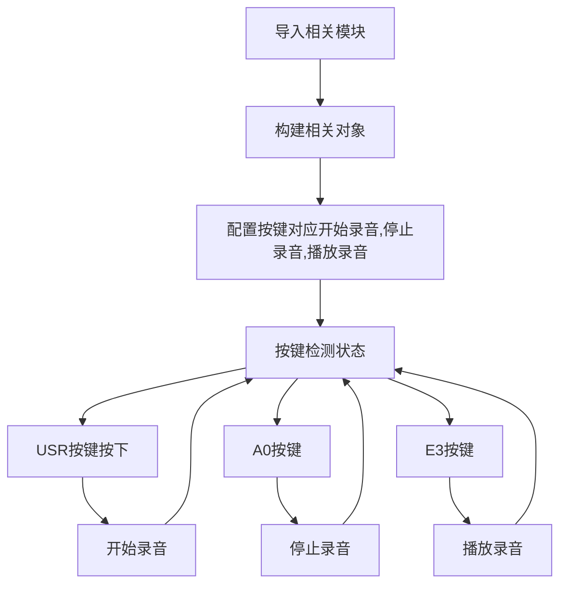
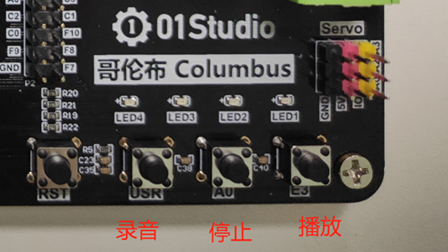
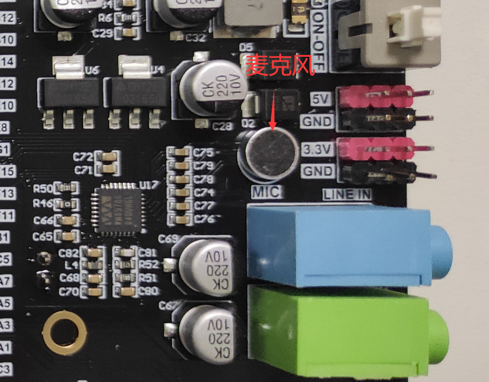

# 录音

## 前言
上一节我们学习了音频文件播放，而哥伦布上的音频驱动芯片还支持录音功能，且开发板已经集成了麦克风和线性输入接口，也就是说我们可以通过麦克风录音或标准3.5MM耳机线将音频信号传输给开发板录制。

## 实验平台
哥伦布开发套件。


## 实验目的
编程实现语音录制和播放。

## 实验讲解

本节主要是编程实现录音后播放，WM8978的音频播放功能上一节已经讲解，本节不再重复，我们来看看音频芯片的录音对象模块：

## WM8978对象

### 构造函数
```python
wm = audio.WM8978()
```
构建音频对象。

### 使用方法
```python
WM8978.record(filename,db=80)
```
录音，麦克风增益默认80，格式：wav
- `filename`: 路径+名称，如：WM8978.load('/flash/test.wav')
- `db`:麦克风增益

<br></br>

```python
WM8978.record_stop()
```
停止录音并保存文件。

<br></br>

更多用法请阅读官方文档：<br></br>
https://docs.01studio.cc/library/columbus/audio.html

录音的对象非常简单，只需要设置文件名和录音增益（可以理解成是录音大小），停止录制后将自动保存文件，我们可以通过3个按键来实现控制录音、停止录音、播放录音3个功能，编程思路如下：




## 参考代码

```python
'''
实验名称：录音
版本：v1.0
平台：哥伦布开发板
作者：01Studio
说明：编程实现录音和播放。
'''

#导入相关模块
import audio,time
from pyb import Switch,LED
from machine import Pin

#构建语音模块对象
wm=audio.WM8978()

record_flag = 0 #录音标志位

######################
# 开始录音 USR按键
######################
def rec_begin():
    global record_flag
    record_flag = 1

sw =Switch()
sw.callback(rec_begin)

######################
# 停止录音 A0按键
######################
KEY_A = Pin('A0',Pin.IN,Pin.PULL_UP) #构建按键A0

def rec_stop(KEY_A):
    global record_flag
    #消除按键抖动
    if KEY_A.value() == 0:
        time.sleep_ms(5)
        if KEY_A.value() == 0:

            record_flag = 2

KEY_A.irq(rec_stop,Pin.IRQ_FALLING) #定义中断，下降沿触发

######################
# 音量减 E3按键
######################

KEY_E = Pin('E3',Pin.IN,Pin.PULL_UP) #构建按键A0

def rec_play(KEY_E):

    global record_flag

    #消除按键抖动
    if KEY_E.value() == 0:
        time.sleep_ms(10)
        if KEY_E.value() == 0:

            record_flag = 3

KEY_E.irq(rec_play,Pin.IRQ_FALLING) #定义中断，下降沿触发


while True:

    #开始录音
    if record_flag == 1:
        wm.record("/flash/test.wav",db=80)
        LED(3).on() #开始录音
        record_flag = 0

    #停止录音
    if record_flag == 2:
        wm.record_stop()
        LED(4).on() #结束录音
        record_flag = 0

    #播放录音，录音完成后按RST复位开发板才有效
    if record_flag == 3:
        #加载录音
        wm.load('/flash/test.wav')
        wm.play()
        record_flag = 0
```

## 实验结果

运行程序，按USR按键开始录音(黄灯亮)，按A0键表示录完完成停止录制（蓝灯亮）。



- 对着麦克风说话



也可以通过线性输入音频口输入音频，使用3.5mm音频线，一端接手机播放音乐，另一端接开发板的Line_IN（蓝色音频座）。开发板默认支持麦克风和线性音频同时输入。


**红灯亮表示正在写flash（保存录音），待红灯熄灭后按RST键复位。**复位后IDE重新连接开发板，可以看到文件系统多了`test.wav`文件。


再次运行程序，这时候按下播放键E3，可以听到刚刚的录音。


