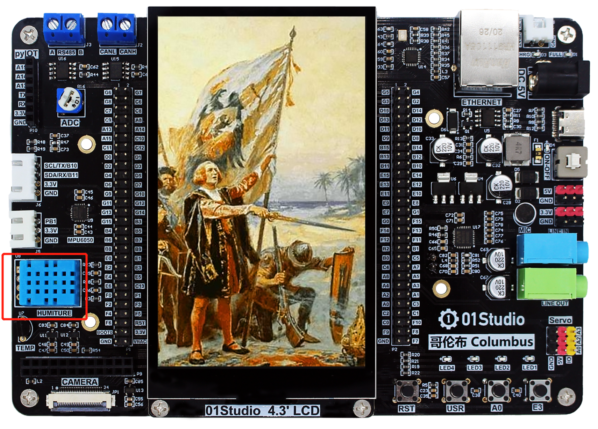
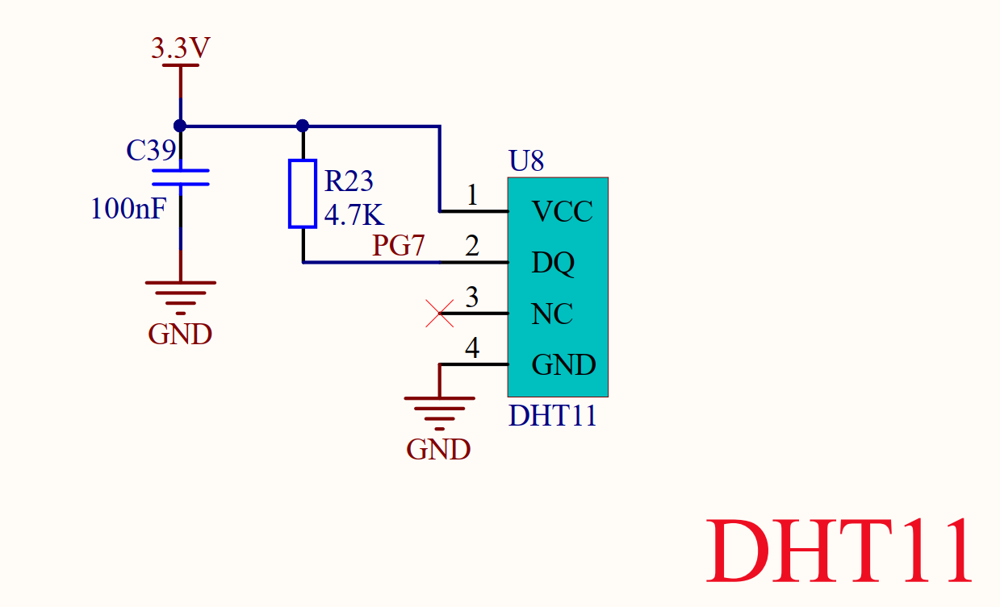
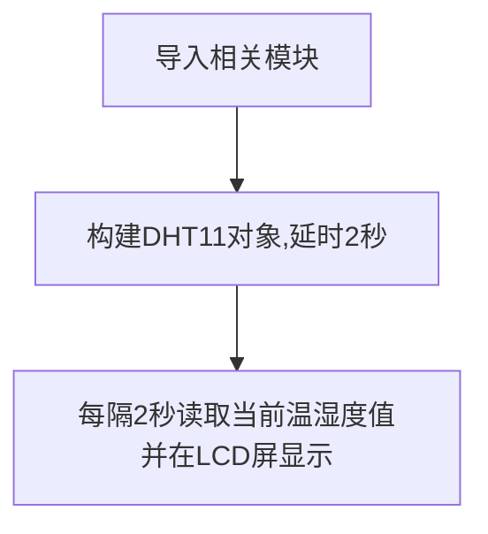
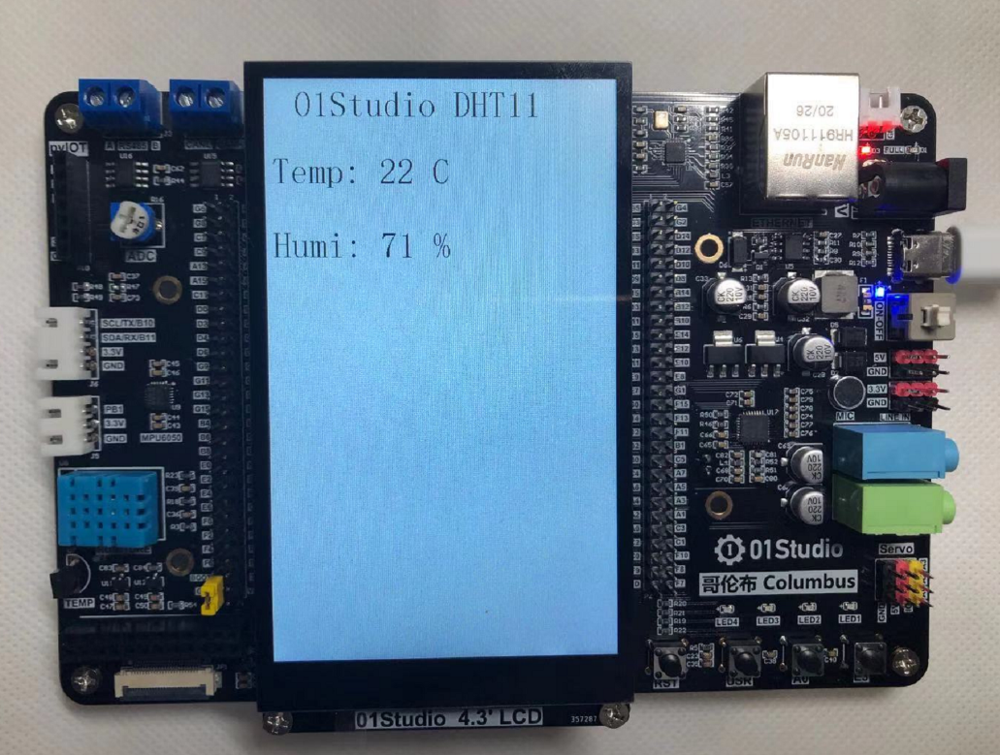

# 温湿度传感器（DHT11）

## 前言
温湿度也是我们日常非常常见的指标，我们使用的是DHT11数字温湿度传感器。这是一款含有已校准数字信号输出的温湿度复合传感器，它应用专用的数字模块采集技术和温湿度传感技术，确保产品具有极高的可靠性和卓越的长期稳定性。

DHT11具有小体积、极低的功耗，信号传输距离可达20米以上，使其成为给类应用甚至最为苛刻的应用场合的最佳选择。产品为4针单排引脚封装，连接方便。


**DHT11温湿度传感器**

## 实验平台
哥伦布开发套件，DHT11温湿度传感器位于左下角（蓝色）。 



## 实验目的
通过编程采集温湿度数据，并在LCD上显示。

## 实验讲解

DHT11虽然有4个引脚，但其中第3个引脚是悬空的，也就是说DHT11也是单总线的传感器，只占用1个IO口。：


我们来看看DHT11在开发板上的接线图：



可以看到DHT11连接到哥伦布主控的‘PG7’引脚，可以针对该引脚编程来驱动DHT11传感器，函数模块说明如下：

## dht对象

### 构造函数
```python
d = dht.DHT11(machine.Pin(id))
```
构建DHT11传感器对象

- `id` ：芯片引脚编号。如：'X12'。


### 使用方法
```python
d.measure()
```
测量温湿度。

<br></br>

```python
d.temperature()
```
获取温度值。

<br></br>

```python
d.humidity()
```
获取湿度值。

<br></br>


建议上电先延时1~2秒，让DHT11稳定后再开始读取。代码编写流程如下：




## 参考代码

```python
'''
实验名称：温湿度传感器实验DTH11
版本：v1.0
平台：哥伦布开发套件
作者：01Studio
说明：通过编程采集温湿度数据，并在LCD上显示。。
'''

#导入相关模块
import time
from machine import Pin
from tftlcd import LCD43M
from dht import DHT11

#定义常用颜色
WHITE=(255,255,255)
BLACK = (0,0,0)

#初始化LCD
d=LCD43M()
d.fill(WHITE)#填充白色

#创建DTH11对象dt
dt=DHT11(Pin('G7'))

#显示标题
d.printStr('01Studio DHT11', 40, 10, BLACK, size=4)

time.sleep(2) #首次启动停顿2秒然传感器稳定

while True:

    try: #异常处理
        
        #获取温湿度值
        dt.measure()
        te=dt.temperature()
        dh=dt.humidity()

        #实时显示温湿度度值
        d.printStr('Temp: '+str(te)+' C',10,100,BLACK,size=4)
        d.printStr('Humi: '+str(dh)+' %',10,200,BLACK,size=4)
        
    except Exception as e: #异常提示

        print('Time Out!')
        
    time.sleep(2) #采集周期2秒
```

## 实验结果

运行代码，可以看到OLED显示采集到的温湿度信息：



通过本节学习我们学会了使用MicroPython来驱动DTH11温湿度传感器，DHT11性价比比较高，是很适合学习使用的，但精度和响应速度有点低，需要更高要求应用的用户可以使用DHT22或者其他更高级的传感器。