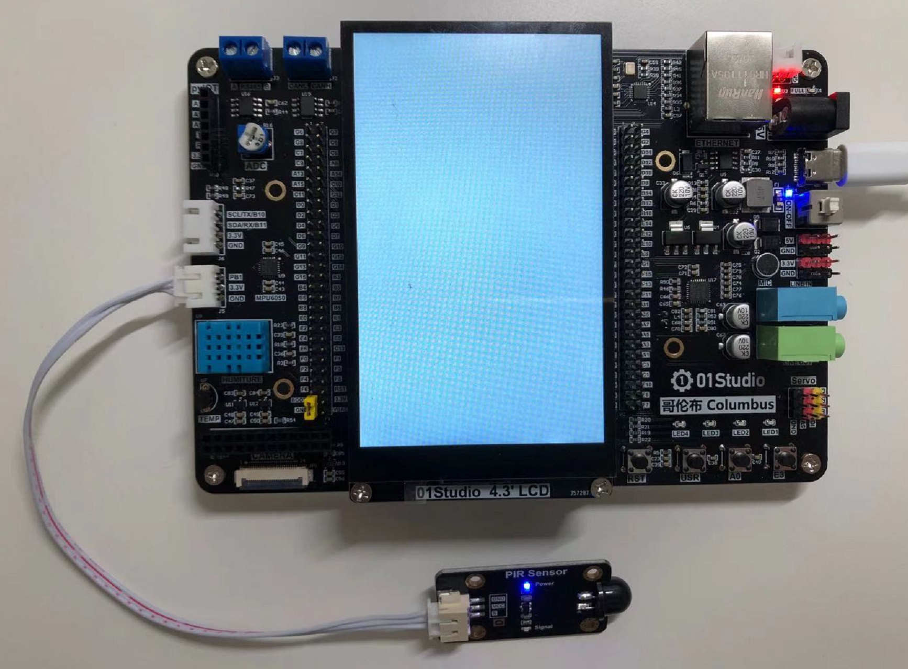
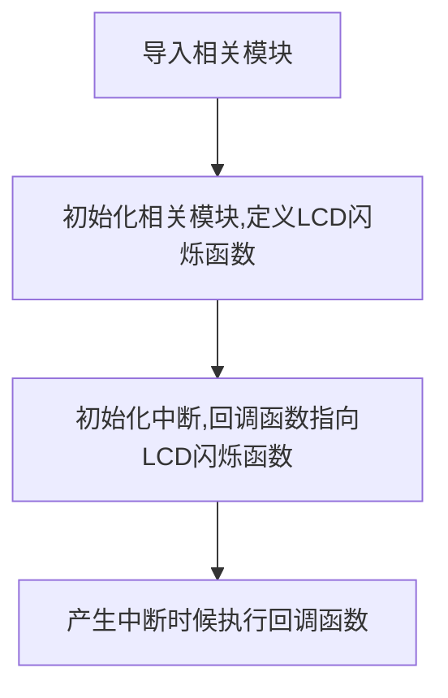
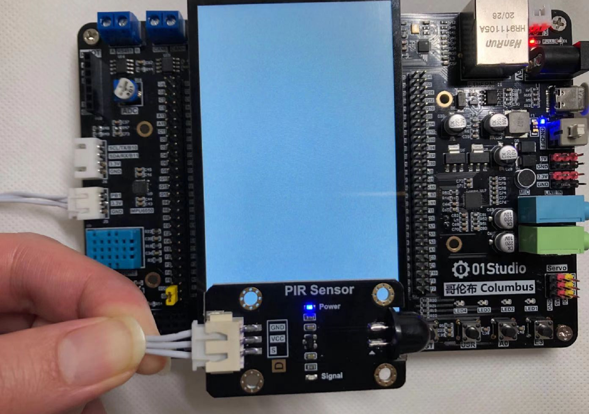
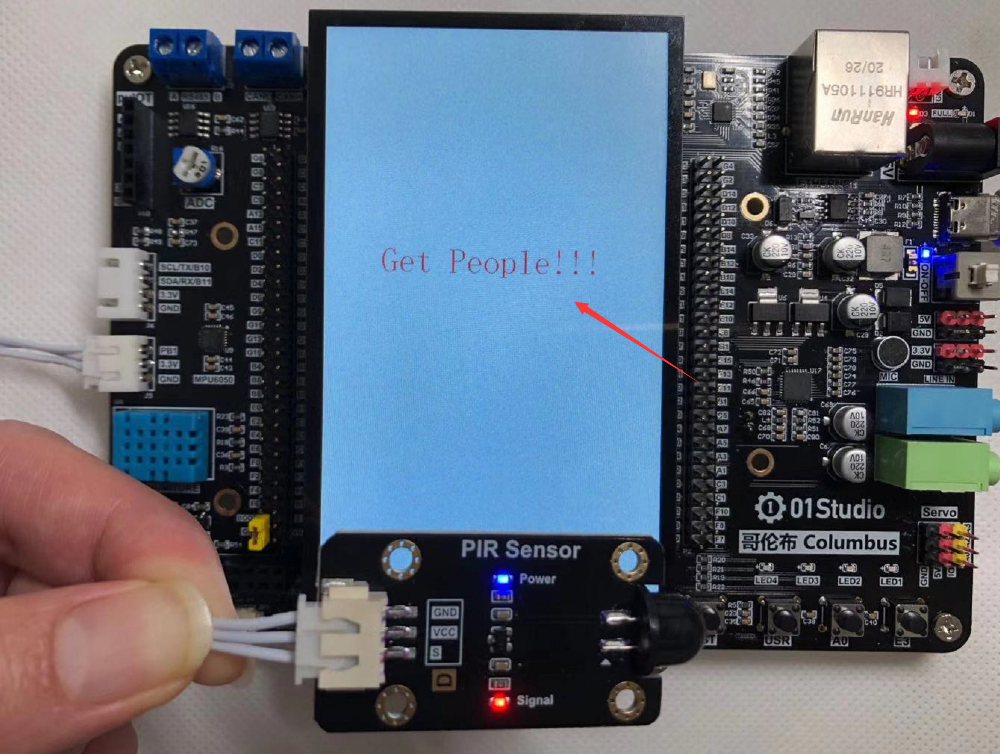

# 人体感应传感器

## 前言
人体感应传感器，在室内安防应用非常普遍，其原理是由探测元件将探测到人体的红外辐射转变成微弱的电压信号，经过放大后输出。为了提高探测器的探测灵敏度以增大探测距离，一般在探测器的前方装设一个塑料的菲涅尔透镜，它和放大电路相配合，可将信号放大 70dB 以上，这样就可以测出 5~10 米范围内人的行动。

## 实验平台
哥伦布开发套件和人体感应传感器模块。

 


## 实验目的
通过外部中断编程来检测人体感应模块，当有人出现时候LCD通过“Get People!！！”闪烁提示。

## 实验讲解

先来看看人体感应传感器模块，主要有供电引脚和信号输出引脚（供电电压一般为3.3V，具体以厂家参数为准）。[**点击购买>>**](https://item.taobao.com/item.htm?id=623858849974)

 

|  产品参数 |
|  :---:  |  --- |
| 供电电压  | 3.3V |
| 工作电流  | <20mA |
| 输出信号  | XH2.54防呆接口（3Pin）【GND、VCC、Single】|
| 输出信号  | 数字信号：<br></br> 检测到人体：高电平3.3V,持续3-8秒; <br></br>未检测到人体：低电平0V。|
| 感应角度  | 100° |
| 感应距离  | 8米 |
| 模块尺寸  | 4.5*2.5cm |

这款模块通电后，当检测到有人时候，传感器信号输出引脚输出高电平并持续3-5秒。

 

由此可见，可以使用外部中断结合上升沿的出发方式来编程实现相关功能。传感器的输出引脚连接Sensor1接口，即连接到哥伦布的“B1”引脚。编程方法可以是当“B1”引脚产生中断时候，说明传感器检测到人体红外线，此时可以在OLED上显示相关信息。

关于外部中断的编程方法可以参考基础实验 [**外部中断**](../basic_examples/exti.md) 章节内容，这里不再重复。

代码编写流程如下：



## 参考代码

```python
'''
实验名称：人体感应传感器
版本：v1.0
平台：哥伦布开发套件
作者：01Studio
'''
import time
from pyb import ExtInt
from machine import Pin  #从machine模块导入Pin子模块
from tftlcd import LCD43M

#定义常用颜色
WHITE=(255,255,255)
BLACK = (0,0,0)
RED=(255,0,0)

#初始化LCD
d=LCD43M()
d.fill(WHITE)#填充白色

d.printStr("01Studio", 10, 10, BLACK, size=4)
d.printStr("Human body test:", 10, 80, BLACK, size=4)

Human=Pin('B1',Pin.IN,Pin.PULL_UP) #构建人体红外对象

def fun(Human): #Get People闪烁5次效果！

    for i in range(5):
        
        #闪烁显示下方内容
        d.printStr('Get People!!!', 80, 300, RED, size=4)
        time.sleep_ms(500)
        
        d.printStr('              ', 80, 300, RED, size=4)
        time.sleep_ms(500)

Human.irq(fun,Pin.IRQ_RISING) #定义中断，上升沿触发
```

## 实验结果

使用Thonny IDE运行代码，实验结果如下。

- 没有检测到人体：

 

- 检测到人体，LCD闪烁提示，传感器模块蓝灯亮：

 

本节通过简单的中断方式便实现了对人体感应传感器的检测，人体感应传感器的应用非常广泛，特别是在安防领域，结合其它硬件模块可以实现当发现有人入侵时，执行发出警报、实现远程提醒等功能。