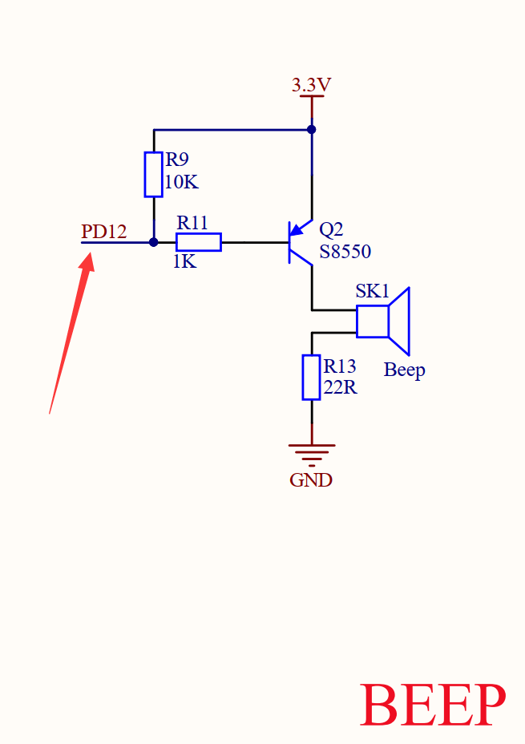
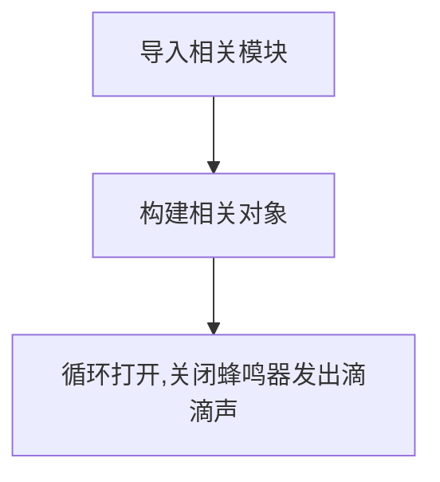
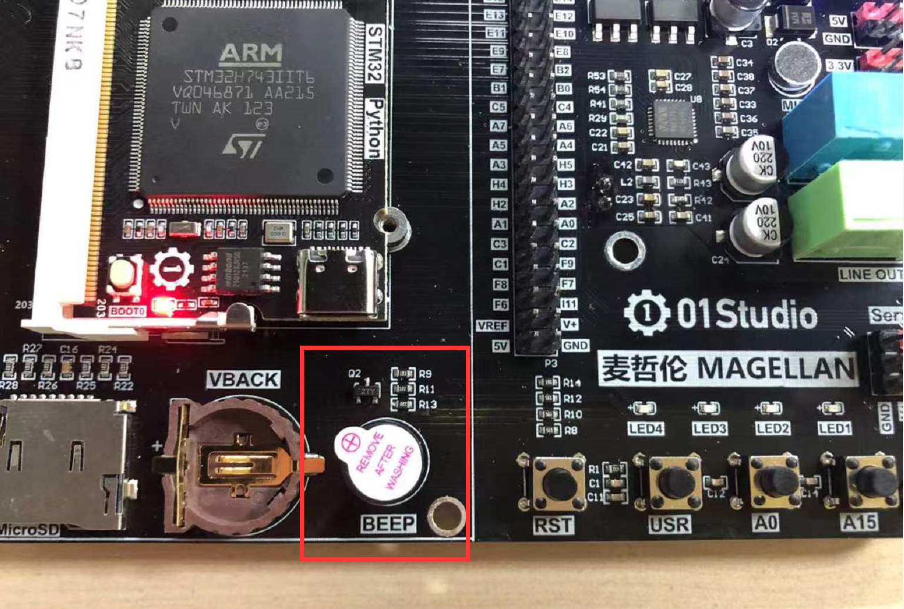
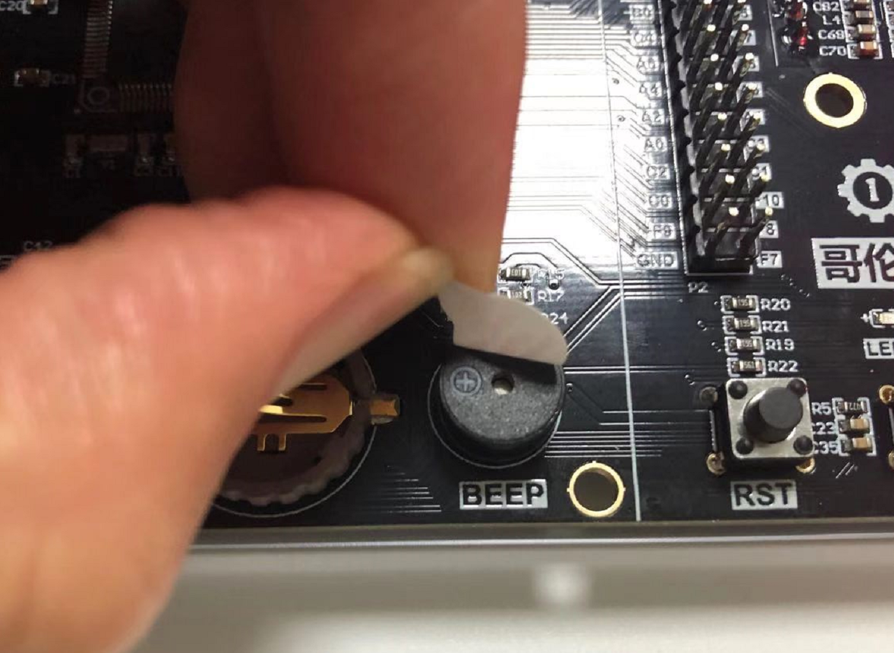

# 蜂鸣器（有源）

## 前言
日常生活中我们不少电子设备在遇到故障时都会报警，而声音比指示灯往往更容易引起人们的注意，本节我们来学习一下蜂鸣器应用。

## 实验平台
麦哲伦开发板。


## 实验目的
通过编程实现蜂鸣器发出滴滴响声。

## 实验讲解

蜂鸣器分有源蜂鸣器和无源蜂鸣器，有源蜂鸣器的使用方式非常简单，只需要接上电源，蜂鸣器就发声，断开电源就停止发声。无源蜂鸣器，是需要给定指定的频率，才能发声的，而且可以通过改变频率来改变蜂鸣器的发声音色。麦哲伦上配备的是有源蜂鸣器，因此控制方式非常简单。

我们从下面原理图可以看到，蜂鸣器跟麦哲伦STM32主控的“PD12”引脚连接，可以通过控制该引脚输出低电平来让蜂鸣器发出响声（IO输出0）。


## Pin对象

GPIO引脚对象。

### 构造函数
```python
machine.Pin(id, mode, pull)
```

machine模块下的Pin对象。

- `id` ：芯片引脚编号。如：X17, B4。
- `mode` ：输入/输出模式。
    - `Pin.IN` : 输入模式；
    - `Pin.OUT` : 输出模式；   
- `pull`: 上下拉电阻配置。
    - `None` : 无上下拉电阻；
    - `Pin.PULL_UP` : 上拉电阻启用；
    - `Pin.PULL_DOWN` : 下拉电阻启用。

### 使用方法

```python
Pin.value([X])
```
配置引脚电平值：
- `输出模式` ：输出电平值。
    - `0` : 输出低电平；
    - `1` : 输出高电平。
- `输入模式` ：无需参数，获取当前引脚输入电平值。

<br></br>

```python
Pin.high()
```
引脚输出高电平。

<br></br>

```python
Pin.low()
```
引脚输出低电平。

<br></br>

更多用法请阅读官方文档：<br></br>
https://docs.01studio.cc/library/machine.Pin.html#machine-pin

<br></br>

代码编写流程如下：



## 参考代码

```python
'''
实验名称：蜂鸣器
版本：v1.0
平台：麦哲伦开发板
作者：01Studio
说明：蜂鸣器发出滴滴滴响声
'''

from machine import Pin
import time

#构建蜂鸣器对象
beep = Pin('D12',Pin.OUT_PP)

while True:

    #蜂鸣器发出滴滴声
    beep.low() #打开蜂鸣器
    time.sleep_ms(500) #延时500毫秒
    beep.high() #关闭蜂鸣器
    time.sleep_ms(500)
```

## 实验结果

运行代码，可以听到麦哲伦开发板上的蜂鸣器发出滴滴响声。



如果觉得声音小，可以将蜂鸣器表面的贴纸撕开，那要声音就会大得多。

