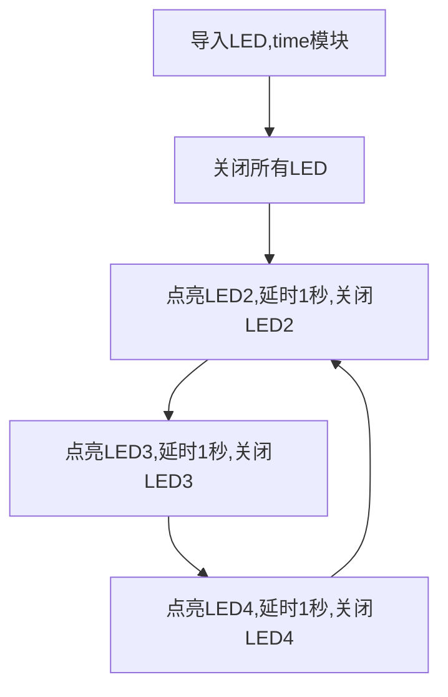
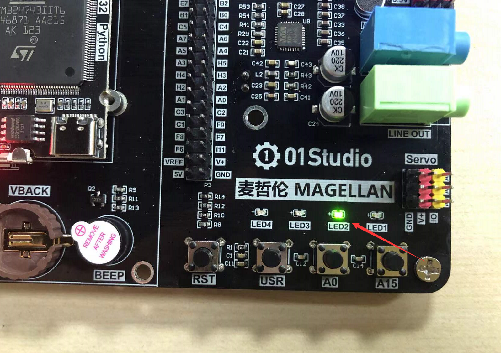
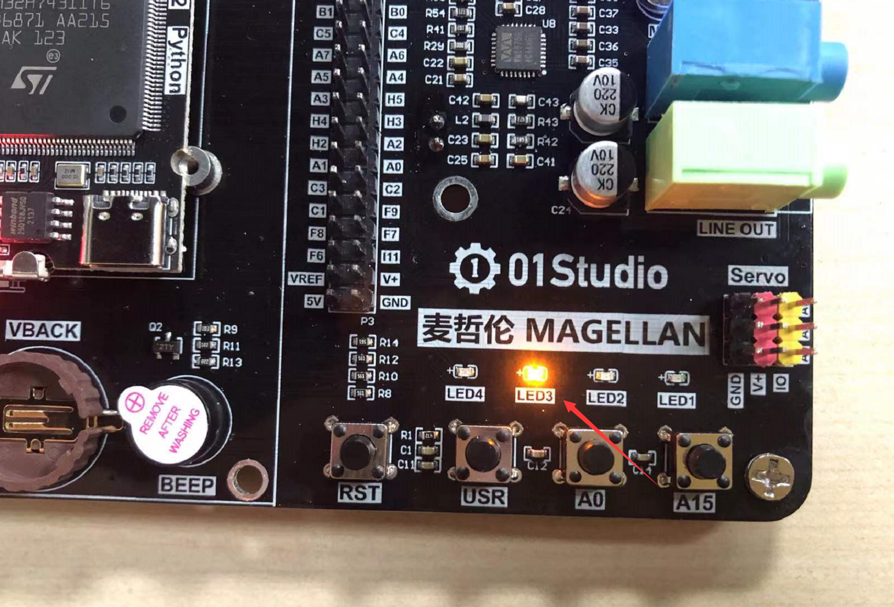
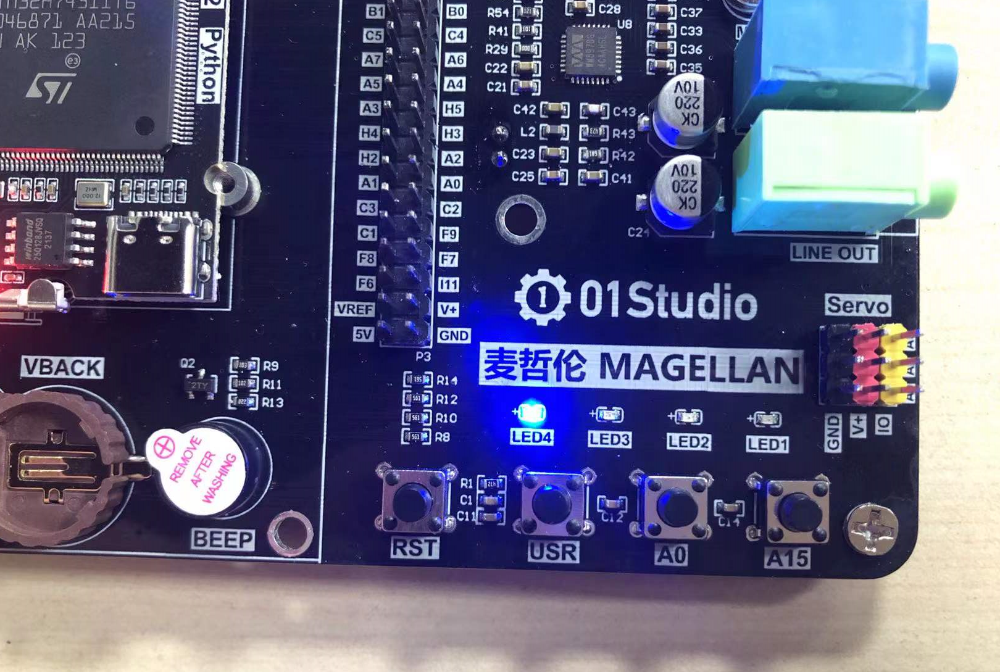

# 流水灯

## 前言
通过上一节点亮LED灯的学习，我们已经对micropython的编程有了初步的了解，这一节来做一个功能稍微复杂一点的实验，流水灯。流水灯也叫跑马灯，也就是让几个LED来回亮灭，达到好像流水的效果。也是单片机开发学习的典型例子。

## 实验目的
micropython编程实现流水灯。

## 实验平台
麦哲伦开发板。


## 实验讲解

麦哲伦开发板上总共有4个LED，分别是LED1(红色)、LED2(绿色)、LED3(黄色)、LED4(蓝色)；

上一章节我们已经学习过LED点亮，这里要实现固定时间来亮灭，需要用到延时的函数。具体如下：

## LED对象

### 构造函数
```python
pyb.LED(id)
```

LED对象位于pyb模块下:

- `id` ：LED编号。1-4。

### 使用方法
```python
LED.off()
```
关闭LED

<br></br>

```python
LED.on()
```
打开LED

<br></br>

```python
LED.toggle()
```
翻转LED状态。

<br></br>

更多用法请阅读官方文档：<br></br>
https://docs.01studio.cc/library/pyb.LED.html#class-led-led-object

## time对象

使用time对象实现延时。

### 构造函数
```python
import time
```

直接import使用。

### 使用方法

```python
time.sleep(seconds)
```
秒级延时；

```python
time.sleep_ms(ms)
```
毫秒级延时；

```python
time.sleep(us)
```
微秒级延时；

更多用法请阅读官方文档：<br></br>
https://docs.01studio.cc/library/time.html#module-time

知道了函数的使用方法后，我们可以简单的梳理一下流程，首先导入LED和time模块，程序开始先让LED2-LED4灭掉，开启循环，依次点亮每个LED，延时1秒，然后关闭。流程如下：

代码编写流程如下：



## 参考代码

### 基础写法

```python
'''
实验名称：流水灯
版本：v1.0
作者：01Studio
'''

from pyb import LED  #从pyb导入LED模块
import time

#关闭全部LED
LED(2).off()
LED(3).off()
LED(4).off()

#while True表示一直循环
while True:
    
    #LED2亮1秒
    LED(2).on()
    time.sleep(1)
    LED(2).off()

    #LED3亮1秒
    LED(3).on()
    time.sleep(1)
    LED(3).off()

    #LED4亮1秒
    LED(4).on()
    time.sleep(1)
    LED(4).off()

```

### 使用for循环实现

上述代码有点冗余，这里可以使用for循环来实现相关功能。

```python
'''
实验名称：流水灯
版本：v2.0
作者：01Studio
'''

from pyb import LED   #从pyb导入LED模块
import time

# 相当于for i in [2, 3, 4]，LED(i).off()执行3次，分别是LED 2，3，4
for i in range(2,5):
    LED(i).off()

while True:
    #使用for循环
    for i in range(2,5):
        LED(i).on()
        time.sleep(1) #延时1秒
        LED(i).off()
```

修改后的代码一下子变得简约美观。Python作为高级语言，使用起来非常灵活，常常能通过几行代码就可以表达复杂的逻辑。我们在编程的过程中应该多思考如何优化代码，才能让自己的编程水平得到较快的提升。


## 实验结果

在Thonny IDE中运行上述代码：


可以看到LED2、LED3、LED4循环点亮，实现流水效果。








本节实验相对于第一节相比增加了延时函数的应用，可见MicroPython编程功能增加就是各类函数的叠加，当开发复杂功能时候，因为底层函数已经封装好，所以面向应用的开发使用起来非常方便。除此之外我们也体验了Python代码的简洁和高效，使得程序更好的阅读。