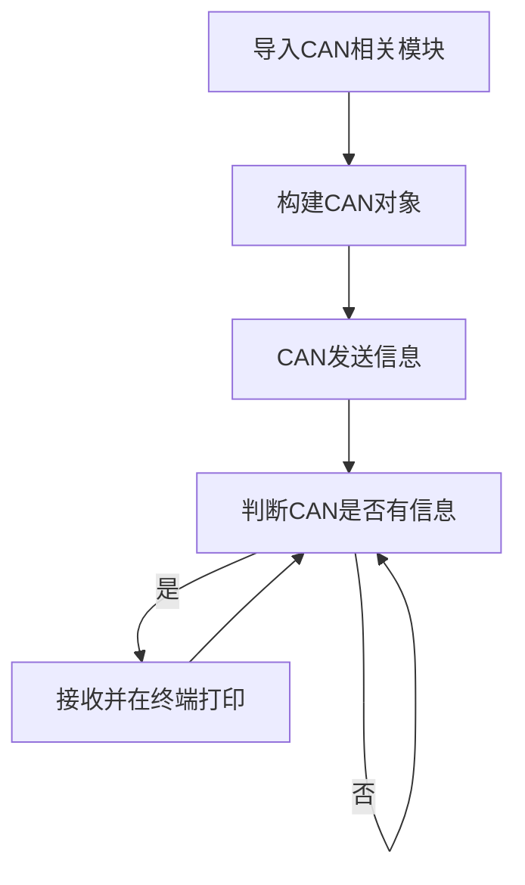
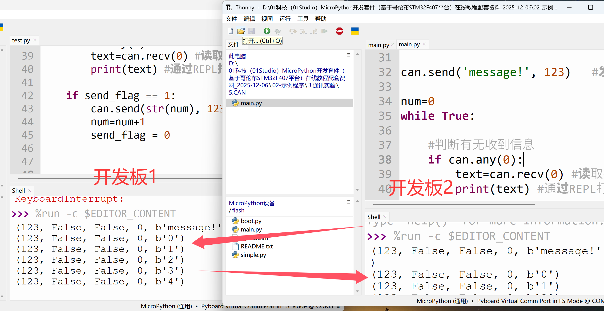

# CAN

## 前言

CAN是控制器局域网络(Controller Area Network, CAN)的简称，是由以研发和生产汽车电子产品著称的德国BOSCH公司开发的，并最终成为国际标准（ISO 11898），是国际上应用最广泛的现场总线之一。 在北美和西欧，CAN总线协议已经成为汽车计算机控制系统和嵌入式工业控制局域网的标准总线，并且拥有以CAN为底层协议专为大型货车和重工机械车辆设计的J1939协议。


## 实验平台
麦哲伦MicroPython开发套件2套，相互通讯。


## 实验目的
编程实现2个麦哲伦开发板之间的CAN通讯。

## 实验讲解

在麦哲伦开发板左上角有CAN接口，从下图可以见到分别是CANH和CANL接口，我们只需要将2个开发板的H—H 和 L—L分别连接即可，用螺丝刀将蓝色接线柱拧松，然后插入导线，再拧紧即可。**另外需要注意的是将右边的跳线帽短接中间和下方，让主控的IO和CAN芯片连通。**


麦哲伦MicroPython库集成了CAN总线库模块，我们熟悉CAN对象后直接使用即可。CAN对象说明如下：

## CAN对象

### 构造函数
```python
pyb.CAN(bus, mode, …)
```
CAN对象位于pyb库下。

- `bus` ：CAN编号。
    - `1`： CAN(1)-->(RX, TX) = (PB8, PB9)
    - `2` ：CAN(2)-->(RX, TX) = (PB12, PB13)

- `mode` ：模式选择。包含**NORMAL, LOOPBACK, SILENT, SILENT_LOOPBACK**。默认使用**NORMAL**。

### 使用方法

```python
CAN.setfilter(bank,mode,fifo,params,*,rtr)
```
配置过滤器组。
- `bank` 组号；
- `mode` 模式；
    - `CAN.LIST16`: 4个16bits的数据，也可以8个8bits的字符；
    - `CAN.LIST32`: 2个32bits的数据；
- `fifo` 信息存放的缓存区，可以是0或1；
- `params` 一个数组值，用于定义过滤器，如: (123,124,125,126)。


<br></br>

```python
CAN.any(fifo)
```
检查缓存区是否有信息。有返回True,没有返回False
- `fifo` 缓冲器编号，可以是0或1;


<br></br>

```python
CAN.send(data, id, …)
```
发送数据。
- `data` 字符数据
- `id` 必须是过滤器定义数组值里面的编号。


<br></br>

```python
CAN.recv(fifo, …)
```
接收数据。
- `fifo` 缓冲器编号，可以是0或1 。


更多用法请阅读官方文档：<br></br>
https://docs.01studio.cc/library/pyb.CAN.html#pyb-can

<br></br>

总的来说CAN协议复杂，但封装好python库后的CAN使用又变得很简单，只要配置好参数即可，本实验代码流程跟UART（串口通讯）有点类似:



## 参考代码

```python
'''
实验名称：CAN总线通讯
版本：v1.0
平台：麦哲伦开发板
作者：01Studio
说明：通过编程实现串口通信，跟电脑串口助手实现数据收发。
'''

#导入串口模块
from pyb import CAN,Switch
import time

send_flag = 0

def send():
    global send_flag

    #消除抖动，sw按下返回1，松开返回0。
    if sw.value()==1:
        time.sleep_ms(10)
        if sw.value()==1:

            send_flag = 1

sw = Switch()     #定义按键对象名字为sw
sw.callback(send) #当按键被按下时，执行函数send()

can=CAN(1, CAN.NORMAL,baudrate=500000) #设置CAN1为普通模式(RX-->PB8,TX-->PB9)
#设置接收相关配置 id=123, 124, 125 和 126
can.setfilter(0, CAN.LIST16, 0, (123, 124, 125, 126))

can.send('message!', 123)   #发送id=123的信息

num=0
while True:

    #判断有无收到信息
    if can.any(0):
        text=can.recv(0) #读取数据
        print(text) #通过REPL打印串口3接收的数据

    if send_flag == 1:
        can.send(str(num), 123)   #发送id=123的信息
        num=num+1
        send_flag = 0
```

## 实验结果

本例程需要同时打开2个Thonny IDE，设置方法如下：

打开 **工具**--**选项**，确认 `只运行同时运行一个Thonny实例` 选项未被勾选。


打开2个Thonny IDE, 分别连接不同的麦哲伦开发板。

本实验代码通过按下USR按键来实现发送信息，将2个开发板的CAN接口连接（H连H，L连L），**另外记得将2个黄色跳线帽打到使能端**，通过USR按键相互发送信息。


按下某个开发板的USR按键，就可以看到另一个开发板收到了信息。




本节通过编程实现了2个开发板之间的RS485通讯。有条件的用户可以连接自己的RS485设备，实现开发板跟设备之间的通讯，从而将麦哲伦开发板变成一个设备主控机。

