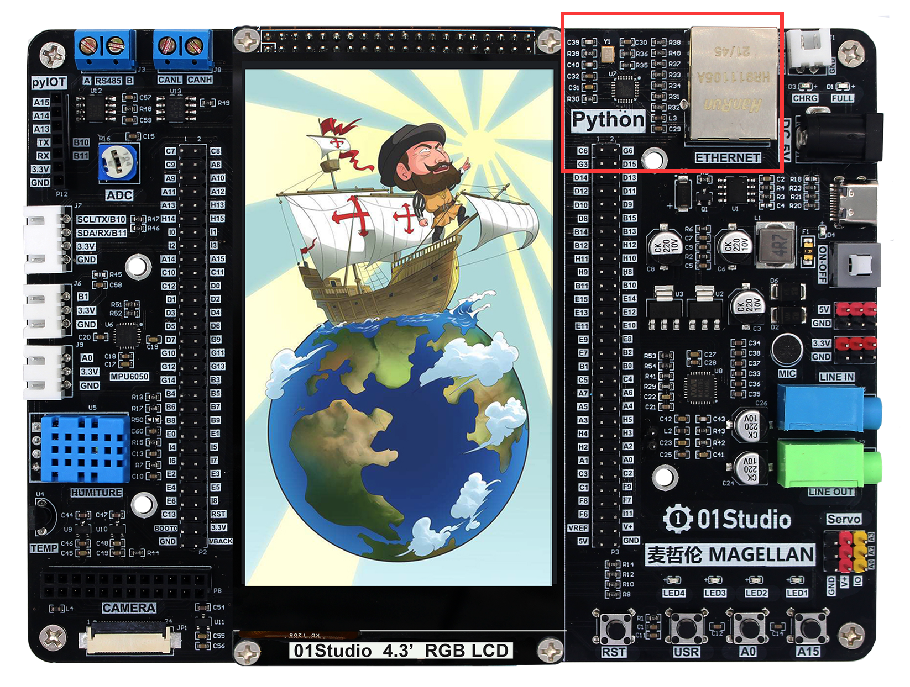
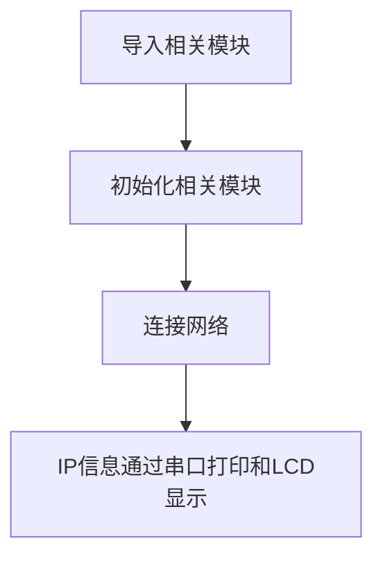
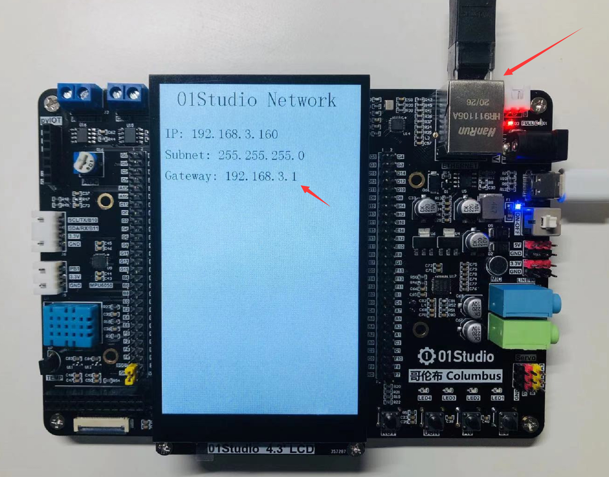

# 连接网络

## 前言
万物互联是趋势，麦哲伦开发板集成了百兆以太网接口，我们可以轻松通过MicroPython编程实现开发板连接互联网。

## 实验平台
麦哲伦开发板



## 实验目的
编程实现连接路由器，将IP地址等相关信息通过串口终端打印和LCD显示出来。

## 实验讲解

连接路由器上网是我们每天都做的事情，日常生活中我们只需要知道路由器的账号和密码，就能使用电脑或者手机连接到无线路由器，然后上网冲浪。

麦哲伦micropython固件已经集成了network网络模块，开发者使用内置的network模块函数可以非常方便地连接上路由器。我们先来看看network模块的构造函数和使用方法。

## network对象

### 构造函数
```python
network.Ethernet()
```
构建以太网模块连接对象。

### 使用方法
```python
Ethernet.active([value])
```
激活或停用网络接口。**参数为空返回当前激活状态。**
- `True`: 激活网络接口;
- `False`: 关闭网络接口。

<br></br>

```python
Ethernet.isconnected()
```
检查设备是否已经连接上。返回 `Ture`:已连接；`False`:未连接。

<br></br>

<br></br>

```python
Ethernet.ifconfig([(ip, subnet, gateway, dns)])
```
配置网络信息，当参数为空时表示查看网络连接信息。
- `ip`: IP地址；
- `subnet` : 子网掩码；
- `gateway`: 网关地址；
- `dns` : DNS信息。

**例：Ethernet.ifconfig(('192.168.1.110', '255.255.255.0', '192.168.1.1', '8.8.8.8')) 。**

<br></br>


更多用法请阅读官方文档：<br></br>
https://docs.01studio.cc/library/network.WIZNET5K.html

从上表可以看到MicroPython通过模块封装，让联网变得非常简单。代码编写流程如下：



## 参考代码

```python
'''
实验名称：以太网连接网络
版本：v1.0
平台：麦哲伦开发板
作者：01Studio
说明：编程实现以太网连接网络,显示IP相关信息。
'''

import network
from tftlcd import LCD43R

#定义常用颜色
RED = (255,0,0)
GREEN = (0,255,0)
BLUE = (0,0,255)
BLACK = (0,0,0)

#4.3寸LCD初始化
d = LCD43R(portrait=4)
d.fill((255,255,255)) #填充白色

#显示标题
d.printStr('01Studio Network', 40, 10, BLACK, size=4)
    
#以太网初始化
nic = network.Ethernet()
nic.active(True)
nic.ifconfig('dhcp')

#判断网络是否连接成功
if nic.isconnected():

    print(nic.ifconfig()) #打印IP信息

    #显示IP信息
    d.printStr('IP: ' + nic.ifconfig()[0], 10, 100, BLACK, size=3)
    d.printStr('Subnet: ' + nic.ifconfig()[1], 10, 150, BLACK, size=3)
    d.printStr('Gateway: ' + nic.ifconfig()[2], 10, 200, BLACK, size=3)
```

## 实验结果

将网线连接开发板和路由器，运行程序，可以观察到连接成功后串口终端打印IP等信息。


LCD屏同时也显示IP信息:



本节是联网应用的基础，成功连接到路由器的实验后，后面就可以做socket和MQTT等相关网络通信的应用了。