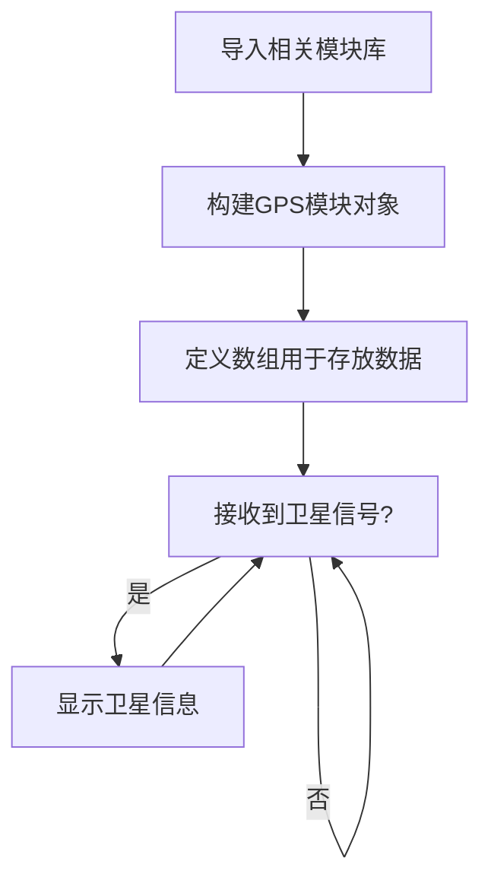
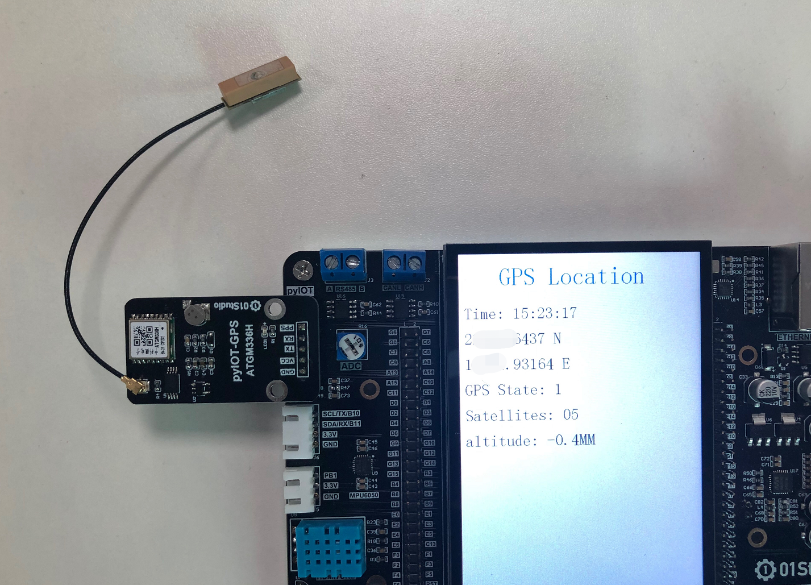

# GPS模块

## 前言
全球卫星定位系统(GPS)的用途非常广泛, 为船舶、汽车、飞机或其它移动资产进行定位。

全球有4大卫星定位系统，GPS系统（美国）、BDS系统（中国北斗）、GLONASS系统（俄罗斯）、伽利略系统（欧盟）。目前在国内比较常用的是GPS系统和北斗导航系统。


## 实验平台

麦哲伦MicroPython开发套件和pyIOT-GPS ATGM336H 卫星定位模块。


## 实验目的
编程实现获取GPS定位信息。

## 实验讲解

pyIOT-GPS ATGM336H是标准的串口卫星定位模块，通过串口单向输出卫星信息，产品参数如下：  [**点击购买>>**](https://item.taobao.com/item.htm?id=624363387479)


|  产品参数 |
|  :---:  |  --- |
| 蓝牙主控  | ATGM336H-5N |
| 卫星信号  | GPS/BDS/GLONASS |
| 定位精度  | 2.5m (开阔地点) |
| 串口波特率  | 9600 bps |
| 串口电平  | 3.3V或5V (自适应) |
| 工作电压  | 3.3V - 5V |
| 功耗  | 工作：<25mA, 待机：<10uA  (@3.3V) |
| 引脚  | GND, 3.3V, TX, RX，PPS（帧同步） |
| 模块尺寸  | 4.5*2.5cm |

用户可以使用python编程通过串口直接使获取模块GPS信息， 我们只需要对GPS信息进行解析并显示即可。关于ATGM336H信息的详细说明可以看手册： **开发套件配套资料_latest\02-示例程序\3.通讯实验\6.pyIOT无线模块\2.ATGM336H GPS模块\03-核心模块手册** 。代码编写流程如下：



## 参考代码

```python
'''
实验名称：pyIOT-GPS模块（中科微 ATGM336H GPS模块）
版本：v1.0
平台：麦哲伦开发板
作者：01Studio
说明：编程实现串口获取GPS数据并显示
'''

#导入串口模块
from machine import UART
from tftlcd import LCD43R
import time

#定义常用颜色
RED = (255,0,0)
GREEN = (0,255,0)
BLUE = (0,0,255)
BLACK = (0,0,0)

########################
# 构建4.3寸LCD对象并初始化
########################
d = LCD43R(portrait=4) #默认方向

#画接收框
d.fill((255,255,255))
d.printStr('GPS Location', 80, 20, BLUE, size=4)

#GPS数据说明
#消息ID：$GNGGA,双模GPS
#[0]定位点UTC时间
#[1]纬度[2]纬度方向[3]经度[4]经度方向
#[5]GPS定位状态
#[6]卫星数量
#[7]水平精度衰减因子
#[8]海平面高度[9]高度单位
GPS_INFO=['','','','','','','','','','','','','',''] #14个数据
k1='$GNGGA,' #关键词,双模GPS数据

#构建蓝牙模块对象（串口）
GPS=UART(3,9600) #设置串口号3和波特率,TX--Y9,RX--Y10

#接收信息
while True:

    if GPS.any(): #查询是否有信息
        text0 = GPS.read(1024) #默认单次最多接收128字节'''
        #print(text0) #原始数据

        text=str(text0) #将数据转成字符

        #找到双模定位
        if text.find(k1) != -1 :
            begin_num=text.find(k1)+7 #起始字符
            for i in range(14):
                while text[begin_num]!=',' :
                    GPS_INFO[i] = GPS_INFO[i]+str(text[begin_num])
                    begin_num=begin_num+1
                begin_num=begin_num+1

            print(GPS_INFO) #双模GPS数据

            #时间
            time=GPS_INFO[0].split('.')
            hh=int(int(time[0])/10000)+8 #北京时间东八区
            mm=int(int(time[0])%10000/100)
            ss=int(int(time[0])%100)
            print('Time: '+str(hh)+':'+str(mm)+':'+str(ss))
            d.printStr('Time: '+str(hh)+':'+str(mm)+':'+str(ss), 10, 100, BLACK, size=3)

            #经纬度
            print(GPS_INFO[1]+' '+GPS_INFO[2])
            print(GPS_INFO[3]+' '+GPS_INFO[4])
            d.printStr(GPS_INFO[1]+' '+GPS_INFO[2], 10, 150, BLACK, size=3)
            d.printStr(GPS_INFO[3]+' '+GPS_INFO[4], 10, 200, BLACK, size=3)

            #定位状态，1为定位成功
            print('GPS State: '+GPS_INFO[5])
            d.printStr('GPS State: '+GPS_INFO[5], 10, 250, BLACK, size=3)

            #卫星数量
            print('Satellites: '+GPS_INFO[6])
            d.printStr('Satellites: '+GPS_INFO[6], 10, 300, BLACK, size=3)

            #水平精度衰减因子
            print('Horizontal precision attenuation factor: '+GPS_INFO[7])

            #海拔高度
            print('altitude: '+GPS_INFO[8]+GPS_INFO[9])
            d.printStr('altitude: '+GPS_INFO[8]+GPS_INFO[9], 10, 350, BLACK, size=3)


            #清空数据
            for i in range(14):
                GPS_INFO[i]=''
```

## 实验结果

将pyIOT-GPS ATGM336H模块连接到麦哲伦开发板pyIOT接口，注意引脚顺序对上。同时模块接上GPS专用的陶瓷天线。


GPS需放在**室外空旷位置搜索卫星信号（部分地方阳台也可以，取决于遮挡），首次上电搜索卫星比较久请耐心等待。**，当搜索到卫星信号时，模块的蓝灯会周期性闪烁。然后可以看到LCD显示出当前GPS模块发过来的信息：



串口GPS模块的使用非常简单，但用途却非常广。有兴趣的用户可以用来打造自己的全球定位仪。