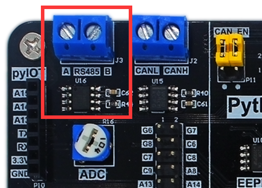
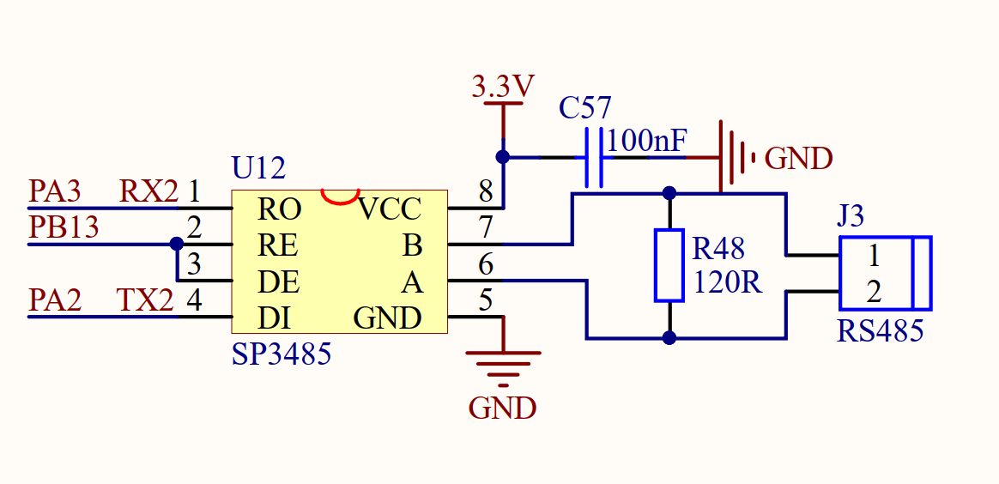
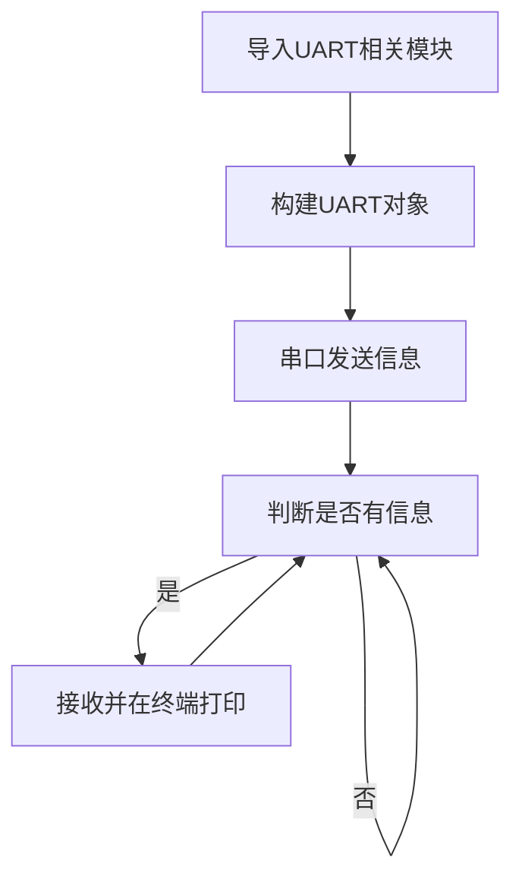
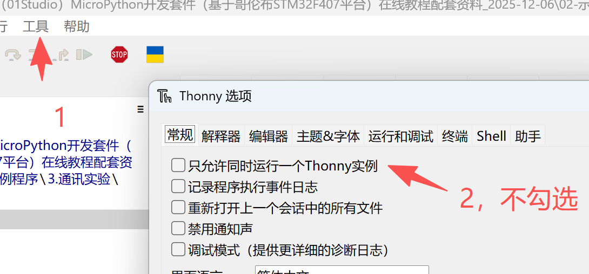
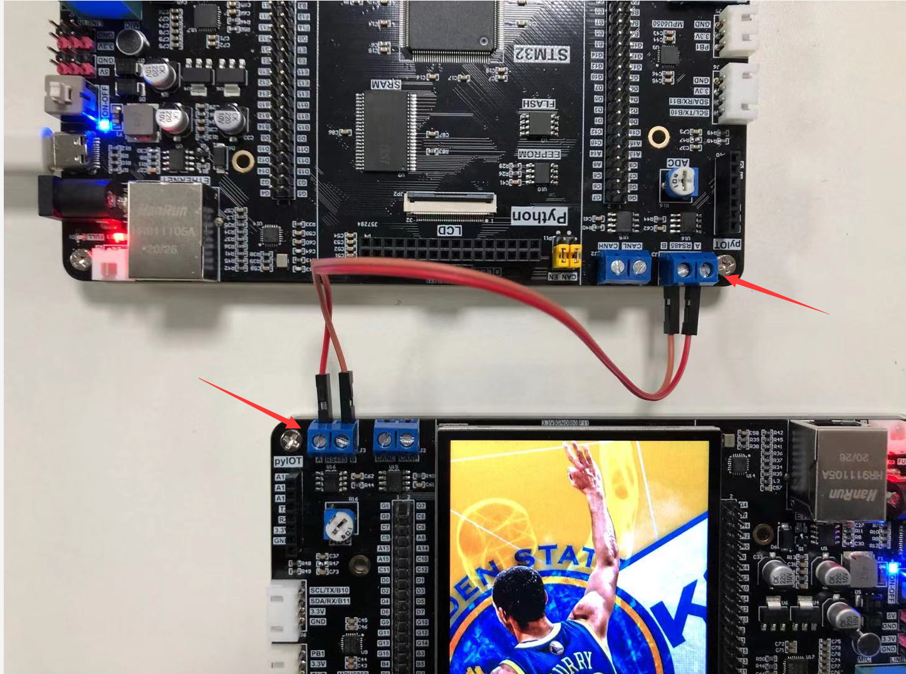

# RS485

## 前言
近三十多年以来，工业控制技术的不断发展和计算机网络通信技术日益广泛的应用，亟需一种总线通信技术能够适合远距离的数字通信。电子工业协会于1983年在RS-422工业总线标准的基础之上，制订并发布了RS-485总线工业标准。RS-485工业总线标准能够有效支持多个分节点和通信距离远，并且对于信息的接收灵敏度较高等特性。在工业通信网络中，RS-485总线一般主要用于与外部各种工业设备进行信息传输和数据交换，所具备的对于噪声的有效抑制能力、高效的数据传输速率与良好的数据传输的可靠性能以及可扩展的通信电缆的长度是其他的许多工业通信标准所无法比拟的。

因此，RS485总线在诸多个领域得到了广泛的应用，比如在工业控制领域、交通的自动化控制领域和现场总线通信网络等。


## 实验平台
麦哲伦MicroPython开发套件2套，相互通讯。


## 实验目的
编程实现2个麦哲伦开发板RS485通讯。

## 实验讲解

在麦哲伦开发板左上角有RS485接口，从下图可以见到分别是A和B接口，我们只需要将2个开发板的A—A 和 B—B 分别连接即可，用螺丝刀将蓝色接线柱拧松，然后插入导线，再拧紧即可。



我们来看看麦哲伦RS485的原理图(下图)，RS485本质是将串口UART信号转成485信号，所以我们编程只需要用到串口代码即可，这里看到连接的是串口UART2。



另外需要注意的是RS485有个控制IO，需要用来控制发送或者接收，高电平表示发送，低电平表示接收。**这也称为半双工。**

[串口通讯实验](./uart.md)在前面章节已经讲述，这里不再重复。编程流程图如下：



## 参考代码

```python
'''
实验名称：RS485通讯
版本：v1.0
平台：麦哲伦开发板
作者：01Studio
说明：通过编程实现2套开发板间的RS485通讯。
'''

#导入串口模块
from pyb import Switch
from machine import UART,Pin
import time

send_flag = 0

def send():
    global send_flag

    #消除按键抖动
    if sw.value()==1:
        time.sleep_ms(10)
        if sw.value()==1:
            send_flag = 1

sw = Switch()     #定义按键对象名字为sw
sw.callback(send) #当按键被按下时，执行函数send()

uart=UART(2,115200) #设置串口号2和波特率
RS485_EN = Pin('B13', Pin.OUT_PP) #初始化控制引脚

RS485_EN.high() #拉高进入发送模式
uart.write('Hello 01Studio!')#发送一条数据
RS485_EN.low() #拉低进入接收模式

while True:

    #判断有无收到信息
    if uart.any():
        text=uart.read(64) #默认单次最多接收64字节
        print(text) #通过REPL打印串口3接收的数据

    if send_flag ==1 :
        RS485_EN.high() #拉高进入发送模式
        uart.write('Hello 01Studio!')#发送一条数据
        RS485_EN.low() #拉低进入接收模式
        send_flag = 0
```

## 实验结果

本例程需要同时打开2个Thonny IDE，设置方法如下：

打开 **工具**--**选项**，确认 `只运行同时运行一个Thonny实例` 选项未被勾选。



打开2个Thonny IDE, 分别连接不同的麦哲伦开发板。

本实验代码通过按下USR按键来实现发送信息，将2个开发板的RS485连接接口（A连A，B连B），通过USR按键相互发送信息。



按下某个开发板的USR按键，就可以看到另一个开发板收到了信息。


本节通过编程实现了2个开发板之间的RS485通讯。有条件的用户可以连接自己的RS485设备，实现开发板跟设备之间的通讯，从而将麦哲伦开发板变成一个设备主控机。

