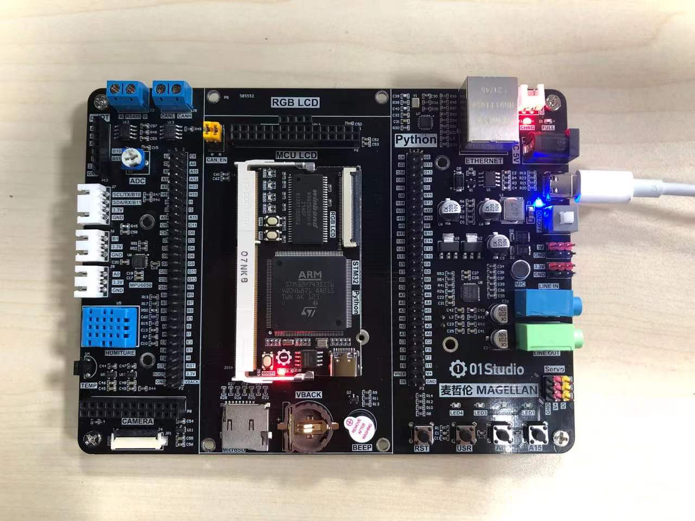
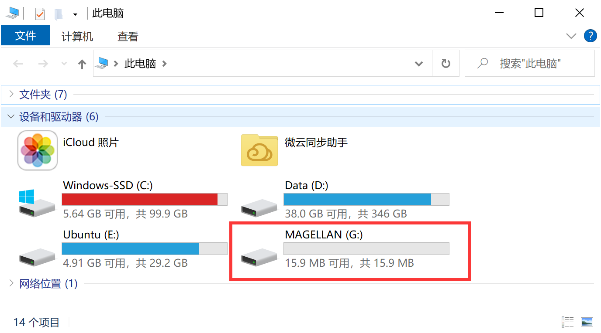
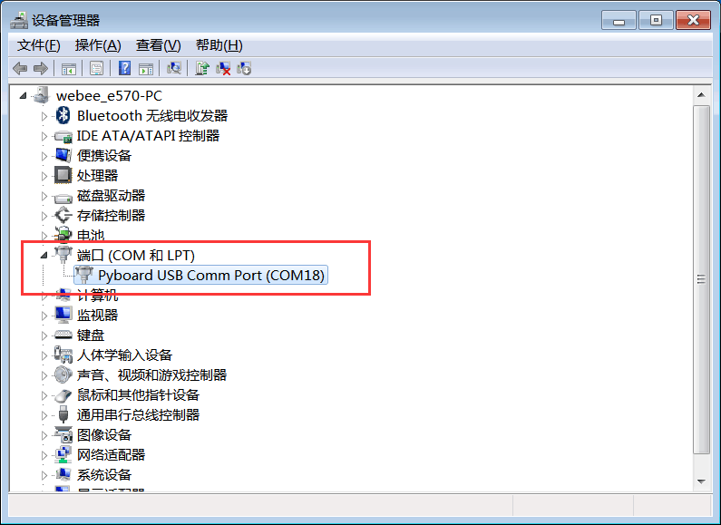

# 驱动安装

我们将开发板通过type-C USB数据线连接到电脑，按下右上角的自锁开关，给开发板上电，蓝色灯亮。

连接电脑后，可以看到“我的电脑”位置弹出一个容量约为16M字节的U盘，名字是`MAGELLAN`。

点击打开，看到以下文件（也可能包含了其它出厂测试例程文件）。

下面是对各个文件的简介，主要是下面4个文件构成MicroPyhon的文件系统：
1.	boot.py : 系统启动文件，上电自动运行的第1个脚本；
2.	main.py: 主函数代码文件，上电自动运行的第2个脚本；；
3.	pybcdc.inf: USB串口调试（REPL）驱动；
4.	README.txt: 说明文件；

我们还需要安装一个USB转串口的驱动（一般情况下win10系统会自动安装） ，

鼠标右键点击 “我的电脑”—属性—设备管理器：系统找到了pyBoard虚拟串口新设备，**部分PC可能不显示pyboard,只要找到COM即可，不确定的可以拔插开发板，找到出现和消失的COM就是开发板的串口COM** ，没有出现感叹号表示自动安装成功。

如果出现感叹号，表示没有自动安装，请按以下方式手动安装。驱动文件在U盘里。

点击右键更新驱动软件：

浏览计算机安装，选择路径是PYBFLASH，也就是U盘盘符。

安装完成后，我们看到，原来的叹号消失，出现了一个COM18串口号。这个串口号不同的电脑会显示不同。

:::tip 提示

部分用户的Win7系统由于使用的是Ghost版系统，Ghost系统精简了很多系统文件，有可能导致驱动无法安装。我们不建议开发者安装Ghost的系统。这时候建议用户采取以下措施。

（1）使用360的系统重装功能，实测重装后驱动可以安装；
（2）升级成Win10系统。

我们更推荐方法（2），因为微软已经宣布停止对Win7进行更新，另外就是我们的教程都会基于Win10系统。

::: 
