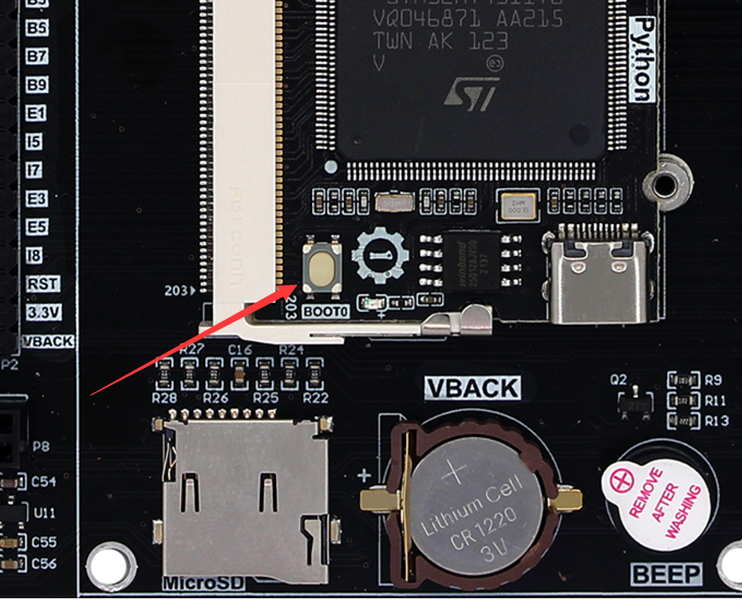
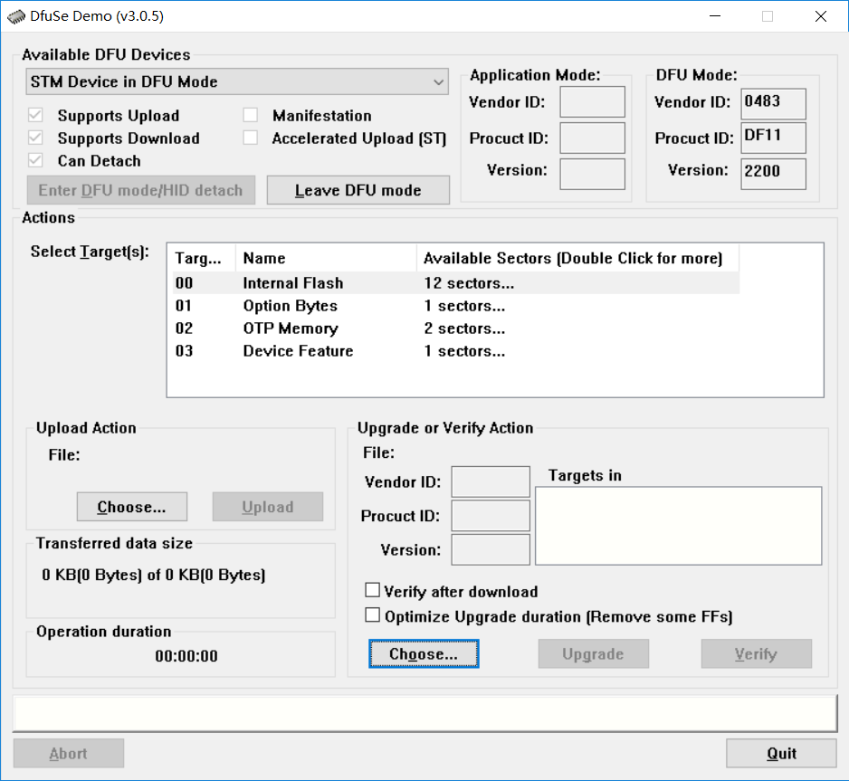
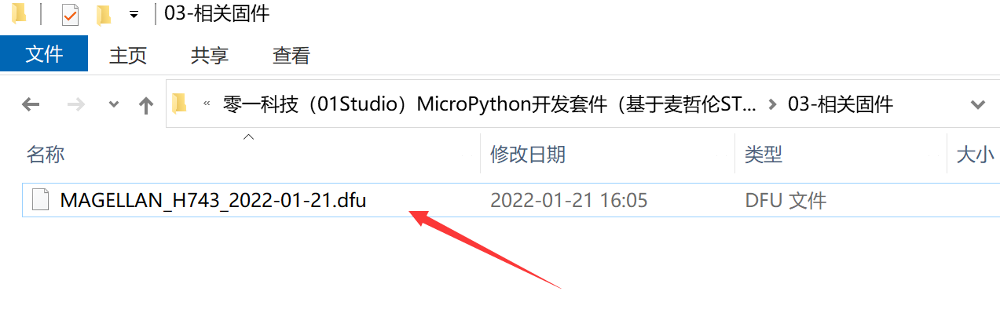
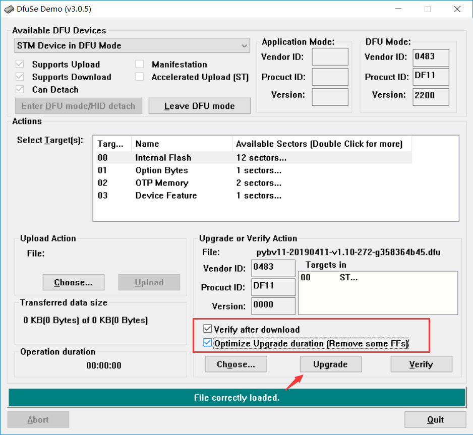
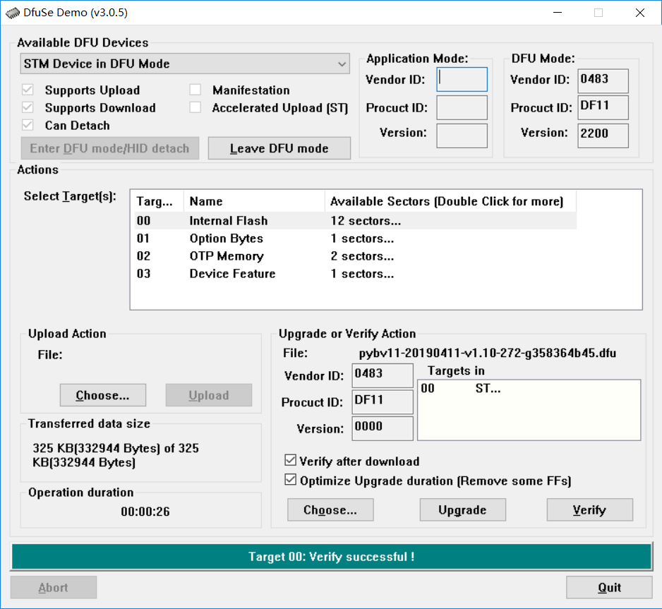

# 固件更新

当开发板上的固件意外丢失或者我们希望升级到较新版本固件时候，就需重新烧录固件。

我们采用DFU的烧写方式，DFU烧写方式优势是不需要ST-LINK一类仿真器，只需要安装一个软件即可。我们打开 **开发套件配套资料\开发工具\Windows\固件更新工具\DfuSe_Demo_V3.0.5** 目录下的DfuSe安装软件。DFU软件安装完成后相当于电脑所需要的驱动也安装了。

按着核心板的BOOT键不放，再按复位键或断电重新上电让麦哲伦开发板进入DFU烧写模式，如下图所示：

打开刚刚安装的DFU软件，没找到可以在开始菜单搜索一下

按下开发板RST复位键，可以见到DFU软件成功识别出ST的芯片。

点击choose，选择要升级的固件版本，在MicroPython开发板配套资料\相关固件\ 目录下选择要升级的固件版本。

勾选配置参数，点击Upgrade开始烧录。

正在烧录：

烧录完成后如下图所示：

烧录完成后重新按下开发板复位键。可以见到系统检测到麦哲伦的U盘文件系统。说明固件更新完成并启动正常。

