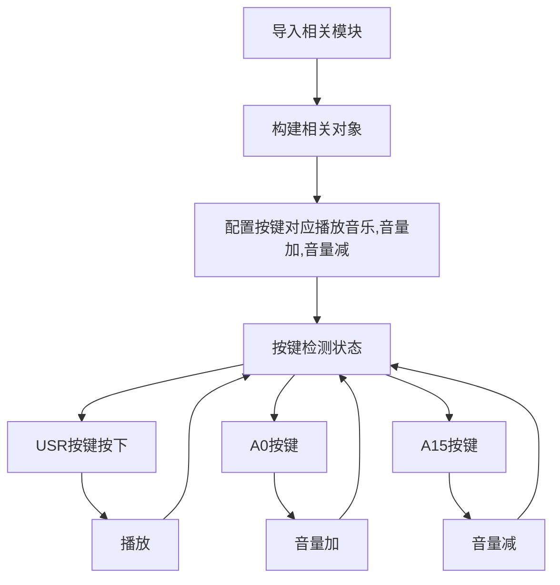
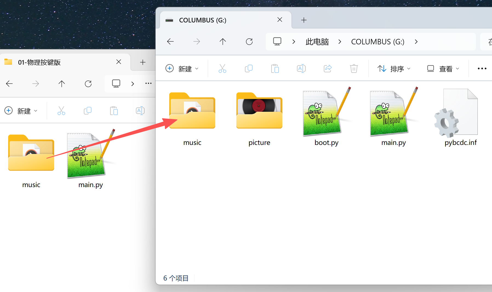
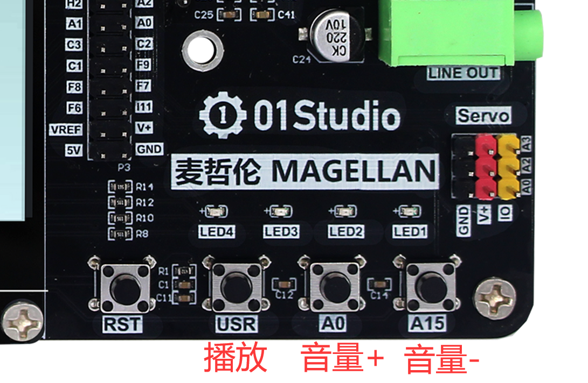
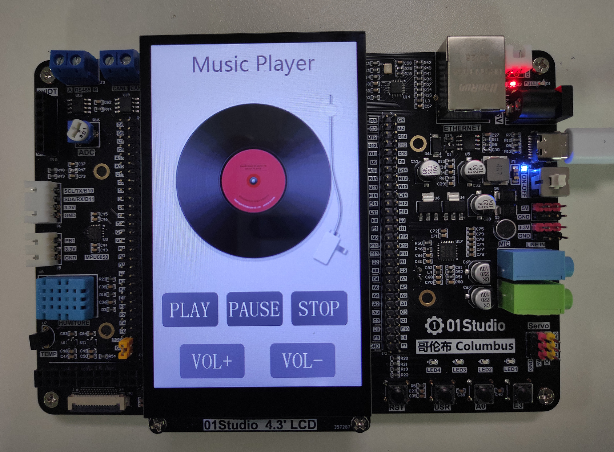

# 音频播放

## 前言
麦哲伦开发板上集成了音频解码芯片，可以播放音乐，本节学习一下编程实现音频文件播放。

## 实验平台
麦哲伦开发套件。


## 实验目的
播放mp3格式音乐文件。

## 实验讲解

麦哲伦开发板上带有WM8978音频解码芯片，具备多路音频输出、麦克风和线性音频输入功能。


开发板背面有一个8Ω/1W自带音腔的小喇叭，音乐可以通过这个喇叭直接播放出来声音。


和以往一样，01Studio已经将WM8978的驱动封装好了驱动模块，用户直接根据对象来调用即可。对象介绍如下：

## WM8978对象

### 构造函数
```python
wm = audio.WM8978()
```
构建音频对象。

### 使用方法
```python
WM8978.load(filename)
```
加载音频文件。支持格式：mp3/wav
- `filename`: 路径+名称，如：WM8978.load(“/flash/test.mp3”)

<br></br>

```python
WM8978.volume(vol=80)
```
调整音量大小，默认80。
- `vol`: 音量大小，范围0-100，整数。

<br></br>

```python
WM8978.play()
```
播放音乐。执行该函数会进入阻塞。

<br></br>

```python
WM8978.pause()
```
暂停播放

<br></br>

```python
WM8978.continue_play()
```
继续播放。暂停后执行该函数可以继续播放。

<br></br>

```python
WM8978.stop()
```
停止播放。

<br></br>


更多用法请阅读官方文档：<br></br>
https://docs.01studio.cc/library/columbus/audio.html

麦哲伦有三个按键，我们可以分别设置用来控制音乐播放、音量加和音量减。编程思路如下：




## 参考代码

```python
'''
实验名称：音频播放
版本：v1.0
平台：麦哲伦开发板
作者：01Studio
说明：MP3/WAV音频文件播放。使用物理按键控制
'''

#导入相关模块
import audio,time
from pyb import Switch
from machine import Pin

#构建音频对象
wm=audio.WM8978()

vol = 80 #音量初始化，80

######################
# 播放 USR按键
######################
play_flag = 0

def music_play():
    global play_flag
    play_flag = 1

sw =Switch()
sw.callback(music_play)

######################
# 音量加 A0按键
######################
VOL_U = Pin('A0',Pin.IN,Pin.PULL_UP) 

vol_up_flag = 0

def vol_up(VOL_U):

    global vol

    #消除按键抖动
    if VOL_U.value() == 0:
        time.sleep_ms(10)
        if VOL_U.value() == 0:
            vol=vol+10
            if vol > 100:
                vol = 100
            wm.volume(vol)

VOL_U.irq(vol_up,Pin.IRQ_FALLING, hard=1) #定义中断，下降沿触发

######################
# 音量减 A15按键
######################

VOL_D = Pin('A15',Pin.IN,Pin.PULL_UP) 

vol_down_flag = 0

def vol_down(VOL_D):

    global vol

    #消除按键抖动
    if VOL_D.value() == 0:
        time.sleep_ms(10)
        if VOL_D.value() == 0:
            vol=vol-10
            if vol < 10:
                vol = 10
            wm.volume(vol)

VOL_D.irq(vol_down,Pin.IRQ_FALLING, hard=1) #定义中断，下降沿触发

#加载音乐
wm.load('/flash/music/Seasons In The Sun.mp3')

while True:

    #播放音乐
    if play_flag == 1:

        wm.play()
        play_flag = 0
```

## 实验结果

本实验需要将示例代码的MP3音频文件拷贝到麦哲伦开发板，大文件推荐直接U盘拷贝而非thonny上传，速度会快很多。



运行后按USR键，音乐开始播放，通过A0按键控制音量加，A15按键控制音量减。



## 实验拓展 - 触摸按键版

音乐播放除了播放和音量调整，还有暂停播放、停止等功能，但麦哲伦上只有3个功能按键，因此我们可以通过LCD触摸按钮来控制，让实验操控变得更丰富。

### 参考代码

```python
'''
实验名称：音频播放
版本：v1.0
平台：麦哲伦开发板
作者：01Studio
说明：mp3/wav音频文件播放，使用触摸按键控制。
'''

from tftlcd import LCD43R
from touch import FT5436
from pyb import Timer
import audio,gui,time

#音频 初始化
wm=audio.WM8978()

#定义常用颜色
BLACK = (0,0,0)
WHITE = (255,255,255)
RED = (255,0,0)
GREEN = (0,255,0)
BLUE = (0,0,255)
#灰色
GRAY1 =(0x80,0x80,0x80)
GRAY2 =(0xa0,0xa0,0xa0)

#LCD初始化
d = LCD43R(portrait=4)
d.fill(WHITE) #填充白色

#显示音乐播放器背景
d.Picture(0,0,"/flash/picture/music_player.jpg")

#触摸屏初始化
t = FT5436(portrait=4)

########################
#定义音频相关按键和回调函数
########################
audio_flag = 0
pause_flag = 0 #暂停标志位

#首次播放和继续播放共用
def fun1(B1):

    global audio_flag,pause_flag

    #如果是暂停后按play按钮，则继续播放
    if pause_flag == 1:
        wm.continue_play()
        pause_flag =0

    audio_flag = 1

#暂停播放
def fun2(B2):
    global pause_flag
    wm.pause()#暂停播放
    pause_flag = 1

#停止播放
def fun3(B3):
    wm.stop()#停止播放

#音量加
def fun4(B4):
    global vol
    vol = vol+10
    if vol > 100:
        vol = 100
    print(vol)
    wm.volume(vol)

#音量减
def fun5(B5):
    global vol
    vol = vol-10
    if vol < 0:
        vol = 0
    print(vol)
    wm.volume(vol)


B1 = gui.TouchButton(20,580,130,80,GRAY1,'PLAY',WHITE,fun1)
B2 = gui.TouchButton(170,580,130,80,GRAY1,'PAUSE',WHITE,fun2)
B3 = gui.TouchButton(320,580,130,80,GRAY1,'STOP',WHITE,fun3)
B4 = gui.TouchButton(60,700,150,80,GRAY2,'VOL+',WHITE,fun4)
B5 = gui.TouchButton(270,700,150,80,GRAY2,'VOL-',WHITE,fun5)

#############################
#### 定时器用于触发按钮事件 ##
#############################
tim_flag = 0

def count(tim):
    global tim_flag
    tim_flag = 1

tim = Timer(1,freq=50) #20ms刷新一次
tim.callback(count)

#加载音乐
wm.load('/flash/music/Seasons In The Sun.mp3')

vol = 80 #音量初始默认80，范围：0-100

while True:

    #执行按钮触发的任务
    if tim_flag == 1:
        t.tick_inc()
        gui.task_handler()
        tim_flag = 0


    #播放音乐
    if audio_flag == 1:
        wm.stop() #从头播放前先停止之前的播放
        wm.play()
        audio_flag = 0
```

### 实验结果

本例程还增加了背景图片，使得音乐播放器外观更漂亮。需要将例程所有素材文件一并拷贝到开发板文件系统下，运行代码，实验结果如下：



本节通过编程实现了mp3音乐文件的播放，结合LCD和触摸，更是诞生了一个简易的音乐播放器。用户可以根据自己的需求继续完善此播放器，如实现自动读取音频文件、上一曲、下一曲等功能。