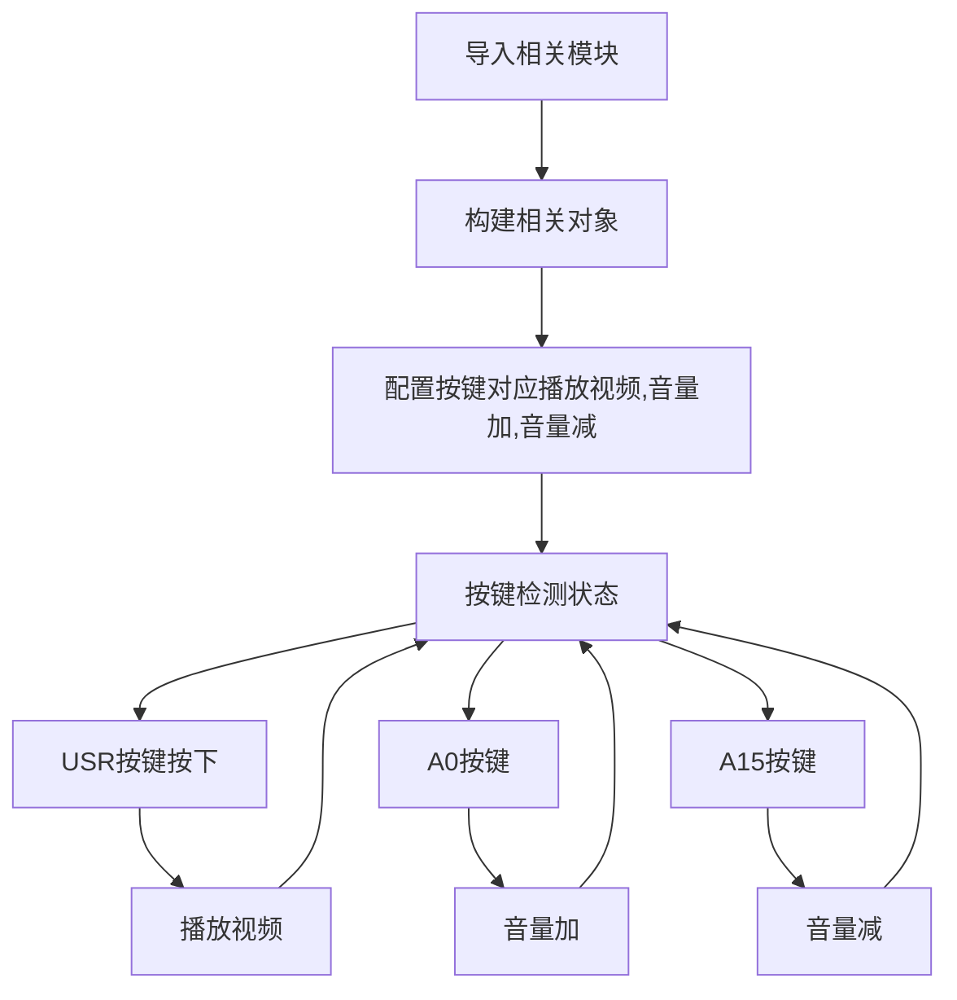

# 视频播放

## 前言
除了音频播放，麦哲伦还支持视频文件播放。目前支持的是avi格式，本节我们来学习如何在麦哲伦开发板上播放视频。

## 实验平台
麦哲伦开发套件。SD卡（存放视频文件）


## 实验目的
编程实现视频播放。

## 实验讲解

和音频播放一样，01Studio已经将复杂的视频解码、播放相关功能封装成micropython库，用户只需要关注使用即可。目前支持的格式是AVI视频文件。视频对象如下：

## VIDEO对象

### 构造函数
```python
v = video.VIDEO()
```
构建视频对象。

### 使用方法
```python
VIDEO.load(filename)
```
加载视频文件，格式avi (分辨率不能过大)
- `filename`: 路径+VIDEO.load('/sd/test.avi')

<br></br>

```python
VIDEO.play()
```
播放视频，执行该函数会进入阻塞。

<br></br>

```python
VIDEO.pause()
```
暂停播放。

<br></br>

```python
VIDEO.continue_play()
```
继续播放，暂停后执行改函数可以继续播放。

<br></br>

```python
VIDEO.stop()
```
停止播放。

<br></br>

```python
VIDEO.volume(vol=80)
```
调整音量大小，默认80。
- `vol`: 音量大小，范围0-100，整数。

<br></br>

更多用法请阅读官方文档：<br></br>
https://docs.01studio.cc/library/columbus/video.html

麦哲伦的主控STM32h743的主频决定了不能播放大帧率的视频文件，否则会出现卡顿或无法播放情况。从上表可以看到视频播放的操作方式跟音频非常类似。我们用3个功能按键来实现播放、音量加、音量减功能。编程思路如下：




## 参考代码

```python
'''
实验名称：视频播放
版本：v1.1
平台：麦哲伦开发板
作者：01Studio
说明：AVI视频文件播放。
'''

#导入相关模块
import video,time
from pyb import Switch
from machine import Pin
import tftlcd

########################
# 构建4.3寸LCD对象并初始化
########################
d = tftlcd.LCD43R(portrait=4) #默认方向

#构建视频文件对象
v=video.VIDEO()

vol = 80 #音量初始默认80，范围：0-100

######################
# 播放 USR按键
######################
play_flag = 0 #播放标志位

def video_play():
    global play_flag
    play_flag = 1

sw =Switch()
sw.callback(video_play)

######################
# 音量加 A0按键
######################
VOL_U = Pin('A0',Pin.IN,Pin.PULL_UP) #构建按键A0

def vol_up(VOL_U):

    global vol

    #消除按键抖动
    if VOL_U.value() == 0:
        time.sleep_ms(10)
        if VOL_U.value() == 0:
            vol=vol+10
            if vol > 100:
                vol = 100
            v.volume(vol)

#定义中断，下降沿触发,视频播放必须使用硬件中断
VOL_U.irq(vol_up,Pin.IRQ_FALLING,hard=1)

######################
# 音量减 A15按键
######################

VOL_D = Pin('A15',Pin.IN,Pin.PULL_UP) #构建按键A15

def vol_down(VOL_D):

    global vol

    #消除按键抖动
    if VOL_D.value() == 0:
        time.sleep_ms(10)
        if VOL_D.value() == 0:
            vol=vol-10
            if vol < 10:
                vol = 10
            v.volume(vol)

#定义中断，下降沿触发,视频播放必须使用硬件中断
VOL_D.irq(vol_down,Pin.IRQ_FALLING,hard=1)

#加载视频
v.load('/sd/video/badapple.avi')

while True:

    #播放视频
    if play_flag == 1:

        v.play()
        play_flag = 0
```

## 实验结果

本实验示例avi视频文件badapple.avi比较大，所以需要使用SD卡作为文件系统。将示例程序所有文件拷贝到SD卡，上电运行程序。**按下USR键**可以看到视频开始播放，通过按“A0”键增加音量，按“A15”键减少音量。


## 实验拓展 - 触摸按键版

视频播放除了播放和音量调整，还有暂停播放、停止等功能，但麦哲伦上只有3个功能按键，因此我们可以通过LCD触摸按钮来控制，让实验操控变得更丰富。

### 参考代码

```python
'''
实验名称：视频播放
版本：v1.0
平台：麦哲伦开发板 + 4.3寸RGB屏
作者：01Studio
说明：AVI视频文件播放，使用触摸按钮控制（触摸按钮长按触发）。
'''

#导入相关模块
import video, tftlcd, touch, gui, time
from pyb import Timer

#定义常用颜色
BLACK = (0,0,0)
WHITE = (255,255,255)
RED = (255,0,0)
GREEN = (0,255,0)
BLUE = (0,0,255)

#灰色
GRAY1 =(0x80,0x80,0x80)
GRAY2 =(0xa0,0xa0,0xa0)

# #初始化LCD
d = tftlcd.LCD43R(portrait=4)
d.fill(BLACK)

#触摸屏初始化
t = touch.FT5436(portrait=4)#默认方向

#构建视频文件对象
v=video.VIDEO()

vol = 80 #音量初始默认80，范围：0-100

########################
#定义音频相关按键和回调函数
########################
video_flag = 0
pause_flag = 0 #暂停标志位

#首次播放和继续播放共用
def fun1(B1):

    global video_flag,pause_flag

    #如果是暂停后按play按钮，则继续播放
    if pause_flag == 1:
        v.continue_play()
        pause_flag =0

    video_flag = 1

#暂停播放
def fun2(B2):
    global pause_flag
    v.pause()#暂停播放
    pause_flag = 1

#停止播放
def fun3(B3):
    
    global video_flag    
    video_flag = 0    
    v.stop()#停止播放    

#音量加
def fun4(B4):
    global vol
    vol = vol+10
    if vol > 100:
        vol = 100
    print(vol)
    v.volume(vol)

#音量减
def fun5(B5):
    global vol
    vol = vol-10
    if vol < 0:
        vol = 0
    print(vol)
    v.volume(vol)


B1 = gui.TouchButton(20,580,130,80,GRAY1,'PLAY',WHITE,fun1)
B2 = gui.TouchButton(170,580,130,80,GRAY1,'PAUSE',WHITE,fun2)
B3 = gui.TouchButton(320,580,130,80,GRAY1,'STOP',WHITE,fun3)
B4 = gui.TouchButton(60,700,150,80,GRAY2,'VOL+',WHITE,fun4)
B5 = gui.TouchButton(270,700,150,80,GRAY2,'VOL-',WHITE,fun5)
# #############################
# #### 定时器用于触发按钮事件 ##
# #############################
tim_flag = 0

def count(tim):
    global tim_flag
    tim_flag = 1

tim = Timer(1,freq=50) #20ms刷新一次
tim.callback(count)

#加载视频
v.load('/sd/video/badapple.avi')

while True:

    #执行按钮触发的任务
    if tim_flag == 1:
        t.tick_inc()
        gui.task_handler()
        tim_flag = 0

    #播放音乐
    if video_flag == 1:
        v.stop() #从头播放前先停止之前的播放
        v.play()
        audio_flag = 0
```

### 实验结果

运行代码，实验结果如下：


本节学习了micropython视频播放应用，但由于麦哲伦的主控主频并不是太高，因此当用来播放分辨率较大的视频时可能会出现卡顿。


