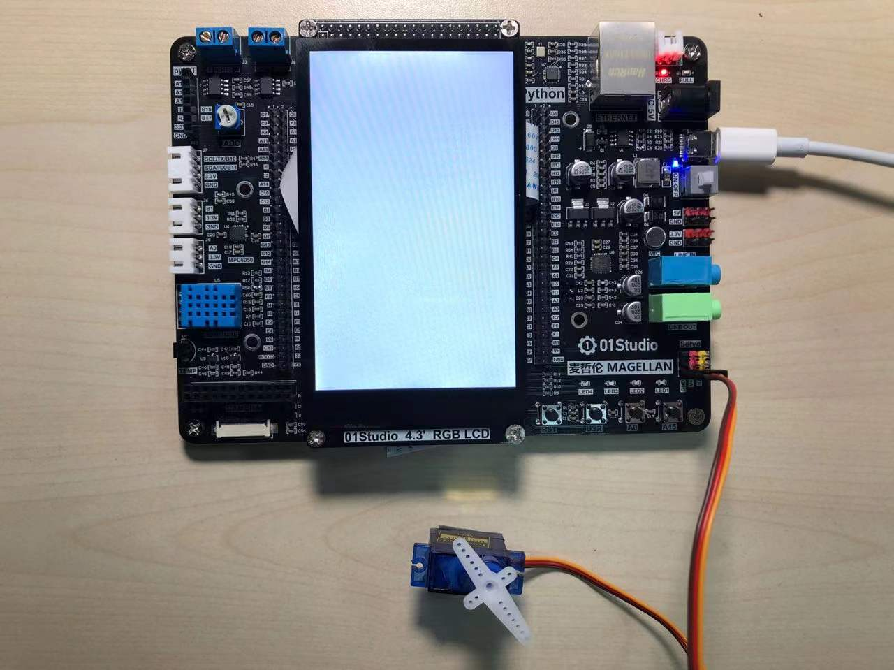
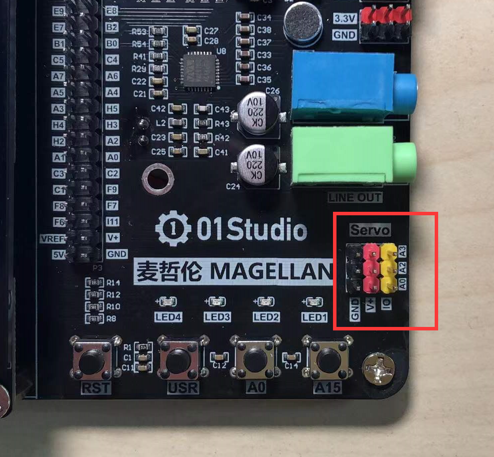
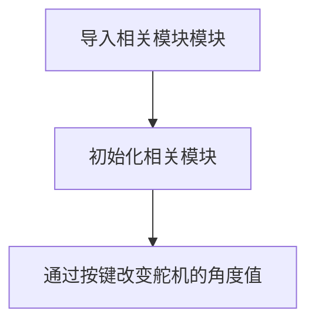
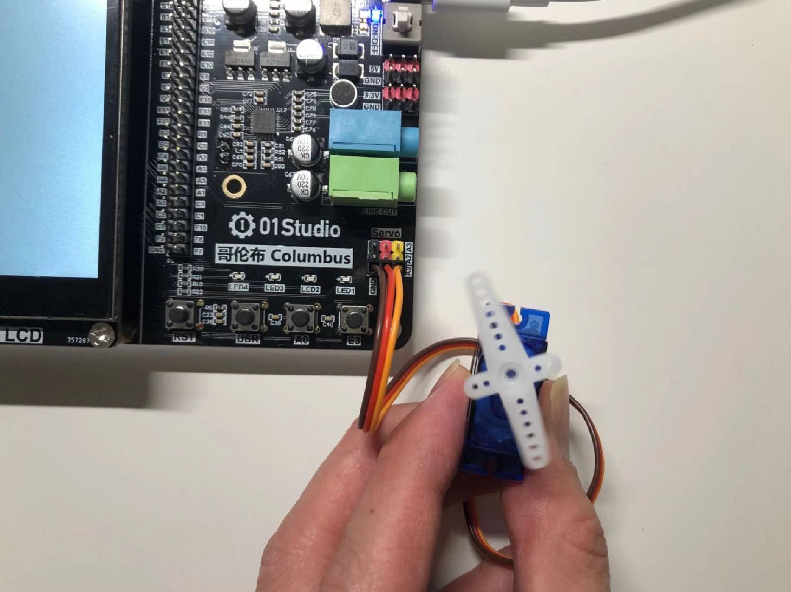

# 舵机

## 前言
舵机又叫伺服电机，是一个可以旋转特定角度的电机，可转动角度通常是90°、180°和360°（360°可以连续旋转）。我们看到的机器人身上就有非常多的舵机，它们抬手或者摇头的动作往往是通过舵机完成，因此机器人身上的舵机越多，意味着动作越灵活。

## 实验平台
麦哲伦开发套件和SG90舵机。[**点击购买>>**](https://item.taobao.com/item.htm?id=623613580232)



:::danger 警告
请确认舵机内置隔离电路，或使用小功率舵机，避免反向电动势击穿主控损坏。
:::


## 实验目的
通过编程实现对SG90舵机的控制。

## 实验讲解

舵机对象通过3线（一般舵机的线序为信号，电源，地）控制，本节实验用到的是性价比较高的SG90舵机。通常情况下：黑色表示GND，红色表示VCC，橙色表示信号线。


麦哲伦开发板支持3路舵机驱动，也就是说有3个位置可以接舵机，分别对应PA0,PA2,PA3引脚。



180°舵机的控制一般需要一个20ms左右的时基脉冲，该脉冲的高电平部分一般为0.5ms-2.5ms范围内的角度控制脉冲部分，总间隔为2ms。以180度角度伺服为例，在MicroPython编程对应的控制关系是从-90°至90°，示例图如下：


而对于360°连续旋转舵机，上面的脉冲表则对应从正向最大速度旋转到反向最大速度旋转的过程。

pyBorad固件自带了舵机（Servo）的对象模块，我们可以直接调用，下面是Servo对象说明。

## Servo对象

### 构造函数
```python
s = pyb.Servo(id)
```
构建舵机对象，位于pyb模块下。

- `id` ：4路，取值1-3，对应A0,A2,A3引脚。

### 使用方法
```python
s.angle(angle,time=0)
```
舵机角度控制。

- `angle` ：角度，取值[-90至90]。
- `time` ：旋转到指定角度的时间，单位ms，默认0表示最快

<br></br>

```python
s.speed(speed,time=0)
```
速度控制,用于针对360度连续旋转舵机。

- `angle` ：速度，取值[-100至100]。
- `time` ：开始启动到指定速度的时间，单位ms，默认0表示以最快

<br></br>

更多用法请查看官方文档：https://docs.01studio.cc/library/pyb.Servo.html

代码编程流程图如下：



## 参考代码

```python
'''
实验名称：舵机(Servo)-180°
版本：v1.0
平台：麦哲伦开发套件
作者：01Studio
说明：180°舵机控制。
'''

#导入相关模块
from pyb import Servo,Switch
import time

sw = Switch()     #定义按键对象名字为sw
s1 = Servo(1)     #构建舵机对象s1，输出引脚为PA0

#定义5组角度：-90、-45、0、45、90
angle=[-90,-45,0,45,90]

key_node = 0  #按键标志位
i = 0         #用于选择角度

##############################################
#  按键和其回调函数
##############################################
def key():
    global key_node
    time.sleep_ms(10) #消除抖动
    if sw.value()==0: #确认按键被按下
        key_node = 1

sw.callback(key)  #当按键被按下时，执行函数key()

#指定角度,启动时i=0，默认-90°
s1.angle(angle[i])

while True:

    if key_node==1: #按键被按下
        i = i+1
        if i == 5:
            i = 0
        key_node = 0 #清空按键标志位

        #X1指定角度
        print(i)
        s1.angle(angle[i])
```

## 实验结果

将180°舵机插到A0三线接口，运行程序,通过USR按键按下实现舵机的不同角度。


## 360度连续旋转舵机

我们刚刚实现了180°舵机的角度控制，现在来做一下360°连续旋转舵机的实验，360°连续旋转舵机可以实现直流减速电机功能，用在小车或者航模上。

实验的基础条件和方式不变，我们只需要将角度参数【-90至90】改成速度【-100至100】即可。修改后的程序代码如下：

### 参考代码
```python
'''
实验名称：舵机(Servo)-360°连续旋转
版本：v1.0
平台：麦哲伦开发套件
作者：01Studio
说明：180°舵机控制。
'''

#导入相关模块
from pyb import Servo,Switch
import time

sw = Switch()     #定义按键对象名字为sw
s1 = Servo(1)     #构建舵机对象s1，输出引脚为PA0

#定义5组速度值,0表示停止
speed=[-100,-50,0,50,100]

key_node = 0  #按键标志位
i = 0         #用于选择角度

##############################################
#  按键和其回调函数
##############################################
def key():
    global key_node
    time.sleep_ms(10) #消除抖动
    if sw.value()==0: #确认按键被按下
        key_node = 1

sw.callback(key)  #当按键被按下时，执行函数key()

#指定速度
s1.speed(speed[i])

while True:

    if key_node==1: #按键被按下
        i = i+1
        if i == 5:
            i = 0
        key_node = 0 #清空按键标志位

        #X1指定角度
        print(i)
        s1.angle(angle[i])

```

实验结果如下：



通过本节我们学会了使用不同类型的舵机，通过多路电机的组合使用，可以实现模型、航模、小车、机器人的实验。
