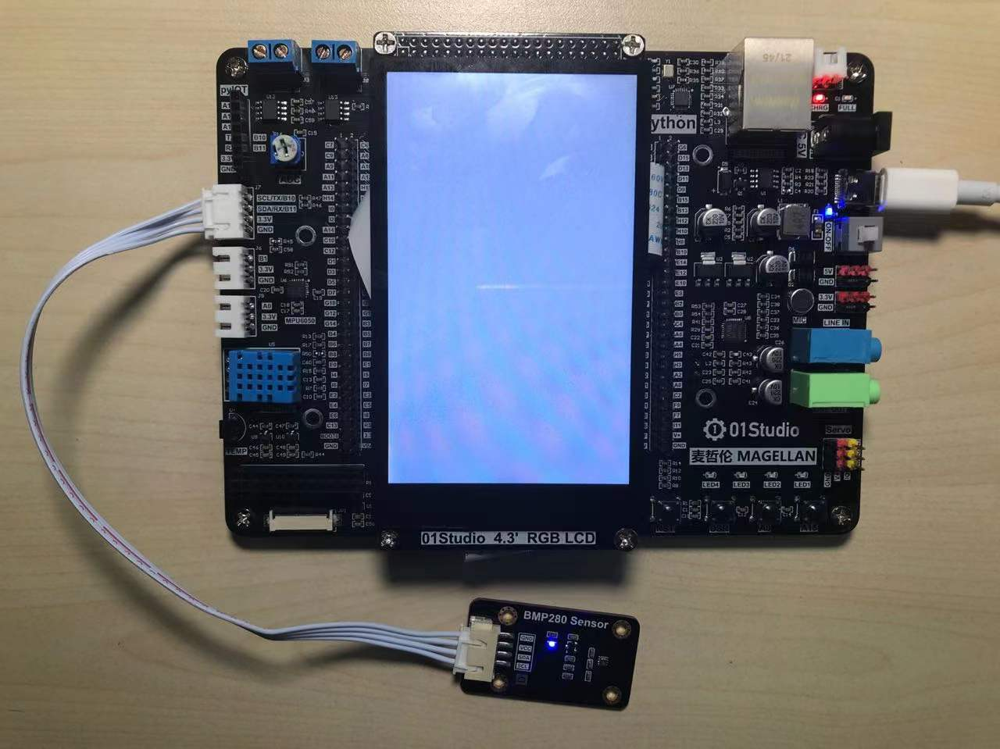
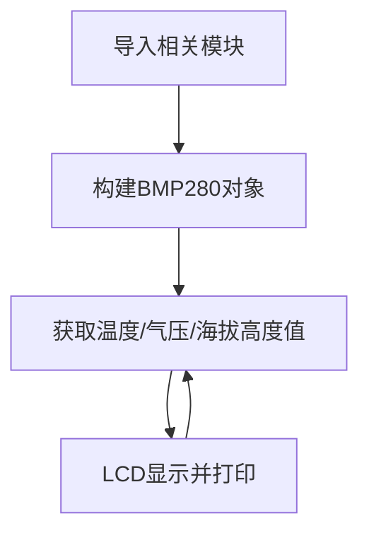

# 大气压强传感器（BMP280）

## 前言
本实验中大气压强传感器模块使用的是BMP280，这是一款专为移动应用而设计的高精度大气压传感器， 传感器模块采用极其紧凑的封装，其小尺寸和低功耗可以应用在手机、 GPS 模块、 手表的电池供电设备中。 BMP280 传感器除了可以测量大气压强，还可以测量温度（温度精度不高）以及通过计算公式来换算出海拔高度。

## 实验平台
麦哲伦MicroPython开发套件和大气压强传感器模块，传感器连接到I2C/UART扩展接口。

 


## 实验目的
编程测量当前环境的大气压强、温度信息，将大气压强通过公式计算出当前海拔高度，并在LCD显示。打造自己的气压计！

## 实验讲解

市面上大多BMP280模块都通用，使用I2C总线通讯，下图是一款BMP280传感器模块：[**点击购买>>**](https://item.taobao.com/item.htm?id=624198694192)


 

|  模块参数 |
|  :---:  | ---  |
| 供电电压  | 3.3V |
| 工作电流  | <20mA |
| 通信方式  | I2C总线 |
| I2C地址  | 0x76（BMP280的SDO默认下拉）；<br></br> 当 BMP280 的 SDO 引脚上拉时，I2C 地址为：0x77 | 
| 引脚说明  | `VCC`: 接3.3V <br></br> `GND`: 接地 <br></br>  `SDA`: I2C数据引脚  <br></br> `SCL`: I2C时钟引脚 |

<br></br>

从上面介绍可以看到，BMP280是一款通过I2C接口驱动的传感器。连接到我们的I2C/UART外扩接口上。我们通过前面学习的I2C接口使用的方式，即可以对该模块实现数据通讯。

**海拔高度计算：**

标准大气压是指把温度为0℃、纬度45度海平面（海拔为0米）上的气压称为1个大气压，其数值为101325 帕斯卡（Pa）。

大气压和海拔高度的关系：P=P0×（1-H/44300)^5.256

因此计算高度公式为：H=44300*(1- (P/P0)^(1/5.256) )

上式中：H为海拔高度，P0=标准大气压（0℃，101325Pa）

从上面公式可以看到，高度是通过大气压强换算出来的，从物理学的角度我们可以知道，高度越高的地方，空气越稀薄，大气压强越低。通过气压的变化我们就可以计算出海拔高度；但是这存在特定条件，那就是温度为0℃的时候，而温度越高的地方，空气越稀薄，大气压强就越低。因此高度数据理论上需要做温度补偿，因此本实验的高度值换算存在一定的误差。有兴趣的小伙伴可以自行深入研究。


Python的强大之处是其有丰富的模块和函数库，一旦模块建立了，那么后来者使用起来就非常简单，无须再去做底层驱动的开发。从而实现面向对象的编程，而当有需要的时候又可以去改底层代码，可以说是进可攻退可守，非常灵活。在这里我们直接调用已经编写好的python驱动文件，该文件实现了对大气压、温度、高度的测量和计算。用户直接使用即可，具体如下：

## BMP280对象

### 构造函数
```python
bmp = bmp280.BMP280(i2c)
```
构建bmp280对象。

参数说明：
- `i2c` :定义好的I2C对象。

### 使用方法

```python
bmp.getTemp()
```
返回温度值，单位℃，数据类型为`float`。

<br></br>

```python
bmp.getPress()
```
返回气压值，单位Pa，数据类型为`float`。

<br></br>

```python
bmp280.pressure()
```
返回大气压强值，单位hPa (1hPa = 100Pa), 数据类型为`float`

<br></br>

```python
bmp.getAltitude()
```
返回海拔高度值，单位m, 数据类型为`float`。

<br></br>

理解了BMP280传感器原理和对象使用方法后，我们可以整理出编程思路，流程图如下 ：



## 参考代码

```python
'''
实验名称：大气压强传感器
版本：v1.0
平台：麦哲伦开发套件
作者：01Studio 【www.01Studio.cc】
说明：测量BMP280温度、气压和计算海拔值，并在LCD上显示。
'''

#导入相关模块
import time,bmp280
from machine import Pin,SoftI2C
from tftlcd import LCD43R

#定义常用颜色
WHITE=(255,255,255)
BLACK = (0,0,0)

#初始化LCD
d=LCD43R(portrait=4)
d.fill(WHITE) #填充白色

#初始化BMP280
i2c = SoftI2C(scl ='B10' ,sda = 'B11')
BMP = bmp280.BMP280(i2c)

#显示标题
d.printStr('01Studio BMP280', 40, 10, BLACK, size=4)

while True:

    #采集温度、压强、高度信息数据并用LCD显示：
    d.printStr('Temp: ' + str(BMP.getTemp()) + ' C', 10, 100, BLACK, size=4)
    d.printStr('Press: ' + str(BMP.getPress()) + ' Pa', 10, 200, BLACK, size=4)
    d.printStr('Altitude: ' + str(BMP.getAltitude()) + ' M', 10, 300, BLACK, size=4)

    time.sleep(1) #延时1秒
```

## 实验结果

将资料包的`bmp280.py`文件上传到开发板文件系统，运行程序，可以看到LCD显示采集到的实验结果。包含温度、大气压和计算得到的海拔高度信息。

 

本节实现了大气压强传感器模块BMP280的应用，而且实验结果的精度很高，有兴趣的小伙伴可以结合自己情况，打造一个属于自己的气压计，然后到户外暴走！