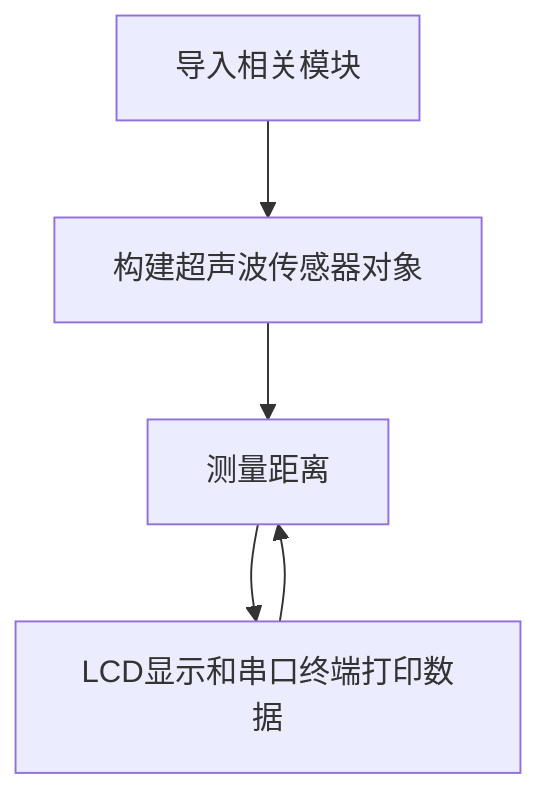

# 超声波测距（HC-SR04）

## 前言
超声波传感器是一款测量距离的传感器。其原理是利用声波在遇到障碍物反射接收结合声波在空气中传播的速度计算的得出。在测量、避障小车，无人驾驶等领域都有相关应用。

## 实验平台
麦哲伦MicroPython开发套件和超声波传感器模块，传感器模块连接到I2C/UART扩展接口。

 

## 实验目的
通过MicroPython编程实现超声波测量距离并在OLED上显示相关数据。

## 实验讲解

我们先来看看超声波传感器模块的介绍：[**点击购买>>**](https://item.taobao.com/item.htm?id=624198434340)


 

|  模块参数 |
|  :---:  | ---  |
| 供电电压  | 3.3V |
| 引脚说明  | XH2.54防呆接口（4Pin）【GND、VCC、ECHO、TRIG】 |
| 测量距离  | 2cm~450cm |
| 测量精度  | 0.5cm | 
| 整体尺寸  | 5.5*4.5*3.0 cm | 


<br></br>

超声波传感器模块使用两个IO口分别控制超声波发送和接收，工作原理如下：

1. 给超声波模块接入电源和地；
2. 给脉冲触发引脚（trig）输入一个长为20us的高电平方波；
3. 输入方波后，模块会自动发射8个40KHz的声波，与此同时回波引脚（echo）端的电平会由0变为1；（此时应该启动定时器计时）
4. 当超声波返回被模块接收到时，回波引 脚端的电平会由1变为0；（此时应该停止定时器计数），定时器记下的这个时间即为超声波由发射到返回的总时长；
5. 根据声音在空气中的速度为340米/秒，即可计算出所测的距离。

下面是超声波传感器HCSR04的时序触发图：

 

以上普及了超声波传感器的原理，我们已经将其集成在HCSR04.py文件，如想了解代码原理可以打开HCSR04.py文件查看代码实现原理。使用MicroPython开发的用户只需要直接使用即可。使用方法如下：

## HCSR04对象

在CircuitPython中可以直接使用写好的Python库来获取超声波传感器测量的距离值。具体介绍如下：

### 构造函数
```python
sonar = HCSR04(trig,echo)
```
构建超声波模块对象，主要是初始化连接超声波传感器的2个引脚。

- `trig` 超声波发射端引脚；
- `echo` 超声波接收端引脚；

### 使用方法
```python
sonar.getDistance()
```
返回测量距离值，单位cm，数据类型为`float`。

<br></br>

我们构建对象后就可以一直循环获取超声波距离信息了，代码编写流程如下：



## 参考代码

```python
'''
实验名称：超声波传感器
版本：v1.0
平台：麦哲伦开发套件
作者：01Studio 【www.01Studio.cc】
说明：通过超声波传感器测距，并在LCD上显示。
'''

#导入相关模块
import time
from HCSR04 import HCSR04
from machine import Pin,I2C
from tftlcd import LCD43R

#定义常用颜色
WHITE=(255,255,255)
BLACK = (0,0,0)

#初始化LCD
d=LCD43R(portrait=4)
d.fill(WHITE)#填充白色

#初始化接口 trig='B10',echo='B11'
trig = Pin('B10',Pin.OUT_PP)
echo = Pin('B11',Pin.IN)
HC=HCSR04(trig,echo)

#显示标题
d.printStr('01Studio Distance', 40, 10, BLACK, size=4)

while True:

    Distance = HC.getDistance() #测量距离

    #采集距离数据并用LCD显示：
    d.printStr(str(Distance) + ' CM  ', 10, 100, BLACK, size=4)

    print(str(Distance) + ' CM')

    time.sleep(1) #延时1秒
```

## 实验结果

将HCSR04.py文件上传到开发板文件系统，连接超声波传感器，运行代码。

在超声波传感器15cm外放置障碍物，可以看到LCD显示屏实时显示距离数据约为15cm。

 

串口终端同时打印距离信息：

 

除去LCD显示代码，我们实际上只用了2行代码：初始化和调用测量函数就实现了对超神波传感器测距的应用。这让我们再一次感受到了MicroPython的魅力。赶快动作制作自己的避障小车和其他好玩的创作吧。
