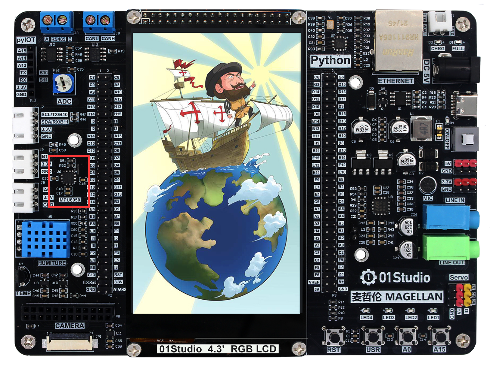
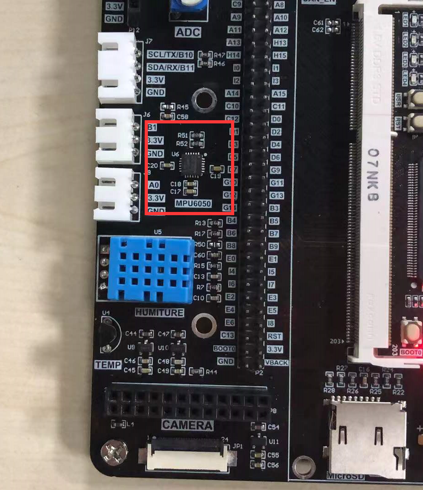
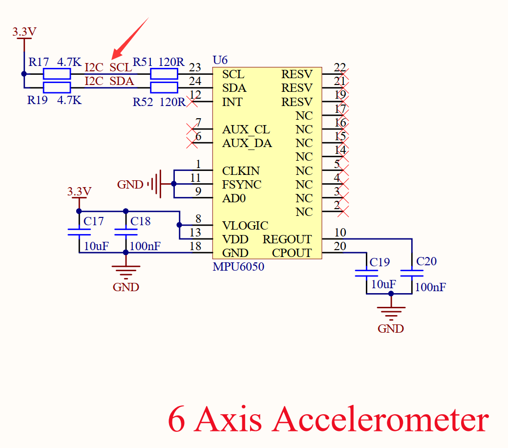
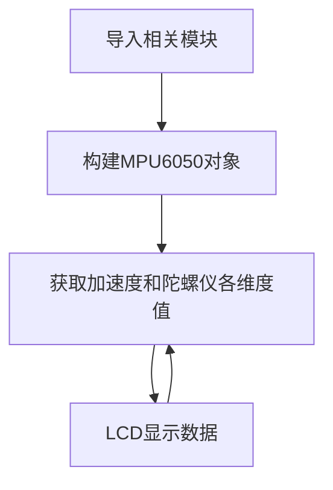
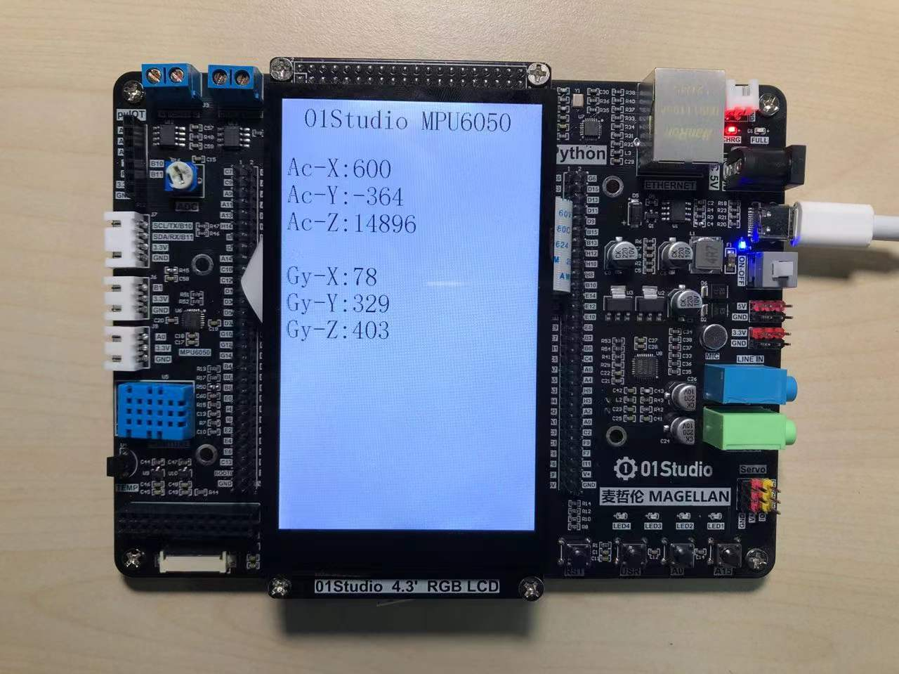

# 六轴加速度计（MPU6050）

## 前言
MPU6050是一款高性能的6轴（三轴加速度+三轴陀螺仪）传感器模块，用于测试物体的运动姿态，I2C接口，本节我们就通过编程来学习读取MPU6050传感器的原始数据。

## 实验平台
麦哲伦MicroPython开发套件。MPU6050传感器位于开发板左侧。

 


## 实验目的
通过编程实现MPU6050六轴传感器数据获取，并显示在LCD上。

## 实验讲解
MPU6050传感器位于麦哲伦开发板的左边中间位置：

 

从原理图可以看到连接到了麦哲伦主控的I2C1接口：

 

|  功能参数 |
|  :---:  | ---  |
| 芯片型号  | MPU6050 |
| 供电电压  | 3.3V |
| 控制方式  | I2C总线 (默认地址：0x68) |
| 测量维度  | 加速度：3维 / 陀螺仪：3维 | 
| 加速度测量范围  | ±2/±4/±8/±16g |
| 陀螺仪测量范围  | ±250/±500/±1000/±2000°/s |
| ADC位数  | 16位 |
| 温度传感器  | 测量范围：-40℃~85℃（精度：±1℃） |

上面介绍可以看到，MPU6050是一款通过I2C接口驱动的传感器。连接到开发板主控的I2C1接口。我们通过前面学习的I2C接口使用的方式，即可以对该模块实现数据通讯。

Micropython模块已经写好，位于例程文件夹里面的mpu6050.py文件，我们来看看其构造函数和使用方法


## mpu6050对象

### 构造函数
```python
mpu6050.accel(i2c)
```
构建MPU6050对象。

参数说明：
- `i2c` :定义好的I2C对象。

### 使用方法

```python
accelerometer.get_values()
```
获取测量数据。返回元组如下：
vals[“AcX”]: 加速度X轴值；
vals [“AcY”] 加速度Y轴值；
vals [“AcZ”] 加速度Z轴值；
vals [“GyX”] 陀螺仪X轴值；
vals [“GyY”] 陀螺仪Y轴值；
vals [“GyZ”] 陀螺仪Z轴值；

<br></br>

理解了MPU6050传感器原理和对象使用方法后，我们可以整理出编程思路，流程图如下 ：



## 参考代码

```python
'''
实验名称：MPU6050六轴传感器
版本：v1.0
平台：麦哲伦开发套件
作者：01Studio
说明：通过编程获MPU6050的6轴（3轴加速度+3轴陀螺仪）和温度数据，并在LCD上显示。
'''

#导入相关模块
import mpu6050,time,gc,time
from machine import SoftI2C,Pin
from tftlcd import LCD43R

#定义常用颜色
WHITE=(255,255,255)
BLACK = (0,0,0)

#初始化LCD
d=LCD43R(portrait=4) #竖屏
d.fill(WHITE) #填充白色

#MPU6050初始化，这里使用软件I2C
i2c = SoftI2C(sda=Pin("H5"), scl=Pin("H4"))
accelerometer = mpu6050.accel(i2c)

#显示标题
d.printStr('01Studio MPU6050', 40, 10, BLACK, size=4)

while True:

    #获取传感器信息
    value=accelerometer.get_values()

    d.printStr('Ac-X:'+str(value["AcX"]), 10, 100, BLACK, size=4)
    d.printStr('Ac-Y:'+str(value["AcY"]), 10, 150, BLACK, size=4)
    d.printStr('Ac-Z:'+str(value["AcZ"]), 10, 200, BLACK, size=4)

    d.printStr('Ac-X:'+str(value["AcX"]), 10, 100, BLACK, size=4)
    d.printStr('Ac-Y:'+str(value["AcY"]), 10, 150, BLACK, size=4)
    d.printStr('Ac-Z:'+str(value["AcZ"]), 10, 200, BLACK, size=4)

    #显示陀螺仪数据
    d.printStr('Gy-X:'+str(value["GyX"]), 10, 300, BLACK, size=4)
    d.printStr('Gy-Y:'+str(value["GyY"]), 10, 350, BLACK, size=4)
    d.printStr('Gy-Z:'+str(value["GyZ"]), 10, 400, BLACK, size=4)

    print(value)
    
    time.sleep_ms(100) #延时
```

## 实验结果

将资料包的`mpu6050.py`文件上传到开发板文件系统，运行程序，可以看到LCD显示采集到的MPU6050六维数据值。

 

拿起开发板并往各个方向转动，可以看到相关数值在变化：

本节通过micropython编程轻松实现了对MPU6050六轴传感器数据采集，但发现采集的是原始数据，因此我们可以用这些数据来进行简单的方向识别。类似于手机的重力感应来旋转屏幕相关的应用。

另外可以看到数据的跳动变化是非常快的，实际应用可以加入数据滤波处理，有兴趣的小伙伴可以自行研究。
