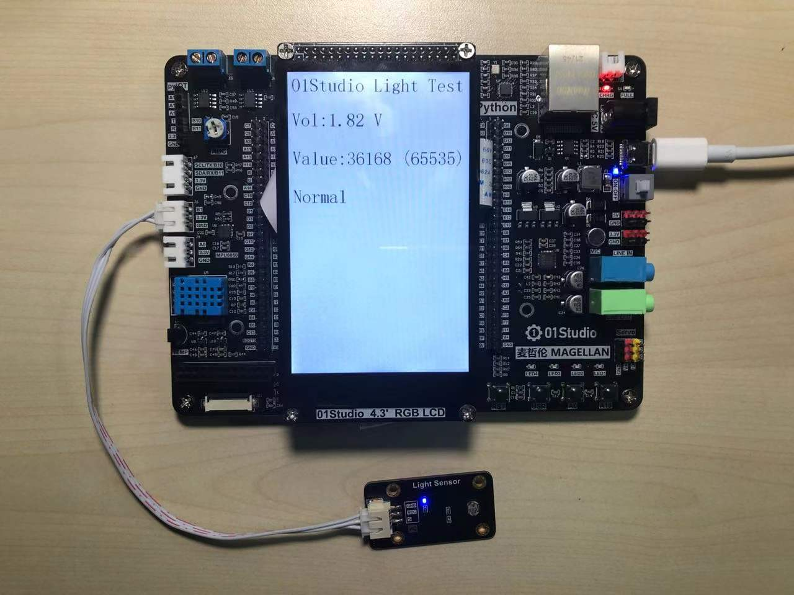
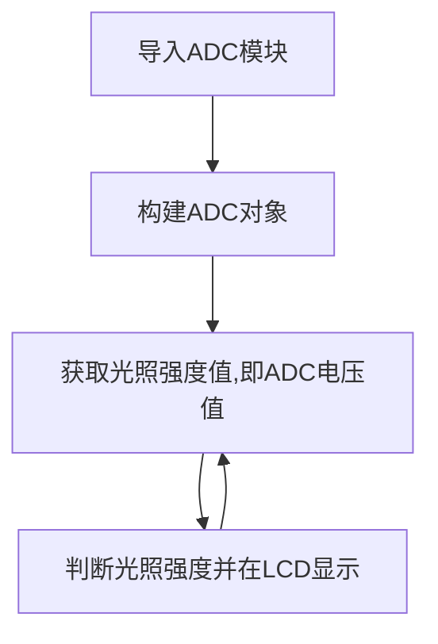
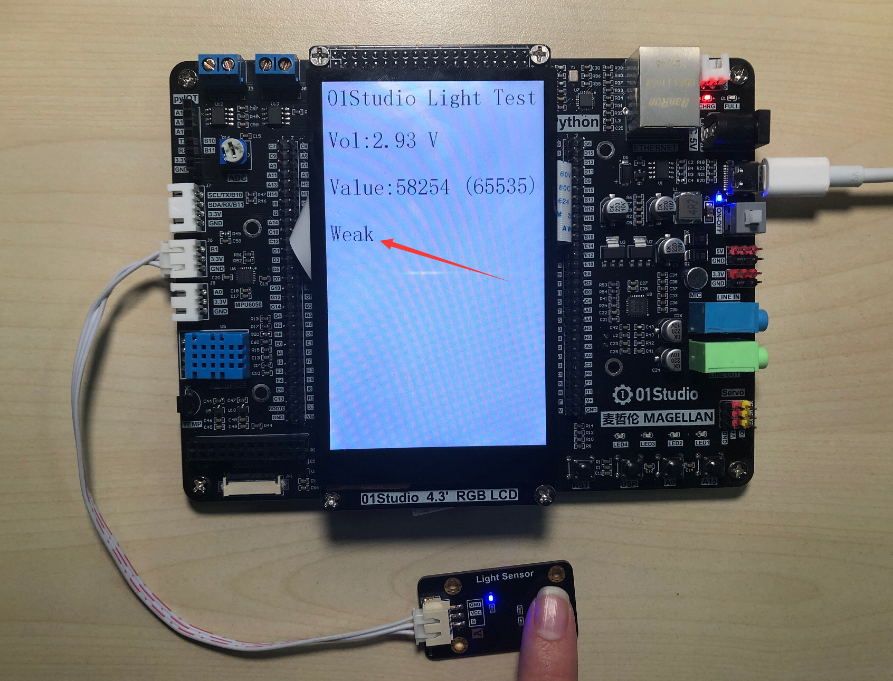
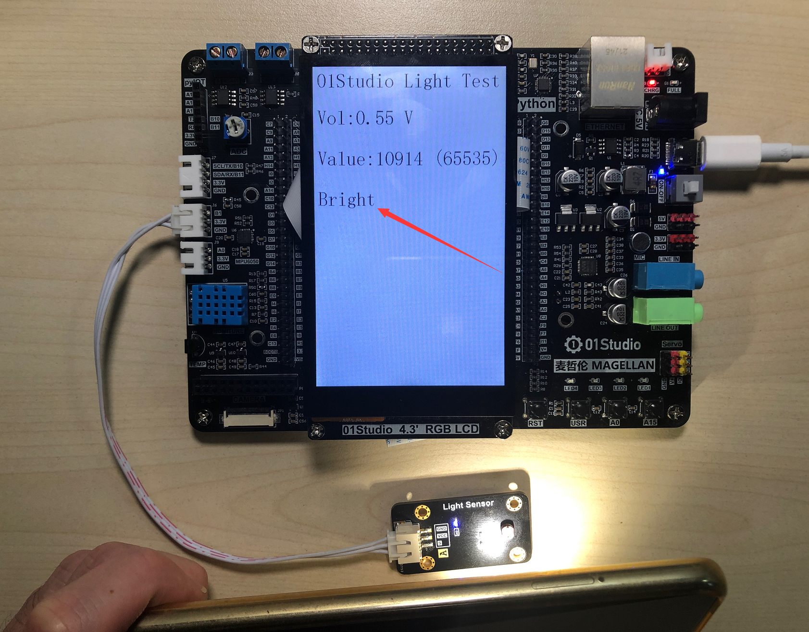

# 光敏传感器

## 前言
光敏传感器实际是一个款可以检测光照强度的传感器，可以应用于我们日常生活中植物光照强度、室内光线检测、以及某些场合的亮度检测。传感器的原理就是将外界模拟变化的信号转变成数字信号（电压值）让单片机出来，处理方式就是常用的ADC（模拟数字转换）。

## 实验平台
麦哲伦开发套件和光敏传感器模块。

 

## 实验目的
采集当前环境的光照强度并在LCD显示，显示方式为：Bright-强，Normal-中等，Weak-弱。

## 实验讲解

我们先来看看光敏传感器模块的介绍： [**点击购买>>**](https://item.taobao.com/item.htm?id=623551464458)

 

|  产品参数 |
|  :---:  |  --- |
| 供电电压  | 3.3V |
| 工作电流  | <20mA |
| 接口定义  | XH2.54防呆接口（3Pin）【GND、VCC、Single】 |
| 输出信号  | 模拟信号：0-3.3V （VCC=3.3V时） |
| 模块尺寸  | 4.5*2.5cm |

从上表可以看到，光敏传感器输出的是模拟信号：0-3.3V，这代表了外界的光照强度。接近0V时光线最强，接近3.3V时，光线最弱。因此我们可以使用基础实验-ADC学习过的内容来编程。

光敏传感器接在传感器3P接口，对应的引脚是“PB1”。ADC使用16bit精度，即最大值为2^16-1=65535。然后我们将检测到的数值0-65535分成三段，分别代表光线强：【0 - 21840】，中等：【21840 - 43680】，弱：【43680 - 65535】。当然开发者可以根据自己实际情况来调整数值。编程流程图如下：

代码编写流程如下：



## 参考代码

```python
'''
实验名称：光敏传感器
版本：v1.0
平台：麦哲伦开发套件
作者：01Studio
说明：通过光敏传感器对外界环境光照强度测量并显示。
'''

#导入相关模块
import machine,time
from machine import Pin
from tftlcd import LCD43R

#定义常用颜色
WHITE=(255,255,255)
BLACK = (0,0,0)
RED=(255,0,0)

#初始化LCD
d=LCD43R(portrait=4) #竖屏
d.fill(WHITE) #填充白色

#初始化ADC
Light = machine.ADC('B1')

#显示标题
d.printStr('01Studio Light Test', 10, 10, BLACK, size=4)

while True:

    value=Light.read_u16() #获取ADC数值

    #LCD显示
    d.printStr('Vol:'+str('%.2f'%(value/65535*3.3))+" V", 10, 100, BLACK, size=4)
    d.printStr('Value:'+str(value)+"   ", 10, 200, BLACK, size=4)
    d.printStr("(65535)", 300, 200, BLACK, size=4)

    #判断光照强度，分3档位显示
    if 0 < value <=21840:
        d.printStr('Bright', 10, 300, BLACK, size=4)

    if 21840 < value <=43680:
        d.printStr('Normal', 10, 300, BLACK, size=4)

    if 43680 < value <=65535:
        d.printStr('Weak   ', 10, 300, BLACK, size=4)

    time.sleep(1) #延时1秒
```

## 实验结果

使用Thonny IDE运行代码，用手遮挡住光敏传感器，可以见到LCD显示光线强势是弱Weak：

 

打开手机手电筒，照在光敏传感器上，可以见到光线强度是强Bright：

 

从实验可以看到，光敏传感器背后的原理是对ADC的应用，实现了改功能后。我们可以自行扩展深入，制作自己喜欢的电子产品。

