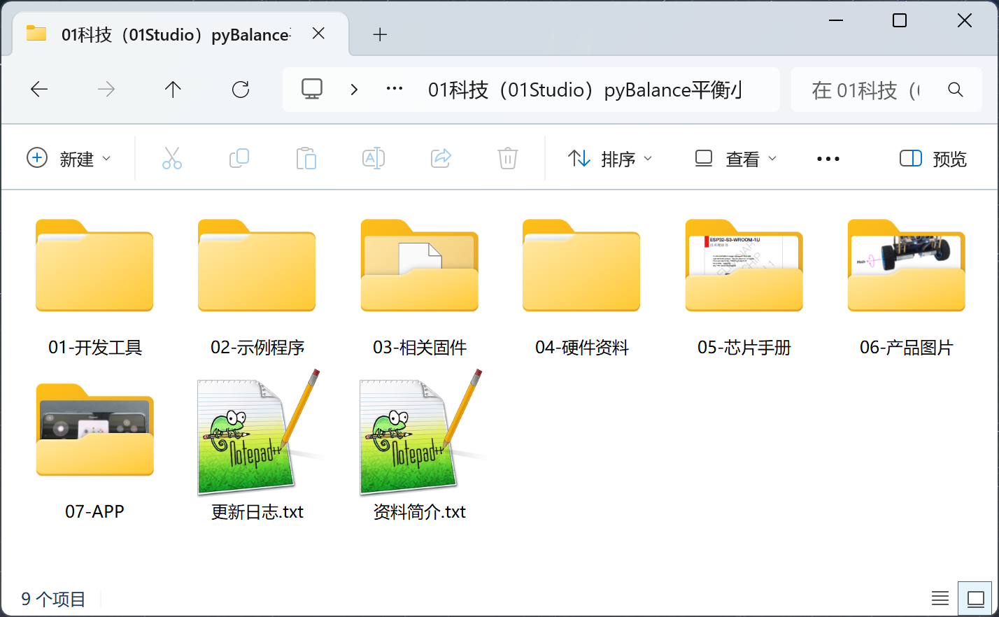
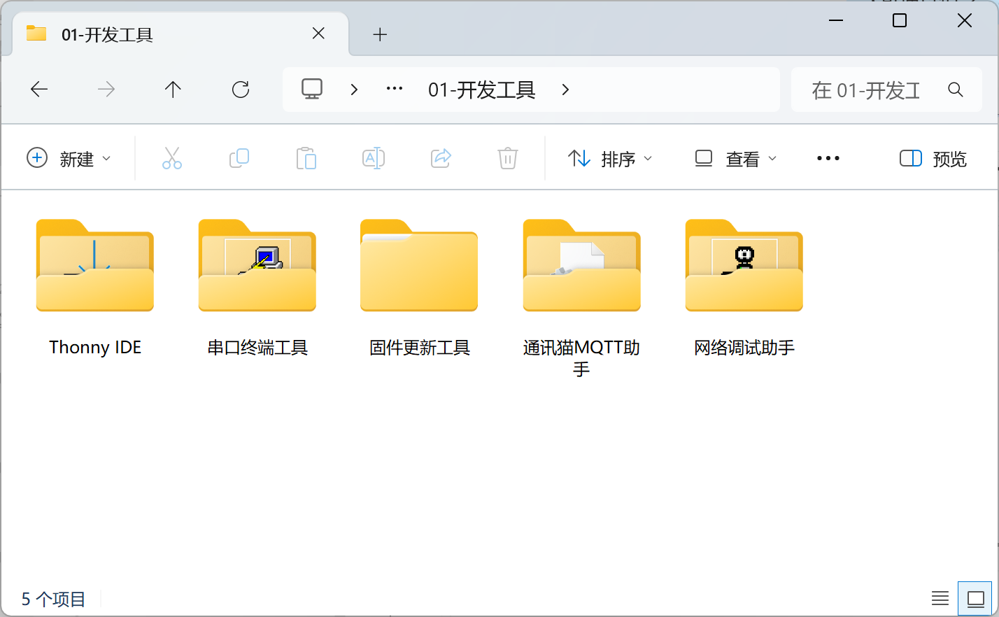
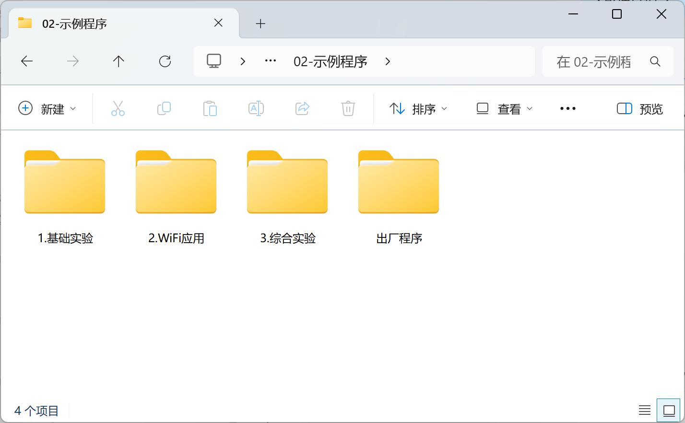
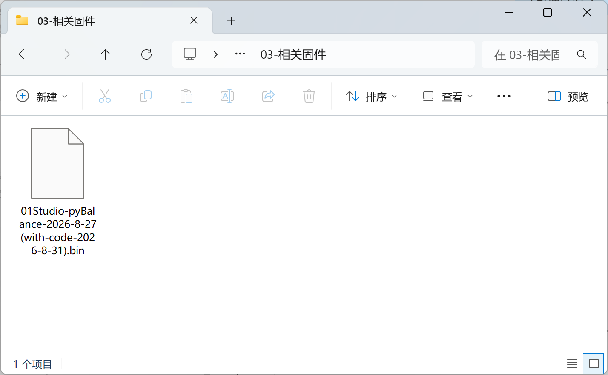
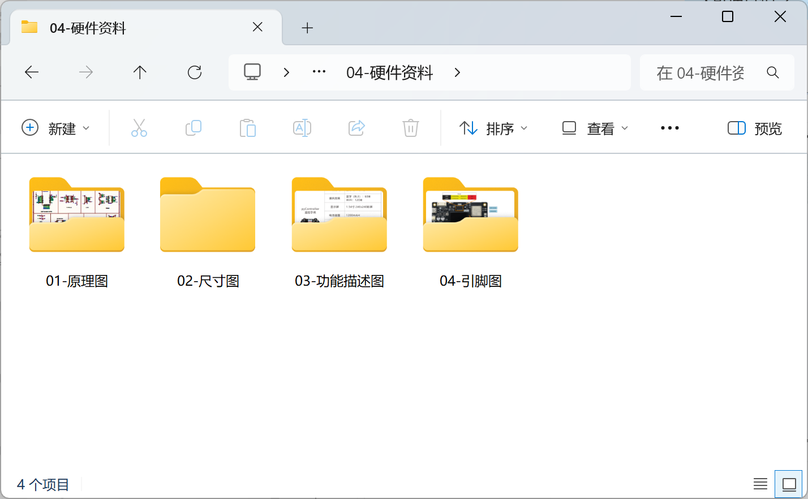
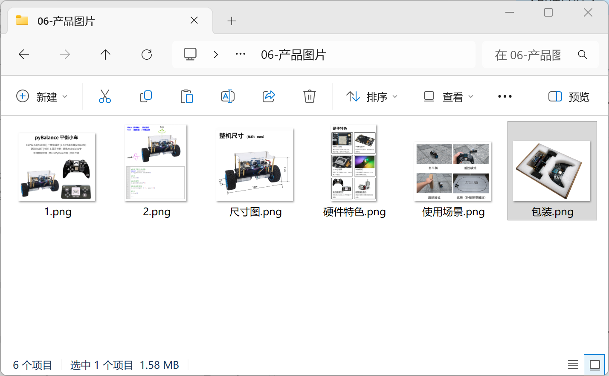

# 开发板资料下载

## 下载方式

### 百度网盘

https://download.01studio.cc/project/pybalance/pybalance.html

### 海外地区下载

- Github仓库：https://github.com/01studio-lab/pyBalance

## 资料介绍：

pyBalance在线教程配套软件、源代码、原理图、芯片手册等。

### 开发工具

开发软件、相关驱动。

### 例程源码

本在线教程所有源代码。

### 固件

01Studio pyBalance MicroPython固件。内置出厂例程代码。

### 硬件资料

开发板原理图和接口说明图片等。

### 产品图片

产品的一些拍摄图，纯粹欣赏用。

