# 使用教程

pyBalance平衡小车出厂内置例程和已经做好校准，开机即用。

:::tip 提示
每次执行重烧固件后需要重新进行校准。
:::

开机后可以通过KEY1键切换模式，KEY2键确认进入，进入后再次按KEY1键返回。

## 自平衡模式

这个模式为自平衡模式。开启后小车能自然直立保持平衡。水平放置小车，按KEY2开启：

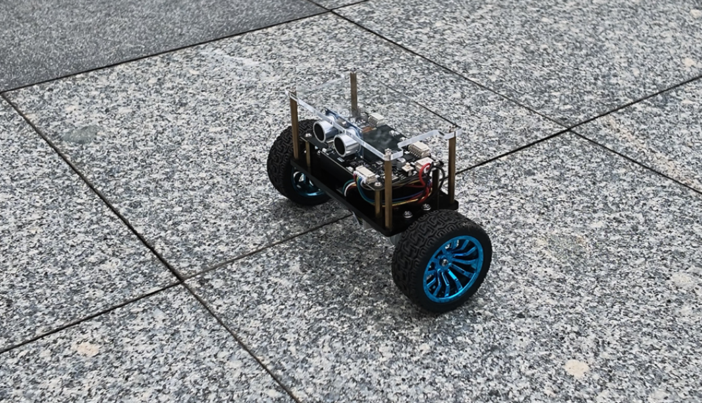 

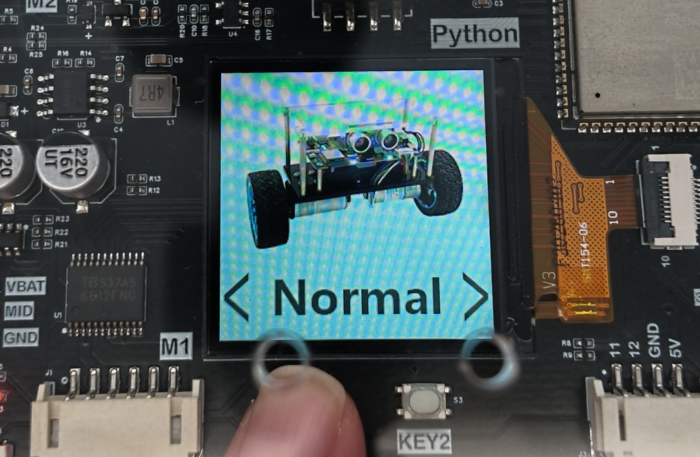 

在平衡车显示屏可以看到小车的相关参数。倾斜角、速度、超声波距离、电池电压、速度等信息。

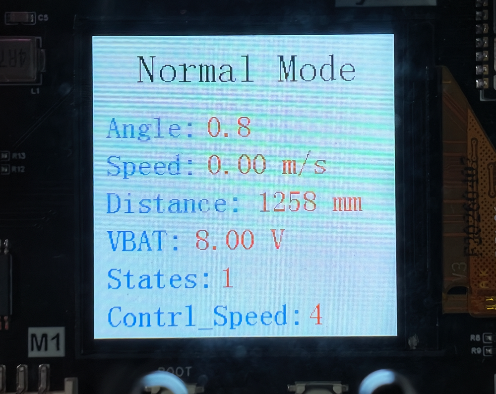 

## 手柄/APP遥控模式

遥控模式可以通过pyController手柄或者配套的Android APP进行控制。水平放置小车，按KEY2开启：

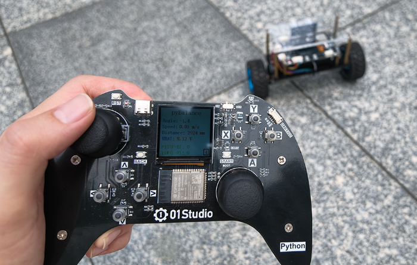 

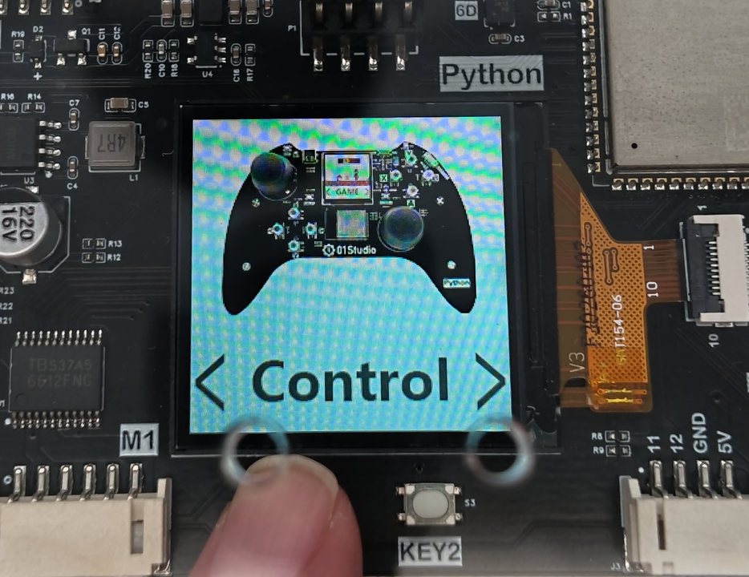 

开启后小车进入遥控模式会自平衡，等待遥控器连接。

 

然后启动手柄，可以看到搜索到pyBAL，信息包含mac地址和信号强度。（支持多台pyBAL同时搜索）。

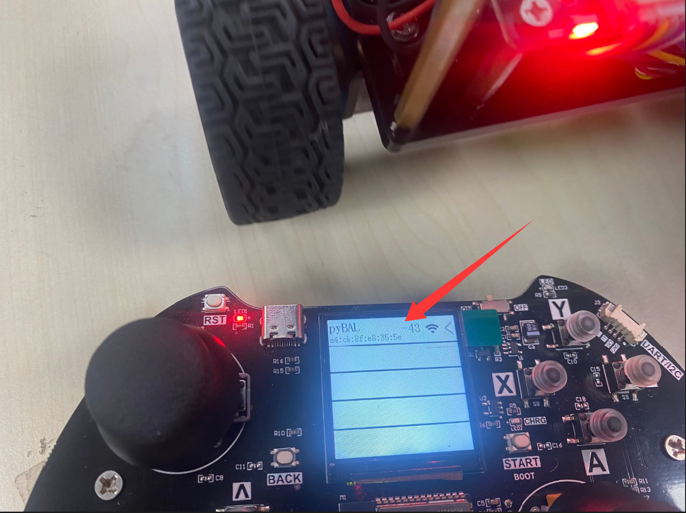 

信号强的范围是 0 ~ -99, 值越接近0表示信号越好。如果搜索到多台，可以通过按手柄的上、下键来选择，长按START键即可连接平衡小车。

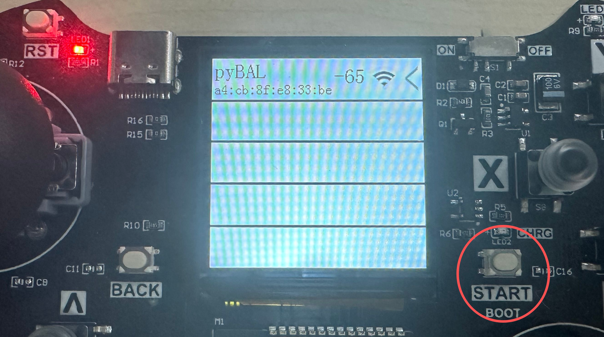 

连接成功后手柄显示屏出现pyBalance发送的实时信息界面。

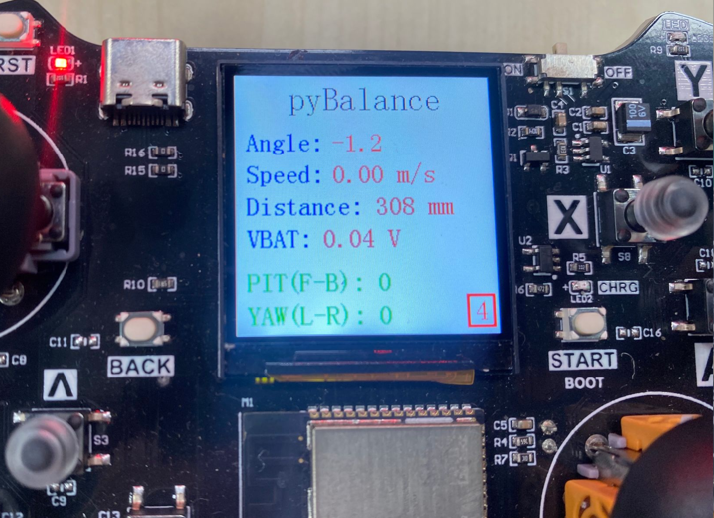 

LCD 从上到下依次显示标题及小车当前状态，包括倾斜角、实时速度、超声波测距值、电池电压、PIT 前后控制量和 YAW 转向控制量。右下侧边框中的数值表示当前小车的运动控制输出档位（速度）。

 

遥控器摇杆和按键对应功能说明如下：

 

安卓APP的使用方法完全一样。

 

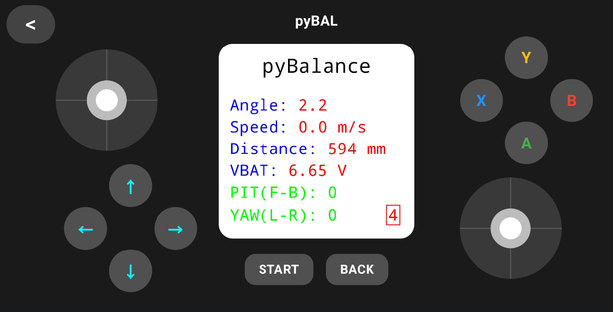 

## 超声波跟随

超声波跟随模式能让平衡小车保持平衡的状态下在0-500mm的有效运动范围内保持200mm的跟随距离。水平放置小车，按KEY2开启：

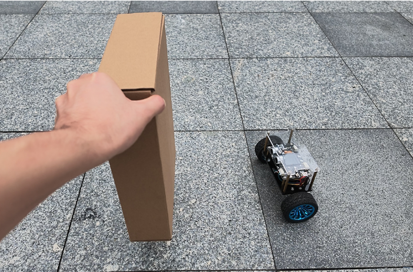 

 

## 校准

校准通常在重烧固件后进行操作。为了去除IMU传感器硬件误差。按KEY1切换至校准模式，水平放置小车，按KEY2开启：

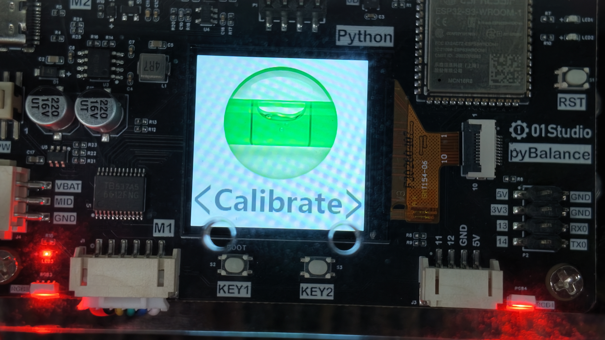 

进入后有2个参数，无需关注内容，稳定后即可再次按下KEY2确认。

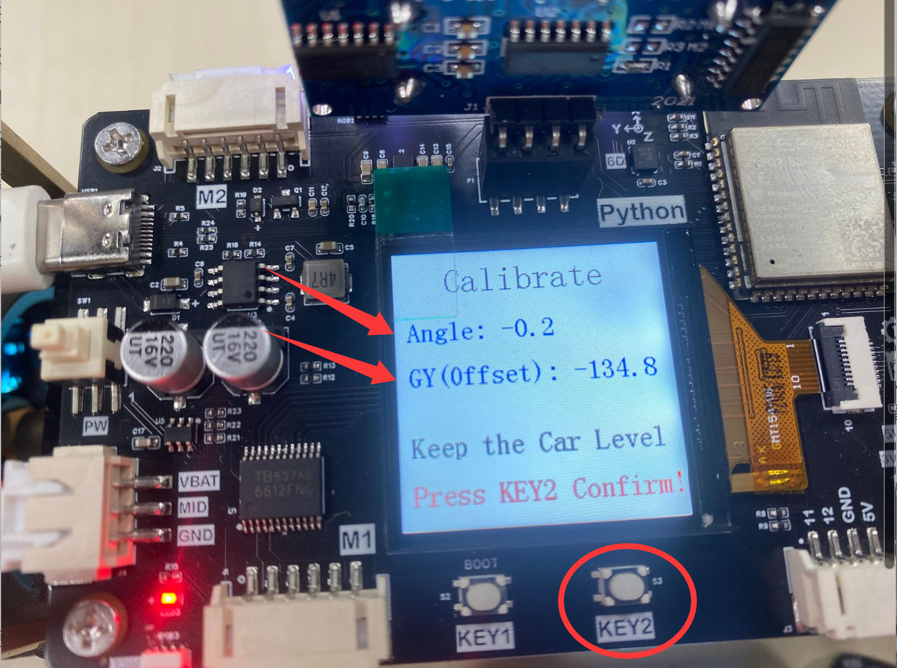 

校准成功后会自动返回。这时候选择[自平衡模式](#自平衡模式)启动，小车能保持自平衡没有明显的大幅度移动即表示校准有效。

 

 

:::tip 提示
校准过程实际是往pyBalance文件系统写入一个`cal_data.txt`文件，如有需要可以将文件下载，后续更新固件后直接上传该文件即可。

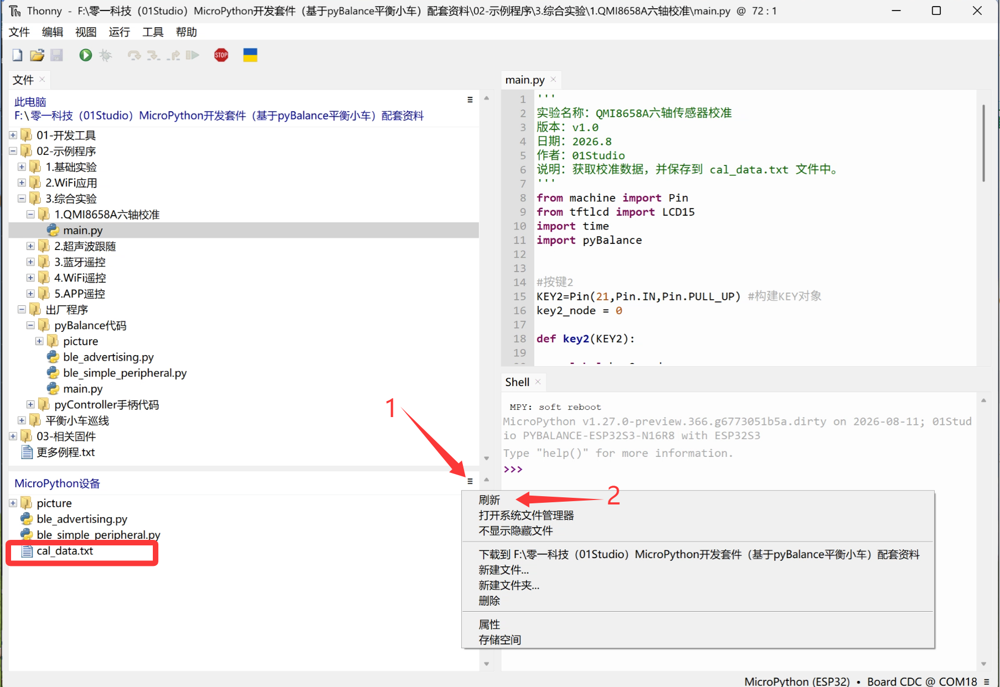 

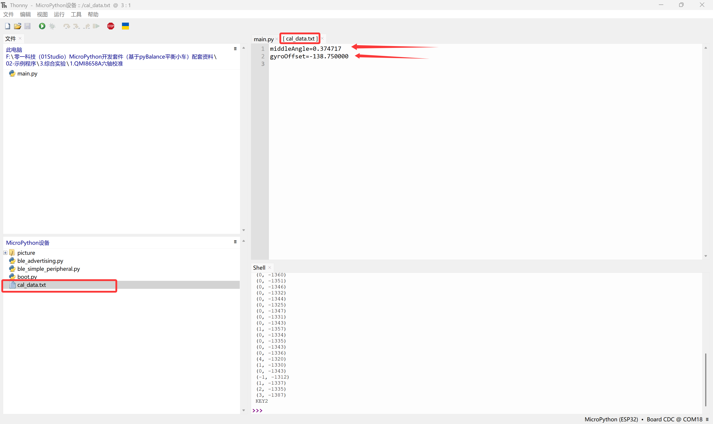 
:::