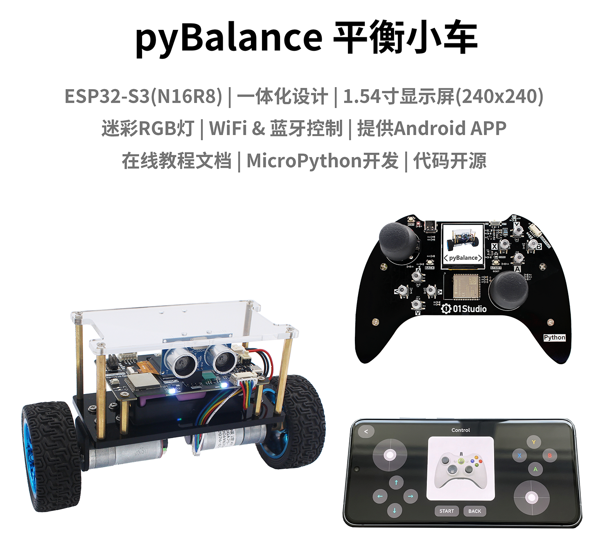
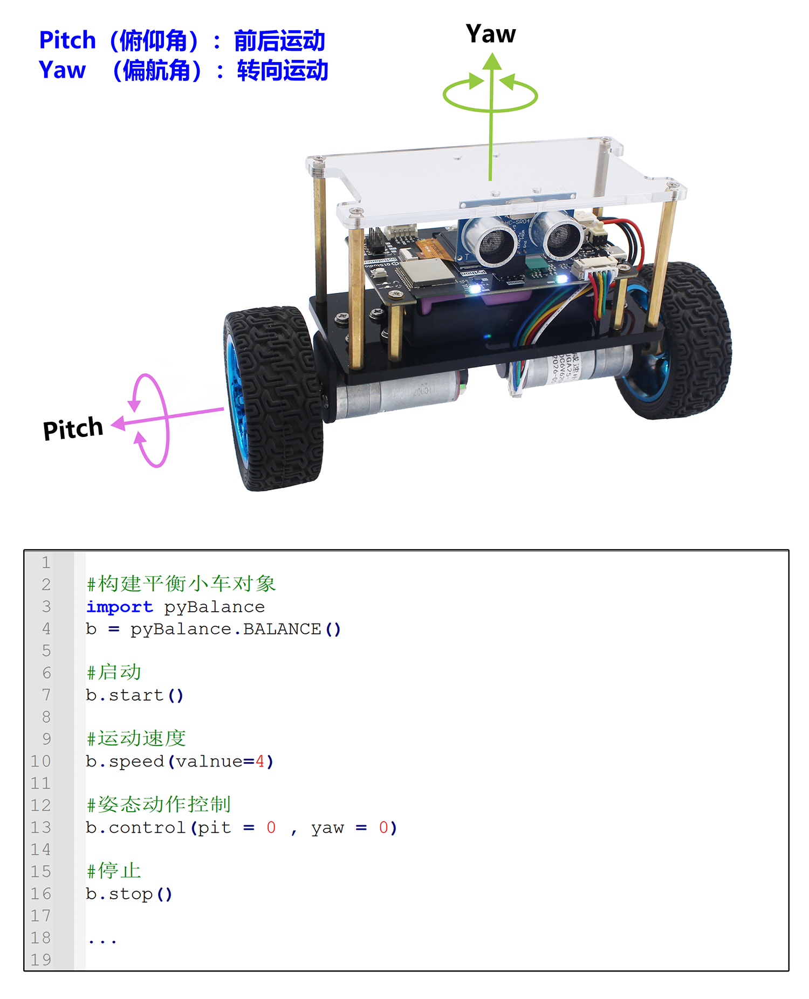
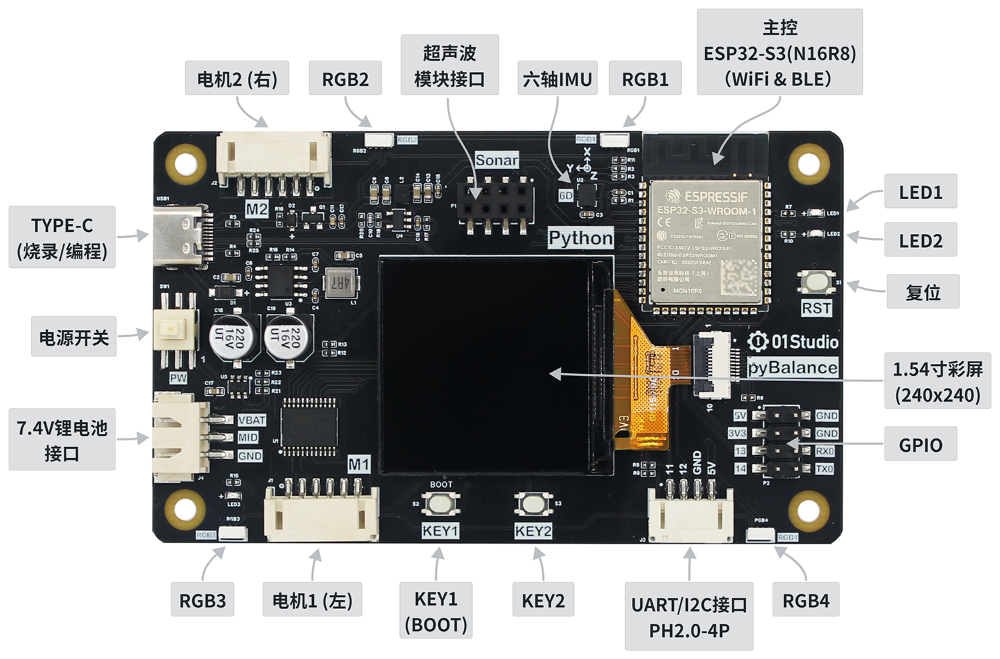
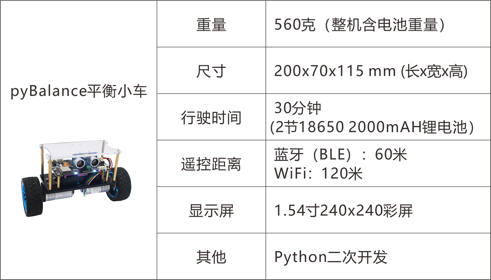
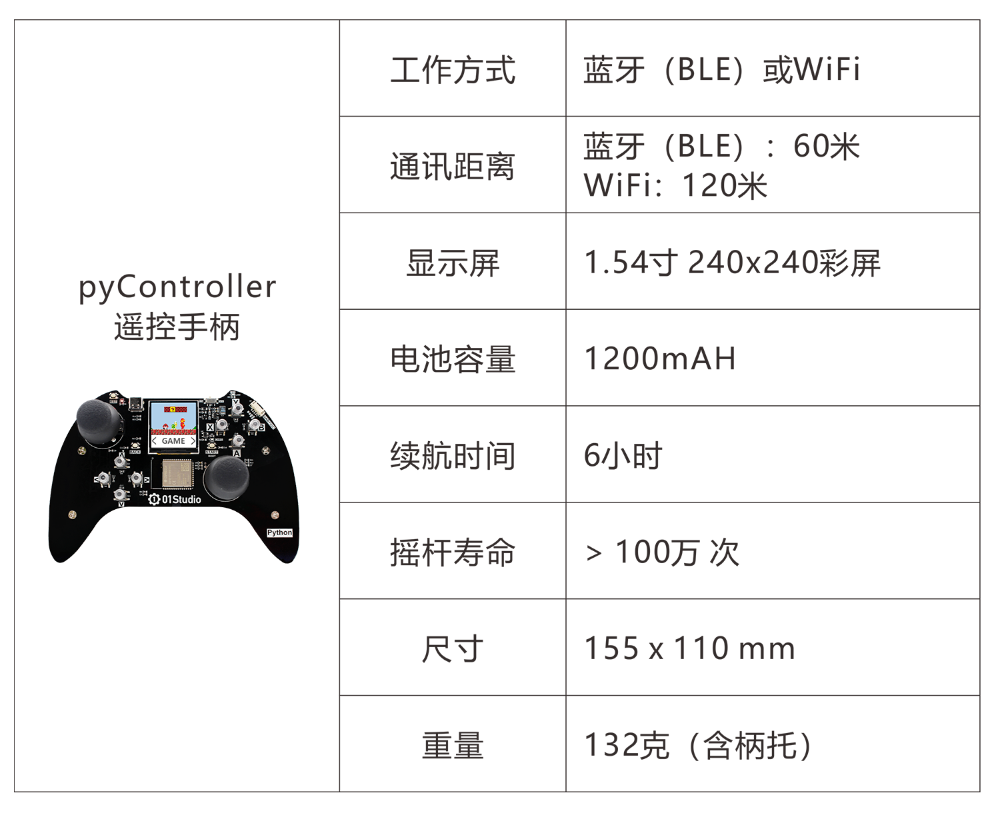
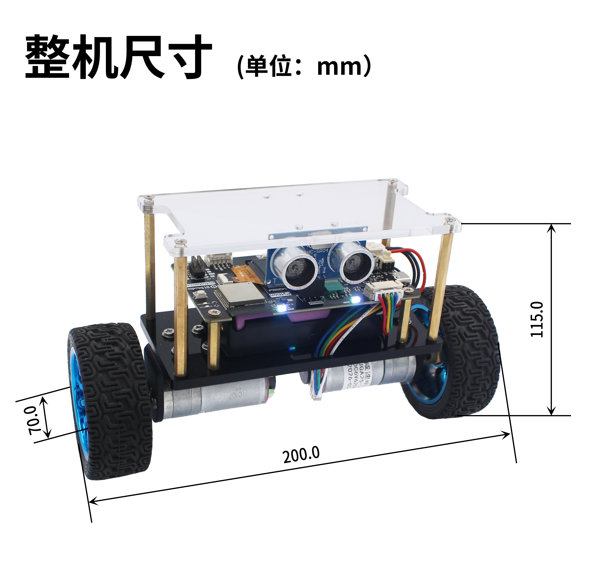

# pyBalance简介

pyBalance是由01Studio(01科技)发起的MicroPython开源平衡小车项目。购买链接

Micropython是指使用Python做各类嵌入式硬件设备编程。MicroPython发展势头强劲，01Studio一直致力于Python嵌入式编程，特此推出pyDrone开源项目，旨在让MicroPython变得更加流行。使用MicroPython，你可以轻松地实现平衡小车直立、前进、后退、巡线、超声波避障、WiFi蓝牙遥控等功能。

## 硬件资源

01Studio pyBalance使用乐鑫科技ESP32-S3(N16R8)主控。

## 基本参数

## 详细参数

|  产品参数 |
|  :---:  | ---  |
| 主控  | ESP32-S3-WROOM-1 （N16R8，Flash:16MBytes，RAM:8MBytes）; 支持WiFi/BLE |
| LED  | x3    ● 电源指示灯：红色     ● 可编程LED1：蓝色    ● 可编程LED2：绿色 |
| 按键  | x3    ● 复位键     ● 可编程 KEY1    ● 可编程 KEY2 |
| RGB彩灯  | x4     ● WS2812B/串联 |
| 六轴IMU  | QMI8658A (三轴加速度 + 三轴陀螺仪) |
| 显示屏  | ● 1.54寸彩屏    ● 分辨率 240x240    ● 驱动IC：ST7789 |
| GPIO  | 2.54mm x 8P 排针 |
| 串口/I2C接口  | PH-2.0mm-4P（送转接线） |
| MicroUSB口  | 烧录/调试 多合一 |
| 电机  | x2      ● 直流减速电机 (带编码器)     ● 电压: 6V      ● 转速: 620 r/min      ● 减速比 1:9.2|
| 轮胎  | ● 直径: 70mm     ● 宽度: 27mm |
| 锂电池  | 7.4V / 两节18650锂电池串联（单节容量2200mAh）/ XH-2.54mm-3P接口 |
| 机身  | 亚克力机身 + 铝合金电机支架 |

|  外观规格 |
|  :---:  | ---  |
| 尺寸  | 200 x 70 x 115mm（长宽高 / 整机） |
| 重量  | 560克（含电池 / 整机） |

## 尺寸图

